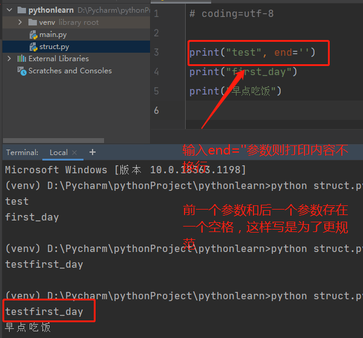
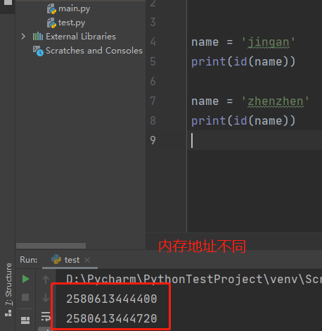

## 一、什么是python语言
    1、完全面向对象
    2、解释型语言
    3、高级编程语言
    4、胶水语言
    优势：简单易学上手快、强大的第三方库、可移植在多平台

## 二、环境搭建

## 三、开发工具
    IDE和PyCharm
    IDE（Intergrated Development Enviroment）集成开发环境
    PyCharm是Python最好的IDE之一，具备跨平台特性

## 四、脚本的结构
    1、# coding=utf-8                     脚本头
    一个空行
    2、import os                          引用部分
    两个空行
    3、print("test")                      业务部分
    一个空行

## 五、python的头部注释
    1、头注释并不是为代码而服务，更多是系统或解释器所调用
       比如：我们的python解释器在哪，脚本编码格式是什么
    
    2、常见头部解释器
       国内常用
       比如：# coding=utf-8 定义coding则告诉系统脚本是何种编码格式
    
    目前很少使用
    #比如：#!/usr/bin/env 定义#!，会去指定路径下的python解释器

## 六、python导入部分
    1、导入是将python的一些功能函数放在当前的脚本使用
    
    2、不导入的功能无法直接在当前脚本使用（除了python自带的内置函数）
    
    3、为什么是在头注释下方使用
       程序自上而下执行
    
    4、import os 由内置导入函数import和被导入模块组成
    
    5、python模块是一个python文件，结尾不加.py

## 七、print用法（函数的初探）
    1、print(object, end= '')
    结构：函数名（执行函数）print + 参数体（函数执行的必要数据，有了数据才能执行函数）(object, end= '')
    
    2、其中参数object表示：打印的信息，多信息用逗号隔开；
    end= ''不传默认打印一行后换行



## 八、变量
    1、变量名 = 变量值
    2、变量存于内存中
    3、每个变量被定义后，存入一个内存块中

    4、变量名规则
    组成：必须是数字、字母、下划线组成
    长度：任意长度，不建议过长、20字符以内、太长可用缩写，然后注释说明
       （ymd = '2020-02-20    # ymd is year_month_day）
    开头、开头不能是数字(01work)、不能包含特殊字符（create&number）
    注意、区分大小写、有意义(abc0101)
    不可使用关键字和保留字
    
    5、不建议使用驼峰命名法定义变量，也就是首字母都大写（OpenBrowser）,最好使用每个单词用下划线分开格式（open_browser）

## 九、python中关键字
    python内部自带的用于处理业务逻辑的特殊单词
    is        判断变量是否是某个类的实例
    not       逻辑运算非的操作
    pass      无意义，站位字符
    raise     主动抛出异常
    in        判断变量是否在序列中
    with      简化python语法
    yield     从循环或函数依次返回数据
    else      逻辑中的否则
    
## 一、数据类型
    多种数据类型主要是为了更好的高效处理和展示数据

## 二、七种数据类型
    1、数字类型
    2、字符串类型
    3、布尔类型
    4、空类型（编程语言不知道使用什么类型的情况下，使用的类型）
    5、列表类型
    6、元组类型
    7、字典类型

## 三、数字类型
    1、整型int
    整型就是我们所说的整数，0也是整数，但是特殊的整数
    int既是整型代表，又是定义整型的内置函数
    定义一个整型，并非一定要使用Int
    count_100_01 = int(100)  ；count_100_02 = 100
    上面两个变量值都一样，python赋值不需要特意定义变量
    python2中曾经有long整型，python3已经弃用
    
    2、浮点型float
    但凡带有小数点的类型，都是浮点型
    
    3、type 内置函数
    返回变量的类型
    结构：type(已经被定义的变量名或变量) 
          name = 'jingan'  
          print(type(name))

## 四、字符串
    1、用单引号‘’ 或双引号“” 包裹的所有数据就是字符串
    三引号的注释也可以当做字符串使用
    2、字符串可以包含任意字符：字母、数字、符号且没有先后顺序
    3、字符串定义方法：str
    4、字符串是不可改变的
    例如：name = 'jingan' 如果再次赋值：name = 'zhenzhen' 是存在了另一个内存中，并不是改变了，即使再次赋值name = 'jingan也不是同一个字符串了，即打印出来的内存地址是不同的
    注意：当name = 'jingan' ，再定义一个变量直接将变量name赋值给新变量，则内存是不变的即是同一个字符串，name_01 = name

```python
a = "123"
print(id(a))   # 2221904245872
b = "456"
a = a + b
print(id(a))   # 2221904249520
```

    5、内置函数id
    作用：返回变量的内存地址
    结构：数字地址 = id(变量)



## 五、内置函数len
    1、返回字符串长度
    2、无法返回数字类型长度，因为数字类型没有长度
    3、结构：返回值 = len(字符串) ，比如判断账号长度
    4、空字符串长度为0

## 六、内置成员运算符in 和 not in的使用
    1、成员运算符用来判断你的数据中是否存在你想要或不想要的成员
    
```python
print("中学" in "高级中学") # True
print("中学" not in "高级中学") # False
```

##七、内置函数max
    1、返回数据中最大的成员（可应用在多种数据类型）
    2、中文字符 > 字母 > 数字 > 英文符号
    3、中文按照拼音首字母计算
    
```python
print(max("今天是11月27号")) # 月
```

## 八、内置函数min
    1、返回数据中最小的成员
    2、注意：空格也会参与比较
  
```python
print(min("今天是11月27号")) # 1
```

## 九、字符串的累加
    1、字符串不是数字不能做减、乘除运算
    2、字符串的拼接，用 “,” 这个符号
    3、字符串不可改变

## 十、布尔类型
    1、真假的判断
    2、数字与字符串
    int 0 ——> False ，非0 ——> True
    float 0.0 ——> False，非0.0——> True
    str ' ' ——> False（即空字符串），非空字符串——> True
    开发过程经常使用1 0来替代True和False
    总结：布尔类型可以当做整数来对待，非零即为True，0表示False

## 十一、空类型
    1、不属于任何数据类型就是空类型
    2、固定值：None 
    3、空类型属于False的范畴
    4、如果不确定数据类型，可先定义为None
    
```python
a = None
print(bool(a)) # False
```

## 十二、列表 list
    1、列表就是队列
    2、它是各种数据类型的集合，也是一种数据结构
    3、列表是一种有序的、且内容可重复的集合类型
    4、列表存于“[]”中
    5、列表是无限制长度的数据结构，需避免放过多数据
    6、in、max、min在列表中运用(注意：max和min在列表中使用时，列表中元素不能是多种类型，如果类型不统一，则会报错)
    7、一个列表中的所有内容都在同一个内存位置中，而不是独立在不同内存位置，每运行一次代码id打印出的地址都不会改变
    
```python
# 为了代码整洁列表中每个元素之间间隔一个空格
name = ["jingan", "zhenzhen", "lisi"]
```

```python
str_array = ['jingan', 'zhenzhen', ' ']
int_array = [1, 3, 4, 6, 30, 29]
float_array = [1.2, 34.3, 20.0]
bool_array = [True, False, True, True]
none_array = [None, None, None, None]   # True
list_array = [[1,4], [3,5]]
mix_array = [1, 'jingan', True, None]

max_value = max([111, 33, 20, 44])
min_value = min([33, 38, 33, 56])
```

## 十三、元组 tuple
    1、元组与列表一样，都是一种可以存储多种数据结构的队列
    2、元组也是一个有序的，且元素可以重复的集合
    3、元组内容存于小括号内“（）”
    4、元组中只有一个数据时，必须带上逗号
    5、元组与列表的区别
    元组比列表占用资源更小（因为元组一旦创建就无法增加、删除、修改）
    列表是可变的，元组是不可变的
    列表中的元组一旦被创建也是不能修改的
    6、元组中类型与列表一致，只是符号不同
    7、in、max、min在元组中使用与列表一致，只是符号不同
    
```python
tuple_value = ()
print(type(tuple_value)) # <class 'tuple'>
```

## 十四、字典dict
    1、字典是由多个键（key）及其对应的值（value）所组成的一种数据类型
    2、字典的结构
    
```python
# 代码规范：冒号和值之间需要有空格
dict_value = {
    'age': 25,
    'sex': '男',
    'name': 'lisi'
}

dict_value1 = {'score': 89, 'classname': '三班'}
```

    3、字典支持的数据类型
    key 支持字符串、数字、元组类型，列表是不支持的
    value 支持python的所有数据类型
    
    4、列表与元组中字典结构
  
```python
list_dict = [{1:2}, {3:4}]
tuple_dict = ({2:3}, {'name': 'lisi'})
```

    5、python3.7之后与之前版本字典的区别
    python3.7之前字典是无序，也就是打印出的结构可能与定义的顺序不一致
    python3.7之后字典是有序的
    
    6、字典的重要特性
    字典中每一个key一定是唯一的

## 十五、八大赋值运算符
    =         等于运算符         c = a + b
    +=        加法运算符         c += a  ——>  c = c + a
    -=        减法运算符         c -= a
    *=        乘法运算符         c *= a
    /=        除法运算符         c /= a     除不尽会返回小数点也就是float
    %=        取模运算符         c %= a
    **=       幂运算符           c **= a
    //=       整除运算符         c //= a  除不尽只会返回整除的部分，如果除数是float就返回float
    
```python
a, b, c = 20, 30, 5
a //= c
b %= a
print(b)  # 取余 b = 2
```

## 十六、计算机计量单位b、kb、mb、gb的转换
    1GB * 1024 = 1024MB * 1024 = 1048576KB * 1024 = 1073741824

## 十七、字符串与数字的乘法
    1、字符串与字符串无法做乘法
    2、字符串只可以和数字做乘法
    3、列表和元组可以数字做乘法、字典不可
    
 ```python
name = "lisi"
print(name * 3) # lisilisilisi

list_value = [1, 2, 3]
print(list_value * 2)  #  [1, 2, 3, 1, 2, 3]

tuple_value = (1, 2, 3)
print(tuple_value * 2) # (1, 2, 3, 1, 2, 3)
```

## 十八、比较与身份运算符有哪些（比较的结果都是布尔类型）
    ==        是否等于
    !=         是否不等于
    >          是否大于
    <          是否小于
    >=        是否大于等于
    <=        是否小于等于
    <>        是否不等于  python3中已经弃用
    
    身份运算符比较，其实就是比较id的内存地址（单元存储就是内存块）
    is          判断两个对象存储单元是否相同    a is b
    is not      判断两个对象存储单元是否不同    a is not b 

    python解释器会先存储定义0~255数值在固定的内存地址中，所以取值返回是True，超过255则返回False；但直接在脚本中定义超过255，仍然返回True，
    原因是上面已经有变量存储了某个值，再次赋值一样的数值，直接调用同样的内存中数值即可
    
```python
a = 300
a_01 = 300
print(id(a))       # 1985004267632
print(id(a_01))    # 1985004267632
print(a == a_01)   # True
```

