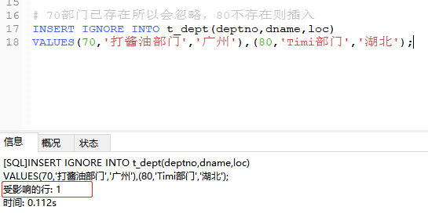
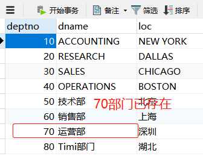

# MySQL的基本操作

## 一、INSERT语句
    1、可以向数据表写入数据，可以是一条记录，可以是多条记录，但都只能向一张表写入
        INSERT INTO 表名(字段1，字段2...)
        VALUES(值1，值2...);
       注意：表名后不添加字段声明，mysql就会查询表结构自动补上这个声明，导致不能快速写入
       
       写入多条记录
       INSERT INTO 表名(字段1，字段2...)
       VALUES(值1，值2...),(值1，值2...),(值1，值2...);
       
```sql
# 向部门表添加部门记录
INSERT INTO t_dept(deptno,dname,loc)
VALUES('50','技术部','北京'),('60','销售部','上海'),('70','运营部','深圳');

# 向技术部添加一条员工记录
# 子查询当做结果写入到VALUES中，这里只能是单行子查询
INSERT INTO 
t_emp(empno,ename,job,mgr,hiredate,sal,comm,deptno)
VALUES(8001,'李四','SALESMAN',7782,'1988-01-01',2000,NULL,
(SELECT deptno FROM t_dept WHERE dname='技术部'));
```

## 二、INSERT语句方言
    1、INSERT语句方言语法格式
        INSERT INTO 表名 SET 字段1=值1,字段2=值2...;
        
```sql
# INTO关键字可省略
INSERT t_emp
SET empno=8002,ename='张三',job='SALESMAN',mgr=7566,
hiredate='1985-02-01',sal=2300,comm=NULL,deptno=50;
```
      
## 三、IGNORE关键字
    1、让INSERT只插入数据库不冲突的记录，比如遇到主键冲突，唯一值冲突就会忽略
    2、语法格式：INSERT [IGNORE] INTO 表名 ... 
    
```sql
# 70部门已存在所以会忽略，80不存在则插入
INSERT IGNORE INTO t_dept(deptno,dname,loc)
VALUES(70,'打酱油部门','广州'),(80,'Timi部门','湖北');
```





## 四、UPDATE语句
    1、UPDATE修改表记录
    2、UPDATE语法：不添加WHERE子句就是全表修改，LIMIT主要是定义修改前几条数据，而且只能写一个参数
        UPDATE [IGNORE] 表名
        SET 字段1=值1,字段2=值2...
        [WHERE 条件1...]
        [ORDER BY...]
        [LIMIT...]
        
```sql
# 把每个员工的编号和上司的编号+1，用ORDER BY子句完成
UPDATE IGNORE t_emp
SET empno=empno+1,mgr=mgr+1
ORDER BY empno;

# 把月收入前三名的员工底薪减100，用LIMIT子句完成
UPDATE IGNORE t_emp 
SET sal=sal-100
ORDER BY sal+IFNULL(comm,0) DESC
LIMIT 3;

# 把10部门中，工龄超过20年的员工，底薪增加200元
UPDATE IGNORE t_emp
SET sal=sal+200
WHERE deptno=10 AND DATEDIFF(NOW(),hiredate)/365>20;
```

## 五、UPDATE语句表连接
    1、因为相关子查询效率低，所以利用表连接改造UPDATE语句
    2、UPDATE表连接语法一：
        UPDATE 表1 JOIN 表2 ON 条件
        SET 字段1=值1,字段2=值2...;
    注意：表连接的UPDATE语句可以修改多张表的记录
    
      UPDATE表连接语法二：
        UPDATE 表1 表2
        SET 字段1=值1,字段2=值2...
        WHERE 连接条件; 
        
```sql
# 把ALLEN调往RESEARCH部门，职务调整为ANALYST
# 因为不知道RESEARCH的部门编号，所以不可以使用e.deptno=d.deptno做连接
UPDATE t_emp e JOIN t_dept d
SET e.deptno=d.deptno,e.job='ANALYST',d.loc='北京'
WHERE e.ename='ALLEN' AND d.dname='RESEARCH';

# 把底薪低于公司平均底薪的员工，底薪增加150元
UPDATE t_emp e JOIN 
(SELECT AVG(sal) avg FROM t_emp) t
ON e.sal<t.avg
SET e.sal=e.sal+150;
```
    UPDATE表连接语法三：既可以是内连接也可以是外连接
    UPDATE 表1 |LEFT|RIGHT| JOIN  表2 ON 条件
    SET 字段1=值2,字段2=值2,...;
    
```sql
# 把没有部门的员工，或者SALES部门低于2000元底薪的员工，都调往20部门
UPDATE t_emp e LEFT JOIN t_dept d ON e.deptno=d.deptno
SET e.deptno=20
WHERE e.deptno IS NULL OR (d.dname='SALES' AND e.sal<=2000);
```

## 六、DELETE删除语句
### 注意：不写WHERE子句是全表删除
    1、DELETE语法
    DELETE [IGNORE] FROM 表名
    [WHERE 条件1,条件2,...]
    [ORDER BY...]
    [LIMIT...];
    执行顺序：FROM / WHERE / ORDER BY / LIMIT / DELETE
    
```sql
# 删除10部门中，工龄超过20年的员工记录
DELETE IGNORE FROM t_emp
WHERE deptno=10 AND DATEDIFF(NOW(),hiredate)/365>20;

# 删除20部门中工资最高的员工记录
DELETE IGNORE FROM t_emp
WHERE deptno=20
ORDER BY sal+IFNULL(comm,0) DESC
LIMIT 1;
```

    2、DELETE语句的表连接
    因为相关子查询的效率比较低，所以可以利用表连接改造DELETE语句
    DELETE 表1,...FROM 表1 JOIN 表2 ON 条件
    [WHERE 条件1,条件2,...]
    [ORDER BY...]
    [LIMIT...];
    
```sql
# 删除SALES部门和该部门的全部员工记录
DELETE e,d
FROM t_emp e JOIN t_dept d ON e.deptno=d.deptno
WHERE d.dname='SALES';


# 删除每个低于部门平均底薪的员工记录
DELETE e
FROM t_emp e JOIN (SELECT deptno,AVG(sal) avg FROM t_emp GROUP BY deptno) t 
ON e.deptno=t.deptno AND e.sal<t.avg;


# 删除员工KING和他的直接下属的员工记录，用表连接实现
# 临时表t是不可删除的，所以加上e.empno=empno
DELETE e
FROM t_emp e JOIN (SELECT empno FROM t_emp WHERE ename='KING') t
ON e.mgr=t.empno OR e.empno=t.empno;
```

    3、DELETE语句的表连接既可以是内连接也可以是外连接
    DELETE 表1,... FROM 表1 |LEFT|RIGHT| JOIN 表2 ON 条件...;
    
```sql
# 删除SALES部门的员工，以及没有部门的员工
DELETE e
FROM t_emp e LEFT JOIN t_dept d ON e.deptno=d.deptno
WHERE d.dname='SALES' OR e.deptno IS NULL;
```
    
## 快速删除数据表全部数据
    DELETE是在事物机制下删除记录，删除记录之前，先把将要删除的记录保存到日志文件里，然后再删除记录
    
    TRUNCATE语句在事物机制之外删除记录，速度远超过DELETE语句
    TRUNCATE TABLE 表名;
    注意：只能添加一个表名
    
     
    


