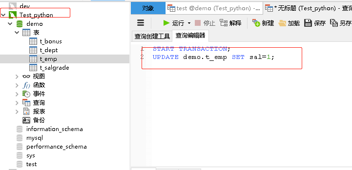
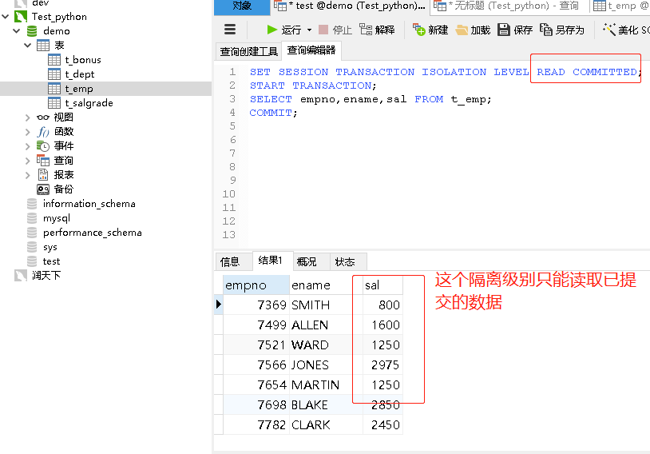
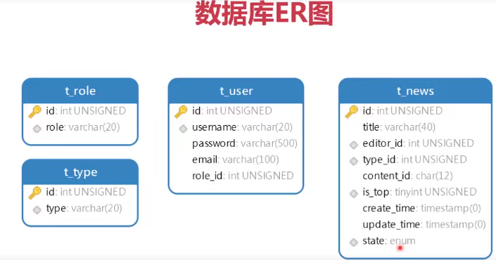

# 综合应用

## 事务机制(Transaction)
    1. 如果数据的写入直接操作数据文件是非常危险的事情
    2. 利用日志来实现间接写入
        MySQL共有五种日志文件，其中redo和undo日志与事务有关
        数据——》拷贝数据到undo日志里——》记录修改到redo日志里——》最后同步最开始的数据
        
    3. RDBMS = SQL语句 + 事务(ACID)
        事务是一个或多个SQL语句组成的整体,要么全部执行成功，要么全部执行失败
        
## 事务案例
    1. 把10部门中MANGER员工调往20部门，其他岗位的员工调往30部门,然后删除10部门
        开启事务
        UPDATE语句
        DELETE语句
        提交事务
        
    2. 管理事务
        默认情况下，MySQL执行每条SQL语句都会自动开启和提交事务，这种方法并不理想
        因为很多业务需要纳入到一个同一个事务下，不需要每条语句都自动开启提交事务，所以需要手动管理事务
        
        语法格式：
            START TARNSACTION;
            SQL语句
            [COMMIT|ROLLBACK];
        COMMIT表示提交事务，ROLLBACK表示回滚
        
        注意：只要没有执行COMMIT事务，那么SQL语句都只是在日志文件中修改的数据，只是在redo文件中修改了数据，不会同步数据文件
        COMMIT提交的是一个结果集，没有中间状态，也就是说不存在说其中的某条SQL执行失败或成功
        
```sql
START TRANSACTION;
DELETE FROM t_emp;
DELETE FROM t_dept;

SELECT * FROM t_emp;
SELECT * FROM t_dept;
# ROLLBACK;
COMMIT;
```

## 事务的ACID的属性
    特性：原子性、一致性、隔离性、持久性
    
    1. 事务的原子性：一个事务中的操作要么全部完成，要么全部失败。
    事务执行后，不允许停留在中间的某个状态
    
    2. 事务的一致性：不管在任何给定的时间，并发事务有多少，事务必须保证运行结果的一致性
    
    3. 事务的隔离性：隔离性要求事务不受其他并发事务的影响，
    如同在给定时间内，该事务是数据库唯一运行的事务
    
    4. 事务的持久性：事务一旦提交，结果便是永久性的，即便发生宕机
    仍然可以依靠事务日志完成数据的持久化
    
## 事务的隔离级别

|序号|隔离级别|功能|
|---|------|---|
|1|read uncommitted|读取未提交数据|
|2|read committed|读取已提交数据|
|3|repeatable read|重复读取|
|4|serializable|序列化|

### 业务案例1
    
    购票场景中，由于事务之间完全隔离的
    首先A事务中用户查询1车厢1A坐席车次状态是：未售出，于是用UPDATE语句修改了这条语句状态
    为已售出，因为没有提交事务，所以修改操作只是记录在redo日志中，真实数据未发生改变
    
|事务|车次|车厢|坐席|状态|
|---|---|---|---|---|
|A事务|G8047|1|1A|未售出|
|B事务|C8047|1|1B|未售出|
    
    这时B事务启动了，同样看到1A坐席也是未售出的，于是用UPDATE语句修改了这条记录的状态
    但是B事务很快就提交了于是数据文件就发生了改变，这时候A事务再去提交事务就发现这个坐席
    被人占用了，于是就引发了回滚操作，虽然没有产生歧义数据，但是动不动就购票失败，这个用
    户体验并不好
    所以在这个场景中，我们应该允许当前事务去读取其他事务的临时状态，B事务发现A事务的临时
    数据里购买了1A这个坐席，那么B事务就可以去购买其他坐席，这样就不会引发数据的冲突
    这个场景可以使用：READ UNCOMMITTED 读取其它事务未提交的数据

|事务|车次|车厢|坐席|状态|
|---|---|---|---|---|
|A事务|G8047|1|1A|已售出|
|B事务|C8047|1|1B|未售出|

    SET SESSION TRANSACTION ISOLATION LEVEL表示设置当前会话的隔离级别
    SQL面板相当于一次会话，关闭了面板会话就关了，所以我们设置的事务隔离级别是
    针对当前会话的，并不是全局的

    打开会话面板一：输入以下sql只开启事务修改工资金额为1，不提交事务   
```sql
START TRANSACTION;
UPDATE demo.t_emp SET sal=1;
```

    打开会话面板二：输入以下sql设置事务隔离等级查看会话面板一工资字段的临时状态提交事务
    
```sql
SET SESSION TRANSACTION ISOLATION LEVEL READ UNCOMMITTED;
START TRANSACTION;
SELECT empno,ename,sal FROM t_emp;
COMMIT;
```




    上面的隔离级别只适用于买票的场景中，不适用于其它场景
    
### 业务案例二
    银行业务：只能读取当前事务已经提交的数据，绝对不能读取未提交的数据
    
    A事务(转账1千) ——> Scott账户5000元 <—— (支出100元)B事务 
     
    比如上面A事务还未来得及做任何操作，这时候B事务先执行了消费行为支出100元
    这时候A事务才开始执行转账1千元，因为B事务已经把余额改成4900元，所以A事务
    务在执行更改记录的时候，只需要在余额上加上1千块即可，也就是5900元。
    
    如果AB事务正常提交事务是没有问题的，如果B事务支出100元是错误的操作需要退回,
    B事务执行了ROLLBACK，这时就没有100块的支出，最终结果应该是6千，如果允许A
    事务读取B事务的临时数据，那么按照这个账户余额4900元加上1千，等到B事务回滚
    账户就变成5900元，这样金额就产生了错误
    
    根据上面的场景修改隔离级别为：READ COMMITTED 只能读取其它事务已经提交的数据 


```sql
START TRANSACTION;
UPDATE demo.t_emp SET sal=1;
```
   
```sql
SET SESSION TRANSACTION ISOLATION LEVEL READ COMMITTED;
START TRANSACTION;
SELECT empno,ename,sal FROM t_emp;
COMMIT;
```



## 业务案例3

    A事务(下单购买) ——> 商品价格350元 <—— (涨价)B事务

    用户支付订单之前，店家给商品涨价了，这样仍然需要按照涨价之前支付订单，因为已经下单未支付
    这种场景是希望当前事务不受其它事务影响，甚至其它事务提交数据的结果也不要影响到当前这个事务
    
    需要使用repeatable重复读取隔离级别，意味着当前事务读取到时事务开始之前的数据，事务开启
    之后其它事务提交的数据是读取不到的（代表事务在执行中反复读取数据，得到的结果是一致的，不受其它事务影响）
    
    注意：是先执行的repeatable read隔离级别中的sql语句，undo日志有数据其它会话提交事务才不会影响当前事务
    mysql默认的隔离级别就是repeatable read

```sql
SET SESSION TRANSACTION ISOLATION LEVEL REPEATABLE READ;
START TRANSACTION;
SELECT empno,ename,sal FROM t_emp;
COMMIT;
```

```sql
START TRANSACTION;
UPDATE demo.t_emp SET sal=1;
COMMIT;
```

## 事务的序列化
    由于事务并发执行所带来的各种问题，前三种隔离级别只适用于在某些业务场景中，
    但是序列化的隔离性，让事务逐一执行，就不会产生上述问题了。
    
    就是前一个事务不提交事务，那么后一个事务就无法执行，牺牲了并发性
    
```sql
SET SESSION TRANSACTION ISOLATION LEVEL SERIALIZABLE;
START TRANSACTION;
SELECT empno,ename,sal FROM t_emp;
COMMIT;
```
    先执行上面sql的第一句开启事务序列化隔离级别
    再执行下面的sql，但不执行COMMIT语句
    再执行上面的查询语句，这时是无法查询出结果的，除非执行了下面的COMMIT语句
    
```sql
START TRANSACTION;
UPDATE demo.t_emp SET sal=1;
COMMIT;
```
    
## 数据导出与备份的区别
    数据导出，导出的纯粹是业务数据
    
    数据备份，备份的是数据文件、日志文件、索引文件等等
    备份分为：全量备份和增量备份（只备份变动的数据）
    
    1. 数据导出的分类
    一、是导出sql文档（导出数据不多，建议使用导出为sql文档）
    二、是导出文本文档（导出数据量多，建议导出为文本文档）
    
    2. 导出sql文件
    mysqldump用来把业务数据导出成sql文件，其中也包括了表结构
    语法格式：uroot和p表示用户名和密码，只想导出表结构就写上no-data
            不写no-data表示既包含表结构也有数据
    mysqldump -uroot -p [no-data] 逻辑库 > 路径
    
    3. 导出方法
    方法一：
        首先需要配置mysqldump命令的系统环境变量：C:\Program Files\MySQL\MySQL Server 8.0\bin
        然后cmd命令窗口中输入命令：mysqldump -uroot -p demo > D:/MySQL
    
    方法二：
        图形界面导出
        右键点击逻辑库——>转储SQL文件——>选择结构和数据或仅结构——>导出到对应目录
        
     4. 导入sql文件：同样分为命令行和图形界面两种方式
        source命令用于导入sql文件，包括创建数据表，写入记录等
        cmd命令窗口：先登录mysql数据库 mysql -uroot -p 
        切换到demo的逻辑库：USE demo
        执行命令：SOURCE D:/MySQL/demo.sql
        
        图形界面方式
        首先备份 
        右键选择其中某一张表t_emp——>转储sql文件——>仅结构——>保存到某个目录  
        
        同样右键选择t_emp——>导出向导——>默认选择txt格式下一步——>选择需要导出的表下一步——开始
        打开txt文本文档，文档中没有sql语句，只有业务数据，所以导出速度快也要先备份结构，不然拿到
        其他mysql中无法还原 
        
        导入只有文本文档sql
        demo右键选择运行sql文件——>弹窗选择上面备份的t_emp表结构文件——>刷新后表是空的
        再次选中t_emp选择导入向导——>弹窗选择文本文档格式下一步——>选择上面的txt文档下一步开始
        注意设置第一个数据行为1；设置目标字段信息
        
## 新闻管理系统 数据库设计

    新闻管理系统控制台程序
        输入用户名：admin
        密码：******
    
    选择你要执行的操作：
        1. 新闻列表
        2. 新建新闻
        3. 编辑新闻
        4. 退出
    
### 建表就要考虑字段的可扩展性，需不需要重新建新表引入

    新闻属性
        新闻表：编号、标题、作者、类型、内容、置顶、创建时间、修改时间、状态
        用户表：编号、用户（由新闻表中作者衍生出这张表，作者字段引用用户表的Id即可）
        类型表：编号、类型 
        类型字段需要做成可扩展的，不能用枚举固定几种类型，如果后面需要添加新类型就需要使用ALTER TABLE修改表结构，
        如果数据量多这个执行速度就慢，因为修改表结构是要锁表的，锁上了既不能写入也不能读取直到ATLER TABLE执行结束
        例如淘宝这个量级的数据库，修改表结构的耗时是非常久的，因此淘宝的数据库在设计的时候，要么提前考虑后面的扩展，
        要么就是重新构建一套数据库系统，新旧数据库是并行运行的，业务模块一个一个迁移到新的数据库平台
        
        内容表：编号、内容
        因为mysql中不太适合保存超长内容的文字，读写速度非常慢，可以把新闻内容保存到MongoDB的数据库里，创建内容表
        MongoDB适合保存海量低价值数据，读写速度较快
        
## 创建逻辑库和数据表
    数据库ER图
        注意：password:varchar(500) 字段长度设置为500是因为密码后期需要做加密处理
        CSDM网站曾明文保存大量数据，导致被拖库操作泄露了大量数据
        
   
   
    注意：创建的数据表需不需要加索引主要是看数据量
    
```sql
# 创建vega逻辑库
CREATE DATABASE vega;
# 切换逻辑库
USE vega;

# 创建类型表
CREATE TABLE t_type(
	id INT UNSIGNED PRIMARY KEY AUTO_INCREMENT,
	type VARCHAR(20) NOT NULL UNIQUE
);

# 插入数据
INSERT INTO t_type(type) VALUE('要闻'),('体育'),('科技'),('历史'),('娱乐');   

# 创建角色表
CREATE TABLE t_role(
	id INT UNSIGNED PRIMARY KEY AUTO_INCREMENT,
	role VARCHAR(20) NOT NULL UNIQUE
);

# 普通用户不需要登录就可以查看新闻，所以不用加入角色表
INSERT INTO t_role(role) VALUES('管理员'),('新闻编辑');
```
  
## 数据加密
    数据加密分为：对称加密和非对称加密
    对称加密分为：DES加密和AES加密
    非对称加密分为：RSA加密、DSA加密和ECC加密
    
    对称加密：指的是加密和解密用到的秘钥是相同的，这种方式加密很快但是强度很低，主要用在文件加密
    非对称加密：分为公钥和私钥都可以用来加密和解密，比如用公钥加密就要用私钥解密，用私钥加密就用公钥解密
    这种加密强度很高但是加密速度慢，网络通信传输的数据量不算大，但信息保密的安全程度高，主要用在互联网和电信领域
    数据加密的底层数学实现是信息安全专业需要特别学习的
    
    DES加密算法24小时即可破解
    AES加密函数：MySQL数据库提供了AES加密和解的函数，所以数据的加密解密非常容易实现
    语法格式：AES_ENCRYPT(原始数据,密钥字符串)
    注意：加密的时候得记得自己定义的密钥，防止加密后乱码显示使用HEX()将2进制转换成16进制展示 
   
```sql
# 未转换16进制显示乱码或NULL结果
SELECT AES_ENCRYPT('你好珍珍','ABC123456');
# 转换为16进制正确显示
SELECT HEX(AES_ENCRYPT('你好珍珍','ABC123456'));
```

    AES解密函数
        需要使用与加密相同的密钥，才能解密出原始密钥
        语法格式：AES_DECRYPT(加密结果,密钥字符串)
        UNHEX()表示将16进制转换成2进制
        
```sql
# 解密D4C57EE82EB6EC0C998D882EE1F8EB96,UNHEX()将16进制转成2进制
SELECT AES_DECRYPT(
	UNHEX('D4C57EE82EB6EC0C998D882EE1F8EB96'),'ABC123456');
```

```sql
# 创建用户表
CREATE TABLE t_user(
	id INT UNSIGNED PRIMARY KEY AUTO_INCREMENT,
	username VARCHAR(20) NOT NULL UNIQUE,
	password VARCHAR(500) NOT NULL,
	email VARCHAR(100) NOT NULL,
	role_id INT UNSIGNED NOT NULL,
	INDEX(username)
);

# 用户表插入数据
INSERT INTO t_user(username,password,email,role_id)
VALUES('admin',HEX(AES_ENCRYPT('123456','HelloWorld')),'admin@163.com',1),
('scott',HEX(AES_ENCRYPT('123456','HelloWorld')),'scott@163.com',2);
```

    MongoDB主键值是固定12个字符长度，所以content_id字段char(12)
    因为MongoDB未搭建，所以下面创建好新闻表后，暂时不插入数据
    
```sql
# 创建新闻表
CREATE TABLE t_news(
	id INT UNSIGNED PRIMARY KEY AUTO_INCREMENT,
	title VARCHAR(40) NOT NULL,
	editor_id INT UNSIGNED NOT NULL,
	type_id INT UNSIGNED NOT NULL,
	content_id CHAR(12) NOT NULL,
	is_top TINYINT UNSIGNED NOT NULL,
	create_time TIMESTAMP NOT NULL DEFAULT CURRENT_TIMESTAMP,
	update_time TIMESTAMP NOT NULL DEFAULT CURRENT_TIMESTAMP,
	state ENUM('草稿','待审批','已审批','隐藏') NOT NULL,
	INDEX(editor_id),
	INDEX(type_id),
	INDEX(state),
	# 创建时间加上索引，自动增加排序
	INDEX(create_time),
	INDEX(editor_id)
);
```