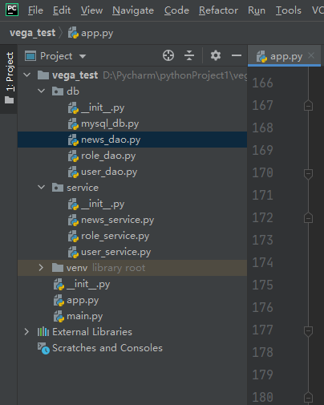

## Colorama模块
    作用：向控制台输出彩色字体
    Fore是针对字体颜色，Back是针对字体背景颜色，Style(重置输出文字颜色)是针对字体格式
    
    Fore: BLACK, RED, GREEN, YELLOW, BLUE, MAGENTA, CYAN, WHITE, RESET.
    Back: BLACK, RED, GREEN, YELLOW, BLUE, MAGENTA, CYAN, WHITE, RESET.
    Style: DIM, NORMAL, BRIGHT, RESET_ALL
    
```python
from colorama import Style
# 记得要及时关闭colorma的作用范围
# 如果不关闭的话，后面所有的输出都会是你指定的颜色
 
print(Style.RESET_ALL)
```
    
```python
# coding=utf-8

from colorama import Fore, Back, Style


print(Fore.LIGHTBLUE_EX, 'TestColor')
print(Back.LIGHTBLACK_EX, 'TestColor')
print(Style.RESET_ALL, 'TestColor')
```

## 项目结构
    vega包
        db包
            mysql_db.py
            user_dao.py  dao(数据库访问模式即对数据表的操作)
            ...
        service包(业务类)
            user_service.py
            ...
        app.py
        
    注意：如果程序是循环执行的（比如；可以循环登录退出），执行完程序后需要归还数据库连接(con.close())
    查询的sql语句不需要进行事务控制
    
    复杂的业务逻辑都写在service层中，比如用户在北京购物下单，北京地区有很多仓库都有该物品，这时候就需要在
    service层中进行复杂的计算拆分多个子订单，看使用哪个仓库进行发货比较合理，然后交给dao写到数据库中形成
    真正的订单，这时具体仓库才发货
    
## APP程序的作用

    APP程序用来处理控制台的输入与输出的，因为控制台的操作询问是轮殉执行的，所以需要在APP中使用死循环
    几层菜单就要做几层的死循环，当用户返回上一级菜单时，只需要break当前死循环即可
    
    getpass模块作用：输入密码时，密码字符内容隐藏
    
## 开发控制台新闻管理系统目录结构



## 对应每个py文件的代码

    mysql_db.py
  
```python
# coding=utf-8

import mysql.connector.pooling


__config = {
    'port': 3306,
    'database': 'vega',
    'user': 'root',
    'password': 'Lja199514',
    'host': 'localhost'
}

try:
    pool = mysql.connector.pooling.MySQLConnectionPool(
        **__config,
        pool_size=10
    )
except Exception as e:
    print(e)
```

    news_dao.py
   
```python
# coding=utf-8

from db.mysql_db import pool

class NewsDao(object):

    # 查询待审批新闻列表
    def search_unreview_list(self, page):
        try:
            con = pool.get_connection()
            cursor = con.cursor()
            sql = 'SELECT n.id,n.title,t.type,u.username FROM t_news n JOIN t_type t ON n.type_id=t.id ' \
                  'JOIN t_user u ON u.id=n.editor_id ' \
                  'WHERE n.state=%s ' \
                  'ORDER BY n.create_time DESC ' \
                  'LIMIT %s,%s;'
            cursor.execute(sql, ('待审批', (page-1)*10, 10))
            result = cursor.fetchall()
            return result
        except Exception as e:
            print(e)
        finally:
            if 'con' in dir():
                con.close()

    # 查询待审批新闻的总页数
    def search_unreview_count_page(self):
        try:
            con = pool.get_connection()
            cursor = con.cursor()
            sql = 'SELECT CEIL((COUNT(*)/10)) FROM t_news WHERE state=%s;'
            cursor.execute(sql, ['待审批'])
            count_page = cursor.fetchone()[0]
            return count_page
        except Exception as e:
            print(e)
        finally:
            if 'con' in dir():
                con.close()

    # 审批新闻
    def update_unreview_news(self, id):
        try:
            con = pool.get_connection()
            con.start_transaction()
            cursor = con.cursor()
            sql = 'UPDATE t_news SET state=%s WHERE id=%s;'
            cursor.execute(sql, ['已审批', id])
            con.commit()
        except Exception as e:
            if 'con' in dir():
                con.rollback()
            print(e)
        finally:
            if 'con' in dir():
                con.close()

    # 删除新闻
    def delete_by_id(self, id):
        try:
            con = pool.get_connection()
            con.start_transaction()
            cursor = con.cursor()
            sql = 'DELETE FROM t_news WHERE id=%s'
            cursor.execute(sql, [id])
            con.commit()
        except Exception as e:
            if 'con' in dir():
                con.rollback()
            print(e)
        finally:
            if 'con' in dir():
                con.close()
```

    role_dao.py
    
```python
# coding=utf-8

from db.mysql_db import pool


class RoleDao(object):

    # 查询角色列表
    def search_role_list(self):
        try:
            con = pool.get_connection()
            cursor = con.cursor()
            sql = 'SELECT id,role FROM t_role;'
            cursor.execute(sql)
            result = cursor.fetchall()
            return result
        except Exception as e:
            print(e)
        finally:
            if 'con' in dir():
                con.close()
```

    user_dao.py
    
```python
# coding=utf-8

from db.mysql_db import pool


class UserDao(object):

    # 验证用户登录
    def login(self, username, password):
        try:
            con = pool.get_connection()
            cursor = con.cursor()
            sql = 'SELECT COUNT(*) FROM t_user WHERE username=%s AND ' \
                  'AES_DECRYPT(UNHEX(password), "HelloWorld")=%s '
            cursor.execute(sql, (username, password))
            count = cursor.fetchone()[0]
            return True if count == 1 else False
        except Exception as e:
            print(e)
        finally:
            if 'con' in dir():
                con.close()

    # 查询用户角色
    def search_user_role(self, username):
        try:
            con = pool.get_connection()
            cursor = con.cursor()
            sql = 'SELECT r.role FROM t_user u JOIN t_role r ON u.role_id=r.id ' \
                  'WHERE username=%s'
            cursor.execute(sql, [username])
            role = cursor.fetchone()[0]
            return role
        except Exception as e:
            print(e)
        finally:
            if 'con' in dir():
                con.close()

    # 添加用户记录
    def insert(self, username, password, email, role_id):
        try:
            con = pool.get_connection()
            con.start_transaction()
            cursor = con.cursor()
            sql = 'INSERT INTO t_user(username, password, email, role_id) ' \
                  'VALUES(%s, HEX(AES_ENCRYPT(%s, "HelloWorld")), %s, %s)'
            cursor.execute(sql, (username, password, email, role_id))
            con.commit()
        except Exception as e:
            if 'con' in dir():
                con.rollback()
            print(e)
        finally:
            if 'con' in dir():
                con.close()

    # 查询用户列表总页数
    def search_user_count_page(self):
        try:
            con = pool.get_connection()
            cursor = con.cursor()
            sql = 'SELECT CEIL(COUNT(*)/10) FROM t_user;'
            cursor.execute(sql)
            result = cursor.fetchone()[0]
            return result
        except Exception as e:
            print(e)
        finally:
            if 'con' in dir():
                con.close()

    # 查询用户分页记录
    def search_user_list(self, page):
        try:
            con = pool.get_connection()
            cursor = con.cursor()
            sql = 'SELECT u.id,u.username,r.role ' \
                  'FROM t_user u JOIN t_role r ' \
                  'ON u.role_id=r.id ' \
                  'ORDER BY u.id ' \
                  'LIMIT %s,%s;'
            cursor.execute(sql, ((page-1)*10, 10))
            result = cursor.fetchall()
            return result
        except Exception as e:
            print(e)
        finally:
            if 'con' in dir():
                con.close()

    # 修改用户信息
    def update_user(self, id, username, password, email, role_id):
        try:
            con = pool.get_connection()
            con.start_transaction()
            cursor = con.cursor()
            sql = 'UPDATE t_user SET username=%s ' \
                  'password=HEX(AES_ENCRYPT(%s, "HelloWorld")), ' \
                  'email=%s, role_id=%s ' \
                  'WHERE id=%s;'
            cursor.execute(sql, (username, password, email, role_id, id))
            con.commit()
        except Exception as e:
            if 'con' in dir():
                con.rollback()
            print(e)
        finally:
            if 'con' in dir():
                con.close()

    # 删除用户信息
    def delete_user_by_id(self, id):
        try:
            con = pool.get_connection()
            con.start_transaction()
            cursor = con.cursor()
            sql = 'DELETE FROM t_user WHERE id=%s;'
            cursor.execute(sql, [id])
            con.commit()
        except Exception as e:
            if 'con' in dir():
                con.rollback()
            print(e)
        finally:
            if 'con' in dir():
                con.close()
```

    news_service.py
    
```python
# coding=utf-8

from db.news_dao import NewsDao


class NewsService(object):

    __news_dao = NewsDao()

    # 查询待审批新闻列表
    def search_unreview_list_service(self, page):
        result = self.__news_dao.search_unreview_list(page)
        return result

    # 查询待审批新闻的总页数
    def search_unreview_count_page_service(self):
        count_page = self.__news_dao.search_unreview_count_page()
        return count_page

    # 审批新闻
    def update_unreview_news_service(self, id):
        self.__news_dao.update_unreview_news(id)

    # 删除新闻
    def delete_by_id_service(self, id):
        self.__news_dao.delete_by_id(id)

```

    role_service.py
    
```python
# coding=utf-8

from db.role_dao import RoleDao


class RoleService(object):

    __role_dao = RoleDao()

    # 查询角色列表
    def search_role_list_service(self):
        result = self.__role_dao.search_role_list()
        return result

if __name__ == '__main__':
    test = RoleService()
    result = test.search_role_list_service()
    print(result)
```

    user_service.py
    
```python
# coding=utf-8

from db.user_dao import UserDao


class UserService(object):

    __user_dao = UserDao()

    # 验证用户登录
    def login_service(self, username, password):
        result = self.__user_dao.login(username, password)
        return result

    # 查询用户角色
    def search_user_role_service(self, username):
        role = self.__user_dao.search_user_role(username)
        return role

    # 添加用户记录
    def insert_service(self, username, password, email, role_id):
        self.__user_dao.insert(username, password, email, role_id)

    # 查询用户列表总页数
    def search_user_count_page_service(self):
        self.__user_dao.search_user_count_page()

    # 查询用户分页记录
    def search_user_list_service(self, page):
        result = self.__user_dao.search_user_list(page)
        return result

    # 修改用户信息
    def update_user_service(self, id, username, password, email, role_id):
        self.__user_dao.update_user(id, username, password, email, role_id)

    # 删除用户
    def delete_user_by_id_service(self, id):
        self.__user_dao.delete_user_by_id(id)
```

    app.py
    
```python
# coding=utf-8

import os
import sys
import time
from getpass import getpass
from colorama import Fore, Back, Style, init
from service.user_service import UserService
from service.news_service import NewsService
from service.role_service import RoleService


__user_service = UserService()
__news_service = NewsService()
__role_service = RoleService()


while True:
    os.system('cls')
    print(Fore.LIGHTBLUE_EX, '\n\t===============')
    print(Fore.LIGHTBLUE_EX, '\n\t欢迎使用新闻管理系统')
    print(Fore.LIGHTBLUE_EX, '\n\t===============')
    print(Fore.LIGHTGREEN_EX, '\n\t1.登录系统')
    print(Fore.LIGHTGREEN_EX, '\n\t2.退出系统')
    print(Style.RESET_ALL)
    opt = input('\n\t请输入操作编号:')
    if opt == '1':
        username = input('\n\t用户名:')
        password = getpass('\n\t密码:')
        result = __user_service.login_service(username, password)
        if result:
            role = __user_service.search_user_role_service(username)
            while True:
                os.system('cls')
                if role == '新闻编辑':
                    print('test')
                if role == '管理员':
                    print(Fore.LIGHTGREEN_EX, '\n\t1.新闻管理')
                    print(Fore.LIGHTGREEN_EX, '\n\t2.用户管理')
                    print(Fore.LIGHTGREEN_EX, '\n\tback.退出登录')
                    print(Fore.LIGHTGREEN_EX, '\n\texit.退出系统')
                    print(Style.RESET_ALL)
                    opt = input('\n\t输入操作编号:')
                    if opt == '1':
                        while True:
                            os.system('cls')
                            print(Fore.LIGHTGREEN_EX, '\n\t1.审批新闻')
                            print(Fore.LIGHTGREEN_EX, '\n\t2.删除新闻')
                            print(Fore.LIGHTGREEN_EX, '\n\tback.返回上一层')
                            print(Style.RESET_ALL)
                            opt = input('\n\t输入操作编号:')
                            if opt == '1':
                                page = 1
                                while True:
                                    os.system('cls')
                                    count_page = __news_service.search_unreview_count_page_service()
                                    result = __news_service.search_unreview_list_service(page)
                                    for index in range(len(result)):
                                        one = result[index]
                                        print(Fore.LIGHTRED_EX, '\n\t%d\t%s\t%s\t%s' % (index+1, one[1], one[2], one[3]))
                                    print(Fore.LIGHTGREEN_EX, '\n\t------------------------')
                                    print(Fore.LIGHTGREEN_EX, '\n\t%s\t%s\t' % (page, count_page))
                                    print(Fore.LIGHTGREEN_EX, '\n\t------------------------')
                                    print(Fore.LIGHTRED_EX, '\n\tback.返回上一层')
                                    print(Fore.LIGHTRED_EX, '\n\tprev.上一页')
                                    print(Fore.LIGHTRED_EX, '\n\tnext.下一页')
                                    print(Style.RESET_ALL)
                                    opt = input('\n\t输入操作编号:')
                                    if opt == 'back':
                                        break
                                    elif opt == 'prev' and page > 1:
                                        page -= 1
                                    elif opt == 'next' and page < count_page:
                                        page += 1
                                    elif 1 <= int(opt) <= 10:
                                        news_id = result[int(opt)-1][0]
                                        __news_service.update_unreview_news_service(news_id)
                            elif opt == '2':
                                page = 1
                                while True:
                                    os.system('cls')
                                    count_page = __news_service.search_unreview_count_page_service()
                                    result = __news_service.search_unreview_list_service(page)
                                    for index in range(len(result)):
                                        one = result[index]
                                        print(Fore.LIGHTRED_EX,'\n\t%d\t%s\t%s\t%s' % (index + 1, one[1], one[2], one[3]))
                                    print(Fore.LIGHTGREEN_EX, '\n\t------------------------')
                                    print(Fore.LIGHTGREEN_EX, '\n\t%s\t%s\t' % (page, count_page))
                                    print(Fore.LIGHTGREEN_EX, '\n\t------------------------')
                                    print(Fore.LIGHTRED_EX, '\n\tback.返回上一层')
                                    print(Fore.LIGHTRED_EX, '\n\tprev.上一页')
                                    print(Fore.LIGHTRED_EX, '\n\tnext.下一页')
                                    print(Style.RESET_ALL)
                                    opt = input('\n\t输入操作编号:')
                                    if opt == 'back':
                                        break
                                    elif opt == 'prev' and page > 1:
                                        page -= 1
                                    elif opt == 'next' and page < count_page:
                                        page += 1
                                    elif 1 <= int(opt) <= 10:
                                        news_id = result[int(opt)-1][0]
                                        __news_service.delete_by_id_service(news_id)
                    elif opt == '2':
                        while True:
                            os.system('cls')
                            print(Fore.LIGHTGREEN_EX, '\n\t1.添加用户')
                            print(Fore.LIGHTGREEN_EX, '\n\t2.修改用户')
                            print(Fore.LIGHTGREEN_EX, '\n\t3.删除用户')
                            print(Fore.LIGHTGREEN_EX, '\n\tback.返回上一层')
                            print(Style.RESET_ALL)
                            opt = input('\n\t输入操作编号')
                            if opt == 'back':
                                break
                            elif opt == '1':
                                os.system('cls')
                                username = input('\n\t用户名:')
                                password = getpass('\n\t密码:')
                                repassword = getpass('\n\t重复密码:')
                                if password != repassword:
                                    print('\n\t两次密码不一致(3秒后自动返回)')
                                    time.sleep(3)
                                    continue
                                email = input('\n\t邮箱:')
                                result = __role_service.search_role_list_service()
                                for index in range(len(result)):
                                    one = result[index]
                                    print(Fore.LIGHTGREEN_EX, '\n\t%d, %s' % (index+1, one[1]))
                                print(Style.RESET_ALL)
                                opt = input('\n\t角色编号:')
                                role_id = result[int(opt)-1][0]
                                __user_service.insert_service(username, password, email, role_id)
                                print('\n\t保存成功(3秒自动返回)')
                                time.sleep(3)
                            elif opt == '2':
                                page = 1
                                while True:
                                    os.system('cls')
                                    count_page = __user_service.search_user_count_page_service()
                                    result = __user_service.search_user_list_service(page)
                                    for index in range(len(result)):
                                        one = result[result]
                                        print(Fore.LIGHTGREEN_EX, '\n\t%d\t%s\t%s' % (index+1, one[0], one[1]))
                                        print(Fore.LIGHTGREEN_EX, '\n\t------------------')
                                        print(Fore.LIGHTGREEN_EX, '\n\t%d/%d' % (page, count_page))
                                        print(Fore.LIGHTGREEN_EX, '\n\tback.返回上一层')
                                        print(Fore.LIGHTGREEN_EX, '\n\tprev.上一页')
                                        print(Fore.LIGHTGREEN_EX, '\n\tnext.下一页')
                                        print(Style.RESET_ALL)
                                        opt = input('\n\t输入操作编号:')
                                        if opt == 'back':
                                            break
                                        elif opt == 'prev' and page > 1:
                                            page -= 1
                                        elif opt == 'next' and page < count_page:
                                            page += 1
                                        elif 1 <= int(opt) <= 10:
                                            os.system('cls')
                                            user_id = result[int(opt)-1][0]
                                            username = input('\n\t新用户名:')
                                            password = getpass('\n\t新密码:')
                                            repassword = getpass('\n\t再次输入密码:')
                                            if password != repassword:
                                                print(Fore.LIGHTGREEN_EX, '\n\t两次密码不一致(3秒后自动返回')
                                                print(Style.RESET_ALL)
                                                time.sleep(3)
                                                break
                                            email = input('\n\t新邮箱:')
                                            result = __role_service.search_role_list_service()
                                            for index in range(len(result)):
                                                one = result[index]
                                                print(Fore.LIGHTGREEN_EX, '\n\t%d.%s' % (index+1, one[1]))
                                            print(Style.RESET_ALL)
                                            opt = input('\n\t角色编号:')
                                            role_id = result[int(opt)-1][0]
                                            opt = input("\n\t是否保存(Y/N)")
                                            if opt == "Y" or opt == "y":
                                                __user_service.update_user_service(id, username, password, email, role_id)
                                                print("\n\t保存成功(3秒自动返回)")
                                                time.sleep(3)
                            elif opt == "3":
                                page = 1
                                while True:
                                    os.system("cls")
                                    count_page = __user_service.search_user_count_page_service()
                                    result = __user_service.search_user_list_service(page)
                                    for index in range(len(result)):
                                        one = result[index]
                                        print(Fore.LIGHTBLUE_EX,
                                                "\n\t%d\t%s\t%s" % (index + 1, one[1], one[2]))
                                        print(Fore.LIGHTBLUE_EX, "\n\t-------------------")
                                        print(Fore.LIGHTBLUE_EX, "\n\t%d/%d" % (page, count_page))
                                        print(Fore.LIGHTBLUE_EX, "\n\t-------------------")
                                        print(Fore.LIGHTRED_EX, "\n\tback.返回上一层")
                                        print(Fore.LIGHTRED_EX, "\n\tprev.上一页")
                                        print(Fore.LIGHTRED_EX, "\n\tnext.下一页")
                                        print(Style.RESET_ALL)
                                        opt = input("\n\t输入操作编号:")
                                        if opt == "back":
                                            break
                                        elif opt == "prev" and page > 1:
                                            page -= 1
                                        elif opt == "next" and page < count_page:
                                            page += 1
                                        elif 1 <= int(opt) <= 10:
                                            os.system("cls")
                                            user_id = result[int(opt) - 1][0]
                                            __user_service.delete_user_by_id_service(id)
                                            print("\n\t删除成功(3秒自动返回)")
                                            time.sleep(3)

                        if opt == 'back':
                            break
                        elif opt == 'exit':
                            sys.exit(0)

        else:
            print("\n\t登录失败(3秒自动返回)")
            time.sleep(3)

    elif opt == "2":
        sys.exit(0)
```


    