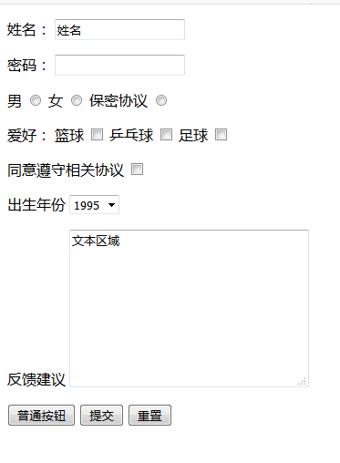
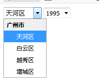

>表单:收集信息
```html
<!DOCTYPE html>
<html lang="en">
<head>
    <meta charset="UTF-8">
    <title>表单</title>
</head>
<body>
    <form action="服务器地址">
        <p>
            姓名：
            <input type="text" value="姓名">
        </p>
        <p>
            <!--html5中使用label可以直接将Input包含起来，不用使用id-->
            <label>密码：
            <input type="password"></label>
        </p>
        <p>
            <!--label一般都是和input搭配使用-->
            <label for="man">男</label>
            <input type="radio" name="sex" id="man">
            <label for="woman">女</label>
            <input type="radio" name="sex" id="woman">

            <label for="secret">保密协议</label>
            <input type="radio" name="sex" id="secret">
        </p>
        <p>
            <!--为了让服务器能接收到提交的数据，需要给每一个表单元素加上name,
            因为数据是通过name 携带的,而且name的值要一样，因为是数组-->
            爱好：
            <label for="basketball">篮球</label>
            <input type="checkbox" id="basketball" name="hobby">
            <label for="pingpang">乒乓球</label>
            <input type="checkbox" id="pingpang" name="hobby">
            <label for="football">足球</label>
            <input type="checkbox" id="football" name="hobby">
        </p>
        <p>
            <label for="xieyi">同意遵守相关协议</label>
            <input type="checkbox" id="xieyi">
        </p>
        <p>
            出生年份
            <select name="" id="">
                <option value="">1995</option>
                <option value="">1996</option>
                <option value="">1997</option>
                <option value="">1998</option>
            </select>
        </p>
        <p>
            反馈建议
            <textarea name="" id="" cols="30" rows="10">文本区域</textarea>
        </p>
        <p>
            <input type="button" value="普通按钮">
            <!--点击提交按钮，信息就会提交到上方action中填写的服务器地址当中-->
            <input type="submit" value="提交">
            <input type="reset" value="重置">
        </p>
    </form>
</body>
</html>
```


>上述表单元素解析(1)文本输入框
```html
<input type="text" value="姓名">
```
    可选择的属性值以及作用如下：
    name:文本框的名字
    value:文本框的值
    maxlength:最多字符长度
    readonly="redonly"输入框为只读状态
    disabled="disable"输入框为未激活状态
    
>(2)密码输入框
```html
<input type="password">
```
    注意：单行文本输入框的所有属性对于密码输入框都适用。
    
>(3)单选框
```html
<label for="man">男</label>
<input type="radio" name="sex" id="man">
```
     name值设置相同的时候，实现单选效果；
     checked="checked" 设置为默认选中项；
     注意：label、for、id的用法，for和id的值需要相同。
     
 >(4)多选框
 ```html
<label for="basketball">篮球</label>
<input type="checkbox" id="basketball" name="hobby">
<label for="pingpang">乒乓球</label>
<input type="checkbox" id="pingpang" name="hobby">
```
>(5)下拉列表
```html
<select name="" id="">
    <optgroup label="广州市">
        <option>天河区</option>
        <option>白云区</option>
        <option>越秀区</option>
        <option>增城区</option>
        </optgroup>
</select>
<select name="" id="">
    <option selected="selected">1995</option>
    <option value="">1996</option>
    <option value="">1997</option>
    <option value="">1998</option>
</select>
```



      注意：selected="selected"设置下拉列表默认选中项；
            multiple="multiple"设置下拉列表为多选项；
            <optgroup></optgroup>对下拉列表进行分组；
            label="分组名称"。
            
>(5)多行文本框
```html
<textarea name="" id="" cols="30" rows="10">文本区域</textarea>
```
     cols=”30”  输入字符的长度
     rows=”10”  输入字符的行数
     
>(6)普通按钮:不能实现表单信息提交，要配合js使用
```html
<input type="button" value="普通按钮">
```
>(7)提交按钮:**点击提交按钮，信息就会提交到上方action中填写的服务器地址当中**
```html
<input type="submit" value="提交">
```
>(8)重置按钮:将表单信息初始化
```html
<input type="reset" value="重置">
```
>(9)上传文件控件 图片...
```html
<input type="file">
```

