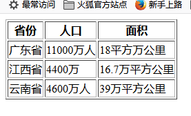
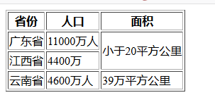
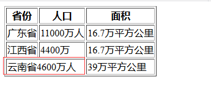
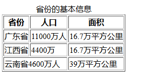

>表格：展示数据
```html
<!DOCTYPE html>
<html lang="en">
<head>
    <meta charset="UTF-8">
    <title>表格</title>
</head>
<body>
    <table border="1">
        <thead>
            <!--tr表示行-->
            <tr>
                <!--th表示列的标题-->
                <th>省份</th>
                <th>人口</th>
                <th>面积</th>
            </tr>
        </thead>
        <tbody>
            <tr>
                <!--td表示单元格-->
                <td>广东省</td>
                <td>11000万人</td>
                <td>18平方万公里</td>
            </tr>
            <tr>
                <td>江西省</td>
                <td>4400万</td>
                <td>16.7万平方公里</td>
            </tr>
            <tr>
                <td>云南省</td>
                <td>4600万人</td>
                <td>39万平方公里</td>
            </tr>
        </tbody>
    </table>
</body>
</html>
```



>(1)th表示表格的标题：浏览器会以一种默认的样式（水平居中，加粗）显示；
    
    如果说th标签有什么作用应该是：不可说是水平居中，加粗显示这只是浏览器给它显示的样式，
    我们需要站在语义的角度说明这个内容是表头的意思，同时外观上也有所不同。跟td用法没有
    本质上的区别，只是增加了语义化。
    
>(2)合并单元格(行合并)
```html
<!DOCTYPE html>
<html lang="en">
<head>
    <meta charset="UTF-8">
    <title>表格</title>
</head>
<body>
    <table border="1">
        <thead>
            <!--tr表示行-->
            <tr>
                <!--th表示列的标题-->
                <th>省份</th>
                <th>人口</th>
                <th>面积</th>
            </tr>
        </thead>
        <tbody>
            <tr>
                <!--td表示单元格-->
                <td>广东省</td>
                <td>11000万人</td>
                <td rowspan="2">小于20平方公里</td>
            </tr>
            <tr>
                <td>江西省</td>
                <td>4400万</td>
                <!--<td>16.7万平方公里</td>-->
            </tr>
            <tr>
                <td>云南省</td>
                <td>4600万人</td>
                <td>39万平方公里</td>
            </tr>
        </tbody>
    </table>
</body>
</html>
```


>(3)合并单元格(列合并)
```html
<!DOCTYPE html>
<html lang="en">
<head>
    <meta charset="UTF-8">
    <title>表格</title>
</head>
<body>
    <table border="1">
        <thead>
            <!--tr表示行-->
            <tr>
                <!--th表示列的标题-->
                <th>省份</th>
                <th>人口</th>
                <th>面积</th>
            </tr>
        </thead>
        <tbody>
            <tr>
                <!--td表示单元格-->
                <td>广东省</td>
                <td>11000万人</td>
                <td>16.7万平方公里</td>
            </tr>
            <tr>
                <td>江西省</td>
                <td>4400万</td>
                <td>16.7万平方公里</td>
            </tr>
            <tr>
                <td colspan="2">云南省4600万人</td>
                <!--<td>4600万人</td>-->
                <td>39万平方公里</td>
            </tr>
        </tbody>
    </table>
</body>
</html>
```


>(4)表格中的thead、tbody、tfoot
    
    要想表格更语义化，与后台更好的交互：
    1、可在表格头部添加thead标签；
    2、在表格体体中添加tbody标签；
    3、表格需要汇总时可在尾部添加tfoot标签；
    4、若是都没有添加则表格内容默认放在tbody中
    
>(5)caption(表格中的主标题)

    不选择使用h系列的标题的原因在于这个在表格中更具有语义化，
    同时如果表格需要移动的话，标题也会跟着移动居中显示。


>(6)div和span
    
    (1)div是一个容器级的标签，什么都可以放，包括自身，可以将一些相同语义的元素
    放在同一个div中,同时它也是无语义的标签，主要是用来div+css布局。
    (2)span标签可以把一些语义相近的功能相同的文本标签放在一个span，也没有任何默认样式。
    
>(7)字符实体

    常用的有：&lt  <;  &gt >;  &copy 版权;  &nbsp 空格
    
>(8)目前废弃标签和主要用途

    废弃标签： b、u、i、font...
    用途：做css钩子使用，如下所示：可以通过让i标签作为选择器，然后去定义样式
```html
<i>当做css的钩子</i>
```

    