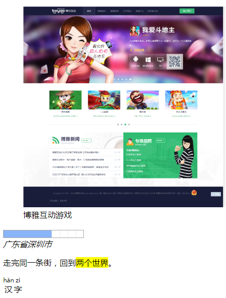
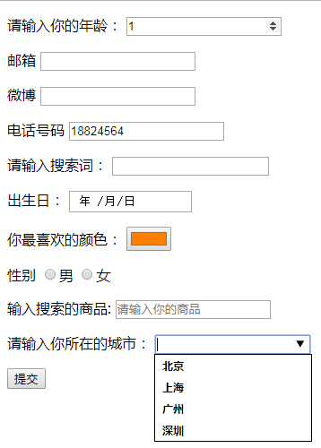

>html5基本骨架
```html
<!-- DTD IE6、7不支持-->
<!DOCTYPE html>
<html lang="en">
<head>
	<!-- 字符集设置 -->
	<meta charset="UTF-8">
	<title>Document</title>
</head>
<body>
	
</body>
</html>
```

>html5新增的提纲标签

    1、导航标签： <nav></nav>
    2、具备主题的区域（公司新闻）： <section></section>
    3、头部： <header></header>
    4、尾部： <footer></footer>
    5、侧边栏： <aside></aside>
    6、分组： <hgroup></hgroup>
    7、文章： <article></article>
    ......
    
    注意：
    (1)关于新增语义化标签说明，语义上都比div大，所以他们都能包含div,但是div不能包含它们，都属于块元素，没有任何默认样式，用法同div.
    (2)兼容性： IE9开始兼容，IE8及以下不能用这些标签，(可用第三方插件兼容PC端低版本ie),不影响手机端浏览器使用。
 
>新的语义元素

```html
<!DOCTYPE html>
<html lang="en">
<head>
	<meta charset="UTF-8">
	<title>Document</title>
</head>
<body>
	<!-- 描述图和标题的语义标签 -->
	<figure>
		
		<figcaption>博雅互动游戏</figcaption>
	</figure>

	<!-- 进度条语义标签 -->
	<progress max="100" value="60"></progress>

	<!-- 地址语义标签 -->
	<address>广东省深圳市</address>

	<!-- 高亮显示语义标签 -->
	<p>走完同一条街，回到<mark>两个世界</mark>。</p>
	
	<!-- 字体上方添加拼音语义标签 -->
	<ruby>
		汉<rp></rp><rt>hàn</rt></rp></rp>
		字<rp></rp><rt>zì</rt></rp></rp>
	</ruby>
</body>
</html>
```  


>新增表单元素

    html4: input、 text、 password、 radio、 checkbox、 submit、 buttom、 reset、 file、 hidden
    
    html5: search、 tel、 url、 email、 color、 date、 number、 date、 color、 datalist/option
    
```html
<!DOCTYPE html>
<html lang="en">
<head>
	<meta charset="UTF-8">
	<title>Document</title>
</head>
<body>
	<form action="">
		<p>
			请输入你的年龄：
			<input type="number"/>
		</p>
		<p>
			邮箱
			<input type="email"/>
		</p>
		<p>
			微博
			<input type="url"/>
		</p>
		<p>
			电话号码
			<input type="tel" pattern="^[\d]{11}$"/>
		</p>
		<p>
			请输入搜索词：
			<input type="search" autofocus/>
		</p>
		<p>
			出生日：
			<input type="date"/>
		</p>

		<p>
			你最喜欢的颜色：
			<input type="color" />
		</p>
		<p>
			性别
			<label>
				<input type="radio" name="sex"/>男
			</label>
			<label>
				<input type="radio" name="sex"/>女
			</label>
		</p>

		<p>
			输入搜索的商品:
			<input type="text" placeholder="请输入你的商品"/>
		</p>
		<p>
			请输入你所在的城市：
			<input type="text" list="city">
			<datalist id="city">
				<option value="北京">北京</option>
				<option value="上海">上海</option>
				<option value="广州">广州</option>
				<option value="深圳">深圳</option>
			</datalist>
		</p>
		<p>
			<input type="submit"/>
		</p>
	
	</form>
</body>
</html>
```

       