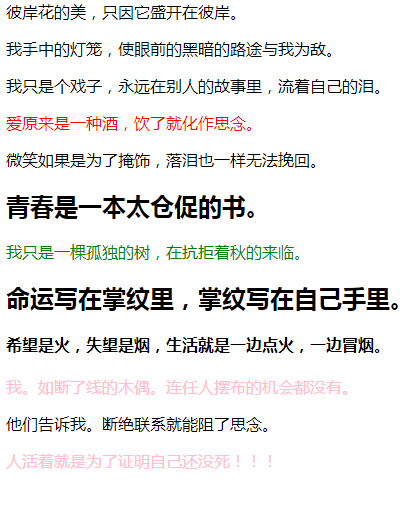
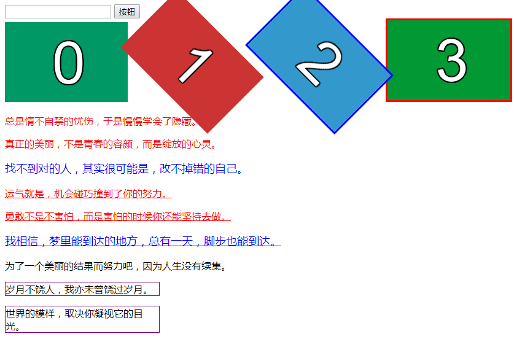

    1、关系选择器："+"、">"、"~"
```html
<!DOCTYPE html>
<html lang="en">
<head>
	<meta charset="UTF-8">
	<title>Document</title>
	<style type="text/css">
		/*是亲儿子，不是后代 IE7开始兼容*/
		.wrap > p {
			color: red;
		}

		/*选择h2紧挨着的p元素("+"表示下一个兄弟) IE7开始兼容*/
		h2+p {
			color: green;
		}

		/*h4后面所有的兄弟,不是兄弟元素不选 */
		h4~p {
			color: pink;
		}
	</style>
</head>
<body>
	<div class="wrap">
		<div>
			<p>彼岸花的美，只因它盛开在彼岸。</p>
			<p>我手中的灯笼，使眼前的黑暗的路途与我为敌。</p>
			<p>我只是个戏子，永远在别人的故事里，流着自己的泪。</p>
		</div>
		<p>爱原来是一种酒，饮了就化作思念。</p>
	</div>
	<p>微笑如果是为了掩饰，落泪也一样无法挽回。</p>
	<h2>青春是一本太仓促的书。</h2>
	<p>我只是一棵孤独的树，在抗拒着秋的来临。</p>
	<h2>命运写在掌纹里，掌纹写在自己手里。</h2>
	<h4>希望是火，失望是烟，生活就是一边点火，一边冒烟。</h4>
	<p>我。如断了线的木偶。连任人摆布的机会都没有。</p>
	<div>
		<p>他们告诉我。断绝联系就能阻了思念。</p>
	</div>
		<p>人活着就是为了证明自己还没死！！！</p>
</body>
</html>
```


    2、属性选择器
    
```html
<!DOCTYPE html>
<html lang="en">
<head>
	<meta charset="UTF-8">
	<title>Document</title>
	<style type="text/css">
		/*根据属性值给最后一张图加上边框*/
		img[src="3.png"] {
			border: 3px solid red;
		}

		/*只要属性等于33的都被选中*/
		[alt="33"] {
			transform: rotate(45deg);
		}

		/*既要满足alt="33"又要满足src="2.png"*/
		[alt="33"][src="2.png"] {
			border: 3px solid blue;
		}

		/*选择以属性值"para"开头的p元素(以什么开头)*/
		p[class^="para"] {
			color: red;
		}

		/*以数字3结尾 (选择以什么结尾的)*/
		p[class$="3"] {
			font-size: 18px;
			color: blue;
		}

		/*包含"n"的都被选中*/
		p[class*="n"] {
			width: 250px;
			border: 1px solid purple;
		}

		/*选中以"para"开头的，并且紧跟着"-" 等价于p[class^="para-"] IE7开始兼容*/
		p[class|="para"] {
			text-decoration: underline;
		}
		
		/*有空格隔开的"jing"的个体被选中，IE7开始兼容
		
		因为类之间用空格隔开 .demo {} 等价于 [class~="demo"]*/
		div[class ~= "jing"] {
			text-decoration: line-through;
		}

	</style>
</head>
<body>
	<input type="text" />
	<input type="button" value="按钮" />

	<div class="jing box"></div>
	<div class="jing an"></div>
	<div class="jerry xixi"></div>
	<div class="xixi-jerry"></div>
	<div class="jing"></div>

	
	
	
	

	<p class="para1">总是情不自禁的忧伤，于是慢慢学会了隐藏。</p>
	<p class="para2">真正的美丽，不是青春的容颜，而是绽放的心灵。</p>
	<p class="para3">找不到对的人，其实很可能是，改不掉错的自己。</p>
	<p class="para-1">运气就是，机会碰巧撞到了你的努力。</p>
	<p class="para-2">勇敢不是不害怕，而是害怕的时候你还能坚持去做。</p>
	<p class="para-3">我相信，梦里能到达的地方，总有一天，脚步也能到达。</p>
	<p class="liao">为了一个美丽的结果而努力吧，因为人生没有续集。</p>
	<p class="jing">岁月不饶人，我亦未曾饶过岁月。</p>
	<p class="an">世界的模样，取决你凝视它的目光。</p>
</body>
</html>
```
