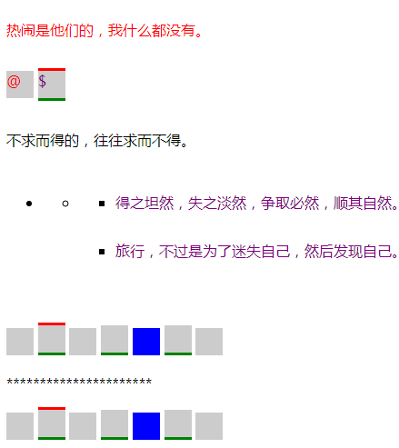
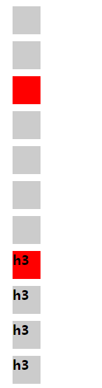

    儿子选择器
        :first-child IE7兼容
        :last-child  其余的都为IE9兼容
        :nth-child()...
        :nth-of-type()...
        :nth-last-type()...
        :first-of-type   不加括号
        ：last-of-type
    
```html
<!DOCTYPE html>
<html lang="en">
<head>
	<meta charset="UTF-8">
	<title>Document</title>
	<style type="text/css">
		/*第一必须是p元素；第二一定是某个元素的第一个儿子 IE7兼容*/
		p:first-child {
			color: red;
		}
		
		/*IE9开始兼容*/
		p:last-child {
			color: purple;
		}

		div p {
			width: 30px;
			height: 30px;
			background-color: #ccc;
		}

		/*div中p标签中的第二个，注意下标从1开始数,不可有负数
		如果括号为2n，即为2的倍数都被选中*/
		div p:nth-child(2) {
			border-top: 3px solid red;
		}

		div p:nth-child(2n) {
			border-bottom: 3px solid green;
		}

		/*某个元素的倒数第几个*/
		p:nth-last-child(3) {
			background-color: blue;
		}

		p {
			display: inline-block;
		}
	</style>
</head>
<body>
	<p>热闹是他们的，我什么都没有。</p>
	<div>
		<p>@</p>
		<p>$</p>
	</div>
	<p>不求而得的，往往求而不得。</p>
	<ul>
		<li>
			<ul>
				<li>
					<ul>
						<li>
							<p>得之坦然，失之淡然，争取必然，顺其自然。</p>
						</li>
						<li>
							<p>旅行，不过是为了迷失自己，然后发现自己。</p>
						</li>
					</ul>
				</li>
			</ul>
		</li>
	</ul>
	<br/>
	<div>
		<p></p>
		<p></p>
		<p></p>
		<p></p>
		<p></p>
		<p></p>
		<p></p>
	</div>
	**********************
	<div>
		<p></p>
		<p></p>
		<p></p>
		<p></p>
		<p></p>
		<p></p>
		<p></p>
	</div>
</body>
```


```html
<!DOCTYPE html>
<html lang="en">
<head>
	<meta charset="UTF-8">
	<title>Document</title>
	<style type="text/css">
		p,h3 {
			width: 40px;
			height: 40px;
			margin: 10px;
			background-color: #ccc;
		}

		/*在携带.jing类中，（即p和h3元素类型中）找到第三个*/
		.jing:nth-of-type(3) {
			background-color: red;
		}

	</style>
</head>
<body>
	<div></div>
	<p></p>
	<p class="jing"></p>
	<p class="jing"></p>
	<p class="jing"></p>
	<div>
		<h3></h3>
		<p></p>
		<h3 class="jing"></h3>
		<h3 class="jing">h3</h3>
		<h3 class="jing">h3</h3>
		<h3 class="jing">h3</h3>
		<h3 class="jing">h3</h3>
	</div>
</body>
</html>
```
