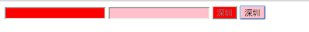

    伪类(元素的不同状态)：
    
    1、*:hover 在css3中能够被所有的元素使用， IE7开始兼容

```html
<!DOCTYPE html>
<html lang="en">
<head>
	<meta charset="UTF-8">
	<title>Document</title>
	<style type="text/css">
		img {
			/*过渡:从一种状态平滑转到另一种状态*/
			transition: all 0.4s ease 0s;
		}

		img:hover {
			/*变形，缩放变形*/
			transform: scale(1.5) rotate(1360deg);
		}
	</style>
</head>
<body>
	
	
	
	
</body>
</html>
```


    2   * :focus 获取得到焦点后，就执行定义的效果
        * :not 
          p:not(.demo) 表示选择中class没有demo类的p元素
          
```html
<!DOCTYPE html>
<html lang="en">
<head>
	<meta charset="UTF-8">
	<title>Document</title>
	<style type="text/css">
	body {
		background-color: #eee;
	}

	input {
		margin: 10px;
		font-size: 30px;
		border-radius: 10px;
		border: 1px solid #ccc;
		/*让轮廓线消失*/
		outline: none;
	}

	input:focus {
		/*动画*/
		animation: donghua 1s ease 0s infinite alternate;
	}

	/*定义动画*/
	@-webkit-keyframes donghua {
		from {
			box-shadow: 0px 0px 0px blue;
		}
		to {
			box-shadow: 0px 0px 50px red;
		}
	}
	</style>
</head>
<body>
	<input type="text"/><br/>
	<input type="text"/><br/>
	<input type="text"/><br/>
	<input type="text"/><br/>
</body>
</html>
```


    3 * :only-child 唯一的儿子
```html
<!DOCTYPE html>
<html lang="en">
<head>
	<meta charset="UTF-8">
	<title>Document</title>
	<style type="text/css">
		p:only-child {
			color: red;
			font-size: 30px;
		}
	</style>
</head>
<body>
    <ul>
		<li>
			<p>青春是一场大雨，即使感冒了，还盼望回头再淋它一次。</p>
		</li>
		<li>
			<p>每一个矜持淡定的现在，都有一个很傻很天真的曾经。</p>
			<p>没用的东西，再便宜也不要买；不爱的人，再寂寞也不要依赖</p>
		</li>
	</ul>
</body>
</html>
```


    4 * :empty 空标签(标签必须首尾相接，比如：<div></div>)
      * :checked 选中的(主要用于单选按钮或复选按钮)，选中后样式就执行样式。
```html
<!DOCTYPE html>
<html lang="en">
<head>
	<meta charset="UTF-8">
	<title>Document</title>
	<style type="text/css">
		div {
			width: 50px;
			height: 50px;
		}

		div:empty {
			background-color: red;
		}

		input[type="radio"]:checked {
			width: 30px;
			height: 30px;
		}
	</style>
</head>
<body>
	<div></div>
	<div> </div>
	<div>
		
	</div>
	<div>哈哈哈</div>
	<input type="radio">男
</body>
</html>
```


    5 * :disabled 和 :enabled  IE9开始兼容
```html
<!DOCTYPE html>
<html lang="en">
<head>
	<meta charset="UTF-8">
	<title>Document</title>
	<style type="text/css">
		/*不可操作的背景色为红色*/
		input:disabled {
			background-color: red;
		}

		/*可操作的背景色为粉色*/
		input:enabled {
			background-color: pink;
		}
	</style>
</head>
<body>
	<input type="text" disabled/>
	<input type="text"/>
	<input type="button" disabled value="深圳"/>
	<input type="button" value="深圳">
</body>
</html>
```
