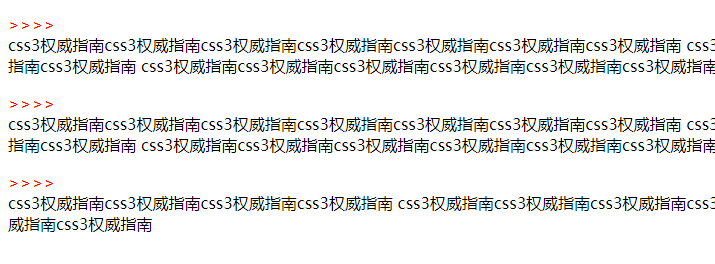
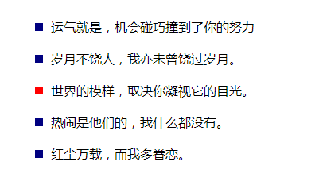
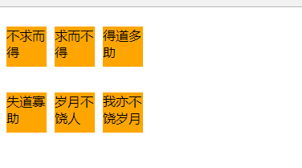

伪元素(跟标签差不多只是用css的方式来写)
    
    1、 ::before与::after
    注意：用::before一定要用content,设置宽高需转换成块，主要用来在某些地方开头插入小图标，文字等
         IE8不兼容::after，但可以兼容:after，所以为了更好的兼容，使用:after即可
```html
<!DOCTYPE html>
<html lang="en">
<head>
	<meta charset="UTF-8">
	<title>Document</title>
	<style type="text/css">
		/*表示在p元素内部开始位置插入content内容,并且颜色为红色
		转换成块，独占一行，一定要用content属性，没有内容就为空*/
		p::before {
			content: ">>>>";
			display: block;
			color: red;
		}
	</style>
</head>
<body>
	<p>css3权威指南css3权威指南css3权威指南css3权威指南css3权威指南css3权威指南css3权威指南
	css3权威指南css3权威指南css3权威指南css3权威指南css3权威指南css3权威指南css3权威指南
	css3权威指南css3权威指南css3权威指南css3权威指南css3权威指南css3权威指南css3权威指南
	css3权威指南css3权威指南css3权威指南css3权威指南css3权威指南css3权威指南css3权威指南
	css3权威指南css3权威指南css3权</p>
	<p>css3权威指南css3权威指南css3权威指南css3权威指南css3权威指南css3权威指南css3权威指南
	css3权威指南css3权威指南css3权威指南css3权威指南css3权威指南css3权威指南css3权威指南
	css3权威指南css3权威指南css3权威指南css3权威指南css3权威指南css3权威指南css3权威指南
	css3权威指南css3权威指南css3权威指南css3权威指南css3权威指南css3权威指南css3权威指南
	css3权威指南css3权威指南css3权</p> <p>css3权威指南css3权威指南css3权威指南css3权威指南
	css3权威指南css3权威指南css3权威指南css3权威指南css3权威指南css3权威指南css3权威指南
	css3权威指南css3权威指南css3权威指南css3权威指南css3权威指南css3权威指南css3权威指南
	css3权威指南css3权威指南css3权威指南</p>
</body>
</html>
```


```html
<!DOCTYPE html>
<html lang="en">
<head>
	<meta charset="UTF-8">
	<title>Document</title>
	<style type="text/css">
		ul {
			list-style: none;
		}

		ul li {
			position: relative;
			padding-left: 20px;
			line-height: 40px;
		}

		/*在li前面用::before插入一个盒子*/
		ul li::before {
			content:"";
			position: absolute;
			top: 50%;
			left: 0;
			margin-top: -5px;
			width: 10px;
			height: 10px;
			background-color: navy;
		}

		ul li:hover::before {
			background-color: red;
		}
	</style>
</head>
<body>
	<ul>
		<li>运气就是，机会碰巧撞到了你的努力</li>
		<li>岁月不饶人，我亦未曾饶过岁月。</li>
		<li>世界的模样，取决你凝视它的目光。</li>
		<li>热闹是他们的，我什么都没有。</li>
		<li>红尘万载，而我多眷恋。</li>
	</ul>
</body>
</html>
```


```html
<!DOCTYPE html>
<html lang="en">
<head>
	<meta charset="UTF-8">
	<title>Document</title>
	<style type="text/css">
		.box {
			width: 500px;
			height: 539px;
			border: 1px solid #000;
			position: relative;
			background: url("liushishi.jpg") center top;
			overflow: hidden;
			float: left;
		}

		.box::before {
			content: "刘诗诗";
			color: white;
			text-align: center;
			line-height: 539px;
			position: absolute;
			width: 500px;
			height: 539px;
			background-color: black;
			top: 539px;
			left: 0;
			opacity: 0.5;
			transition: all 0.4s ease 0s;
		}

		.box:hover::before {
			top: 0;
			box-shadow: inset 0px 0px 20px red;
		}
	</style>
</head>
<body>
	<div class="box"></div>
	<div class="box"></div>
	<div class="box"></div>
</body>
</html>
```


    ::after 清除浮动
```html
<!DOCTYPE html>
<html lang="en">
<head>
	<meta charset="UTF-8">
	<title>Document</title>
	<style type="text/css">
		p {
			float: left;
			width: 50px;
			height: 50px;
			background-color: orange;
			margin-right: 10px;
		}

		.cl::after {
			content: "";
			display: block;
			clear: both;
		}
	</style>
</head>
<body>
		<div class="cl">
			<p>不求而得</p>
			<p>求而不得</p>
			<p>得道多助</p>
		</div>
		<div class="cl">
			<p>失道寡助</p>
			<p>岁月不饶人</p>
			<p>我亦不饶岁月</p>
		</div>
</body>
</html>
```


    ::selection 被选中的文字样式
    ::first-letter 表示第一个文字
    ::first-line   表示第一行
    以上都从 IE9开始兼容
```html
<!DOCTYPE html>
<html lang="en">
<head>
	<meta charset="UTF-8">
	<title>Document</title>
	<style type="text/css">
		/*选择p里面文字时，样式生效*/
		p::selection {
			background-color: orange;
			color: white;
		}

		p::first-letter {
			font-weight: 700;
			font-size: 50px;
			float: left;
		}

		p::first-line {
			font-weight: 700;
		}
	</style>
</head>
<body>
	<p>冬天的河干涸了，我相信，春水还会来临，那时白帆就是我心中的偶像;风中的树 叶凋零了，我相信，泥土里的梦将在枝头开花结果。
　　	   青春是用意志的血滴和拼搏的汗水酿成的琼浆——历久弥香;青春是用不凋的希望和不灭的向往编织的彩虹——绚丽辉煌;青春是用永恒的执着	  和顽强的韧劲筑起的一道铜墙铁壁——固若金汤。
　　   人世间的真情就像一张大网，时刻温暖着人的心扉，就如妈妈的爱一样，永无止境。
　　   是一丛秋菊，也要散发芳香;是一片秋叶，也要装点大地;是一株古柏，也要撑起 蓝天;是一眼古井，也要流出清泉。
　　   岁月，是一首诗，一首蕴含丰富哲理的诗，岁月是一峰骆驼，驮着无数人的梦想。
　　   天空收 容每一片云彩，不论其美丑，所以天空宽阔无边。大地拥抱每一寸土地，不论其贫富，所以大地广袤无垠。海洋接纳每一条河流， 不论其大小，所以海洋广阔无边。
　　   往事如歌，在人生的旅途中，尽管有过坎坷，有过遗憾，却没有失去青春的美丽。相信自己，希望总是有的，让我们记住那句话：错过了太阳，我不哭泣，否则，我将错过月亮和星辰。　　信念是巍巍大厦的栋梁，没有它，就只是一堆散乱的砖瓦;信念是滔滔大江的河床，没有它，就只有一片泛滥的波浪;信念是熊熊烈火的引星，没有它，就只有一把冰冷的柴把;信念是远洋巨轮的主机，没有它，就只剩下瘫痪的巨架。</p>
</body>
</html>
```