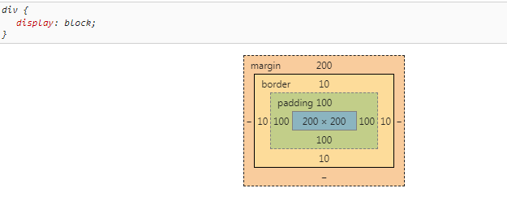
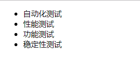
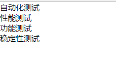
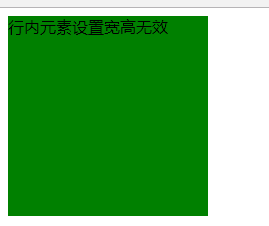
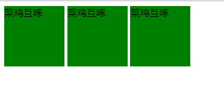

>盒模型

    比如一个相框 400*400的相框以及300*300的相片
    width----------------内容的宽度，不是盒子的总宽度
    height---------------内容的高度，不是盒子的总高度
    border---------------边框
    padding--------------内边距
    margin---------------外边距
    
```html
<!DOCTYPE html PUBLIC "-//W3C//DTD XHTML 1.0 Transitional//EN" "http://www.w3.org/TR/xhtml1/DTD/xhtml1-transitional.dtd">
<html xmlns="http://www.w3.org/1999/xhtml" xml:lang="en">
<head>
	<meta http-equiv="Content-Type" content="text/html;charset=UTF-8">
	<title>Document</title>
	<style type="text/css">
		div {
			width: 200px;
			height: 200px;
			padding: 100px;
			border: 10px solid blue;
			margin-top: 200px;
			background-color: red; 
		}
	</style>
</head>
<body>
	<div>
		江南的风轻轻的吹，那样柔软，那样舒适，吹过青青芳草地，吹过盈盈碧水岸，吹过烟雨蒙蒙的江南杨柳舍。江南的风如此温柔，轻轻吹过我柔柔的发间，轻轻吹过我湿润的双眸；江南的风如此温暖，我灵敏的鼻息仿佛嗅到你谈吐间暖暖的气息
	</div>
</body>
</html>
```


    上面的盒子真实宽度是多少？   200+100+100+10+10=420px
>1、padding属性

    内容和边框之间的距离：
        padding: 10px;
        相当于padding-top: 10px;
             padding-right: 10px;
             padding-buttom: 10px;
             padding-left: 10px;
        
        padding: 10px 20px; 上（下）10px， 右（左）20px；
        padding: 10px 20px 30px; 上10px， 右(左)20px， 下30px;
        padding: 10px 20px 30px 40px 上10px, 右20px, 下30px, 左40px;
        
        记忆规律：四个值的时候就顺时针书写；
                不满四个值时，先按顺序写完，缺少的找对立面即可；
                比如：padding: 10px 20px; 先按顺序写上10px,右20px,缺少的找对立面，上对应下也10px,右对应左也20px

**注意自带padding和margin对网页的制作影响**                
```html
<!DOCTYPE html PUBLIC "-//W3C//DTD XHTML 1.0 Transitional//EN" "http://www.w3.org/TR/xhtml1/DTD/xhtml1-transitional.dtd">
<html xmlns="http://www.w3.org/1999/xhtml" xml:lang="en">
<head>
	<meta http-equiv="Content-Type" content="text/html;charset=UTF-8">
	<title>Document</title>
	<style type="text/css">
	/*由于ul自带padding和margin对我们页面制作有影响
	所以我们需要重置清零*/
	* {
		padding: 0;
		margin: 0;
	}
	</style>
</head>
<body>
	<ul>
		<li>自动化测试</li>
		<li>性能测试</li>
		<li>功能测试</li>
		<li>稳定性测试</li>
	</ul>
</body>
</html>
``` 

   

>2、border属性

    边框三要素： 粗细、线型、颜色
    border: 10px solid blue;
    对应于：
        border-width: 10px;
            分解： border-top-width: 10px;
                  border-right-width: 10px;
                  border-buttom-width: 10px;
                  border-left-width: 10px;
                  
        border-style: solid;
            分解：......
        border-color: blue;
            分解：......
    
    常用线型：solid------实线
            dashed-----虚线
            其余线型容易出现兼容性问题    
            
>3、margin:盒子与其它元素之间的距离(使用方式基本和padding用法相似)
    
    margin-top
    margin-right
    margin-buttom
    margin-left 
    
**外边距塌陷问题** 

    两个盒子垂直一个设置上外边距，一个设置下外边距，取的设置较大的值。
    
    1、上下盒子的margin小的值会塌陷在大的值里 
    2、嵌套的盒子（父子关系）也会发生塌陷
```html
<!DOCTYPE html>
<html lang="en">
<head>
	<meta charset="UTF-8">
	<title>Document</title>
	<style type="text/css">
		* {
			margin: 0;
			padding: 0;
		}
        
        		/*上下盒子发生塌陷的现象*/
        		
		.box1 {
			width: 200px;
			height: 200px;
			background-color: skyblue;
			margin-bottom: 120px;
		}

		.box2 {
			width: 200px;
			height: 200px;
			background-color: yellowgreen;
			margin-top: 80px;
		}
	</style>
</head>
<body>
	<div class="box1"></div>
	<div class="box2"></div>
</body>
</html>
```
**左右盒子没有塌陷的现象，距离是两个外边距相加**

>4、文本居中策略

    text-align: center 文本居中 不区分单行和多行
    对于单行文本居中：让行高等于高度，line-height=height
    对于多行文本垂直居中：不设置盒子的高度，用文本行高撑开，上下内边距给一个相同的数值，盒子居中。
    
>5、标准文档流

    特点： 1、文字空白出现折叠现象；
          2、文本类的元素会并排，高低不齐，底边对齐；
          3、文字排到最右侧，自动换行。
          
    对元素进行分类：
          1、块级元素：所有的容器级标签都是块级元素，文本级元素中的p元素也是块级元素
            例如：body、h1~h6、dl、dt、ul、li、table、tr、td、div、form
            
          2、行内元素：除了p元素之外的所有文本级标签都是行内元素
            例如：a、img、span、input、i、em、strong、del、ins
            
    行内元素特点：
          1、设置宽高无效(是由内容撑开的)；
          2、行内元素与行内元素可以并排在一行；
          
    块级元素特点：
          1、可以设置宽高；
          2、独占一行，不与其它标签并排；
          3、不设置宽高，会继承父亲宽度的100%；
          
    行块元素之间的转换：
          display: block; 常用
          display: none; 隐藏元素
          display: inline-block 行内块
```html
<!DOCTYPE html>
<html lang="en">
<head>
	<meta charset="UTF-8">
	<title>Document</title>
	<style type="text/css">
		/*行内元素添加display:block属性后，可设置宽高*/
		span {
			height: 200px;
			width: 200px;
			display: block;
			background-color: green;
		}
	</style>
</head>
<body>
	<span>行内元素设置宽高无效</span>
</body>
</html>
```


    display: inline-block;行内块用法

```html
<!DOCTYPE html>
<html lang="en">
<head>
	<meta charset="UTF-8">
	<title>Document</title>
	<style type="text/css">
	span {
		width: 100px;
		height: 100px;
		background-color: green;
		/*可以设置宽高，也可以并排显示*/
		display: inline-block;
	}
	</style>
</head>
<body>
	<div>
		<span>菜鸡互啄</span>
		<span>菜鸡互啄</span>
		<span>菜鸡互啄</span>
	</div>
</body>
</html>
```


