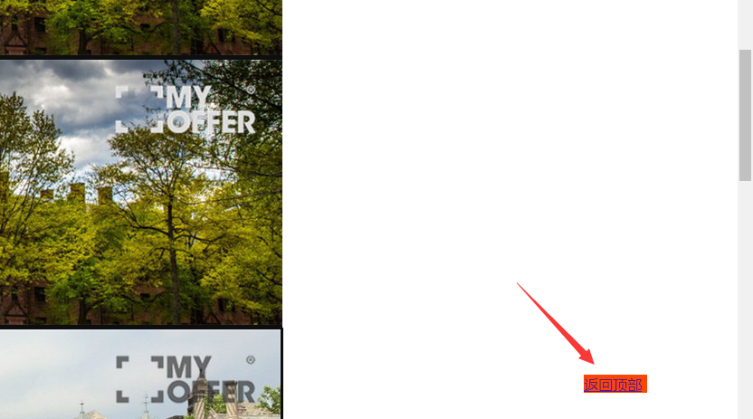

>固定定位

    position:fixed;
    固定定位元素也是脱标的，特点：随着窗口的卷动，固定定位的元素不会消失
    参考点： 一定是浏览器的角
    应用：页面中作为返回顶部
    
```html
<!DOCTYPE html PUBLIC "-//W3C//DTD XHTML 1.0 Transitional//EN" "http://www.w3.org/TR/xhtml1/DTD/xhtml1-transitional.dtd">
<html xmlns="http://www.w3.org/1999/xhtml" xml:lang="en">
<head>
	<meta http-equiv="Content-Type" content="text/html;charset=UTF-8">
	<title>Document</title>
	<style type="text/css">
		* {
			padding: 0;
			margin: 0;
		}

		a.goBack {
			position: fixed;
			right: 100px;
			bottom: 40px;
			width: 70px;
			height: 20px;
			background-color: #f40;
		}
	</style>
</head>
<body>
	<div class="header">
		<p></p>
		<p></p>
		<p></p>
		<p></p>
		<p></p>
		<p></p>
		<p></p>
		<p></p>
		<a href="#" class="goBack">返回顶部</a>
	</div>
```


总结：浮动、绝对定位、固定定位，这几种定位方式，只能一种作用在同一个元素上，不能同时作用于同一个元素。
    