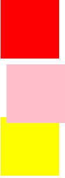

>css定位： 相对定位、绝对定位、固定定位

    1、相对定位 position:relative;
     用途：
        相对自身进行位置的微调,相对自己原来的位置进行移动
        
     移动位置表示方法：
        top 正数向下
        right 正数向左
        bottom 正数向上
        left 正数向右
        任意组合： 从top、bottom选一个 left、right选一个
        
     总结：  和自身设置的方向相反移动 
     
**相对定位的元素是定位方法中唯一不脱标的**
```html
<!DOCTYPE html PUBLIC "-//W3C//DTD XHTML 1.0 Transitional//EN" "http://www.w3.org/TR/xhtml1/DTD/xhtml1-transitional.dtd">
<html xmlns="http://www.w3.org/1999/xhtml" xml:lang="en">
<head>
	<meta http-equiv="Content-Type" content="text/html;charset=UTF-8">
	<title>Document</title>
	<style type="text/css">
		div {
			width: 100px;
			height: 100px;
		}

		.box1 {
			background-color: red;
		}

		.box2 {
			background-color: pink;
			/*添加position:relative;只是告诉浏览器开始相对定位了，不会有具体变化，要变化需要添加值*/
			position: relative;
			/*相对于原来边框位置向下移动10px*/
			top: 10px;
			/*相对于原来左边框位置向右移动10px*/
			left: 10px;
		}

		.box3 {
			background-color: yellow;
		}
	</style>
</head>
<body>
	<div class="box1"></div>
	<div class="box2"></div>
	<div class="box3"></div>
</body>
</html>
```

