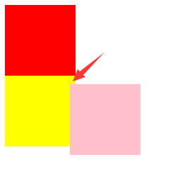
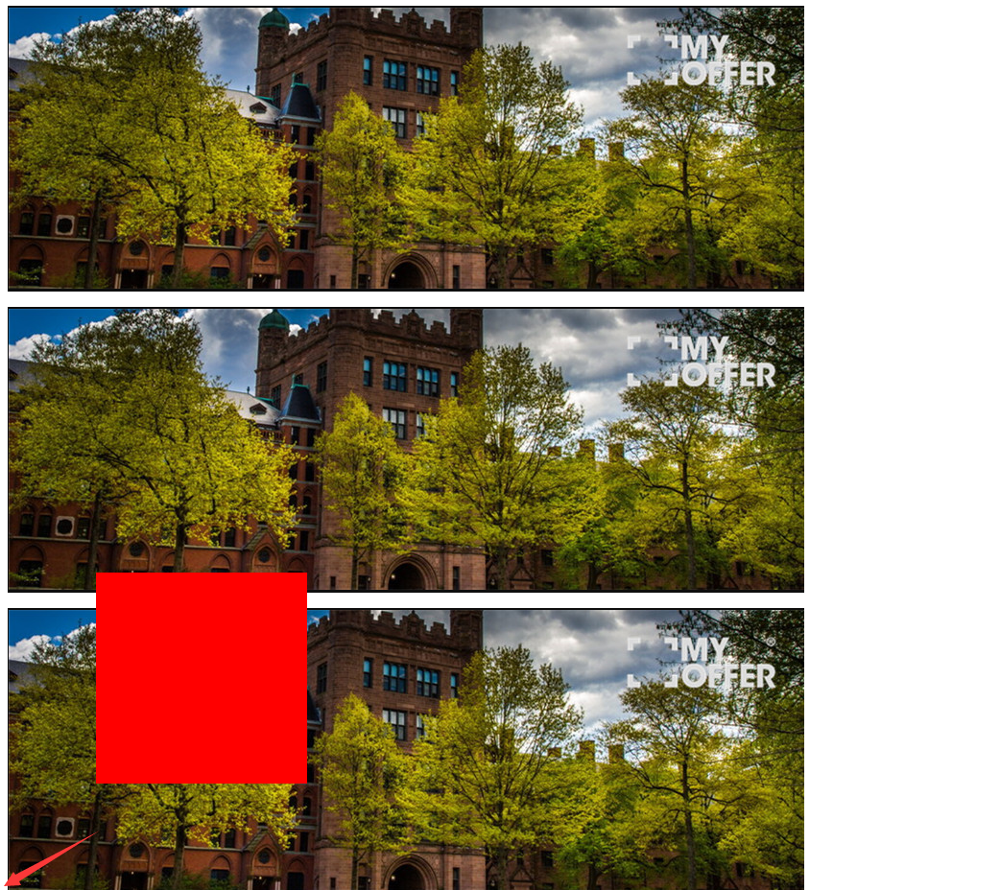
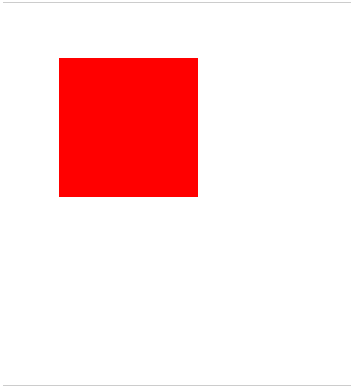

>绝对定位

    position: absolute;
    1、绝对定位元素脱离标准文档流；
    
**定位参考点**
    
    a、假如用top定位:
        参考点就是页面的左上角(top、left)或者右上角(top、right)，不是浏览器窗口,就是会随着滚动条滚动。
    
```html
<!DOCTYPE html PUBLIC "-//W3C//DTD XHTML 1.0 Transitional//EN" "http://www.w3.org/TR/xhtml1/DTD/xhtml1-transitional.dtd">
<html xmlns="http://www.w3.org/1999/xhtml" xml:lang="en">
<head>
	<meta http-equiv="Content-Type" content="text/html;charset=UTF-8">
	<title>Document</title>
	<style type="text/css">
		div {
			width: 100px;
			height: 100px;
		}

		.box1 {
			background-color: red;
		}

		.box2 {
			background-color: pink;
			position: absolute;
			/*左上角离上方body的距离*/
			top: 120px;
			/*左上角离左边body的距离（左上角离父亲的距离）*/
			left: 100px;
		}

		.box3 {
			background-color: yellow;
		}
	</style>
</head>
<body>
	<div class="box1"></div>
	<div class="box2"></div>
	<div class="box3"></div>
</body>
</html>
```


    b、假如用bottom定位：
        就是浏览器首屏的左下角在页面中的位置
```html
<!DOCTYPE html PUBLIC "-//W3C//DTD XHTML 1.0 Transitional//EN" "http://www.w3.org/TR/xhtml1/DTD/xhtml1-transitional.dtd">
<html xmlns="http://www.w3.org/1999/xhtml" xml:lang="en">
<head>
	<meta http-equiv="Content-Type" content="text/html;charset=UTF-8">
	<title>Document</title>
	<style type="text/css">
		p.last {
			width: 220px;
			height: 220px;
			background-color: red;
			position: absolute;
			/*以浏览器首屏左下角作为参考点，不是以整个页面*/
			bottom: 100px;
			/*离页面左侧100px*/
			left: 100px;
		}
	</style>
</head>
<body>
	<div>
		<p></p>
		<p></p>
		<p></p>
		<p></p>
		<p></p>
		<p></p>
		<p></p>
		<p></p>
		<p class="last"></p>
	</div>
</body>
</html>
```


    c、祖先的盒子作为参考点
        子绝父相：儿子用绝对定位，父亲用相对定位
        一个盒子可以以祖先盒子作为参考点，选择的是最近的带有定位(无论何种定位：相对、绝对、固定都可以)的盒子做参考
```html
<!DOCTYPE html PUBLIC "-//W3C//DTD XHTML 1.0 Transitional//EN" "http://www.w3.org/TR/xhtml1/DTD/xhtml1-transitional.dtd">
<html xmlns="http://www.w3.org/1999/xhtml" xml:lang="en">
<head>
	<meta http-equiv="Content-Type" content="text/html;charset=UTF-8">
	<title>Document</title>
	<style type="text/css">
		* {
			padding: 0;
			margin: 0;
		}

		.fa {
			width: 500px;
			height: 500px;
			margin: 50px auto;
			padding-top: 50px;
			/*父亲只要是定位就可以，但最好是相对定位，
			因为不脱标，只是让浏览器明白它要微调*/
			position: relative;
			border: 1px solid #ccc;
		}

		.son {
			width: 200px;
			height: 200px;
			background-color: red;
			position: absolute;
			top: 80px;
			left: 80px;
		}
	</style>
</head>
<body>
	<div class="fa">
		<div class="son"></div>
	</div>
</body>
</html>
```


**绝对定位元素的(水平、垂直)居中问题**

    magin: 0 auto; 只对标准流居中有效，脱标了就无效。
```html
<!DOCTYPE html PUBLIC "-//W3C//DTD XHTML 1.0 Transitional//EN" "http://www.w3.org/TR/xhtml1/DTD/xhtml1-transitional.dtd">
<html xmlns="http://www.w3.org/1999/xhtml" xml:lang="en">
<head>
	<meta http-equiv="Content-Type" content="text/html;charset=UTF-8">
	<title>Document</title>
	<style type="text/css">
		div {
			width: 560px;
			height: 280px;
			background-color: green;
			position: absolute;
			/*相对于大盒子div向左50%，再向左移动一半280px，就可水平居中*/
			left: 50%;
			margin-left: -280px;
			/*垂直居中*/
			top: 50%;
			margin-top: -140px;
		}
	</style>
</head>
<body>
	<div>
		
	</div>
</body>
</html>
```

**应用：90%的压盖效果图都是绝对定位做的(轮播)**

```html
<!DOCTYPE html PUBLIC "-//W3C//DTD XHTML 1.0 Transitional//EN" "http://www.w3.org/TR/xhtml1/DTD/xhtml1-transitional.dtd">
<html xmlns="http://www.w3.org/1999/xhtml" xml:lang="en">
<head>
	<meta http-equiv="Content-Type" content="text/html;charset=UTF-8">
	<title>Document</title>
	<style type="text/css">
		* {
			padding: 0;
			margin: 0;
		}

		.carousel {
			width: 590px;
			height: 470px;
			margin: 80px auto;
			position: relative;
			border: 1px solid #ccc;
		}

		span {
			position: absolute;
			width: 30px;
			height: 35px;
			cursor: pointer;
			top: 50%;
			margin-top: -17px;
			background: url(icon_v9.png) no-repeat 0 0;
		}

		.left_btn {
			left: 6px;
		}

		.right_btn {
			right: 6px;
			background-position: 0 -44px;
		}

		.carousel p {
			position: absolute;
			bottom: 0;
			left: 0;
			line-height: 40px;
			background-color: #000;
			color: white;
			widows: 100%;
			opacity: 0.8;
		}
	</style>
</head>
<body>
	<div class="carousel">
		
		<span class="left_btn"></span>
		<span class="right_btn"></span>
		<p>数码相机</p>
	</div>
</body>
</html>
```
