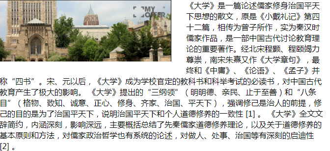

>CSS脱离标准文档流的三种方法(浮动、绝对定位、固定定位)

    1、浮动：float: left;或float: right
    主要作用：可以让元素在同一行显示
```html
<!DOCTYPE html PUBLIC "-//W3C//DTD XHTML 1.0 Transitional//EN" "http://www.w3.org/TR/xhtml1/DTD/xhtml1-transitional.dtd">
<html xmlns="http://www.w3.org/1999/xhtml" xml:lang="en">
<head>
	<meta http-equiv="Content-Type" content="text/html;charset=UTF-8">
	<title>Document</title>
	<style type="text/css">
		div {
			/*设置了浮动就会靠近父子，即浏览器*/
			width: 100px;
			height: 100px;
			float: left;
			background-color: red;

		}

		div.box {
			/*继承了浮动*/
			background-color: green;
		}
	</style>
</head>
<body>
	<div></div>
	<div class="box"></div>
</body>
</html>
```


    2、要保证子代并排显示，则父辈要有足够的宽度，否则就会被挤出去。
```html
<!DOCTYPE html PUBLIC "-//W3C//DTD XHTML 1.0 Transitional//EN" "http://www.w3.org/TR/xhtml1/DTD/xhtml1-transitional.dtd">
<html xmlns="http://www.w3.org/1999/xhtml" xml:lang="en">
<head>
	<meta http-equiv="Content-Type" content="text/html;charset=UTF-8">
	<title>Document</title>
	<style type="text/css">
		.wrap {
			width: 600px;
			height: 350px;
			margin: 50px auto;
			border: 1px solid #ccc;
		}
		.wrap div {
			width: 200px;
			height: 200px;
			float: left;
			background-color: red;

		}

		div.box2 {
			background-color: green;
		}

		div.box3 {
			background-color: skyblue;
		}

		div.box4 {
			background-color: pink;
		}
	</style>
</head>
<body>
	<div class="wrap">
		<div class="box1"></div>
		<div class="box2"></div>
		<div class="box3"></div>
		<div class="box4"></div>
	</div>
</body>
</html>
```


**特性**
    1、浮动的元素脱离标准流，所以添加了浮动就不需要加入display:block了，显得多余，因为浮动已经脱离标准流了，就可以设置宽高了。
```html
<!DOCTYPE html PUBLIC "-//W3C//DTD XHTML 1.0 Transitional//EN" "http://www.w3.org/TR/xhtml1/DTD/xhtml1-transitional.dtd">
<html xmlns="http://www.w3.org/1999/xhtml" xml:lang="en">
<head>
	<meta http-equiv="Content-Type" content="text/html;charset=UTF-8">
	<title>Document</title>
	<style type="text/css">
		div {
			margin: 0 auto;
			width: 500px;
			height: 200px;
			font-size: 30px;
			border: 1px solid gold;
		}

		div span {
			/*添加浮动脱离标准流，宽高就生效*/
			width: 120px;
			height: 100px;
			float: left;
			background-color: green;
		}
	</style>
</head>
<body>
	<div>
		<span>不思量</span>
		<span>自难忘</span>
	</div>
</body>
</html>
```


    2、浮动的元素不能撑开父亲：
    一般做网页不设置父亲的高度，靠子代撑开，比如新闻首页，你并不清楚它有多高；
     父亲不设置高度，在标准流中，儿子可以撑开父亲，如果加入浮动脱标了，就不可以撑开只剩边框高度，对比图如下。
 ```html
<!DOCTYPE html PUBLIC "-//W3C//DTD XHTML 1.0 Transitional//EN" "http://www.w3.org/TR/xhtml1/DTD/xhtml1-transitional.dtd">
<html xmlns="http://www.w3.org/1999/xhtml" xml:lang="en">
<head>
	<meta http-equiv="Content-Type" content="text/html;charset=UTF-8">
	<title>Document</title>
	<style type="text/css">
		* {
			padding: 0;
			margin: 0;
		}
		div {
			width: 500px;
			border: 1px solid #f40;
		}

		div p {
			width: 200px;
			height: 120px;
			float: left;
			background-color: purple;
		}
	</style>
</head>
<body>
	<div>
		<p>彼岸花的美，只因它盛开在彼岸。</p>
	</div>
</body>
</html>
```


    3、相互贴靠规则（依次贴靠）：
    当父亲不够位置放子代，就会被挤出，如果前面有三代，则先判断上一代够不够位置，够位置就贴靠，，如果不够就再找上一代，直到够位置放下。
    (假如之前的兄弟不能容纳自己，会依次往上寻找位置贴靠)
```html
<!DOCTYPE html PUBLIC "-//W3C//DTD XHTML 1.0 Transitional//EN" "http://www.w3.org/TR/xhtml1/DTD/xhtml1-transitional.dtd">
<html xmlns="http://www.w3.org/1999/xhtml" xml:lang="en">
<head>
	<meta http-equiv="Content-Type" content="text/html;charset=UTF-8">
	<title>Document</title>
	<style type="text/css">
	* {
		padding: 0;
		margin: 0;
	}

	div {
		width: 600px;
		height: 400px;
		border: 6px solid #ccc;
	}

	div p {
		float: left;
	}

	.item1 {
		width: 50px;
		height: 300px;
		background-color: red;
	}

	.item2 {
		width: 50px;
		height: 120px;
		background-color: green;
	}

	.item3 {
		width: 460px;
		height: 30px;
		background-color: blue;
	}

	.item4 {
		width: 50px;
		height: 300px;
		background-color: yellow;
	}
	</style>
</head>
<body>
	<div>
		<p class="item1"></p>
		<p class="item2"></p>
		<p class="item3"></p>
		<p class="item4"></p>
	</div> 
</body>
</html>
```


    4、竖直方向的margin塌陷现象消失（变为上下外边距相加）
```html
<!DOCTYPE html PUBLIC "-//W3C//DTD XHTML 1.0 Transitional//EN" "http://www.w3.org/TR/xhtml1/DTD/xhtml1-transitional.dtd">
<html xmlns="http://www.w3.org/1999/xhtml" xml:lang="en">
<head>
	<meta http-equiv="Content-Type" content="text/html;charset=UTF-8">
	<title>Document</title>
	<style type="text/css">
		.wrap {
			height: 600px;
			width: 260px;
			border: 1px dashed green;
		}

		.wrap p {
			width: 200px;
			height: 200px;
			float: left;
		}

		.wrap .p1 {
			background-color: blue;
			margin-bottom: 40px;
		}

		.wrap .p2 {
			background-color: pink;
			margin-top: 100px;
		}
	</style>
</head>
<body>
	<div class="wrap">
		<p class="p1"></p>
		<p class="p2"></p>
	</div>
</body>
</html>
```

**遮盖应用**(不常用)
```html
<!DOCTYPE html PUBLIC "-//W3C//DTD XHTML 1.0 Transitional//EN" "http://www.w3.org/TR/xhtml1/DTD/xhtml1-transitional.dtd">
<html xmlns="http://www.w3.org/1999/xhtml" xml:lang="en">
<head>
	<meta http-equiv="Content-Type" content="text/html;charset=UTF-8">
	<title>Document</title>
	<style type="text/css">
		/*第一个浮动了，就脱标了，第二个盒子还是标准流，默认从左上角开始渲染*/
		.wrap1 {
			float: left;
			width: 180px;
			height: 180px;
			background-color: #f40;
		}

		.wrap2 {
			width: 380px;
			height: 380px;
			background-color: navy;
		}
	</style>
</head>
<body>
	<div class="wrap1"></div>
	<div class="wrap2"></div>
</body>
</html>
```


**字围现象**
```html
<!DOCTYPE html PUBLIC "-//W3C//DTD XHTML 1.0 Transitional//EN" "http://www.w3.org/TR/xhtml1/DTD/xhtml1-transitional.dtd">
<html xmlns="http://www.w3.org/1999/xhtml" xml:lang="en">
<head>
	<meta http-equiv="Content-Type" content="text/html;charset=UTF-8">
	<title>Document</title>
	<style type="text/css">
		* {
			padding: 0;
			margin: 0;
		}

		div {
			width: 660px;
			height: 600px;
			margin: 0 auto;
			padding: 50px;
		}

		img {
			/*图片标签添加浮动就会产生字围绕现象*/
			float: left;
			width: 350px;
			height: 125px;
			padding-right: 30px;
			padding-bottom: 20px;
		}

		p {
			line-height: 140%;
		}
	</style>
</head>
<body>
	<div>
		
		<p>《大学》是一篇论述儒家修身治国平天下思想的散文，原是《小戴礼记》第四十二篇，相传为曾子所作，实为秦汉时儒家作品，是一部中国古代讨论教育理论的重要著作。经北宋程颢、程颐竭力尊崇，南宋朱熹又作《大学章句》，最终和《中庸》、《论语》、《孟子》并称“四书”。宋、元以后，《大学》成为学校官定的教科书和科举考试的必读书，对中国古代教育产生了极大的影响。
《大学》提出的“三纲领”（明明德、亲民、止于至善）和“八条目”（格物、致知、诚意、正心、修身、齐家、治国、平天下），强调修己是治人的前提，修己的目的是为了治国平天下，说明治国平天下和个人道德修养的一致性 [1]  。
《大学》全文文辞简约，内涵深刻，影响深远，主要概括总结了先秦儒家道德修养理论，以及关于道德修养的基本原则和方法，对儒家政治哲学也有系统的论述，对做人、处事、治国等有深刻的启迪性 [2]  。</p>
		<p>《大学》出自《礼记》，原本是《礼记》四十九篇中的第四十二篇。
《大学》与四书关系
《大学》与四书关系 [3]
《礼记》原名《小戴礼记》，又名《小戴记》，由汉宣帝时人戴圣根据历史上遗留下来的一批佚名儒家的著作合编而成。据断代史学家班固在“《记》百三十一篇”下自注云“七十子后学者所记也”，他认为《礼记》各篇的成书年代主要分布在战国初期至西汉初期这段时间。清代人崔述认为：“凡文之体，因乎其时……《大学》之文繁而尽，又多排语，计其时当在战国。”（《洙泗考信录·全录》）综合而论，《大学》的成书时代大体在孔子、曾子之后，孟子、荀子之前的战国前期，即公元前5世纪左右，系出于曾氏之儒一派的纯儒家作品”。即《大学》的成书年代应是在战国初期，其作者应是“曾氏之儒一派”，即现在学术界比较认可的战国初期曾参所作。 [4]  [5]</p>
		<p>宋代以前，《大学》一直从属于《礼记》。尽管《大学》没有从《礼记》中独立出来，但是，西汉的董仲舒、东汉的郑玄、唐代的孔颖达和韩愈，他们对《大学》的传承与发展作出了重要贡献，影响了《大学》的学术地位。
⑴董仲舒对《大学》的贡献主要在于将儒家经学由民间思想提升到国家意识形态的高位，开启了儒学成为官学、显学和国学的始点。
⑵郑玄将西汉后期流传的各种《礼记》抄本，相互校对，并作注解，
使得《礼记》大行于世，并流传至今。他的著作《三礼注》中《礼记·大学》是现今可考的最早的《大学》研究著述。
⑶孔颖达解读《大学》，重点强调“诚意”的关键性作用。他将《大学》文本分为两大段，为朱熹将《大学》分为经、传两部分做好了铺垫。</p>
	</div>
</body>
</html>
```

       