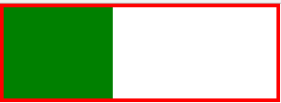
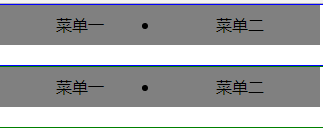
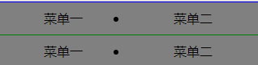
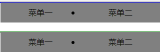
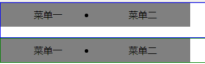
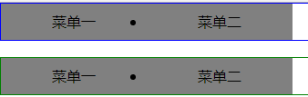

>浮动的影响以及清除浮动的方法

    浮动的元素不能撑开父亲
        解决方案：在父亲中增加 overflow:hidden
```html
<!DOCTYPE html PUBLIC "-//W3C//DTD XHTML 1.0 Transitional//EN" "http://www.w3.org/TR/xhtml1/DTD/xhtml1-transitional.dtd">
<html xmlns="http://www.w3.org/1999/xhtml" xml:lang="en">
<head>
	<meta http-equiv="Content-Type" content="text/html;charset=UTF-8">
	<title>Document</title>
	<style type="text/css">
		* {
			padding: 0;
			margin: 0;
		}

		/*添加overflow*/
		div {
			width: 300px;
			border: 4px solid red;
			overflow: hidden;
		}

		div p {
			float: left;
			width: 120px;
			height: 100px;
			background-color: green;
		}
	</style>
</head>
<body>
	<div>
		<p></p>
	</div>
</body>
</html>
```



**不清除浮动带来的影响**
```html
<!DOCTYPE html PUBLIC "-//W3C//DTD XHTML 1.0 Transitional//EN" "http://www.w3.org/TR/xhtml1/DTD/xhtml1-transitional.dtd">
<html xmlns="http://www.w3.org/1999/xhtml" xml:lang="en">
<head>
	<meta http-equiv="Content-Type" content="text/html;charset=UTF-8">
	<title>Document</title>
	<style type="text/css">
		*{
			padding: 0;
			margin: 0;
		}
		.box1 {
			border: 1px solid blue;
		}

		.box2 {
			border: 1px solid green;
		}
		li {
			float: left;
			width: 160px;
			height: 40px;
			text-align: center;
			line-height: 40px;
			background-color: gray;
		}
	</style>
</head>
<body>
	<div class="box1">
		<ul>
			<li>菜单一</li>
			<li>菜单二</li>
		</ul>
	</div>
		<div class="box2">
		<ul>
			<li>菜单一</li>
			<li>菜单二</li>
		</ul>
	</div>
</body>
</html>
```


**清除浮动的方法**

    1、给父亲增加高度(有高度的盒子可以关注浮动)
        弊端：实际工作中很少给父亲直接加高度，一般都是由儿子撑开，此方法了解即可。
```html
<!DOCTYPE html PUBLIC "-//W3C//DTD XHTML 1.0 Transitional//EN" "http://www.w3.org/TR/xhtml1/DTD/xhtml1-transitional.dtd">
<html xmlns="http://www.w3.org/1999/xhtml" xml:lang="en">
<head>
	<meta http-equiv="Content-Type" content="text/html;charset=UTF-8">
	<title>Document</title>
	<style type="text/css">
		*{
			padding: 0;
			margin: 0;
		}
		
		/*给父亲增加高度清除浮动*/
		div {
			height: 60px;
		}

		.box1 {
			border: 1px solid blue;
		}

		.box2 {
			border: 1px solid green;
		}
		li {
			float: left;
			width: 160px;
			height: 40px;
			text-align: center;
			line-height: 40px;
			background-color: gray;
		}
	</style>
</head>
<body>
	<div class="box1">
		<ul>
			<li>菜单一</li>
			<li>菜单二</li>
		</ul>
	</div>
		<div class="box2">
		<ul>
			<li>菜单一</li>
			<li>菜单二</li>
		</ul>
	</div>
</body>
</html>
```


    2、clear:both 清除左右两边的浮动
        使用：可以用在下面div盒子中
        缺点：不能撑开父亲的高度
```html
<!DOCTYPE html PUBLIC "-//W3C//DTD XHTML 1.0 Transitional//EN" "http://www.w3.org/TR/xhtml1/DTD/xhtml1-transitional.dtd">
<html xmlns="http://www.w3.org/1999/xhtml" xml:lang="en">
<head>
	<meta http-equiv="Content-Type" content="text/html;charset=UTF-8">
	<title>Document</title>
	<style type="text/css">
		*{
			padding: 0;
			margin: 0;
		}

		.box1 {
			border: 1px solid blue;
		}

		.box2 {
			border: 1px solid green;
			/*因为前面会因为浮动造成影响，所以在这里清理浮动但不能撑开父亲*/
			clear: both;
		}
		li {
			float: left;
			width: 160px;
			height: 40px;
			text-align: center;
			line-height: 40px;
			background-color: gray;
		}
	</style>
</head>
<body>
	<div class="box1">
		<ul>
			<li>菜单一</li>
			<li>菜单二</li>
		</ul>
	</div>
		<div class="box2">
		<ul>
			<li>菜单一</li>
			<li>菜单二</li>
		</ul>
	</div>
</body>
</html>
```



    3、外墙法
    优点：可以调间距；缺点：不能撑开父亲的高度
```html
<!DOCTYPE html PUBLIC "-//W3C//DTD XHTML 1.0 Transitional//EN" "http://www.w3.org/TR/xhtml1/DTD/xhtml1-transitional.dtd">
<html xmlns="http://www.w3.org/1999/xhtml" xml:lang="en">
<head>
	<meta http-equiv="Content-Type" content="text/html;charset=UTF-8">
	<title>Document</title>
	<style type="text/css">
		*{
			padding: 0;
			margin: 0;
		}

		.box1 {
			border: 1px solid blue;
		}

		.box2 {
			border: 1px solid green;
			/*因为前面会因为浮动造成影响，所以在这里清理浮动*/
			clear: both;
		}
		li {
			float: left;
			width: 160px;
			height: 40px;
			text-align: center;
			line-height: 40px;
			background-color: gray;
		}
	</style>
</head>
<body>
	<div class="box1">
		<ul>
			<li>菜单一</li>
			<li>菜单二</li>
		</ul>
	</div>
		<div class="box2">
		<ul>
			<li>菜单一</li>
			<li>菜单二</li>
		</ul>
	</div>
</body>
</html>
```


    4、内墙法：
        优点：可以撑开父亲，也可以调间距
        
```html
<!DOCTYPE html PUBLIC "-//W3C//DTD XHTML 1.0 Transitional//EN" "http://www.w3.org/TR/xhtml1/DTD/xhtml1-transitional.dtd">
<html xmlns="http://www.w3.org/1999/xhtml" xml:lang="en">
<head>
	<meta http-equiv="Content-Type" content="text/html;charset=UTF-8">
	<title>Document</title>
	<style type="text/css">
		*{
			padding: 0;
			margin: 0;
		}

		.box1 {
			border: 1px solid blue;
		}

		.box2 {
			border: 1px solid green;
		}

		li {
			float: left;
			width: 160px;
			height: 40px;
			text-align: center;
			line-height: 40px;
			background-color: gray;
		}
		
		.h18 {
			height: 18px;
		}

		.cl {
			clear: both;
		}
	</style>
</head>
<body>
	<div class="box1">
		<ul>
			<li>菜单一</li>
			<li>菜单二</li>
		</ul>
		<div class="cl h18"></div>
	</div>
	<div class="box2">
		<ul>
			<li>菜单一</li>
			<li>菜单二</li>
		</ul>
		<div class="cl"></div>
	</div>
</body>
</html>
```


    5、overflow:hidden 
        可以撑开盒子，可调试间距
```html
<!DOCTYPE html PUBLIC "-//W3C//DTD XHTML 1.0 Transitional//EN" "http://www.w3.org/TR/xhtml1/DTD/xhtml1-transitional.dtd">
<html xmlns="http://www.w3.org/1999/xhtml" xml:lang="en">
<head>
	<meta http-equiv="Content-Type" content="text/html;charset=UTF-8">
	<title>Document</title>
	<style type="text/css">
		*{
			padding: 0;
			margin: 0;
		}

		.box1 {
			border: 1px solid blue;
			overflow: hidden;
			/*调间距*/
			margin-bottom: 18px;
		}

		.box2 {
			border: 1px solid green;
			overflow: hidden;
		}

		li {
			float: left;
			width: 160px;
			height: 40px;
			text-align: center;
			line-height: 40px;
			background-color: gray;
		}
		
	</style>
</head>
<body>
	<div class="box1">
		<ul>
			<li>菜单一</li>
			<li>菜单二</li>
		</ul>
	</div>
	<div class="box2">
		<ul>
			<li>菜单一</li>
			<li>菜单二</li>
		</ul>
	</div>
</body>
</html>
```
