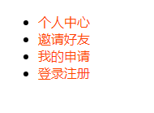

>1、伪类(代表元素的不同状态)
    
    a:link 未访问时超链接的状态
    a:visited 访问后的状态
    a:hover 鼠标悬浮的状态
    a:active 鼠标长按的状态
    
    总结：爱恨原则---->link、visited、hover、active
                     love          hate
         注意可以省略某个不写，但顺序不可交换
```html
<!DOCTYPE html PUBLIC "-//W3C//DTD XHTML 1.0 Transitional//EN" "http://www.w3.org/TR/xhtml1/DTD/xhtml1-transitional.dtd">
<html xmlns="http://www.w3.org/1999/xhtml" xml:lang="en">
<head>
	<meta http-equiv="Content-Type" content="text/html;charset=UTF-8">
	<title>Document</title>
	<style type="text/css">
		a:link {
			color: #f40;
			text-decoration: none;
		}	

		a:visited {
			color: #999;
		}

		a:hover {
			font-size: 30px;
			color: #000;
			text-decoration: none;
		}

		a:active {
			color: #666;
		}

	</style>
</head>
<body>
	<a href="http://www.baiddu.com">百度一下</a>
</body>
</html>
```
         
**超链接的常用写法**

    1、a:link和a:visited写在一起
```html
<!DOCTYPE html PUBLIC "-//W3C//DTD XHTML 1.0 Transitional//EN" "http://www.w3.org/TR/xhtml1/DTD/xhtml1-transitional.dtd">
<html xmlns="http://www.w3.org/1999/xhtml" xml:lang="en">
<head>
	<meta http-equiv="Content-Type" content="text/html;charset=UTF-8">
	<title>Document</title>
	<style type="text/css">
		a:link,a:visited {
			text-decoration: none;
			color: #f40;
		}

		a:hover {
			color: skyblue;
		}

	</style>
</head>
<body>
	<ul>
		<li><a href="">个人中心</li>
		<li><a href="">邀请好友</li>
		<li><a href="">我的申请</li>
		<li><a href="">登录注册</li>
	</ul>
</body>
</html>
```


    2、a元素要设置宽高或者其它盒模型的属性写在a这个选择器上，伪类一般写关于文字的属性
       text-decoration不可设置在父亲上，因为a超链接有自定义的样式，继承不了。
**a链接要设置宽高，前提要转换成块元素**
```html
<!DOCTYPE html PUBLIC "-//W3C//DTD XHTML 1.0 Transitional//EN" "http://www.w3.org/TR/xhtml1/DTD/xhtml1-transitional.dtd">
<html xmlns="http://www.w3.org/1999/xhtml" xml:lang="en">
<head>
	<meta http-equiv="Content-Type" content="text/html;charset=UTF-8">
	<title>Document</title>
	<style type="text/css">
		* {
			padding: 0;
			margin: 0;
		}

		.nav {
			width: 960px;
			margin: 80px auto;
			height: 40px;
			background-color: #f40;
		}

		.nav ul {
			list-style: none;
		}

		.nav li {
			float: left;
			width: 120px;
			height: 40px;
			text-align: center;
			line-height: 40px;
		}
		
		/*盒模型写在a这个选择器上*/
		.nav li a {
			display: block;
			width: 120px;
			height: 40px;
		}

		/*文字的属性写在伪类当中*/
		.nav li a:link,.nav li a:visited {
			text-decoration: none;
			color: #fff;
		}

		.nav li a:hover {
			background-color: gold;
		}
	</style>
</head>
<body>
	<div class="nav">
		<ul>
			<li><a href="">首页</a></li>
			<li><a href="">我的申请</a></li>
			<li><a href="">邀请好友</a></li>
			<li><a href="">登录注册</a></li>
			<li><a href="">公司新闻</a></li>
			<li><a href="">公司文化</a></li>
			<li><a href="">公司产品</a></li>
			<li><a href="">关于我们</a></li>
		</ul>
	</div>
</body>
</html>
```
