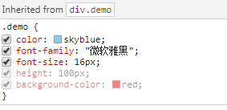

>继承性：CSS中有一部分属性，标签即使不设置也可能加载。
>>可被继承的属性有：文字的大部分属性都可以继承(color、font-size、font-family、font-style、font-weight、line-height)\
>>不可继承的属性有：width、height、backgroud-color、h系列、a、盒模型、定位、浮动;
```html
<!DOCTYPE html PUBLIC "-//W3C//DTD XHTML 1.0 Transitional//EN" "http://www.w3.org/TR/xhtml1/DTD/xhtml1-transitional.dtd">
<html xmlns="http://www.w3.org/1999/xhtml" xml:lang="en">
<head>
	<meta http-equiv="Content-Type" content="text/html;charset=UTF-8">
	<title>Document</title>
	<style type="text/css">
		.demo {
			/*前三个属性都可被继承*/
			color: skyblue;
			font-family: "微软雅黑";
			font-size: 16px;
			height: 100px;
			background-color: red;
		}
	</style>
</head>
<body>
	<div class="demo">
		<ul>
			<li>
				<p>一些事，只配当回忆。一些人，只能做过客。</p>
			</li>
			<li>
				<p>因为年轻，所以自信；因为自信，所以年轻</p>
			</li>
			<li>
				<p>隔阂着我们的并非他人，是世俗</p>
			</li>
			<li>
				<p>隔阂着我们的并非他人，是世俗</p>
			</li>
			<li>
				<p>因为年轻，所以自信；因为自信，所以年轻</p>
			</li>
		</ul>
	</div>
</body>
</html>
```



    工作中，一般先在body{}中设置一些文字属性，下面的元素都会继承，然后在body中的p、div等标签，就不需要再次设置文字属性了。