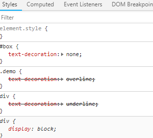
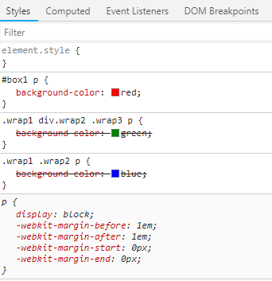
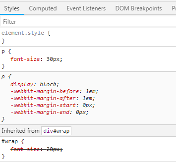
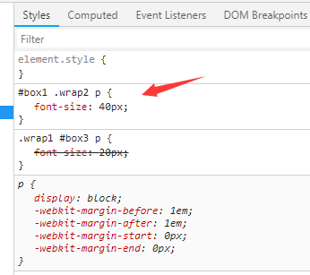
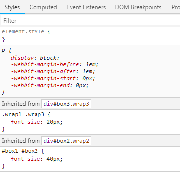
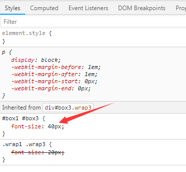
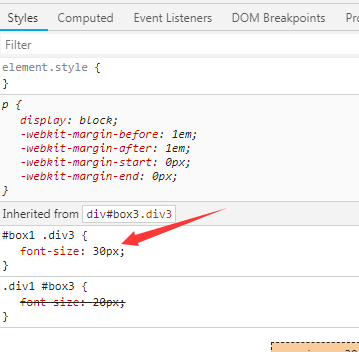
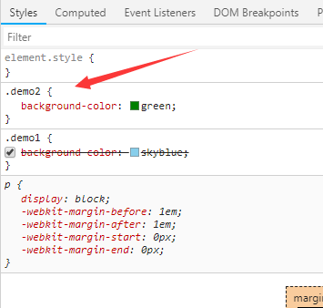
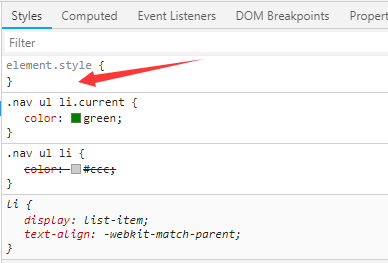

>层叠性：CSS处理冲突的能力，当有多个选择器作用于同一个标签时，样式发生冲突时，该调用谁的。

     1、选择器基本权重：id选择器>类选择器>标签选择器
```html
<!DOCTYPE html PUBLIC "-//W3C//DTD XHTML 1.0 Transitional//EN" "http://www.w3.org/TR/xhtml1/DTD/xhtml1-transitional.dtd">
<html xmlns="http://www.w3.org/1999/xhtml" xml:lang="en">
<head>
	<meta http-equiv="Content-Type" content="text/html;charset=UTF-8">
	<title>Document</title>
	<style type="text/css">
	    
		div{
			text-decoration: underline;
		}
		#box{
			text-decoration: none;
		}
		.demo{
			text-decoration: overline;
		}
	</style>
</head>
<body>
	<div id="box" class="demo">谢谢你来过我的世界。</div>
</body>
</html>
```



    2、复杂选择器：层层比较id选择器数量、类选择器数量、标签选择器数量  
    假如id选择器数量相等，就比较类选择器数量，如果类选择器数量也相等，就比较选择器数量。  
```html
<!DOCTYPE html PUBLIC "-//W3C//DTD XHTML 1.0 Transitional//EN" "http://www.w3.org/TR/xhtml1/DTD/xhtml1-transitional.dtd">
<html xmlns="http://www.w3.org/1999/xhtml" xml:lang="en">
<head>
	<meta http-equiv="Content-Type" content="text/html;charset=UTF-8">
	<title>Document</title>
	<style type="text/css">
		/*层层比较id选择器数量、类选择器数量、标签选择器数量*/
		/*1 0 1*/
		#box1 p {
			background-color: red;
		}
		/*0 2 1*/
		.wrap1 .wrap2 p {
			background-color: blue;
		}
		/*0 3 2*/
		.wrap1 div.wrap2 .wrap3 p{
			background-color: green;
		}
	</style>
</head>
<body>
	<div id="box1" class="wrap1">
		<div id="box2" class="wrap2">
			<div id="box3" class="wrap3">
				<p>疯狂的石头</p>
			</div>
		</div>
	</div>
</body>
</html>
```


    3、权重为0的情况
    当选择器没有直接作用于对应标签，而是继承的，其权重为0，(就是自身定义了样式，不使用继承的，听自己的)
```html
<!DOCTYPE html PUBLIC "-//W3C//DTD XHTML 1.0 Transitional//EN" "http://www.w3.org/TR/xhtml1/DTD/xhtml1-transitional.dtd">
<html xmlns="http://www.w3.org/1999/xhtml" xml:lang="en">
<head>
	<meta http-equiv="Content-Type" content="text/html;charset=UTF-8">
	<title>Document</title>
	<style type="text/css">
	/*该选择器不是直接选择到p元素，样式可以被继承，所以继承的权重为0*/
	#wrap {
		font-size: 20px;
	}
	/*直接作用于标签，没有继承*/
	p {
		font-size: 30px;
	}
	</style>
</head>
<body>
	<div id="wrap">
		<p>功夫熊猫</p>
	</div>
</body>
</html>
```  
  

    4、id数量、类选择器数量、标签选择器数量都一样情况
    （1）前提都直接选择到标签元素不是继承的且权重相同；
    （2）后面的会层叠掉前面的。
    
```html
<!DOCTYPE html PUBLIC "-//W3C//DTD XHTML 1.0 Transitional//EN" "http://www.w3.org/TR/xhtml1/DTD/xhtml1-transitional.dtd">
<html xmlns="http://www.w3.org/1999/xhtml" xml:lang="en">
<head>
	<meta http-equiv="Content-Type" content="text/html;charset=UTF-8">
	<title>Document</title>
	<style type="text/css">
		/*不是继承的，且权重相同的情况*/
		/*1 1 1*/
		.wrap1 #box3 p {
			font-size: 20px;
		}

		/*1 1 1*/
		#box1 .wrap2 p {
			font-size: 40px;
		}
	</style>
</head>
<body>
	<div id="box1" class="wrap1">
		<div id="box2" class="wrap2">
			<div id="box3" class="wrap3">
				<p>疯狂的石头</p>
			</div>
		</div>
	</div>
</body>
</html>
```


    5、不是直接选择到标签的（即继承的情况）
    采用就近原则：就是层次结构离要选择的标签更近的。
```html
<!DOCTYPE html PUBLIC "-//W3C//DTD XHTML 1.0 Transitional//EN" "http://www.w3.org/TR/xhtml1/DTD/xhtml1-transitional.dtd">
<html xmlns="http://www.w3.org/1999/xhtml" xml:lang="en">
<head>
	<meta http-equiv="Content-Type" content="text/html;charset=UTF-8">
	<title>Document</title>
	<style type="text/css">
		/*继承的权重，就采用就近原则*/
		.wrap1 .wrap3 {
			font-size: 20px;
		}

		#box1 #box2 {
			font-size: 40px;
		}
	</style>
</head>
<body>
	<div id="box1" class="wrap1">
		<div id="box2" class="wrap2">
			<div id="box3" class="wrap3">
				<p>疯狂的石头</p>
			</div>
		</div>
	</div>
</body>
</html>
```


    6、不是直接选择到标签的（即继承的情况但是选择的层级是一样的，没有先后之分）
    这种情况，就按照id选择器、类选择器、标签选择器数量来判定
```html
<!DOCTYPE html PUBLIC "-//W3C//DTD XHTML 1.0 Transitional//EN" "http://www.w3.org/TR/xhtml1/DTD/xhtml1-transitional.dtd">
<html xmlns="http://www.w3.org/1999/xhtml" xml:lang="en">
<head>
	<meta http-equiv="Content-Type" content="text/html;charset=UTF-8">
	<title>Document</title>
	<style type="text/css">
		/*继承的权重，离标签的层级结构都一样，即都定位到第三个div,
		这种情况，就按照id选择器、类选择器、标签选择器数量来判定*/
		.wrap1 .wrap3 {
			font-size: 20px;
		}

		#box1 #box3 {
			font-size: 40px;
		}
	</style>
</head>
<body>
	<div id="box1" class="wrap1">
		<div id="box2" class="wrap2">
			<div id="box3" class="wrap3">
				<p>疯狂的石头</p>
			</div>
		</div>
	</div>
</body>
</html>
```


    7、当都是继承的，权重为0，先就近原则，远近一样；再看选择器数量，选择器数量也一样；此时后面的覆盖前面的
```html
<!DOCTYPE html PUBLIC "-//W3C//DTD XHTML 1.0 Transitional//EN" "http://www.w3.org/TR/xhtml1/DTD/xhtml1-transitional.dtd">
<html xmlns="http://www.w3.org/1999/xhtml" xml:lang="en">
<head>
	<meta http-equiv="Content-Type" content="text/html;charset=UTF-8">
	<title>Document</title>
	<style type="text/css">
		/*都是继承的，权重为0，先就近原则，远近一样；再看选择器数量，
		选择器数量也一样；此时后面的覆盖前面的*/
		.div1 #box3 {
			font-size: 20px;
		}

		#box1 .div3 {
			font-size: 30px;
		}
	</style>
</head>
<body>
	<div id="box1" class="div1">
		<div id="box2" class="div2">
			<div id="box3" class="div3">
				<p>css层叠性</p>
			</div>
		</div>
	</div>
</body>
</html>
```


    8、同一标签携带相同的类:不看顺序，按照权重来看
```html
<!DOCTYPE html PUBLIC "-//W3C//DTD XHTML 1.0 Transitional//EN" "http://www.w3.org/TR/xhtml1/DTD/xhtml1-transitional.dtd">
<html xmlns="http://www.w3.org/1999/xhtml" xml:lang="en">
<head>
	<meta http-equiv="Content-Type" content="text/html;charset=UTF-8">
	<title>Document</title>
	<style type="text/css">
		.demo1 {
			background-color: skyblue;
		}

		.demo2 {
			background-color: green;
		}
	</style>
</head>
<body>
    <!--html类名顺序不一样，不影响权重-->
	<p class="demo1 demo2">人在江湖哪有不挨刀</p>
	<p class="demo2 demo1">剑未佩妥，便是江湖</p>
</body>
</html>
```


**应用场景**

    用来层叠共性：选择器的前半部分都相同，需要添加共性的地方，后面添加选择器，来层叠前面的代码，达到个性化设置。
```html
<!DOCTYPE html PUBLIC "-//W3C//DTD XHTML 1.0 Transitional//EN" "http://www.w3.org/TR/xhtml1/DTD/xhtml1-transitional.dtd">
<html xmlns="http://www.w3.org/1999/xhtml" xml:lang="en">
<head>
	<meta http-equiv="Content-Type" content="text/html;charset=UTF-8">
	<title>Document</title>
	<style type="text/css">
		/*应用场景：用来层叠共性,达到个性化设置*/
		.nav ul li {
			color: #ccc;
		}

		.nav ul li.current {
			color: green;
		}
	</style>
</head>
<body>
	<div class="nav">
		<ul>
			<li class="current">个人中心</li>
			<li>邀请好友</li>
			<li>我的申请</li>
			<li>检查更新</li>
			<li>关于我们</li>
		</ul>
	</div>
</body>
</html>
```



**总结**：

    1、首先判断该选择有没有直接选中元素；
    a)若是直接选中则：
    
    比权重（d选择器数量、类选择器数量、标签数量）；
    若权重不相同，则以权重大的为准，权重小的就被层叠；
    若权重相同则以，后出现的为准

    b)若不是直接选中（即继承的）则：
    
    通过继承影响的最内层标签，权重为0，就近原则，看哪个标签离最内层的标签近,若远近不一样，以描述近的为准；
    若远近一样，则先根据数量比较，如果数量一样，则后面的覆盖前面的。
        
