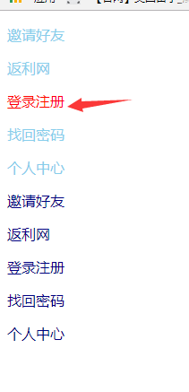
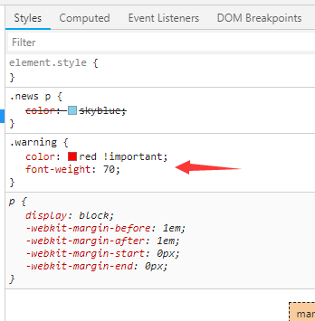
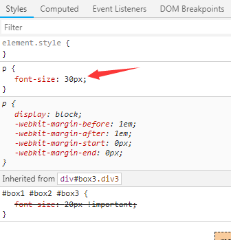
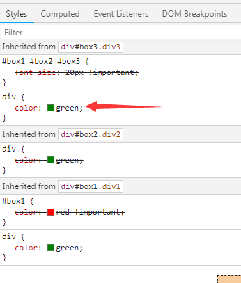
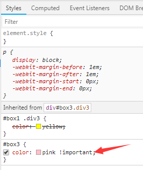
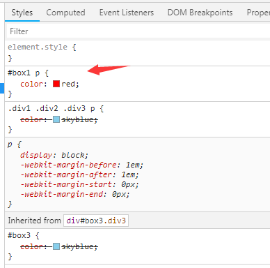

>!import 作用：提升权重

    1、如果多个属性需要提升权重，则每个属性都加入!important；
    2、注意：页面不可滥用!important，只能在原子类情况使用；
    3、!important不影响继承，权重该是0还是0，继承的属性加上!important也不能与选中了元素的选择器相比较
    4、!important不影响就近原则
```html
<!DOCTYPE html PUBLIC "-//W3C//DTD XHTML 1.0 Transitional//EN" "http://www.w3.org/TR/xhtml1/DTD/xhtml1-transitional.dtd">
<html xmlns="http://www.w3.org/1999/xhtml" xml:lang="en">
<head>
	<meta http-equiv="Content-Type" content="text/html;charset=UTF-8">
	<title>Document</title>
	<style type="text/css">
		.warning {
			/*注意在分号之前加入!important,只能在原子类中使用*/
			color: red !important;
			font-weight: 70;
		}

		.news p {
			color: skyblue;
		}

		.products p {
			color: navy;
		}
	</style>
</head>
<body>
	<div class="news">
		<p>邀请好友</p>
		<p>返利网</p>
		<p class="warning">登录注册</p>
		<p>找回密码</p>
		<p>个人中心</p>
	</div>
	<div class="products">
		<p>邀请好友</p>
		<p>返利网</p>
		<p>登录注册</p>
		<p>找回密码</p>
		<p>个人中心</p>
	</div>
</body>
</html>
```




>!important不影响权重
```html
<!DOCTYPE html PUBLIC "-//W3C//DTD XHTML 1.0 Transitional//EN" "http://www.w3.org/TR/xhtml1/DTD/xhtml1-transitional.dtd">
<html xmlns="http://www.w3.org/1999/xhtml" xml:lang="en">
<head>
	<meta http-equiv="Content-Type" content="text/html;charset=UTF-8">
	<title>Document</title>
	<style type="text/css">
		#box1 #box2 #box3 {
			/*其中添加的!important并不影响权重*/
			font-size: 20px !important;
		}

		p {
			font-size: 30px;
		}
	</style>
</head>
<body>
	<div id="box1" class="div1">
		<div id="box2" class="div2">
			<div id="box3" class="div3">
				<p>提升权重</p>
			</div>
		</div>
	</div>
</body>
</html>
```


>!important不影响就近原则
```html
<!DOCTYPE html PUBLIC "-//W3C//DTD XHTML 1.0 Transitional//EN" "http://www.w3.org/TR/xhtml1/DTD/xhtml1-transitional.dtd">
<html xmlns="http://www.w3.org/1999/xhtml" xml:lang="en">
<head>
	<meta http-equiv="Content-Type" content="text/html;charset=UTF-8">
	<title>Document</title>
	<style type="text/css">
		/*权重为0，因为是继承的*/
		#box1 #box2 #box3 {
			font-size: 20px !important;
		}

		p {
			font-size: 30px;
		}

		/*!important不影响就近原则，加了!important也不提升权重，颜色还是绿色*/
		#box1 {
			color: red !important;
		}

		div {
			color: green;
		}
	</style>
</head>
<body>
	<div id="box1" class="div1">
		<div id="box2" class="div2">
			<div id="box3" class="div3">
				<p>提升权重</p>
			</div>
		</div>
	</div>
</body>
</html>
```



>在继承，权重为0且远近一致的情况下，加入!important就会提升权重
```html
<!DOCTYPE html PUBLIC "-//W3C//DTD XHTML 1.0 Transitional//EN" "http://www.w3.org/TR/xhtml1/DTD/xhtml1-transitional.dtd">
<html xmlns="http://www.w3.org/1999/xhtml" xml:lang="en">
<head>
	<meta http-equiv="Content-Type" content="text/html;charset=UTF-8">
	<title>Document</title>
	<style type="text/css">
		/*继承、远近一致的状态下，!important就会提升权重*/
		#box1 .div3 {
			color: yellow;
		}

		#box3 {
			color: pink !important;
		}
	</style>
</head>
<body>
	<div id="box1" class="div1">
		<div id="box2" class="div2">
			<div id="box3" class="div3">
				<p>提升权重</p>
			</div>
		</div>
	</div>
</body>
</html>
```


>有并集选择器的情况下，先将其拆分，然后再根据总结的内容进行判读
```html
<!DOCTYPE html PUBLIC "-//W3C//DTD XHTML 1.0 Transitional//EN" "http://www.w3.org/TR/xhtml1/DTD/xhtml1-transitional.dtd">
<html xmlns="http://www.w3.org/1999/xhtml" xml:lang="en">
<head>
	<meta http-equiv="Content-Type" content="text/html;charset=UTF-8">
	<title>Document</title>
	<style type="text/css">
		/*1 0 1*/
		#box1 p {
			color: red;
		}

	/*	.div1 .div2 .div3 p,#box3 {
			color: skyblue;
		}*/

		/*0 3 1*/
		.div1 .div2 .div3 p {
			color: skyblue;
		}

   		/*继承权重为0*/
		#box3 {
			color: skyblue;
		}
	</style>
</head>
<body>
	<div id="box1" class="div1">
		<div id="box2" class="div2">
			<div id="box3" class="div3">
				<p>提升权重</p>
			</div>
		</div>
	</div>
</body>
</html>
```
