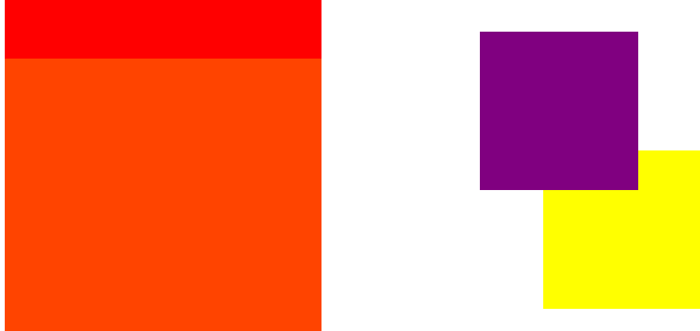

>z-index属性：作用(负责谁压盖谁)

    1、默认情况下：定位的元素压盖没有定位的元素
```html
<!DOCTYPE html PUBLIC "-//W3C//DTD XHTML 1.0 Transitional//EN" "http://www.w3.org/TR/xhtml1/DTD/xhtml1-transitional.dtd">
<html xmlns="http://www.w3.org/1999/xhtml" xml:lang="en">
<head>
	<meta http-equiv="Content-Type" content="text/html;charset=UTF-8">
	<title>Document</title>
	<style type="text/css">
		div {
			width: 200px;
			height: 200px;
			background-color: red;
		}
		.box2 {
			position: absolute;
			top: 10px;
			left: 50px;
			background-color: green;
		}
	</style>
</head>
<body>
	<div class="box1"></div>
	<div class="box2"></div>
</body>
</html>
```


   2、如果都定位了，html代码后面的盒子压住前面的
```html
<!DOCTYPE html PUBLIC "-//W3C//DTD XHTML 1.0 Transitional//EN" "http://www.w3.org/TR/xhtml1/DTD/xhtml1-transitional.dtd">
<html xmlns="http://www.w3.org/1999/xhtml" xml:lang="en">
<head>
	<meta http-equiv="Content-Type" content="text/html;charset=UTF-8">
	<title>Document</title>
	<style type="text/css">
		div {
			width: 200px;
			height: 200px;
			background-color: red;
		}

		.box2 {
			position: absolute;
			top: 10px;
			left: 50px;
			background-color: green;
		}

		.box1 {
			position: absolute;
			top: 0;
			left: 0;
		}
	</style>
</head>
<body>
	<div class="box2"></div>
	<!-- html代码后面的盒子压住前面的 -->
	<div class="box1"></div>
</body>
</html>
```


    使用：z-index: 数字  (数字大的压住数字小的，默认值是0)
          z-index适用于有定位的元素，标准流和浮动的元素都不能使用z-index
```html
<!DOCTYPE html PUBLIC "-//W3C//DTD XHTML 1.0 Transitional//EN" "http://www.w3.org/TR/xhtml1/DTD/xhtml1-transitional.dtd">
<html xmlns="http://www.w3.org/1999/xhtml" xml:lang="en">
<head>
	<meta http-equiv="Content-Type" content="text/html;charset=UTF-8">
	<title>Document</title>
	<style type="text/css">
		div {
			width: 200px;
			height: 200px;
			background-color: red;
		}

		.box2 {
			position: absolute;
			top: 10px;
			left: 50px;
			/*数字大的压住数字小的*/
			z-index: 2;
			background-color: green;
		}

		.box1 {
			position: absolute;
			top: 0;
			left: 0;
		}
	</style>
</head>
<body>
	<div class="box1"></div>
	<div class="box2"></div>
</body>
</html>
```
    比较祖辈(从父)现象
```html
<!DOCTYPE html PUBLIC "-//W3C//DTD XHTML 1.0 Transitional//EN" "http://www.w3.org/TR/xhtml1/DTD/xhtml1-transitional.dtd">
<html xmlns="http://www.w3.org/1999/xhtml" xml:lang="en">
<head>
	<meta http-equiv="Content-Type" content="text/html;charset=UTF-8">
	<title>Document</title>
	<style type="text/css">
		.wjl {
			width: 400px;
			height: 400px;
			background: red;
			/*加入相对定位，不会脱标*/
			position: relative;
			z-index: 999;
		}

		.lisi {
			width: 400px;
			height: 400px;
			background: #f40;
			position: relative;
			z-index: 99;
		}

		.wsc {
			width: 200px;
			height: 200px;
			position: absolute;
			background-color: purple;
			top: 350px;
			left: 600px;
			z-index: 10;
		}

		.xueshen {
			width: 200px;
			height: 200px;
			position: absolute;
			background-color: yellow;
			top: 100px;
			left: 680px;
			/*虽然这个z-index值大于.wsc中的值，但还是紫色压盖在黄色上*/
			z-index: 10000;
		}
	</style>
</head>
<body>
	<div class="wjl">
		<p class="wsc"></p>
	</div>
	<div class="lisi">
		<p class="xueshen"></p>
	</div>
</body>
</html>
```

    