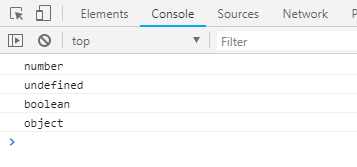

1、JS概述

    *负责页面的交互和行为
    
    *作用
        (1)数据验证
        (2)操作html元素
        (3)制作网页特效(轮播、其它效果)
        (4)WEB游戏
        (5)Nodejs进行服务端编程
        
    *组成部分
        a 语言核心 ECMAscript 如变量 数组 函数 对象...
        b DOM 文档模型对象
        c BOM 浏览器模型对象
        
二、js书写位置

        一、内嵌式
            * 在页面的任何位置放置一对script标签(一般放置在body中)
            
            常见的消息输出
                * alert() 弹窗
                * console.log() 控制台输出
                * prompt() 可以输入内容的弹窗
                * document.write() 动态表示内容
                
            注意： * 分号";"是js语句结束的标志(不加分号，上线压缩文件后，就无法识别哪里表示结束语句)
```html
	<script type="text/javascript">
		alert("javascript");
	</script>
```

```html
	<script type="text/javascript">
		console.log(123);
		console.log("abc")
		console.error("错误信息")
		console.warn("警告信息")
	</script>
```

```html
	<script type="text/javascript">
		prompt("请输入内容:");
	</script>
```

```html
	<script type="text/javascript">
		document.write("<h1>人生苦短，要学javaScript</h1>")
	</script>
```


       二、行内式
       三、外链式
        
三、注释

    单行注释符号： "//"
    多行注释符号： "/*  */
    不允许多行套多行注释

四、变量
        
        js定义变量
            方式一：  var 变量名 = 值;
            
            方式二：  var 变量名
                     变量名 = 值;
                     
            可同时定义多个变量，用逗号分隔开
                    
```html
	<script type="text/javascript">
		var a = "11";

		var b;
		b = 100;

		var name = "廖" , age = 20 , sex = "男" 
		alert(a);
		alert(b);
		alert(name);
	</script>
```

五、数据类型

     1、基本数据类型
      Number   数字类型
      String   字符串
      undefined 
      Boolean 布尔类型
      null
        
    2、复杂数据类型
       Object
     
    注意：变量的数据类型由存储的数据类型决定
         null 空
         变量定义后不赋值，类型为undefined ，打印后的值也为undefinde
            
```html
    <script type="text/javascript">
		//typeof检测数据类型
		console.log(typeof 11);//number
		console.log(typeof undefined);//undefined
		console.log(typeof true);//boolean
		console.log(typeof null);//object

		var b="111";
		alert(typeof b);//string 
	</script>
```



```html
	<script type="text/javascript">
	    var a = "我和";
	    var b = "你";
	    var c = a + b;
	    alert(typeof c);// string

	    var a = 10;
	    var b = "2";
	    alert(a + b); // "102"
	    alert("a" + b); //"a2"

	    var a = "123"; // 纯数字的字符串
	    var b = 10;
	    alert(a-b);// 先把"123"变成123 然后减

	    alert("3"-"4");// 3-4 得到-1
	    alert("3"-"4aa");// NaN not a number
	    //alert(typeof NaN);// number
	    
	    document.write("3"-false);// 3-0
	    console.log("20"+2-"6");//"20"+2----->"202" - "6" 得到196
	    
	    alert(2/2);
	    alert(12%7);
	    var num = parseInt(1.999);
	    alert(num);
	</script>
```

如果在文档已完成加载后执行 document.write，整个 HTML 页面将被覆盖。

```html
<!DOCTYPE html>
<html lang="en">
<head>
	<meta charset="UTF-8">
	<title>菜鸟教程</title>
</head>
<body>
	<h1>每一次美好的相遇，都是生活对你的馈赠</h1>
	<p>夕阳无限好，不用扬鞭自奋蹄</p>

	<button onclick="myFunction()">点击按钮</button>

	<script>
		function myFunction() {
			document.write(Date());
		}
	</script>
</body>
</html>
```