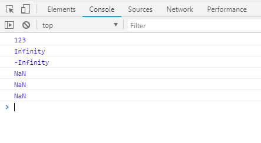
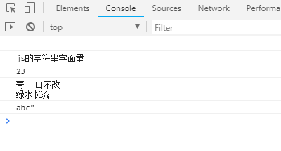

JS的字面量(常量)

    字面量 固定值
    *数字字面量
    *字符串字面量
    
```html
<!DOCTYPE html>
<html lang="en">
<head>
	<meta charset="UTF-8">
	<title>Document</title>
</head>
<body>
	<script type="text/javascript">
		console.log(123)  //数字字面量
		console.log(Infinity) 	//正无穷大
		console.log(-Infinity)  //负无穷大

		//NaN not a number 本身还是一个数字,不能表达一个正规的数字可以使用
		console.log(NaN);
		console.log(0/0);
		console.log("add"*2);  //NaN
	</script>
</body>
</html>
```


```html
<!DOCTYPE html>
<html lang="en">
<head>
	<meta charset="UTF-8">
	<title>Document</title>
</head>
<body>
	<script type="text/javascript">
		console.log("");  //空字符串
		console.log("js的字符串字面量");
		console.log("23");
		console.log("青\t山不改\n绿水长流");
		console.log("abc\"");
	</script>
</body>
</html>
```
