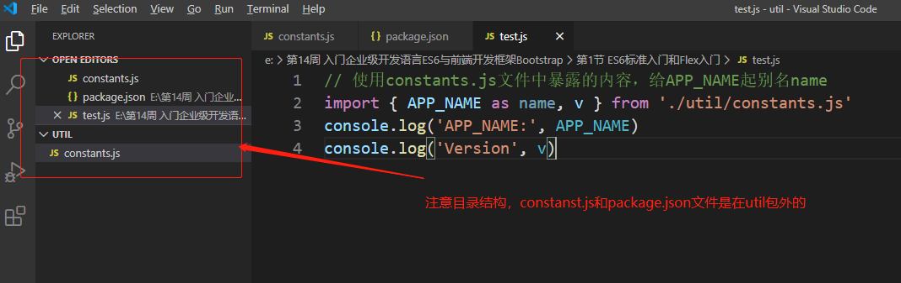

### 面向对象编程

     回顾：ES6以前的面向对象编程
    function Point(x, y) {
        this.x = x;
        this.y = y;
    }
    
    Point.prototype.toString = function () {
        return '(' + this.x + ', ' + this.y + ')';
    };
    
    var p = new Point(1, 2);
    
    
     ES6中引入class关键字,实现面向对象编程
    class Point {
        constructor(x, y) { // 构造函数
            this.x = x;
            this.y = y;
        }
        
        toString() {
            return '(' + this.x + ', ' + this.y + ')';
        } 
    }
    
### 函数的调用

     关于类的实例
        使用new关键字来实例化类
        var p = new Point(1, 2);
        其中p就是类的实例
        
### 构造函数

     关于构造函数constructor
        构造函数（ constructor ）是类的默认方法，通过new命令生成对象实例时，会自动调用该方法。
        一个类必须有constructor方法，如果没有显式定义，一个空的constructor方法会被默认添加
        
### this指向

     关于this的指向
        类方法中的this指向类的实例
        静态方法中的this指向类
        
### 静态方法（当做类下面的工具函数来使用）
    
     可以直接通过类来调用的方法（无法通过类的实例来调用）
    class Foo {
        static staticMethod() {
            return 'I am static method';
        } 
    }
    Foo.staticMethod()
    
    注意：静态方法中的this指的是类，而不是其实例
    
    
### 属性表达式

     类的属性名，可以采用表达式，使用[]来引用
    let methodName = 'getArea';
    class Square {
        ['a' + 'bc']: 123,
        [methodName]() {
        // 业务逻辑代码
        } 
    }
    
### 类的继承（ES6中没有多重继承）

     ES6中使用extends关键字实现类的继承
    class Animal {
        eat () {
        return 'Food'
        } 
    }
    
    new Animal().eat()
    
    
    class Cat extends Animal {
        eat() {
            return 'Fish'
        } 
    }

    new Cat().eat()
    
     使用super关键字调用父类方法
    
    class Cat extends Animal {
        eat() {
            let rest = super.eat(); // 调用父类方法
            return rest + ' Fish'
        } 
    }

    new Cat().eat()
    
### 模块化

    什么是模块化？它有什么好处？
    
     增强代码的可维护性
     增强代码的可阅读性
     增强代码的可扩展性
    
    JS中的模块化
    
     ES6以前
     服务器端：CommonJS标准去定义
     浏览器端：AMD、CMD
    
### 模块化的实现

     模块是对内部逻辑的封装，只对外提供接口
     举例：汽车发动机模块
        输入：汽油
        输出：动力
        不关心内部是如何实现的
        
     一个js文件就是一个模块
     ES6中使用export关键字对外暴露接口（导出）
     ES6中使用import关键字导入一个模块
    
### export的使用

    注意：语句的位置（代码的顶层，不能在语句块内）
     方式一：直接导出（写一个导出一个）
    
    export let a = 1
    export const NAME = 'JavaScript'
    export function sayHello() {
        console.log('Hey, boy!')
    }
    
     方式二：批量导出
    
    let a = 1 // 变量
    const NAME = 'JavaScript' // 常量
    // 函数
    function sayHello() {
        console.log('Hey, boy!')
    }
    
    export {a, NAME, sayHello}
    
     通过as关键字指定别名
    
    let a = 19
    export { a as age }
    
     方式三：使用export default 默认导出
       注意一个模块只有一个export default
    
    // a.js
    export default 1
    
    // b.js
    let b = 2
    export default b // 可以理解为把b赋值给default
    
    // f.js
    export default function () {
        console.log('from default')
    }
    
### import的使用

     方式一：导入需要的部分内容
    
    // 从myFirstModule.js导入需要的函数
    import { sayHello } from './myFirstModule.js'
    
    // 执行函数
    sayHello()
    
     方式二：导入全部内容，使用as指定别名
    
    // 从myFirstModule.js导入全部
    import * as myModule from './myFirstModule.js'
    
    // 执行函数
    myModule.sayHello()
    
### 踩坑指南

     第一坑：不能在块级作用域内执行导入导出
    if (true) {
        export let a = 1 // SyntaxError
    }
    
     第二坑：不能直接导出变量的值
        export 3.1415926 // SyntaxError
        
     第三坑：注意import的顺序
        let a = 1
        import b from './b.js' // 报错
        
### 在Node中执行ES6模块

    * 构建如下目录
    ├── caculator.js
    ├── index.js
    └── package.json
        
    * 2、控制台执行命令
        node + 文件名
        例如：node index.js
        
    常量模块实例和格式化用户昵称实例
    
    文件名index.js
    
```js
const APP_NAME = '在线问答系统'
const VERSION = '1.0'

export let a = 1
let b = 2

// 暴露出这两个常量
export {
	APP_NAME,
	VERSION as v // 起别名
}
```

    文件名 package.json
    
```json
{
	"type": "module"
}
```
        文件名: caculator.js
        
```js
// 使用constants.js文件中暴露的内容，给APP_NAME起别名name
import { APP_NAME as name, v } from './caculator.js'
console.log('APP_NAME:', APP_NAME)
console.log('Version', v)

import formatUname from './caculator.js'
let uname = formatUname('张三')  // 调用，因为是return返回的，所以用变量uname接收
console.log(uname)
```

```js
/**
 * 文件名formatUsername.js
 * 格式化用户昵称，只明文显示第一个字，后面用***代替
 * @param {*} name 用户昵称
 */
export default function(name) { 
    return name.substr(0, 1) + "***"  // substr从0开始取第一个
}
```



    