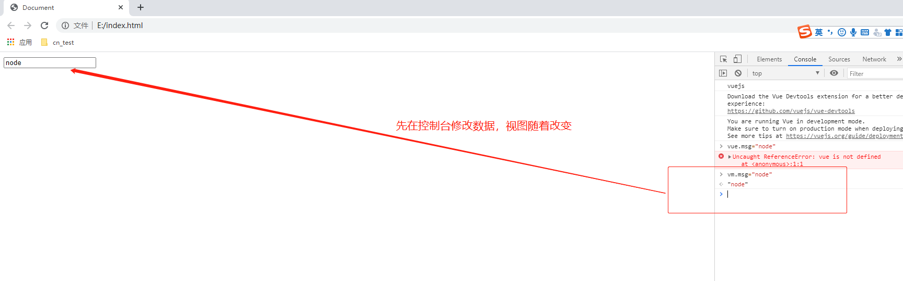
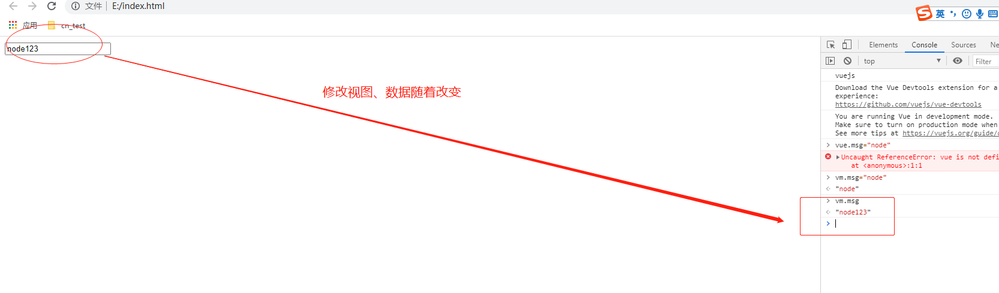

### vue简介
    
    * vue是JavaScript框架，操作的是数据不关心视图，组件化开发方便
    * 区分jQuery库，只是一些API，直接操作DOM
    
    
### vue简单实例

```html
<!DOCTYPE html>
<html lang="en">
<head>
    <meta charset="UTF-8">
    <meta name="viewport" content="width=device-width, initial-scale=1.0">
    <title>Document</title>
</head>
<body>
	<!-- 第三步：展示数据，html结构叫做视图-->
	<div id="app">
		<!-- 下面的a、b数据如何展示，依靠vue提供的模板语法（也叫插值表达式） -->
		{{a}}    <!--下面的数据会替换双大括号 -->
	</div>
    <!--第一步：引包 -->
    <script src="./nodejs/node_global/node_modules/vue/dist/vue.js"></script>
    <script>
		// 第二步：创建vue的实例，挂载到dom元素上，则可以显示数据（图片、字符串等）在上面
		new Vue({
			// el后面添加dom选择器
			el: "#app",  
			// 数据写在data上，因为展示的数据可能很多，所以data可以是对象
			data: {
				a: 100,
				b: 200
			}
		});
    </script>
</body>
</html>

<!--100-->
```

### 插值表达式

    {{表达式}}，双大括号里面主要写表达式（三目运算、加减法、对象、函数等），主要是为了将数据的属性值渲染在元素上
    但一般都只放单个数据或简单的计算，if else是语句不是表达式所以不能放入
    
```html
<!DOCTYPE html>
<html lang="en">
<head>
    <meta charset="UTF-8">
    <meta name="viewport" content="width=device-width, initial-scale=1.0">
    <title>Document</title>
</head>
<body>
	<!-- 3、展示数据，html结构叫做视图-->
	<div id="app">
		{{a}}   
		{{a+b}}
		{{5>4?"ok":"wrong"}}
		{{ {"name": "珍珍"} }}
		<!-- 将函数返回值渲染 -->
		{{ fn() }}
	</div>
	<div>
		{{a}}
	</div>
    <!--1、引包 -->
    <script src="./nodejs/node_global/node_modules/vue/dist/vue.js"></script>
    <script>
		// 2、创建vue的实例
		new Vue({
			el: "#app",  
			/* data: {
				a: 100,
				b: 200
			}
			*/
			// 组件当中要求data是一个函数，是考虑到数据的独立性
			// 使用ES6语法省略function -- data:function() {	
            // 修改下面的data数据，并不影响上面html的视图，所以说vue只关注数据		
			data:function() {
				return {
					a: 100,
					b: 200
				}
			},
			methods: {
				fn() {
					return "zhenzhen"
				}
			}
		});
    </script>
</body>
</html>
```

### 指令系统（v-text、v-html）

    v-text作用：把数据渲染在视图中，与{{}}作用类似，相当于原生的innerText，使用较少
    
    v-text作用：...且支持标签，相当于innerHTML
    
```html
<!DOCTYPE html>
<html lang="en">
<head>
    <meta charset="UTF-8">
    <meta name="viewport" content="width=device-width, initial-scale=1.0">
    <title>Document</title>
</head>
<body>
	<!-- v-text传入下面定义的数据变量与两个大括号{{}}效果一致，F12审查元素看到v-text是被移除的 -->
	<div id="app" v-html="msg2">
		
	</div>
    <!--1、引包 -->
    <script src="./nodejs/node_global/node_modules/vue/dist/vue.js"></script>
    <script>
		new Vue({
			el: "#app",
			data() {
				return {
					msg: "vue指令",
					msg2: "<p>测试</p>"
				}
			}
		})
    </script>
</body>
</html>
```

    v-if/v-else（决定元素是否显示）
    * v-if 作用：等于false，在F12审查元素界面可以看到元素被隐藏，true就显示
      类似于元素的增加与删除：appendChild()/removeChild()
      
```html
<!DOCTYPE html>
<html lang="en">
<head>
    <meta charset="UTF-8">
    <meta name="viewport" content="width=device-width, initial-scale=1.0">
    <title>Document</title>
</head>
<body>
	<!-- false表示隐藏元素 -->
	<div id="app" v-if="false">
		
	</div>
    <!--1、引包 -->
    <script src="./nodejs/node_global/node_modules/vue/dist/vue.js"></script>
    <script>
		new Vue({
			el: "#app",
			data() {
				return {
					msg: "vue指令",
					msg2: "<p>测试</p>"
				}
			}
		})
    </script>
</body>
</html>
```
      
    * v-show
        v-show=false 相当于将display=none
        原理是改变display样式，频繁切换DOM元素则使用这个方法，只需要改变样式即可，不频繁则使用v-if效率更高
        
        
```html
<!DOCTYPE html>
<html lang="en">
<head>
    <meta charset="UTF-8">
    <meta name="viewport" content="width=device-width, initial-scale=1.0">
    <title>Document</title>
</head>
<body>
	<!-- false表示隐藏元素 -->
	<div id="app">
		<div v-if="false"></div>
		<!-- 上面v-if=false则下面v-else标签数据显示 -->
		<div v-else>测试</div>
		<div class="demo" v-show="false">test</div>
		<!-- 将v-show与isShow数据关联判断是否显示 -->
		<div class="demo2" v-show="isShow">demo2</div>
		<!-- 通过按钮来控制数据的显示与隐藏 v-on绑定click事件=定义的方法-->
		<button v-on:click="fn">切换</button>
	</div>
    <!--1、引包 -->
    <script src="./nodejs/node_global/node_modules/vue/dist/vue.js"></script>
    <script>
		new Vue({
			el: "#app",
			data() {
				return {
					msg: "vue指令",
					msg2: "<p>测试</p>",
					isShow: true
				}
			},
			methods: {
				fn() {
					// this代表整个vue实例
					console.log(this.isShow);	
					// 因为上面div绑定了click事件，所以每点击一次就运行一次事件	
					this.isShow = !this.isShow;		
				}
			}
		})
    </script>
</body>
</html>
```

    * v-for（频繁使用）该指令的优先级比其他指令高
    
        获取到学生的科目和成绩
        方法一：一般实际项目都是从后台获取数据的，也不清楚有多少数据，所以此方法不可行
        
```html
<!DOCTYPE html>
<html lang="en">
<head>
    <meta charset="UTF-8">
    <meta name="viewport" content="width=device-width, initial-scale=1.0">
    <title>Document</title>
</head>
<body>
	<div id="app">
		<ul>
			<li>{{arr[0].subject}}--{{arr[0].score}}</li>
			<li>{{arr[1].subject}}--{{arr[1].score}}</li>
			<li>{{arr[2].subject}}--{{arr[2].score}}</li>
		</ul>
	</div>
    <script src="./nodejs/node_global/node_modules/vue/dist/vue.js"></script>
    <script>
		new Vue({
			el: "#app",
			data: {
				arr: [
					{
						subject: "语文",
						score: 90
					},
					{
						subject: "数学",
						score: 98
					},
					{
						subject: "英语",
						score: 59
					}
				]
			}
		})
    </script>
</body>
</html>
```

    方法二：使用v-for循环
    
```html
<!DOCTYPE html>
<html lang="en">
<head>
    <meta charset="UTF-8">
    <meta name="viewport" content="width=device-width, initial-scale=1.0">
    <title>Document</title>
</head>
<body>
	<div id="app">
		<!-- 读取数组 -->
		<ul>
			<!-- 相当于for item in的语法，item是每一项，arr要循环的数组，index索引 -->
			<li v-for="(item, index) in arr">{{index}}--{{item.subject}}-{{item.score}}</li>
		</ul>
		<!-- 读取字典 -->
		<ul>
			<li v-for="(value, key) in girl">{{key}}:{{value}}</li>
		</ul>

	</div>
    <script src="./nodejs/node_global/node_modules/vue/dist/vue.js"></script>
    <script>
		new Vue({
			el: "#app",
			data: {
				arr: [
					{
						subject: "语文",
						score: 90
					},
					{
						subject: "数学",
						score: 98
					},
					{
						subject: "英语",
						score: 59
					}
				],
				girl: {
					name: "zhenzhen",
					age: 18,
					hobby: "sing"
				}
			}	
		})
    </script>
</body>
</html>
<!-- 
0--语文-90
1--数学-98
2--英语-59
name:zhenzhen
age:18
hobby:sing
-->
```

    * v-bind 绑定属性（固有属性或自定义属性都可以）只能单向绑定即：只能通过改变数据来改变视图，不能反过来
    
```html
<!DOCTYPE html>
<html lang="en">
<head>
    <meta charset="UTF-8">
    <meta name="viewport" content="width=device-width, initial-scale=1.0">
    <title>Document</title>
    <style>
    	div {
    		height: 200px;
    	}

    	.demo {
    		background: red;
    	}

    	.demo2 {
    		background: green;
    	}
    </style>
</head>
<body>
	<div id="app">
		<!-- 将下面className的值绑定给属性class -->
		<div v-bind:class="className"></div>
		<!-- 绑定url -->
		<!--   -->
		<!-- 可以省略缩写v-bind，称为语法糖 -->
		 
		<!-- 自定义属性绑定 -->
		<p v-bind:mydata="className2"></p>
		<!-- 直接绑定类名 -->
		<div v-bind:class="'demo'"></div>
		<!-- 可以绑定类，如果为 true则显示，false则不显示 -->
		<div v-bind:class="{demo:true}">11111</div>
	</div>
	<!-- 1、引入包 -->
    <script src="./nodejs/node_global/node_modules/vue/dist/vue.js"></script>
    <script>
    	// 2、创建vue实例
		new Vue({
			el: "#app",
			data: {
				className: "demo",
				className2: "demo2",
				url: "yyx.jpg"
			}	
		})
    </script>
</body>
</html>
```
    
    * v-model：双向数据绑定，一般只用于表单控件（文本框、单选框、复选框即带有value属性的表单）
    




```html
<!DOCTYPE html>
<html lang="en">
<head>
    <meta charset="UTF-8">
    <meta name="viewport" content="width=device-width, initial-scale=1.0">
    <title>Document</title>
</head>
<body>
	<!-- 视图--HTML结构 -->
	<div id="app">
		<!-- <input type="text" v-bind:value="msg"> 单向绑定 -->
		<input type="text" v-model="msg">
		<!-- 加上绑定的chang函数具有跟v-model一样的效果，本质上就是控制数据-->
		<input type="text" v-bind:value="msg" v-on:input="change">
		{{msg}}
	</div>
	<!-- 1、引入包 -->
    <script src="./nodejs/node_global/node_modules/vue/dist/vue.js"></script>
    <script>
    	// 2、创建vue实例
		let vm = new Vue({
			el: "#app",  //元素
 			data: {      //数据
				msg: "vuejs"
			},
			methods: {
				change(e) {
					// 事件源e，可在控制台输入e查看到target，将当前事件源文本框赋值给msg
					this.msg = e.target.value;
				}
			}	
		});

		console.log(vm.msg);
    </script>
</body>
</html>
```

    
    