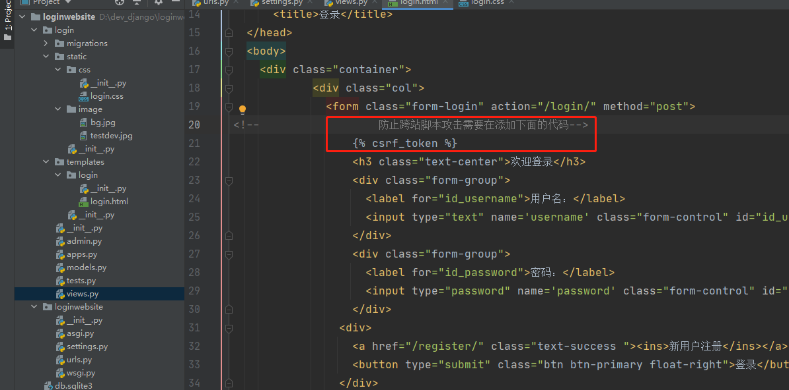
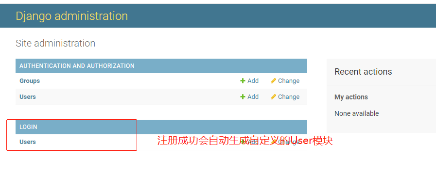

### 传统的web开发框架

    浏览器 <————HTTP————>WSGI/路由系统/业务处理逻辑/数据库与模板耦合<————>1、static：html/css/js等静态文件
                                                            <————>2、ORM数据库
                                                           
    浏览器通过http协议请求网站，然后（Web框架）做进一步解析，检索出对应的数据返回
    
    一般的MVC模式
    
        * Model(数据相关)分别指向：1、View视图；2、Controller控制器
          Controller控制器又指向View视图 
          
          Controller控制器就好比访问的链接中域名+不同的api，加上login的api就是访问登录的逻辑控制器
          因为需要判断用户名和密码是否正确，主要负责逻辑这块
          
          View视图表示能够在界面看到的内容，比如Html/css/js等
          
    Django现在的MTV模式
        
        * Model(数据相关)分别指向：1、View业务逻辑；2、Template视图模板
        
        跟MVC不同在于，控制器现在放到View视图中处理了，看到的内容通过模板展示
        
### Django的MTV模型组织

    后续添加图片
    
### 环境搭建版本信息

    Python环境至少3.6
    Django为3.1
    
    * 1、先在一个根目录创建一个空文件夹dev_django
    * 2、cmd命令窗口切换到该目录下
    
    因为同样的库版本不一样，如果我们运行的系统依赖的库版本不一样就可能造成冲突
    python同名库只能存在一个版本，所以需要虚拟环境解决这种冲突，创建一个新项
    就必须创建虚拟环境，而且这个只包含这个项目依赖的库
    
    * 3、使用python自带的venv工具创建虚拟环境在命令窗口输入
        D: \dev_django> python -m venv venv
        venv为保存虚拟环境的文件夹，可以任意更改
        
    * 4、激活虚拟环境，在刚创建的venv虚拟环境文件中Scripts文件夹下输入activate.bat
        D: \dev_django> venv\Scripts\activate.bat 
        激活后cmd命令窗口前面就多个虚拟环境目录venv标志
        
    * 5、在dev_django目录下输入pip install django安装
        D: \dev_django> pip install django
        
        pip list 查看该环境下django版本
        
    * 6、创建django项目，命令窗口输入
        D: \dev_django> python -m django startproject loginwebsite
        
        loginwebsite是项目名称
        
    * 7、验证是否创建项目成功
        D: \dev_django> cd loginwebsite
        进入loginwebsite目录下，里面还存在同样是loginwebsite名称的文件夹，不可修改，是django创建的，外面的可以修改
        
        manage.py是django的命令工具，输入命令启动项目
        D: \dev_django\loginwebsite> python manage.py runserver
        
        使用ip和端口号访问127.0.0.1:8000
        
    * 8、在项目路径下创建一个应用
        前面创建的项目可以理解为一个网站，应用指的是单独的应用程序（例如：美团平台和外卖商家的关系，就是不能只有平台还需要商家）
        D: \dev_django\loginwebsite> python -m django startapp login
        目录下就会多出一个login应用
        
    * 上面创建的项目，使用Pycharm打开（注意是最外层的就是loginwebsite目录）
        migrations为全局配置文件
        login目录下为应用程序，主要是在这个位置开发
        
### 开发登录实例过程


    配置虚拟环境：Pycharm——>setting——>Project——>Python Interpreter——>show all——>自定义添加虚拟环境路径
    


    1、打开loginwebsite——>urls.py文件，配置路由
    
        添加path('login/')代码
        


    2、如何处理路由中的login呢？
    
        需要在login——>views.py文件定义一个函数（即编写视图），函数名最好和路由的名称一致便于理解
        
        * 定义的函数必须传入request参数   
        * 因为不能直接返回字符串，所以需要添加HttpResponse对象
        
    3、views.py文件中定义好函数后，又需要重新进入loginwebsite——>urls.py文件导入函数
    
        * urls.py路由配置文件中加入路由，将其映射到上面新增的视图
    


    4、在loginwebsite——>setting.py文件中进行注册，setting.py是django的全局配置文件
    
        * INSTALLED_APPS列表中已经存在一些默认的应用程序，在列表中添加我们创建的应用名称

    

    5、cmd命令窗口启动服务
    
        * python manage.py runserver
        出现Starting development server at http://127.0.0.1:8000/，django自带的开发服务器表示启动成功，正式开发不会使用这个服务
        
    6、浏览器访问：端口和ip后加上login
        
        * 127.0.0.1:8000/login    
        
    7、login应用程序目录下创建一个templates模板包
        
        * templates包中又创建一个和应用程序名称相同的login包（规范）
        * 新建templates——>login包中创建login.html 
        
    8、上面创建了html文件，在login——>views.py文件则需要返回html文件
    
        * 使用导入的render模块，直接返回html文件，第一个传入的参数是request，第二个参数是html文件的路径
        * 第二个参数路径书写时可以忽略templates目录，所以传入login/login.html
        
        以下为login.html中内容
        
```html
<!DOCTYPE html>
<html lang="en">
<head>
    <meta charset="UTF-8">
    <!--从服务器上获取样式-->
    <link href="https://cdn.bootcss.com/twitter-bootstrap/4.3.1/css/bootstrap.min.css" rel="stylesheet">
    <!--使用django方法引入css样式文件-->
    
    <!--模板引入css样式，不从static开始写路径，因为django会默认读取static路径-->
    <link href="" rel="stylesheet">
    <title>login</title>
</head>
<body>
    <div class="container">
        <div class="col">
            <form class="form-login" action="/login/" method="post">
                <h3 class="text-center">欢迎登陆</h3>
                <div class="form-group">
                    <label for="id_username">用户名:</label>
                    <input type="text" name="username" class="form-control" id="id_username" placeholder="Username" autofocus required>
                </div>
                <div class="form-group">
                    <label for="id_password">密码:</label>
                    <input type="text" name="password" class="form-control" id="id_password" placeholder="Password" required>
                </div>
                <div>
                    <a href="/register/" class="text-success"><ins>新用户注册</ins></a>
                    <button type="button" class="btn btn-primary float-right">登陆</button>
                </div>
            </form>
        </div>
    </div>
</body>
</html>
```
    
    9、login包下创建static包，static包下再创建login包
    
        * login包里创建创建两个包image和css存放样式和图片
        * css包中创建login.css用来定义login的样式，然后在html文件中使用django中方法引入样式文件
        
        以下为login.css中内容
        
```css
body {
  height: 100%;
  background-image: url('../image/bg.jpg');
}
.form-login {
  width: 100%;
  max-width: 330px;
  padding: 15px;
  margin: 0 auto;
}
.form-login{
  margin-top:80px;
  font-weight: 400;
}
.form-login .form-control {
  position: relative;
  box-sizing: border-box;
  height: auto;
  padding: 10px;
  font-size: 16px;

}
.form-login .form-control:focus {
  z-index: 2;
}
.form-login input[type="text"] {
  margin-bottom: -1px;
  border-bottom-right-radius: 0;
  border-bottom-left-radius: 0;
}
.form-login input[type="password"] {
  margin-bottom: 10px;
  border-top-left-radius: 0;
  border-top-right-radius: 0;
}
form a{
  display: inline-block;
  margin-top:25px;
  font-size: 12px;
  line-height: 10px;
}
```

    10、现在浏览器访问127.0.0.1:8000/login/
        目前输入账号密码是无法登陆的，而且报错提示跨域
        需要在html文档中添加代码：
        


    11、输入账号、密码POST方法请求，页面返回“登陆成功”文案，views.py文件修改为如下
        HttpResponse仅做调试使用
    
```python
from django.shortcuts import render
from django.http import HttpResponse

# Create your views here.

def login(request):
    # 判断请求方法post
    if request.method == 'POST':
        # 接收登陆传递过来的用户和密码
        username = request.POST.get('username')
        password = request.POST.get('password')
        # 数据验证，密码不能为空，长度不能小于8个字符
        password = password.strip()  # 清除空格
        if password and len(password) >= 8:
            # 账号和密码存在返回登陆成功字符串
            return HttpResponse('登陆成功~')
        else:
            return HttpResponse('密码不能为空，长度需要大于等于8个字符~')
    # 忽略templates路径
    return render(request, 'login/login.html')
```

    12、定义登陆成功的页面，在templates——>login目录下创建index.html文件，static目录下创建index.css文件
    
        * index.html代码如下
        
```html
<!DOCTYPE html>
<html lang="en">
<head>
    <meta charset="UTF-8">
    <title>主页</title>
    
    <link href="" rel="stylesheet">
</head>
<body>
<!--    {{username}}表示传入一个变量-->
    欢迎<h1 style="color:red">{{username}}</h1>登录成功~
</body>
</html>
</html>
```

    * index.css代码如下
    
```css
body {
  height: 100%;
  background-image: url('../image/testdev.jpg');
}
```

    * views.py文件中将HttpResponse替换成render方法，且要实时变化{{username}}，则需要传入字典
    
        views.py代码如下
        
```python
from django.shortcuts import render
from django.http import HttpResponse

# Create your views here.

def login(request):
    # 判断请求方法post
    if request.method == 'POST':
        # 接收登陆传递过来的用户和密码
        username = request.POST.get('username')
        password = request.POST.get('password')
        # 数据验证，密码不能为空，长度不能小于8个字符
        password = password.strip()  # 清除空格
        if password and len(password) >= 8:
            # 账号和密码存在返回登陆成功字符串,username变量与views.py视图文件传入的{{username}}一致
            return render(request, 'login/index.html', {'username': username})
        else:
            return HttpResponse('密码不能为空，长度需要大于等于8个字符~')
    # 忽略templates路径
    return render(request, 'login/login.html')
```

    用户名和密码应该是保存在网站中的，存在系统中账号才可以登录，用户信息需要存在数据库中
    
        * django的数据库表字段类似于面向对象中的类
        * 行数据相当于对象（对象可以很多且不同）
        引出数据对象模型
        
### 数据对象模型ORM

    1、login应用程序的models.py文件中创建一个类，类中定义字段信息
    
        * 类要继承django的models.Model这个类
        * django有自带的数据库sqlite
        
```python
from django.db import models

# Create your models here.

class User(models.Model):
    # 定义表的字段
    username = models.CharField(max_length=128, unique=True)  # 字符串类型
    password = models.CharField(max_length=256)
```
        
    2、数据库配置
    
        * 数据库在login全局下的db.sqlite3中
        


        * loginwebsite目录下的settings.py文件中DATABASES中可以配置
          需要修改这里的数据库信息即可
          
    3、需要将models.py文件中数据同步到数据库
    
        * cmd命令窗口输入命令： python manage.py makemigrations，执行成功会自动生成migrations包
        
  

        * 创建命令的表格需要再次输入命令：python manage.py migrate    
        
  

    4、目前只是有数据表格，里面并没有数据，需要塞入数据，排除直接操作数据库方法
    
        * 使用django自带的admin页面，访问：http://127.0.0.1:8000/admin
        * 先创建一个管理员，输入命令：python manage.py createsuperuser

 

    5、admin.py文件关联admin页面 
    
```python
from django.contrib import admin
from . import models
# Register your models here.


# 注册刚创建的User类模块
admin.site.register(models.User)
```

 

    6、浏览器创建用户、修改views.py视图文件代码
    
```python
from django.shortcuts import render
from django.http import HttpResponse
# 导入models模块
from . import models
# Create your views here.

def login(request):
    # 判断请求方法post
    if request.method == 'POST':
        # 接收登陆传递过来的用户和密码
        username = request.POST.get('username')
        password = request.POST.get('password')
        # 数据验证，密码不能为空，长度不能小于8个字符
        password = password.strip()  # 清除空格
        if password and len(password) >= 8:
            # 验证用户密码是否正确，根据用户名搜索系统中的用户,filter获取数据库方法，没有取到用户不会抛异常
            res = models.User.objects.filter(username=username)  # 返回res搜索结果
            # 判断用户存在且密码是否正确
            if res and res[0].password == password:  # 第一个搜索记录对应整个用户对象
                # 账号和密码存在返回登陆成功字符串,username变量与views.py视图文件传入的{{username}}一致
                return render(request, 'login/index.html', {'username': username})
            else:
                return HttpResponse('请检查用户名或密码不正确~')
        else:
            return HttpResponse('密码不能为空，长度需要大于等于8个字符~')
    # 忽略templates路径
    return render(request, 'login/login.html')
```


### 问题总结

    注意：启动项目时8000端口被占用，命令窗口提示:Not Found: /c_hello,可将占用该端口进程kill,命令如下
    查看指定端口被占用情况：netstat -aon | findstr 8000
    查看对应PID进程情况：tasklist|findstr "43084"
    终止该进程：taskkill /f /t /im CLodopPrint32.exe

    参考链接：https://www.cnblogs.com/hghua/p/13277720.html  
        
        
        
        
    
        
    