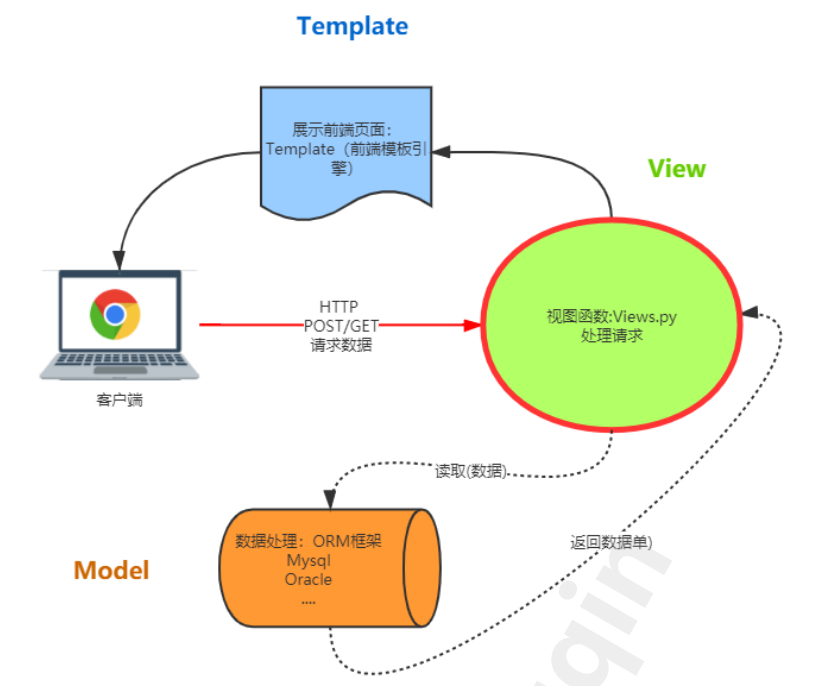

### Web系统本质
    
    * 提供服务
    * 提供接口或界面供调用
    

    
    
### 底层逻辑（请求与响应）


  
### 协议（信息交换的标准）

    

### 前端（客户端）

   

    javascript又包含：jquery、vue、react、anglar
    android开发技术包括：java；还有谷歌新推出的kotlin
    ios开发技术包括：object-c；swift
    跨平台：既可以用于android又可以用于ios，主要使用flutter框架
    小程序：国内开发的基于网页和app开发技术
    
### 后端（服务端）

   

    python开发框架包括：Django、flask、bottle、tornado
    java开发框架：spring全家桶
    
### 需求目的

    项目1：签到系统
        架构：前后端不分离，前端部分django模板实现
    项目2：测试管理平台
        架构：前后端分离，聚焦后端开发
        
### Web开发世界观

    道：协议/规则/底层逻辑
    术：各种开发技术
    如何理解道：以术窥道
    
### 创建的Django项目

    asgi.py是异步网关接口文件
    wsgi.py是同步网关接口文件（常用）
    
### Django基本架构

    * 传统MVC
    
   

    * django改进的MVC---MTV
    




    * Modle:和数据库交互，通过Model可以不用直接操作数据库，提高了代码编写效率，重点
    * View: 处理用户的请求，和返回数据响应，可以直达用户，重点
    * Template: django独特的网页渲染方式，将内容配合模板渲染成网页展现给用户，需要配合前端基本
      知识使用（html css js）如果前后端分离则用不到此模块 了解即可
      
      
### Django视图

    * 视图的定义
        直观的感受：看到什么
        本质：处理http请求的部分，返回http响应，例如数据的增删改查
        
    * 一个视图（view）是python中针对一个特定的URL的回调函数，此回调函数描述了需要展示的数据
    
```python
# demo/views.py
#定义视图--用户能看到的内容
from django.http import HttpResponse


def index(request):
    return HttpResponse('测试')
```

### Django的路由系统

    * 什么是路由？
        请求的向导，如用户访问http://host/path/foo/bar 被系统转到foo视图函数，处理后返回结果
        
    * 路由原理
        通过解析传递过来的url，来分配具体执行的视图函数。可以理解为视图的调度器
        
        


```python
# djangosite/urls.py
from login import views
urlpatterns = [
    path('admin/', admin.site.urls),
    path('index/',views.index),
]

# 注意路由path传入空字符串，默认指向根目录访问
# path('',views.index),
```

    * django路由转发
        当系统比较复杂时，一层路由会显得很臃肿，且后期不好维护，所以我们可以把路由层层分解，这个叫做路由的转发
    
    

    * 蓝色的是总路由，统一处理用户的请求，后面五颜六色的是分路由，分别处理总路由发过来的请求。这
      个就好比之前的小店老板1个人处理业务就够了，但是现在公司做大了，老板接到活以后要分配给下面的员工来处理
      
    * 路由的注意点
        末尾/的问题
        一般我们在定义路由的时候习惯末尾加/（斜杠）
        如果定义了斜杠，那么浏览器访问的时候可以不带（会自动为你补全），但是请求工具，比如代码request必须带（不会自动补全）
        
        如果末尾没有定义斜杠，那么浏览器访问的时候不带/（不会自动帮你删/），同样请求工具，比如代码request也不能带/（不会自动补全也不会自动帮你删/）
        
### 视图与路由组合练习

    发布会签到系统
    
    视图view.py
    
```python
from django.shortcuts import render
from django.http import HttpResponse


# Create your views here.
def events(request):

    event_list = [
        '测试课程发布会',
        '自动化发布会',
        '安全发布会',
        '全栈发布会',
        'ISTQB',
        'TM项目管理',
        'PMP考证'
    ]

    # 套入标签<li></li>中
    tmp = [f'<li>{event}</li>' for event in event_list]
    res = ''.join(tmp)
    return HttpResponse('<ul>' + res + '</ul>')
```

    这时候发现在代码里面修改html很麻烦，且不好维护，这个时候我们需要将html的内容外包给模板系统
    来处理，他负责对外展示的样式
    
### Django模板（template）

    1、定义任意的html文件
    2、提高html的复用性，效率开发
    3、原理：Django渲染html文件内容后变成规范的html文档

    * 一、首先在应用程序sgin的目录下新建一个templates的目录 目录名必须固定,然后新建events.html文件，里面塞入如下内容
    
```html
<!DOCTYPE html>
<html lang="en">
<head>
    <meta charset="UTF-8">
    <title>发布会页面</title>
</head>
<body>

</body>
</html>
```
    
    * 二、先在settings.py文件中注册app应用程序"sgin"
    
    * 三、上面创建了html文件，在sgin——>views.py文件则需要返回html文件
    
         * 使用导入的render模块，直接返回html文件，第一个传入的参数是request，第二个参数是html文件的路径
         * 第二个参数路径书写时可以忽略templates目录，所以传入events.html
         
        视图函数views.py修改如下
        
```python
from django.shortcuts import render
from django.http import HttpResponse


# Create your views here.
def events(request):

    event_list = [
        '测试课程发布会',
        '自动化发布会',
        '安全发布会',
        '全栈发布会',
        'ISTQB',
        'TM项目管理',
        'PMP考证'
    ]

    # 套入标签<li></li>中
    # tmp = [f'<li>{event}</li>' for event in event_list]
    # res = ''.join(tmp)
    # return HttpResponse('<ul>' + res + '</ul>')

    return render(request, 'events.html')  # django的快捷函数
```

### 第一个模板技术：变量

    作用：将视图函数中的变量返回到模板中，django将其渲染
    用法：视图返回变量：{'模板中用到的变量名': 返回的变量}
        
    视图views.py代码修改如下
    
```python
from django.shortcuts import render
from django.http import HttpResponse


# Create your views here.
def events(request):

    event_list = [
        '测试课程发布会',
        '自动化发布会',
        '安全发布会',
        '全栈发布会',
        'ISTQB',
        'TM项目管理',
        'PMP考证'
    ]

    # 套入标签<li></li>中
    tmp = [f'<li>{event}</li>' for event in event_list]
    res = ''.join(tmp)
    # return HttpResponse('<ul>' + res + '</ul>')

    # django的快捷函数
    # return render(request, 'events.html')

    # 视图返回变量：{'模板中用到的变量名': 返回的变量}
    return render(request, 'events.html', {'events': res})
```

    events.html代码修改如下
    
```html
<!DOCTYPE html>
<html lang="en">
<head>
    <meta charset="UTF-8">
    <title>发布会</title>
</head>
<body>
<!--    模板使用变量：{{变量名}}-->
    <h1>{{ events }}</h1>
</body>
</html>
```

   

    发现变量自带的标签没有被渲染，对的，默认情况下django返回的变量中若带html标签是不会被渲染
    的，当然如果你本就不想渲染html标签，或者变量内容没有Html标签那么可以忽略，但是如果想的话，请看下面

### 第二个模板技术（for循环控制器）

    作用：将列表类型的变量挨个展现出来
    用法：视图返回变量列表
    
    修改下原视图函数views.py的返回，之前是字符串，现在改为列表并且去掉标签
    视图函数代码修改如下
    
```python
from django.shortcuts import render
from django.http import HttpResponse


# Create your views here.
def events(request):

    event_list = [
        '测试课程发布会',
        '自动化发布会',
        '安全发布会',
        '全栈发布会',
        'ISTQB',
        'TM项目管理',
        'PMP考证'
    ]

    # 套入标签<li></li>中
    res = [event for event in event_list]

    # 视图返回变量：{'模板中用到的变量名': 返回的变量}
    return render(request, 'events.html', {'events': res})
```

    envent.html代码修改如下
    
```html
<!DOCTYPE html>
<html lang="en">
<head>
    <meta charset="UTF-8">
    <title>发布会</title>
</head>
<body>
<!--    模板for使用-->
    <h6>
        <ul>
        
            <li>{{ event }}</li>
        
        </ul>
    </h6>
</body>
</html>
```

    语法和 python几乎一样！不要忘记For循环结束要加，因为Html里是不认你的缩进的
    
### 第三个模板技术（if控制器）

    作用：条件控制，可以根据条件选择渲染哪些元素
    用法：视图返回变量同上
    
    event.html代码修改如下
    
```html
<!DOCTYPE html>
<html lang="en">
<head>
    <meta charset="UTF-8">
    <title>发布会</title>
</head>
<body>
<!--    模板for使用-->
    <ul>
        
        <li>{{ event }}</li>
        
    </ul>

<!--        判断ISTQB是否在列表中-->
    
        <!--注意：在标签内使用变量不用再加{{}}了，否则会报错-->
        <h4>国际软件测试工程师课程存在</h4>
        
            <h5>没有该课程</h5>  
    
</body>
</html>
``` 

    像for和if这种定义在中的，称为模板标签
    
    再换一个条件
    
```python

    <h3>9个课程发布会</h3>

```
    发现没有生效，原因是在模板中.length这种列表自带的属性失效了，需要使用模板自带的过滤器来实现
    
    
### stage1修改页面html框架内容

    event.html代码修改如下
    
```html
<!DOCTYPE html>
<html lang="cn">

<head>
    <meta charset="utf-8" />
    <meta name="viewport" content="width=device-width, initial-scale=1.0" />
    <meta content="haiwen" name="author" />
    <!-- Bootstrap Styles-->
    <link href="assets/css/bootstrap.css " rel="stylesheet" />
    <!-- FontAwesome Styles-->
    <link href="assets/css/font-awesome.css" rel="stylesheet" />
    <!-- Custom Styles-->
    <link href="assets/css/custom-styles.css" rel="stylesheet" />
    <title></title>
</head>

<body>
<div id="wrapper">
    <nav class="navbar navbar-default top-navbar" role="navigation">
        <div class="navbar-header">
            <a class="navbar-brand"><i class="icon fa fa-plane"></i> 发布会签到系统</a>

            <div id="sideNav" >
                <i class="fa fa-bars icon"></i>
            </div>
        </div>

        <ul class="nav navbar-top-links navbar-right">
            <li class="dropdown">
                <a class="dropdown-toggle" data-toggle="dropdown" href="#" aria-expanded="false">
                    <i class="fa fa-user fa-fw"></i> <i class="fa fa-caret-down"></i>
                </a>
                <ul class="dropdown-menu dropdown-user">
                    <li><a href="#"><i class="fa fa-user fa-fw"></i> User Profile</a>
                    </li>
                    <li><a href="#"><i class="fa fa-gear fa-fw"></i> Settings</a>
                    </li>
                    <li class="divider"></li>
                    <li><a href="#"><i class="fa fa-sign-out fa-fw"></i> Logout</a>
                    </li>
                </ul>
                <!-- /.dropdown-user -->
            </li>
        </ul>
    </nav>
    <!--/. NAV TOP  -->
    <nav class="navbar-default navbar-side" role="navigation">
        <div class="sidebar-collapse">
            <ul class="nav" id="main-menu">
                <li>
                    <a class="active-menu" href="/sgin/events"><i class="fa fa-dashboard"></i> 发布会</a>
                </li>
                <li>
                    <a href="/sgin/guests"><i class="fa fa-desktop"></i> 嘉宾</a>
                </li>

            </ul>

        </div>

    </nav>
    <!-- /. NAV SIDE  -->

    <div id="page-wrapper">
        <div class="header">
            <div class="page-header">

            </div>

        </div>
        <div id="page-inner" class="panel-body">


            <footer><p>Author:haiwen.  <a href="https://ke.qq.com/course/3135766" target="_blank">松勤测试开发课程</a></p>
            </footer>
        </div>
        <!-- /. PAGE INNER  -->

    </div>
    <!-- /. PAGE WRAPPER  -->
</div>


<!-- jQuery Js -->
<script src="assets/js/jquery-1.10.2.js"></script>
<!-- Bootstrap Js -->
<script src="assets/js/bootstrap.min.js"></script>

<!-- Custom Js -->
<script src="assets/js/custom-scripts.js"></script>
<script>
  $(document).ready(
    $('#main-menu>li>a').each(function (){
      $(this).attr('class',''); //先取消选中
      let current_href = window.location.pathname
      if(current_href === $(this).attr('href')){
        $(this).attr('class','active-menu');
      }
    }),
  )
</script>

</body>

</html>
```

### stage2美化页面

    * 引入静态文件（static）
        - 定义：前端样式文件的通用叫法，包括css,js,图片,音频等相对不变的文件
        - 作用：调整网页样式，让网页变的生动
        - 在应用程序sgin包下创建：static,默认静态文件从这个目录下寻找，然后将assert静态文件
        
      注意：django引入模板文件时，先在event.html文件底部写入：  意思就是载入静态文件
      所有的css和js中href属性都改成该形式：href="" 加入static表示从这个文件开始查找 
      改完静态文件都需要重启django才生效
        

        
```html

<!DOCTYPE html>
<html lang="cn">
<head>
    <meta charset="utf-8" />
    <meta name="viewport" content="width=device-width, initial-scale=1.0" />
    <meta content="haiwen" name="author" />
    <!-- Bootstrap Styles-->
    <link href=" " rel="stylesheet" />
    <!-- FontAwesome Styles-->
    <link href="" rel="stylesheet" />
    <!-- Custom Styles-->
    <link href="" rel="stylesheet" />
    <title></title>
</head>

<body>
<div id="wrapper">
    <nav class="navbar navbar-default top-navbar" role="navigation">
        <div class="navbar-header">
            <a class="navbar-brand"><i class="icon fa fa-plane"></i> 发布会签到系统</a>

            <div id="sideNav" >
                <i class="fa fa-bars icon"></i>
            </div>
        </div>

        <ul class="nav navbar-top-links navbar-right">
            <li class="dropdown">
                <a class="dropdown-toggle" data-toggle="dropdown" href="#" aria-expanded="false">
                    <i class="fa fa-user fa-fw"></i> <i class="fa fa-caret-down"></i>
                </a>
                <ul class="dropdown-menu dropdown-user">
                    <li><a href="#"><i class="fa fa-user fa-fw"></i> User Profile</a>
                    </li>
                    <li><a href="#"><i class="fa fa-gear fa-fw"></i> Settings</a>
                    </li>
                    <li class="divider"></li>
                    <li><a href="#"><i class="fa fa-sign-out fa-fw"></i> Logout</a>
                    </li>
                </ul>
                <!-- /.dropdown-user -->
            </li>
        </ul>
    </nav>
    <!--/. NAV TOP  -->
    <nav class="navbar-default navbar-side" role="navigation">
        <div class="sidebar-collapse">
            <ul class="nav" id="main-menu">
                <li>
                    <a class="active-menu" href="/sgin/events"><i class="fa fa-dashboard"></i> 发布会</a>
                </li>
                <li>
                    <a href="/sgin/guests"><i class="fa fa-desktop"></i> 嘉宾</a>
                </li>

            </ul>

        </div>

    </nav>
    <!-- /. NAV SIDE  -->

    <div id="page-wrapper">
        <div class="header">
            <div class="page-header">
                 <small></small>

            </div>

        </div>
        <div id="page-inner" class="panel-body">

            

            

            <footer><p>Author:haiwen.  <a href="https://ke.qq.com/course/3135766" target="_blank">测试开发</a></p>
            </footer>
        </div>
        <!-- /. PAGE INNER  -->

    </div>
    <!-- /. PAGE WRAPPER  -->
</div>


<!-- jQuery Js -->
<script src=""></script>
<!-- Bootstrap Js -->
<script src=""></script>

<!-- Custom Js -->
<script src=""></script>
<script>
  $(document).ready(
    $('#main-menu>li>a').each(function (){
      $(this).attr('class',''); //先取消选中
      let current_href = window.location.pathname
      if(current_href === $(this).attr('href')){
        $(this).attr('class','active-menu');
      }
    }),
  )
</script>

</body>

</html>
```
    
    * 然后将需要展示的内容通过F12审查元素放到合适的位置，并且定义样式
    
```html

<!DOCTYPE html>
<html lang="cn">
<head>
    <meta charset="utf-8" />
    <meta name="viewport" content="width=device-width, initial-scale=1.0" />
    <meta content="haiwen" name="author" />
    <!-- Bootstrap Styles-->
    <link href=" " rel="stylesheet" />
    <!-- FontAwesome Styles-->
    <link href="" rel="stylesheet" />
    <!-- Custom Styles-->
    <link href="" rel="stylesheet" />
    <title></title>
</head>

<body>
<div id="wrapper">
    <nav class="navbar navbar-default top-navbar" role="navigation">
        <div class="navbar-header">
            <a class="navbar-brand"><i class="icon fa fa-plane"></i> 发布会签到系统</a>

            <div id="sideNav" >
                <i class="fa fa-bars icon"></i>
            </div>
        </div>

        <ul class="nav navbar-top-links navbar-right">
            <li class="dropdown">
                <a class="dropdown-toggle" data-toggle="dropdown" href="#" aria-expanded="false">
                    <i class="fa fa-user fa-fw"></i> <i class="fa fa-caret-down"></i>
                </a>
                <ul class="dropdown-menu dropdown-user">
                    <li><a href="#"><i class="fa fa-user fa-fw"></i> User Profile</a>
                    </li>
                    <li><a href="#"><i class="fa fa-gear fa-fw"></i> Settings</a>
                    </li>
                    <li class="divider"></li>
                    <li><a href="#"><i class="fa fa-sign-out fa-fw"></i> Logout</a>
                    </li>
                </ul>
                <!-- /.dropdown-user -->
            </li>
        </ul>
    </nav>
    <!--/. NAV TOP  -->
    <nav class="navbar-default navbar-side" role="navigation">
        <div class="sidebar-collapse">
            <ul class="nav" id="main-menu">
                <li>
                    <a class="active-menu" href="/sgin/events"><i class="fa fa-dashboard"></i> 发布会</a>
                </li>
                <li>
                    <a href="/sgin/guests"><i class="fa fa-desktop"></i> 嘉宾</a>
                </li>

            </ul>

        </div>

    </nav>
    <!-- /. NAV SIDE  -->

    <div id="page-wrapper">
        <div class="header">
            <div class="page-header">
                 <small></small>

            </div>

        </div>
        <div id="page-inner" class="panel-body">

            

            

            <ul class="list-group">
                
                    <li class="list-group-item text-center">{{ event }}</li>
                
            </ul>

            <!--判断ISTQB是否在列表中-->
            
                <h3>国际软件测试工程师课程存在</h3>
            
                <h3>没有该课程</h3>
            

            <footer><p>Author:haiwen.  <a href="https://ke.qq.com/course/3135766" target="_blank">测试开发</a></p>
            </footer>
        </div>
        <!-- /. PAGE INNER  -->

    </div>
    <!-- /. PAGE WRAPPER  -->
</div>


<!-- jQuery Js -->
<script src=""></script>
<!-- Bootstrap Js -->
<script src=""></script>

<!-- Custom Js -->
<script src=""></script>
<script>
  $(document).ready(
    $('#main-menu>li>a').each(function (){
      $(this).attr('class',''); //先取消选中
      let current_href = window.location.pathname
      if(current_href === $(this).attr('href')){
        $(this).attr('class','active-menu');
      }
    }),
  )
</script>

</body>

</html>
``` 


### stage3发布会详情页开发

    需求：
        * 展示发布会具体信息：名称、地点、时间等
        * 从发布会管理页面链接到详情页
        * 增加返回
        
    1、templates目录下新建events_detail.html发布会详情页文件，复制events.html文件内容，修改内容（创建模板）
    
```html

<!DOCTYPE html>
<html lang="cn">
<head>
    <meta charset="utf-8" />
    <meta name="viewport" content="width=device-width, initial-scale=1.0" />
    <meta content="haiwen" name="author" />
    <!-- Bootstrap Styles-->
    <link href=" " rel="stylesheet" />
    <!-- FontAwesome Styles-->
    <link href="" rel="stylesheet" />
    <!-- Custom Styles-->
    <link href="" rel="stylesheet" />
    <title></title>
</head>

<body>
<div id="wrapper">
    <nav class="navbar navbar-default top-navbar" role="navigation">
        <div class="navbar-header">
            <a class="navbar-brand"><i class="icon fa fa-plane"></i> 发布会签到系统</a>

            <div id="sideNav" >
                <i class="fa fa-bars icon"></i>
            </div>
        </div>

        <ul class="nav navbar-top-links navbar-right">
            <li class="dropdown">
                <a class="dropdown-toggle" data-toggle="dropdown" href="#" aria-expanded="false">
                    <i class="fa fa-user fa-fw"></i> <i class="fa fa-caret-down"></i>
                </a>
                <ul class="dropdown-menu dropdown-user">
                    <li><a href="#"><i class="fa fa-user fa-fw"></i> User Profile</a>
                    </li>
                    <li><a href="#"><i class="fa fa-gear fa-fw"></i> Settings</a>
                    </li>
                    <li class="divider"></li>
                    <li><a href="#"><i class="fa fa-sign-out fa-fw"></i> Logout</a>
                    </li>
                </ul>
                <!-- /.dropdown-user -->
            </li>
        </ul>
    </nav>
    <!--/. NAV TOP  -->
    <nav class="navbar-default navbar-side" role="navigation">
        <div class="sidebar-collapse">
            <ul class="nav" id="main-menu">
                <li>
                    <a class="active-menu" href="/sgin/events"><i class="fa fa-dashboard"></i> 发布会</a>
                </li>
                <li>
                    <a href="/sgin/guests"><i class="fa fa-desktop"></i> 嘉宾</a>
                </li>

            </ul>

        </div>

    </nav>
    <!-- /. NAV SIDE  -->

    <div id="page-wrapper">
        <div class="header">
            <div class="page-header">
                 <small></small>

            </div>

        </div>
        <div id="page-inner" class="panel-body">

            

            

            <h1>发布会详情页</h1>

            <footer><p>Author:haiwen.  <a href="https://ke.qq.com/course/3135766" target="_blank">测试开发</a></p>
            </footer>
        </div>
        <!-- /. PAGE INNER  -->

    </div>
    <!-- /. PAGE WRAPPER  -->
</div>


<!-- jQuery Js -->
<script src=""></script>
<!-- Bootstrap Js -->
<script src=""></script>

<!-- Custom Js -->
<script src=""></script>
<script>
  $(document).ready(
    $('#main-menu>li>a').each(function (){
      $(this).attr('class',''); //先取消选中
      let current_href = window.location.pathname
      if(current_href === $(this).attr('href')){
        $(this).attr('class','active-menu');
      }
    }),
  )
</script>

</body>

</html>
```

    2、views.py文件中创建视图
    
```python
from django.shortcuts import render
from django.http import HttpResponse


# Create your views here.
def events(request):

    event_list = [
        '测试课程发布会',
        '自动化发布会',
        '安全发布会',
        '全栈发布会',
        'ISTQB',
        'TM项目管理',
        'PMP考证'
    ]

    # 套入标签<li></li>中
    res = [event for event in event_list]

    # 视图返回变量：{'模板中用到的变量名': 返回的变量}
    return render(request, 'events.html', {'events': res})

# 发布会详情页
def events_detail(request):
    return render(request, 'events_detail.html')

```

    3、urls.py文件定义路由，然后浏览器访问127.0.0.1:8000/sgin/events_detail
   
```python
"""djangosite URL Configuration

The `urlpatterns` list routes URLs to views. For more information please see:
    https://docs.djangoproject.com/en/3.1/topics/http/urls/
Examples:
Function views
    1. Add an import:  from my_app import views
    2. Add a URL to urlpatterns:  path('', views.home, name='home')
Class-based views
    1. Add an import:  from other_app.views import Home
    2. Add a URL to urlpatterns:  path('', Home.as_view(), name='home')
Including another URLconf
    1. Import the include() function: from django.urls import include, path
    2. Add a URL to urlpatterns:  path('blog/', include('blog.urls'))
"""
from django.urls import path
from django.contrib import admin
# 第一步导入视图函数
from sgin import views as sgin_view


urlpatterns = [
    path('admin/', admin.site.urls),
    # 签到系统路由
    path('sgin/events', sgin_view.events),  # 配置路由
    # 第一个参数视图访问路径，第二个参数导入定义的视图函数
    path('sgin/events_detail', sgin_view.events_detail)
]

``` 
    
### 多个页面样式相同如何维护

    使用模板继承方式
        * 定义：Django可以从基本模板继承公共的部分，只需要修改不同的部分即可，减少了网页修改的工作量
        * 作用：解决网页重复内容的可维护性问题
        
    类似这种格式的标签这个就是模板提供的接口，预留了空间让继承的子页面用于改动的
    我们要做的就是继承这个模板页面，改动需要改动的即可
        
    * 定义父模板
        
        
        
    * 继承父模板
          父模板文件路径
         这里填充你需要填充的内容 
        
    1、新建一个父模板base.html文件，将上面events.html内容复制进去
    2、events.html和events_detail.html文件继承base.html
    
    events.html文件代码修改如下
    
```html
<!--继承base.html-->

<!--定义个性化内容，注意占坑的标签内容-->

    <ul class="list-group">
        
            <li class="list-group-item text-center">{{ event }}</li>
        
            </ul>

    <!--判断ISTQB是否在列表中-->
    
        <h3>国际软件测试工程师课程存在</h3>
    
        <h3>没有该课程</h3>
    

```

    events_detail文件代码修改如下
    
```html
<!--继承base.html-->

<!--定义个性化内容，注意占坑的标签内容-->

    <h1>发布会详情页</h1>

```

### 实现从发布会管理页面链接到详情页

    * 代码中加入a标签，href填入需要跳转的链接
    * 注意：添加的链接前面需要加上斜杠"/"，否则会解析为相对路径在原有链接上重复显示
    


    events.html代码修改如下
    
```html
<!--继承base.html-->

<!--定义个性化内容，注意占坑的标签内容-->

    <ul class="list-group">
        
            <li class="list-group-item text-center"><a href="/sgin/events_detail">{{ event }}</a></li>
        
            </ul>

    <!--判断ISTQB是否在列表中-->
    
        <h3>国际软件测试工程师课程存在</h3>
    
        <h3>没有该课程</h3>
    

```

### 实现返回功能

    * events_detail.html文件定义a标签和样式即可
    * 然后访问http://127.0.0.1:8000/sgin/events_detail
    
    events_detail.html代码修改如下
    
```html
<!--继承base.html-->

<!--定义个性化内容，注意占坑的标签内容-->

    <h1>发布会详情页</h1>
    <p><a href="/sgin/events" class="btn btn-info">返回列表</a></p>

```
    
        
        
        
        
    
    
    

    