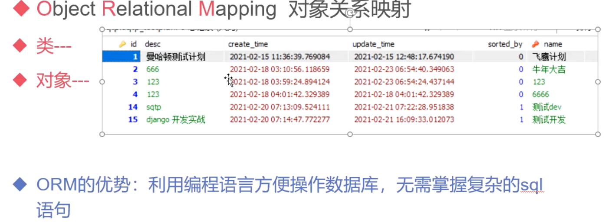

### 多级路由转发

    作用：不同的app路由都统一集中到了一块，如果项目简单还好，项目复杂，url文件就会变得特别臃肿。
    所以为了后期好维护，我们可以将路由多级分发

    * 将每个应用程序的urls.py独立出来
    * 先定义一个主路由文件，然后每个分路由建立一个应用程序的urls.py(例如：总部下有许多分部)
    * 比如demo/index.url访问，会先访问主路由，检查到第一级路由是demo，不管后面是什么(index或者其他)
      都发给demo/urls.py分路由分配，然后解析到index，然后映射到views.py视图返回给前端页面，同理其他一样的
    


    * 导入django的include模块来完成
        from django.urls import include
        from app import urls
        path('1级路由/', include(视图模块))
        
    * 1、主路由urls.py导入include模块
    
```python
from django.urls import path
from django.urls import include
from django.contrib import admin
# 第一步导入视图函数
from sgin import views as sgin_view


urlpatterns = [
    path('admin/', admin.site.urls),
    # 签到系统路由
    path('sgin/events', sgin_view.events),  # 配置路由
    # 第一个参数视图访问路径，第二个参数导入定义的视图函数
    path('sgin/events_detail', sgin_view.events_detail)
]
```

    * 2、djangosite主路由urls.py文件修改如下
       
```python
from sgin import urls as sgin_url  # 导入某一个app应用程序urls路由文件
from django.contrib import admin
from django.urls import path, include


urlpatterns = [
    path('admin/', admin.site.urls),  # admin依然在主路由中设置
    # 签到分发路由，1级路由是sgin，如果是访问sgin/index，这里就是解析第一层sgin，index再往下传给sgin目录下urls.py
    path('sgin/', include(sgin_url))  # 注意：include参数传入的是路由文件
]
```

    * 3、app目录下新建分路由文件urls.py（文件名可自定义，一般定义为这个名称）
    
```python
# coding=utf-8
# @File     : urls.py
# @Time     : 2021/3/15 11:16
# @Author   : jingan
# @Email    : 3028480064@qq.com
# @Software : PyCharm

from . import views  # 导入视图函数
from django.urls import path, include


urlpatterns = [
    # 签到子路由
    path('events/', views.events),  # 配置子路由
    path('events_detail/', views.events_detail),
]
```
    浏览器访问：http://127.0.0.1:8000/sgin/events/
    
### 需求1发布会采用真实数据

    目前存在的问题：数据写死在代码中
        * 解决方式：从数据库中读取真实数据，并且此数据可以维护
        * 如何操作数据库
    
    操作数据库的方式
        * 方式1：写原生sql
        * 方式2：ORM（对象关系映射）工具
    
### 数据操作——ORM模型——Object Relational Mapping(对象关系映射)



    一般ORM足以完成项目内容，特别复杂的sql可以使用原生的方式
    
    其主要作用是在编程中，把面向对象的概念跟数据库中表的概念对应起来。 
    ... 当然这只是从对象到SQL的映射，还有从SQL到对象的映射，也是类似的过程。
    有了ORM，我们不需要再写繁琐的sql语句，一切以python语法为准，通过ORM提供的API就可以操作数据库
    
    * 数据模型定义在app目录下的models.py中
    * 模型类继承Django的models.Model模型基本类
    * 类成员对应数据的字段类型
    
### 发布会模型定义

    1、模型定义
        在应用程序下的models.py文件定义发布会模型，代码如下
        注意：可以修改模型自带的str方法，这样在查询的时候，就能看到对应的数据信息了
    
```python
from django.db import models

# Create your models here.

# 定义发布会模型，模型名称对应表名，app_class
class Event(models.Model):  # 继承django自带的模型基类
    # 发布会名称   字符串   最大长度256   非空
    name = models.CharField(max_length=256)
    # 发布会地点   字符串   最大长度256   非空
    address = models.CharField(max_length=256)
    # 发布会人数   默认人数100
    limits = models.IntegerField(default=100)
    # 发布会状态   布尔类型   默认为True
    status = models.BooleanField(default=True)
    # 开始时间   日期时间类型   python的datetime.datetime的实例
    start_time = models.DateTimeField(null=True)

    # 修改模型自带方法 __str__ 调用该对象自动返回对象的name值
    def __str__(self):
        return self.name
```
    
    2、激活模型与数据迁移
    
        要想上面定义的模型映射到数据则需要进行以下操作
        * 激活模型
            settings.py中添加应用名称以关联app
        * 配置数据库信息
            默认使用的是sqlite，不需要配置，若要改成其他数据库，可以参考以下配置修改：如改成mysql
            
```python
# settings.py
DATABASES = {
    'default': {
        'ENGINE': 'django.db.backends.mysql', #数据库引擎
        'NAME': 'sqtp', #数据库名称
        'USER': 'root', #用户名
        'PASSWORD': 'devops', #密码
        'HOST': '192.168.21.140', #数据库IP
        'PORT': '3306', #数据库端口
    }
}
```

    附录：数据库配置 https://docs.djangoproject.com/zh-hans/3.1/intro/tutorial02/
    
    模型迁移
    
        * 1、生成模型迁移文件
            控制台该项目虚拟环境下输入命令：python manage.py makemigrations sgin
            注意：多个应用同时存在时，上面可以指定对应应用程序sgin
            

            
        * 2、同步到数据库
            控制塔该虚拟环境下输入命令：python manage.py migrate
        
        注意：如果修改了模型文件内容，比如增加字段、修改字段等需要再次运行上面两个命令同步到数据库
        Django不需要刻意定义主键，会自动定义自增的id主键    
           
        
        makemigrations命令---做语法预检查，生成操作数据库的命令，并不操作数据库，此时发生的错误都和数据库无关
        migrate命令 将前一步的命令落实到数据库，此时发生的错误都和数据库有关
        
        * 3、安装SQLiteStudio
        
            为可视化工具类似于navicat，导入创建的数据表，表名称会自动在前面加上应用程序名称sgin
            
  

        
### 数据的增删改查API

    调用模型API--- 通过模型的管理器
    语法：模型类.objects.方法
    注意：只能通过类调用，不用通过实例调用，如Event.objects而不是Event().objects
    
    增删改查操作
        * 增加：Model.objects.create(**kws)
        * 删除：数据对象.delete()，这里用对象调用删除方法，模型管理器没有
        * 修改（需要两步）：1、数据对象.字段=值；2、数据对象.save() #调用save才会保存到数据库
        注意：千万不要用 Model.objects.update(**kws) 会把所有数据记录都更改
        * 查询：
            Model.objets.all() ---- 获取所有查询结果，返回QuerySet对象
            Model.objets.filter(**kw) --- 条件过滤查询，返回QuerySet对象,不加参数效果和all()一样
            Modle.objets.get() --- 获取单个数据对象 #没有匹配结果或者匹配结果超过1个都会报错
        ORM执行查询参考：https://docs.djangoproject.com/zh-hans/3.1/topics/db/queries/
        
    测试API——体验Django自带的命令行
    
        * 1、控制台命令行输入：python manage.py shell
        * 2、添加数据：from sgin.models import Event
                     Event.objects.create(name='测试开发发布会',address='高新园')
        * 3、退出quit()
        * 4、再次同步数据库：python manage.py makemigrations sgin 
                         python manage.py migrate 
        * 5、查询数据：Event.objects.all()，如果使用filter方法可以传入查询参数
        * 6、获取数据对象，用于后面删除：e = Event.objects.filter()[1]  
                                   e.delete()
        * 7、修改数据：event = Event.objects.filter()[0]  先获取一个数据对象
                     event.name = '性能测试发布会'
                     event.save() 一定要执行这个方法后才生效
                     
        * 其余命令
            Event.objects.values()  返回的是键值对，也可以指定返回Event.objects.values('name','address')
            Event.objects.values_list()  返回元组 [('性能测试发布会', '高新园'), ('自动化发布会', '高新园')]>                 
            Event.objects.get()  获取结果只能有一个，获取不到值或者多个都报错 
            快捷查询方法       
            输入命令先导入：from django.shortcuts import get_object_or_404
            再根据模块下表中的id查询：get_object_or_404(Event, id=1)  如果id不存在会抛出异常404，后面用于使用作为一个404页面

        
### 常用的数据库字段类型和选项（ORM）

|名称|类型/选项|解析|
|---|---|---|
|CharField|字符串|必须接收一个max_length参数，表示字符串长度不能超过该值|
|BooleanField|布尔值|默认值是None|
|DateTimeField|日期时间|Python的datetime.datetime的实例|
|IntegerField|整数|范围-2147483648 到 2147483647的值在 Django 支持的所有数据库中都是安全的|
|db_index|索引|如果db_index=True 设置索引|
|null|默认为 False|如果是 True， Django 将在数据库中存储空值为 NULL|
|default|为字段设置默认值|可以是一个值或者是个可调用的对象，不能是一个可更改的对象（模型实例、list、set 等）|
|unique|默认为False|若为True该字段可以成为一个唯一索引|
|verbose_name|字段的一个类可读名称|如果没有给定详细名称，Django会使用字段的属性名自动创建，并将下划线转换为空格|
|primary_key|主键|设置为True，则为该模型的主键，最多只能有一个字段被设置|
    
    剩余通用字段参考:https://docs.djangoproject.com/zh-hans/3.1/ref/models/fields/#field-options
    
    Django不允许下面两种字段名：
        * 与Python关键字冲突。这会导致语法错误
        * 字段名中不能有两个以上下划线在一起，因为两个下划线是Django的查询语法
        * 字段名不能以下划线结尾，原因同上
        
### Django自带的后台数据管理

    用API手动创建的方式还是太麻烦，后续我们可以用API编写到接口里面
    
    现在，先用Django自带的后台来管理数据
    1、注册超级用户
        控制台输入命令：python manage.py createsuperuser
        设置用户民：admin 邮箱：123@qq.com 密码：123123
        
    2、admin关联模型admin.py 
        sgni应用程序下的admin.py文件将模型进行关联
        
 ```python
from django.contrib import admin
from sgin.models import Event

# Register your models here.
# 将模型关联到admin以便于后台手动操作
admin.site.register(Event)
```
    
    3、访问admin管理页面
        浏览器访问：127.0.0.1:8000/admin
        


### 功能迭代

    1、修改event视图（从数据库读取数据）
    
    views.py
    
```python
from django.shortcuts import render
from sgin.models import Event
from django.http import HttpResponse


# Create your views here.
def events(request):

    # 从数据库读取所有发布会数据
    event_list = Event.objects.all()
    return render(request, 'events.html', {'events': event_list})
```
    
    2、修改events.html文件中{{ event }}为{{ event.name }} 表示将发布会名称展示在前端页面
    
```html
<!--继承base.html-->

<!--定义个性化内容，注意占坑的标签内容-->

    <ul class="list-group">
        
            <li class="list-group-item text-center"><a href="/sgin/events_detail">{{ event.name }}</a></li>
        
            </ul>

```


    1、更新发布会详情页视图，view.py更新如下
    
```python
from django.shortcuts import render
from sgin.models import Event
from django.http import HttpResponse


# Create your views here.
def events(request):

    # 从数据库读取所有发布会数据
    event_list = Event.objects.all()
    return render(request, 'events.html', {'events': event_list})

# 发布会详情页
def events_detail(request, event_id):
    # 根据传入的id获取发布会信息，pk表示id，主键，不是id名称也可以使用pk表示主键
    event = Event.objects.get(pk=event_id)
    # {'event': event} 通过这个id获取的数据库信息进行返回展示
    return render(request, 'events_detail.html', {'event': event})
```

    2、修改url，增加id，urls.py更新如下
    注意：<int:event_id>的拼接链接的方式
    
```python
# coding=utf-8
# @File     : urls.py
# @Time     : 2021/3/15 11:16
# @Author   : jingan
# @Email    : 3028480064@qq.com
# @Software : PyCharm

from . import views  # 导入视图函数
from django.urls import path, include


urlpatterns = [
    # 签到子路由
    path('events/', views.events),  # 配置子路由
    # 路径拼接上id，名称要与视图函数传入的参数event_id保持一致
    path('events_detail/<int:event_id>', views.events_detail),
]
```
   
    3、修改发布会详情页，events_detail.html更新如下
    
```html
<!--继承base.html-->

<!--定义个性化内容，注意占坑的标签内容-->

    <h1>发布会详情页</h1>
    <p>发布会名称：{{ event.name }}</p>
    <p>发布会开始时间：{{ event.start_time }}</p>
    <p>发布会地址：{{ event.address }}</p>
    <p><a href="/sgin/events/" class="btn btn-info">返回列表</a></p>

``` 

    4、修改列表页的URL，events.html
    
```html
<!--继承base.html-->

<!--定义个性化内容，注意占坑的标签内容-->

    <ul class="list-group">
        
            <li class="list-group-item text-center"><a href="/sgin/events_detail/{{ event.id }}">{{ event.name }}</a></li>
        
    </ul>


```

### 需求2实现签到功能

    * 嘉宾关联对应的发布会
    * 通过嘉宾手机号签到
    * 系统通过手机号判断其嘉宾是否为对应发布会嘉宾
    
    1.创建嘉宾数据模型对象（一个发布会对应多个嘉宾，数据库1对多关系）
        至少包括手机号，姓名，邮箱，和关联的发布会
        
    按照需求，嘉宾需要与发布会进行关联，这个就涉及到了数据库表关联的关系
    
### 数据库表关联

    后端系统开发中， 数据库设计是重中之重。
    特别是前后端分离的系统，后端的职责基本就是数据管理，开发的代码几乎都是围绕数据操作的
    数据库表 和 表之间的关系 的设计：目前使用的数据库系统 主要还是关系型数据库 
    
    什么是关系型数据库？就是建立在关系模型基础上的数据库
        大家耳熟能详的mysql、oracle、 sqlserver、SQLite 都是，而mongodb、Cassandra不是
        而关系型数据库，设计的一个难点就是各种表之间的关联关系
        常见的3种关联关系就是： 一对多 ， 一对一 ， 多对多
        
    实例如下：
    * 1对多： 1个老师可以上多门课程，对应多门课程
      models.ForeignKey  外键定义在多方
    
    * 多对多：1个学生可以对应多门课程，1门课程也可以对应多个学生
      models.ManyToManyField  定义在任意1方，只能定义在1方，不能双方都定义
      
    * 1对1：1个男盆友对应1个女盆友
      models.OneToOneField  定义在多方
      


    1、sgin——models.py文件修改如下
    嘉宾表模型定义代码
    
```python
from django.db import models

# Create your models here.

# 定义发布会模型，模型名称对应表名，app_class
class Event(models.Model):  # 继承django自带的模型基类
    # 发布会名称   字符串   最大长度256   非空
    name = models.CharField(max_length=256)
    # 发布会地点   字符串   最大长度256   非空
    address = models.CharField(max_length=256)
    # 发布会人数   默认人数100
    limits = models.IntegerField(default=100)
    # 发布会状态   布尔类型   默认为True
    status = models.BooleanField(default=True)
    # 开始时间   日期时间类型   python的datetime.datetime的实例
    start_time = models.DateTimeField(null=True)

    # 修改模型自带方法 __str__ 调用该对象自动返回对象的name值
    def __str__(self):
        return self.name


# 定义发布会关联嘉宾
class Guest(models.Model):
    # django会自动创建一个id作为主键
    # 关联发布会，下面CASCADE表示如果删除了关联的发布会，该嘉宾也会删除
    event = models.ForeignKey(Event, on_delete=models.CASCADE)
    # 姓名 字符串 64 唯一
    name = models.CharField(max_length=64, unique=True)
    # 手机号 字符串 11 唯一
    phone = models.CharField(max_length=11, unique=True)
    # 邮箱 邮箱格式 xxx@yyy.z
    email = models.EmailField()
    # 加入时间 创建数据的时候就自动取当前时间 auto_now_add=True
    join_time = models.DateTimeField(auto_now_add=True)

    def __str__(self):
        return self.name
```

    2、输入命令同步数据库
        python manage.py makemigrations
        python manage.py migrate
    
    3、templates模板目录下新建guests.html和guests_detail.html空文件
    
    4、view.py视图函数新增嘉宾列表和嘉宾函数

```python
from django.shortcuts import render
from sgin.models import Event
from sgin.models import Guest
from django.http import HttpResponse


# Create your views here.
def events(request):

    # 从数据库读取所有发布会数据
    event_list = Event.objects.all()
    return render(request, 'events.html', {'events': event_list})

# 发布会详情页
def events_detail(request, event_id):
    # 根据传入的id获取发布会信息，pk表示id，主键，不是id名称也可以使用pk表示主键
    event = Event.objects.get(pk=event_id)
    return render(request, 'events_detail.html', {'event': event})

# 嘉宾列表
def guests(request):
    # 获取页面嘉宾所有信息
    guest_list = Guest.objects.all()
    # 返回页面并填充数据
    return render(request, 'guests.html', {'guest_list': guest_list})

# 嘉宾详情
def guests_detail(request, guest_id):
    # 根据嘉宾Id获取嘉宾信息
    guest = Guest.objects.get(pk=guest_id)
    # 返回页面并填充嘉宾信息
    return render(request, 'guests_detail.html', {'guest': guest})
```
    
    5、urls.py分路由增加嘉宾列表和嘉宾详情路由
    
```python
# coding=utf-8
# @File     : urls.py
# @Time     : 2021/3/15 11:16
# @Author   : jingan
# @Email    : 3028480064@qq.com
# @Software : PyCharm

from . import views  # 导入视图函数
from django.urls import path, include


# 子路由
urlpatterns = [
    # 发布会列表
    path('events/', views.events),  # 配置子路由
    # 发布会详情，路径拼接上id，名称要与视图函数传入的参数event_id保持一致
    path('events_detail/<int:event_id>', views.events_detail),
    # 嘉宾列表
    path('guests/', views.guests),
    # 嘉宾详情
    path('guests_detail/<int:guest_id>', views.guests_detail),
]
```

    6、修改guests.html和guests_detail.html网页模板内容
    
    guests.html
    
```html
<!--继承base.html-->

<!--定义个性化内容，注意占坑的标签内容-->

    <ul class="list-group">
        
            <li class="list-group-item text-center"><a href="/sgin/guests_detail/{{ guest.id }}">{{ guest.name }}</a></li>
        
    </ul>


```

    guests_detail.html
    
```html
<!--继承base.html-->

<!--定义个性化内容，注意占坑的标签内容-->

    <div class="panel-info panel">
        <div class="panel-heading"> 嘉宾详情页 </div>
        <div class="panel-body">
<!--            直接使用guest对象调用关联的发布会（正向查询即多方查询单方）-->
            <p>参与发布会：{{ guest.event }}</p>
            <p>嘉宾姓名：{{ guest.name }}</p>
            <p>嘉宾手机号：{{ guest.phone }}</p>
            <p>嘉宾邮箱：{{ guest.email }}</p>
            <p>嘉宾进入时间：{{ guest.join_time }}</p>
            <p><a href="/sgin/guests" class="btn btn-info">返回列表</a></p>
        </div>
    </div>

```

    6、sgin下的admin注册关联模型方便自定义后台添加数据
    
### 外键关联查询

    正向查询（多方查询单方）
        模型对象.外键：guest.event  直接查询guest关联的发布会数据
        
    反向查询（单方查多方）
        模型对象.外键模型的小写_set：event.guest_set  查看此发布会下关联的所有嘉宾
        
### 附录

    模型字段参考：https://docs.djangoproject.com/zh-hans/3.1/ref/models/fields/#field-types
    数据库配置：https://docs.djangoproject.com/zh-hans/3.1/intro/tutorial02/
    数据库访问优化：https://docs.djangoproject.com/zh-hans/3.1/topics/db/optimization/
    字段命名限制：https://docs.djangoproject.com/zh-hans/3.1/topics/db/models/#field-name-restrictions
    模型方法：https://docs.djangoproject.com/zh-hans/3.1/topics/db/models/#model-methods
    模型管理器：https://docs.djangoproject.com/zh-hans/3.1/topics/db/managers/
    ORM执行查询：https://docs.djangoproject.com/zh-hans/3.1/topics/db/queries/
    QuerySetAPI参考：https://docs.djangoproject.com/zh-hans/3.1/ref/models/querysets/