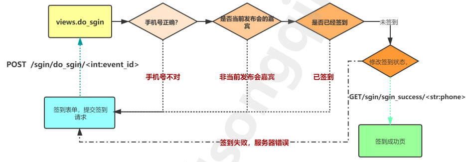
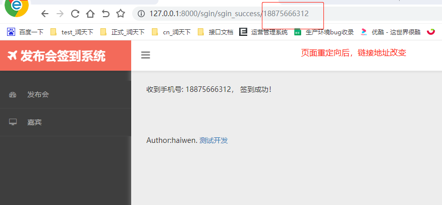
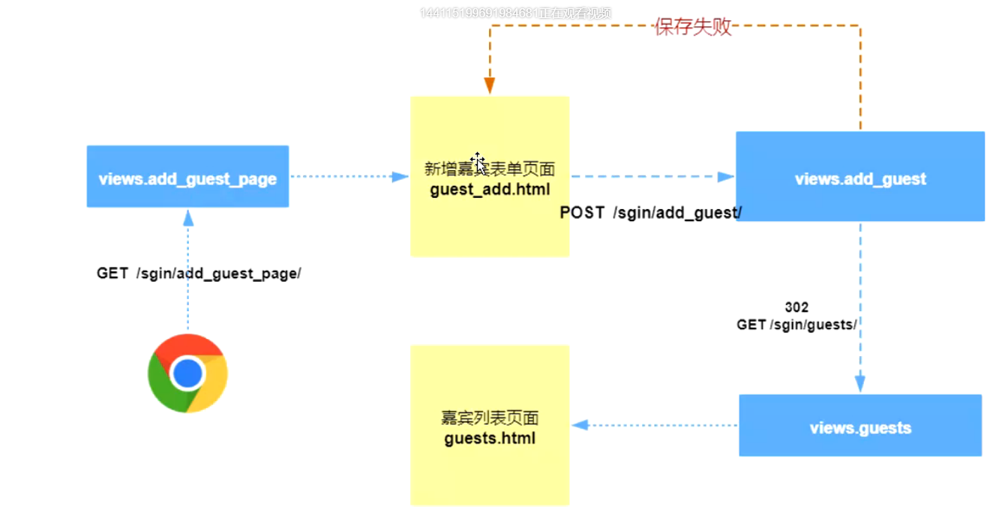
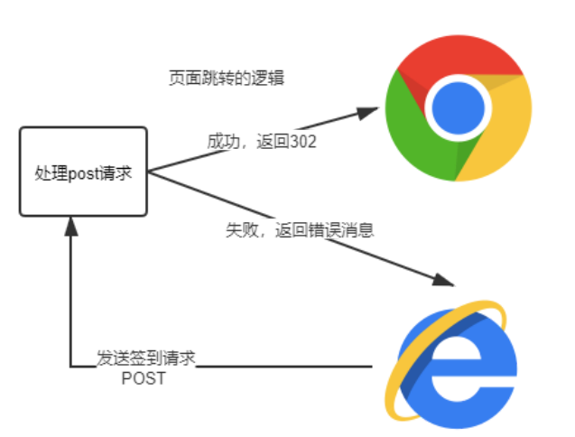

### 签到需求实现

    流程图
    


    1、models.py为嘉宾模型添加is_sign字段，用于显示是否签到
    
```python
# 记录是否签到成功，默认没有签到
is_sign = models.BooleanField(default=False)
```

    2、同步模型数据库
        python manage.py makemigrations
        python manage.py migrate
        
    3、发布会详情页增加签到表单，提交嘉宾手机号
    
    表单基础知识了解：
    
```html
<form class="form-horizontal" action="/sgin/add_event" method="post" enctype="application/x-www-form-urlencoded">
    <input type="text" class="form-control" placeholder="发布会名称" name="name">
    <button type="submit" class="btn btn-block btn-info" >提交</button>
</form>
```
        三大必填属性  
        action: 提交的URL
        method: 请求方法，get或者post
        enctype: 三种编码方式
        application/x-www-form-urlencoded #键值对方式
        multipart/form-data #二进制编码 上传文件会用到的方式
        text/plain #文本方式
        
    evens_detail.html代码添加form表单
    
```html
<!--继承base.html-->

<!--定义个性化内容，注意占坑的标签内容-->

    <h1>发布会详情页</h1>
    <p>发布会名称：{{ event.name }}</p>
    <p>发布会开始时间：{{ event.start_time }}</p>
    <p>发布会地址：{{ event.address }}</p>
    
    <form action="/sgin/do_sgin/{{ event.id }}" method="post" enctype="application/x-www-form-urlencoded">
<!--        required作用：前端用户不输入点击后会做出提示-->
        
        <input placeholder="请输入手机号" type="text" name="phone" required>
        <button type="submit">签到</button>
    </form>
    <p><a href="/sgin/events/" class="btn btn-info">返回列表</a></p>

```

    4、views.py视图定义do_sgin函数
    
        * 判断请求方法 request.method 值是大写的POST 或GET PUT DELETE
        * 取post表单数据 request.POST[key] 或request.POST.get() # request.POST返回的是一个字典
        
```python
# 签到
def do_sgin(request, event_id):
    if request.method == 'POST':
        phone = request.POST.get('phone')
        # 判断手机号是否正确
        res = Guest.objects.filter(phone=phone)
        if not res:
            return render(request, 'events_detail.html', {'event': Event.objects.get(pk=event_id), 'error':'手机号错误'})
        guest = res[0]
        # 是否属于当前发布会
        if guest.event.id != event_id:
            return render(request, 'events_detail.html', {'event': guest.event, 'error': '非当前发布会嘉宾'})
        # 是否已经签到
        if guest.is_sign:
            return render(request, 'events_detail.html', {'event': guest.event, 'error': '已签到不要重复签到'})
        # 开始签到
        guest.is_sign = True
        # 涉及到数据库修改，所以要加上save，多个动作才存在回滚
        guest.save()
        return render(request, 'sgin_success.html', {'phone': phone})
```
        
    5、urls.py添加路由
    
```python
 # 处理签到
    path('do_sgin/<int:event_id>', views.do_sgin)
```   

    6、签到成功，跳转到签到成功页（重定向）
        redirect(url)  # url就是跳转的目标
        新建一个sgin_success.html文件
   
```html

收到手机号: {{ phone }}， 签到成功！
```

    7、urls.py添加路由
    
```python
# 签到成功页
path('sgin/success', views.sgin_success),
```

    8、views.py视图添加以下函数
    
```python
def sgin_success(request, phone):
    return render(request, 'sgin_success.html', {'phone': phone})
```

    9、post请求提交之后，需要一个请求的转发（重定向），转发到另一个界面，防止和之前的url相同
    
    修改签到的视图函数do_sgin返回内容如下
    
```python
# 签到
def do_sgin(request, event_id):
    if request.method == 'POST':
        phone = request.POST.get('phone')
        # 判断手机号是否正确
        res = Guest.objects.filter(phone=phone)
        if not res:
            return render(request, 'events_detail.html', {'event': Event.objects.get(pk=event_id), 'error':'手机号错误'})
        guest = res[0]
        # 是否属于当前发布会
        if guest.event.id != event_id:
            return render(request, 'events_detail.html', {'event': guest.event, 'error': '非当前发布会嘉宾'})
        # 是否已经签到
        if guest.is_sign:
            return render(request, 'events_detail.html', {'event': guest.event, 'error': '已签到不要重复签到'})
        # 开始签到
        guest.is_sign = True
        # 涉及到数据库修改，所以要加上save，多个动作才存在回滚
        guest.save()
        # return render(request, 'sgin_success.html', {'phone': phone})
        return redirect(f'/sgin/sgin_success/{phone}')
```

    9、签到路由修改如下
    
```python
# 签到成功页
path('sgin_success/<str:phone>', views.sgin_success),
```



### 需求实现“新增嘉宾”功能




    1、"新增嘉宾"视图函数add_guest创建
    
```python
# 添加嘉宾表单页面
def add_guest_page(request):
    # event_list变量传入到guest_add模板中渲染
    event_list = Event.objects.all()
    return render(request, 'guest_add.html', {'events': event_list})

# 新增嘉宾
def add_guest(request):
    if request.method == 'POST':
        name = request.POST['name']  # 姓名
        phone = request.POST['phone']  # 手机号
        email = request.POST['email']  # 邮箱
        event_id = request.POST['event_id']  # 关联发布会
        # 创建嘉宾
        try:
            guest = Guest.objects.create(name=name, phone=phone, email=email, event_id=event_id)
        except Exception as e:
            return render(request, 'guest_add.html', {'error': repr(e)})  # repr表示只返回精简错误信息

        # 新增嘉宾保存成功，跳转到嘉宾列表页
        return redirect('/sgin/guests/')
```
    
    2、urls.py文件添加"新增嘉宾"路由
    
```python
# 新增嘉宾
path('add_guest_page/', views.add_guest_page),
# 处理新增嘉宾请求
path('add_guest/', views.add_guest),
```
    
    3、新增嘉宾表单页面guest_add.html
    
```html


    <div class="panel panel-info">
        <div class="panel-heading"> 新增嘉宾 </div>
        <div class="panel-body">

            <form method="post" action="/sgin/add_guest/" enctype="application/x-www-form-urlencoded">
                
                <div class="form-group">
                    <label class="col-sm-2 control-label">发布会</label>
                    <div class="col-sm-10">
                        <select class="form-control" name="event_id">
                            
                                <option value={{ event.id }}>{{ event.name }}</option>
                            

                        </select>
                    </div>
                </div>
                <div class="form-group">
                    <label class="col-sm-2 control-label">名称</label>
                    <div class="col-sm-10">
                        <input class="form-control" type="text" name="name" required>
                    </div>
                </div>

                <div class="form-group">
                    <label class="col-sm-2 control-label">手机号</label>
                    <div class="col-sm-10">
                        <input class="form-control" type="text" name="phone" required>
                    </div>
                </div>
                <div class="form-group">
                    <label class="col-sm-2 control-label">邮箱</label>
                    <div class="col-sm-10">
                        <input class="form-control" type="text" name="email" required>
                    </div>
                </div>


                <button class="btn btn-block btn-primary" type="submit">保存</button>
            </form>
            
                <p class="danger"> {{ error }}</p>
            
            <p><a href="/sgin/guests" class="btn btn-info">返回列表</a></p>
        </div>
    </div>

```
    
    4、嘉宾列表guests.html文件增加"添加嘉宾"入口
  
```html
<!--继承base.html-->


    <a href="/sgin/add_guest_page" class="btn btn-info navbar-right">添加嘉宾</a>

<!--定义个性化内容，注意占坑的标签内容-->

    <ul class="list-group">
        
            <li class="list-group-item text-center"><a href="/sgin/guests_detail/{{ guest.id }}">{{ guest.name }}</a></li>
        
    </ul>


```
    
### 需求实现分页功能
    分页三要素
        * page_size: 每页显示的条数
        * page_num: 第几页
        * page_count: 总页数
        
    用法：使用Paginator对象
        方法：Paginator.page(number)
        返回指定页面的Page对象，比如第7页的所有内容，从1开始，如果提供的页码不存在，抛出InvalidPage异常
        
        方法：Paginator.get_page(number)
        上面方法的安全版本，不会弹出异常，如果输入的参数不是数字，返回第一页，如果输入的数字大于最大页码，返回最后一页
        
    属性
        * Paginator.count：对象总数
        * Paginator.num_pages：页面总数
        * Paginator.page_range：基于1的页数范围迭代器，比如：[1, 2, 3, 4]
        
    Page对象
        Paginator.page(num)将返回一个Page对象，我们主要的操作都是基于Page对象的
        
    方法：
        * Page.has_next()：如果有下一页，则返回True
        * Page.has_previous()：如果有上一页，返回 True
        * Page.has_other_pages()：如果有上一页或下一页，返回True
        * Page.next_page_number()：返回下一页的页码。如果下一页不存在，抛出InvalidPage异常
        * Page.previous_page_number()：返回上一页的页码。如果上一页不存在，抛出InvalidPage异常
        * Page.start_index() ：返回当前页上的第一个对象，相对于分页列表的所有对象的序号，从1开
            始计数。 比如，将五个对象的列表分为每页两个对象，第二页的 start_index() 会返回3
        * Page.end_index() :返回当前页上的最后一个对象，相对于分页列表的所有对象的序号，从1开
            始。 比如，将五个对象的列表分为每页两个对象，第二页的 end_index() 会返回4
            
    属性
        * Page.object_list:当前页上所有对象的列表
        * Page.number:当前页的序号，从1开始计数
        * Page.paginator：当前Page对象所属的Paginator对象
        
    1、以嘉宾列表为例,修改嘉宾列表视图，使其返回分页数据，视图函数修改如下views.py
    
```python
# 嘉宾列表
def guests(request):
    # 获取页面嘉宾所有信息
    guest_list = Guest.objects.all()
    # 页面尺寸 - 每页显示的最大数量
    page_size = 3
    # 定义分页器 Paginator(查询集的列表形式, 页面尺寸)
    paginator = Paginator(list(guest_list), page_size)
    # 从请求中获取页码
    page_index = request.GET.get('page')
    # 根据页面显示对应的数据
    current_page = paginator.get_page(page_index)
    # 返回页面并填充数据
    return render(request, 'guests.html', {'guest_list': current_page})
``` 

    2、修改嘉宾模板页面，添加分页控件，guests.html
    
```html

<a href="/sgin/add_guest_page" class="btn btn-info navbar-right">添加嘉宾</a>

    <ul class="list-group">
        
            <li class="list-group-item text-center"><a href="/sgin/guest_detail/{{ guest.id }}">{{ guest.name }}</a></li>
        
    </ul>

    <div class="dataTables_paginate paging_simple_numbers" id="dataTables-example_paginate">
        <ul class="pagination">
            
                <li class="paginate_button previous " aria-controls="dataTables-example" tabindex="{{ guest_list.number }}" id="dataTables-example_previous">
                    <a href="?page={{ guest_list.previous_page_number }}">Previous</a>
                </li>
            
                <li class="paginate_button previous disabled" aria-controls="dataTables-example" tabindex="0" id="dataTables-example_previous">
                    <a href="#">Previous</a>
                </li>
            

            
                
                    <li class="paginate_button active " aria-controls="dataTables-example" tabindex="0"><a href="#">{{ guest_list.number }}</a></li>
                
                    <li class="paginate_button " aria-controls="dataTables-example" tabindex="0"><a href="?page={{ page_num }}">{{ page_num }}</a></li>
                
            

            
                <li class="paginate_button next" aria-controls="dataTables-example" tabindex="0" id="dataTables-example_next"><a href="?page={{ guest_list.next_page_number }}">Next</a></li>
            
                <li class="paginate_button next disabled" aria-controls="dataTables-example" tabindex="0" id="dataTables-example_next"><a href="#">Next</a></li>
            
        </ul>
    </div>


```
    
### Django安全策略处理

    django的csrf防护处理方式
    方法一：自费武功
        settings.py文件里注释django.middleware.csrf.CsrfViewMiddleware
        
    方法二：开后门
        在不需要校验csrf的视图加上装饰器
```python
from django.views.decorators.csrf import csrf_exempt
@csrf_exempt
def do_sgin(request,event_id):
    pass
```

    方法三：正规方式
    表单内部加入
    
```html
<form method="post" action="/sgin/do_sgin/{{ event.id }}" enctype="application/x-www-form-urlencoded">
    
    <input type="text" name="mobile" required>
    <button type="submit">输入手机号签到</button>
</form>
```
    
### 请求的转发——重定向

    手机号正常，状态正常，且签到状态修改成功后，跳转页面
    

    
    http重定向：
        * 把原本访问A的请求转给B
        * 状态码301（永久重定向，不常用）；302（临时重定向）
        
    django的快捷方式：
        redirect(视图，参数)  对应状态码302
    

    