### 单元测试

    Django 的单元测试采用 Python 的标准模块： unittest。该模块以类的形式定义测试。Django继承了
    该模块并对其做了一定修改，使其能配合Django的特性做一些测试
    
    主要测试对象：数据模型（ORM）
    
    运行方法: python manage.py test
    
    测试文件：定义在app目录下默认的test.py
    
    注意：
        * 使用Django提供的TestCase类作为被继承类。注意这里不是unittest的TestCase，否则无法使用django的测试功能
        * 创建数据时采用的是测试数据库，并且会在测试结束后销毁
        * 测试行为不会影响到真实的数据库
        
### Django实现单元测试增删改查的实例

    单元测试主要测试模型的基本功能，测试场景可能不够全面，所以大家了解这个功能即可。在项目中通
    常使系统测试，集成测试，接口测试等方法对产品功能进行覆盖测试
    
    运行所有用例：
    python3 manage.py test
    
    运行sign应用下的所有用例：
    python3 manage.py test sign
    
    运行sign应用下的tests.py文件用例：
    python3 manage.py test sign.tests
    
    运行sign应用下的tests.py文件中的 GuestTestCase 测试类：
    python3 manage.py test sign.tests.GuestTestCase
    
    tests.py文件代码如下
    
```python
from django.test import TestCase
from .models import Event, Guest
from datetime import datetime
# Create your tests here.


# 发布会测试
class EventTestCase(TestCase):
    # 继承的TestCase类，会自动创建测试数据库，销毁数据等操作
    # 单元测试主要针对数据模型——ORM

    def setUp(self):
        # 创建发布会
        Event.objects.create(name='新闻发布会', address='南山区', limits=120, start_time=datetime.now())
        Event.objects.create(name='安全测试发布会', address='龙华区', limits=110, start_time=datetime.now())

    # 测试用例以test开头
    def test_event_address(self):
        # 通过name查询
        event1 = Event.objects.get(name='新闻发布会')
        event2 = Event.objects.get(name='安全测试发布会')
        # 校验地址断言
        self.assertEqual(event1.address, '南山区')
        self.assertEqual(event2.address, '龙华区')

    def test_event_limits(self):
        event1 = Event.objects.get(name='新闻发布会')
        event2 = Event.objects.get(name='安全测试发布会')
        self.assertEqual(event1.limits, 120)
        self.assertEqual(event2.limits, 110)

    # 测试修改
    def test_address_update(self):
        event1 = Event.objects.get(name='新闻发布会')
        event1.address = '宝安区'
        event1.save()
        self.assertEqual(event1.address, '宝安区')

    def test_delete(self):
        # 删除前列出所有数据
        event_list1 = Event.objects.all()
        event1 = Event.objects.get(name='新闻发布会')
        self.assertIn(event1, event_list1)  # 检查是否存在
        event1.delete()  # 删除
        # 删除后列出所有
        event_list2 = Event.objects.all()
        self.assertNotIn(event1, event_list2)  # 检测删除后是否存在

# 嘉宾测试
class GuestTestCase(TestCase):

    # 初始化
    def setUp(self) -> None:  # -> None新语法，表示返回空
        # 嘉宾需要关联发布会，所以需要先创建发布会
        self.event = Event.objects.create(name='系统测试发布会', address='福田区', start_time=datetime.now(), limits=130)
        Guest.objects.create(name='钱林', phone='18823192229', email='2349932@qq.com', event=self.event)

    def test_query(self):
        guest = Guest.objects.filter(name='钱林')[0]
        self.assertEqual(guest.phone, '18823192229')

    def test_update(self):
        guest = Guest.objects.filter(name='钱林')[0]
        guest.name = '钱明'
        guest.save()
        guest2 = Guest.objects.filter(name='钱明')[0]
        self.assertEqual(guest.phone, guest2.phone)

    def test_delete(self):
        guest = Guest.objects.filter(name='钱林')[0]
        guest.delete()

    # 通过客户端模拟http请求添加guest
    def test_add(self):
        payload = {
            'name': '珍珍',
            'phone': '13754123456',
            'email': 'zhenzhen@qq.com',
            'event_id': self.event.id
        }

        # 模拟客户端发起请求，路径直接添加路由即可，不需要添加http
        self.client.post('/sgin/add_guest/', data=payload)  # data传入就是表单类型
        # 从数据库获取并校验
        guest = Guest.objects.filter(name='珍珍')[0]
        self.assertEqual(guest.phone, '13754123456')
```

### 数据库表关联（多对多）

    回顾下之前嘉宾与发布会：多个个嘉宾对应一个，这多对1，那么这个情况和真实的不太相符，一个嘉
    宾也可以参与多个发布会，因此，改成多对多更合理

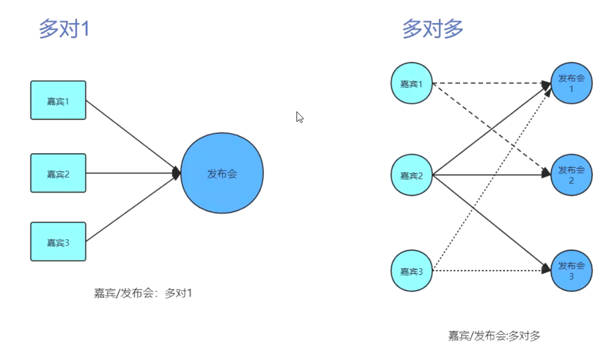

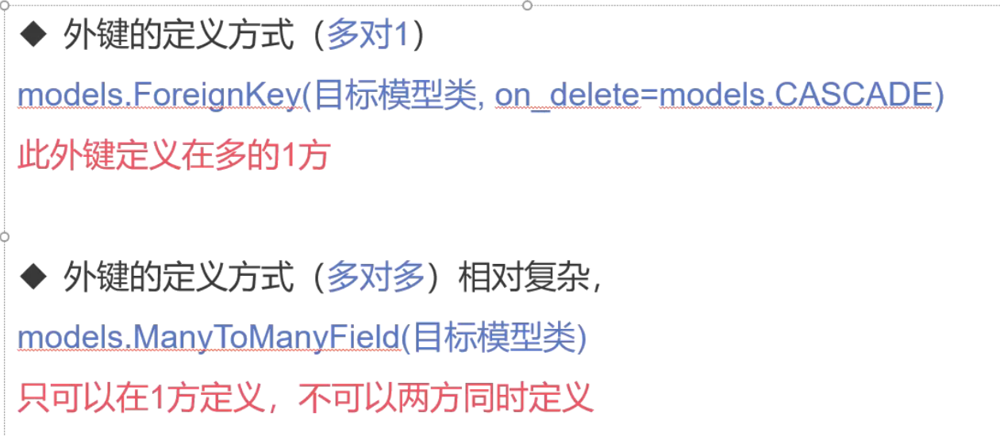

    多对多与多对1的定义方式不同，注意对比
        * 外键的定义方式（多对1）:models.ForeignKey(目标模型类, on_delete=models.CASCADE)
        * 此外键定义在多的1方
        
        * 外键的定义方式（多对多）相对复杂：models.ManyToManyField(目标模型类)
        * 只可以在1方定义，不可以两方同时定义
        
# 多对多的实例应用
    修改发布会嘉宾的关系，变为多对多，外键定义在嘉宾这里，因为从业务来看，是嘉宾选择发布会，所以定义在嘉宾这里更合理
    
    1、修改原有models.py文件中关联发布会的外键字段为
        * events = models.ManyToManyField(Event)
        
```python
# 定义发布会关联嘉宾
class Guest(models.Model):
    # django会自动创建一个id作为主键
    # 关联发布会，下面CASCADE表示如果删除了关联的发布会，该嘉宾也会删除
    # event = models.ForeignKey(Event, on_delete=models.CASCADE)
    events = models.ManyToManyField(Event)
    # 姓名 字符串 64 唯一
    name = models.CharField(max_length=64, unique=True)
    # 手机号 字符串 11 唯一
    phone = models.CharField(max_length=11, unique=True)
    # 邮箱 邮箱格式 xxx@yyy.z
    email = models.EmailField()
    # 加入时间 创建数据的时候就自动取当前时间 auto_now_add=True
    join_time = models.DateTimeField(auto_now_add=True)
    # 记录是否签到成功，默认没有签到
    is_sign = models.BooleanField(default=False)
```

    2、控制台执行数据库迁移命令同步数据库
        python manage.py makemigrations
        python manage.py migrate
        
    完成后，数据库会自动新增一个关系表，发布会和嘉宾之间的关系，就存储在这里
    主张表的名字默认是 应用名_模型1_模型2 如： sgin_guest_events
    
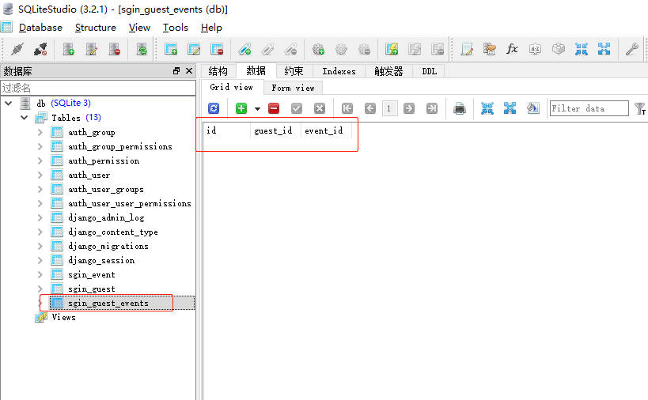

    这里生成的第三张表sgin_guest_events：用来记录两张表多对多的映射关系
        
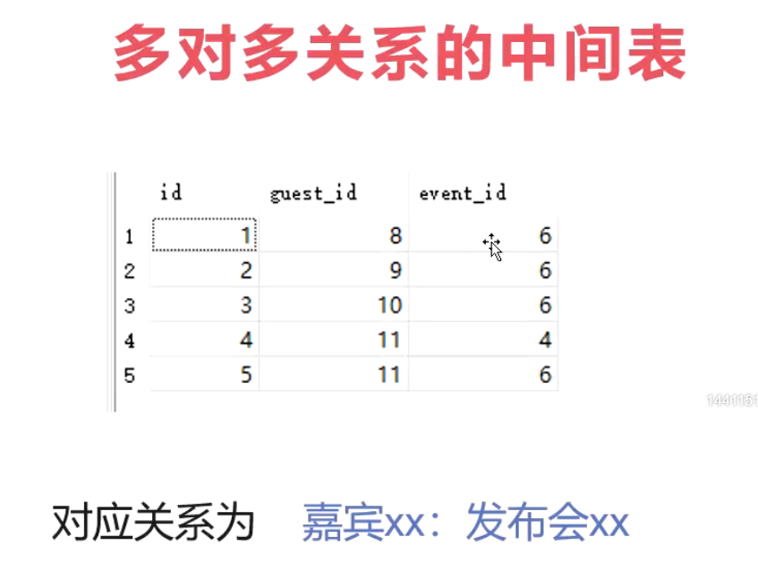      

    关系发生变动后，视图和模板也需要进行相应的修改
    
    3、修改templates的guest_add.html模板
        * 修改后访问：http://127.0.0.1:8000/sgin/add_guest_page/ 即可看到发布会选项可多选
    
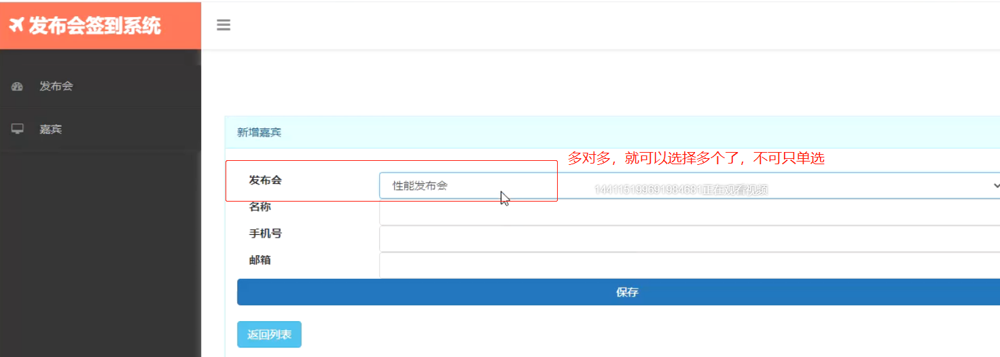      
        
    4、视图的修改
        * 首先修改add_guest视图部分：原来是关联1个发布会就够了，现在需要改成关联多个发布会，所以参数应该传递发布会的ID列表 event_ids
        * 更改前：event_id = request.POST['event_id']
    
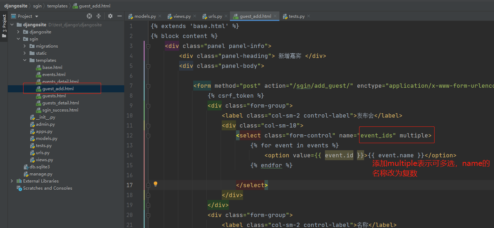   

        * views.py中的add_guest视图更改后
            
```python
#关联发布会
#event_ids = request.POST['event_ids'] #这种方式只会获取最后一个值--错误方式
event_ids = request.POST.getlist('event_ids') #获取值列表 --正确方式
```
    此时，新增嘉宾，多对多需要另外进行处理，先创建嘉宾数据，再将其进行关联
    guest = Guest.objects.create(name=name,phone=phone,email=email)
    
    创建嘉宾数据时，不要传入event_ids,应该用数据对象进行关联，方法是：
        * 方法1：数据对象.多方.add(多方数据对象1,多方数据对象2,多方数据对象3,.....)
                可以简化成数据对象.多方.add(*多方数据对象列表) # 利用自动解包可以省略手动传参
        * 方法2：数据对象.多方.set(多方数据对象列表)
        
```python
#根据event_ids查找发布会数据列表
events = [Event.objects.get(pk=event_id) for event_id in event_ids ]
#将发布会数据列表关联到当前嘉宾
guest.events.add(*events)
# 或者 guest.events.set(events)
```
    * 查看关联表的映射关系

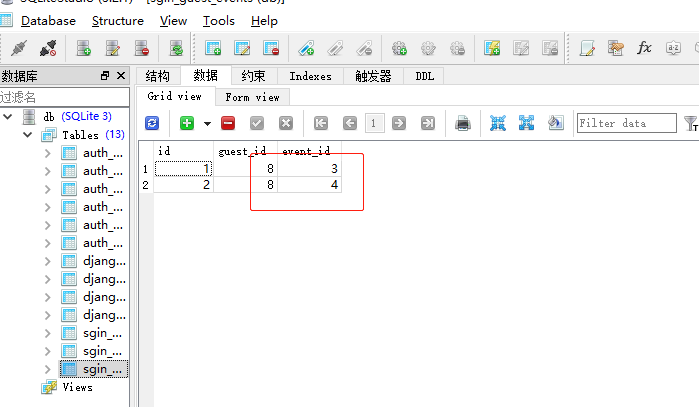 

    总的修改内容如下
    
```python
# 新增嘉宾
def add_guest(request):
    if request.method == 'POST':
        name = request.POST['name']  # 姓名
        phone = request.POST['phone']  # 手机号
        email = request.POST['email']  # 邮箱
        # event_id = request.POST['event_ids']  只会获取最后一个——错误
        event_ids = request.POST.getlist('event_ids')  # 获取关联发布会列表id
        # 创建嘉宾，直接保存
        try:
            guest = Guest.objects.create(name=name, phone=phone, email=email)
            # 根据event_ids查找发布会数据(列表生成式)
            events = [Event.objects.get(pk=event_id) for event_id in event_ids]
            # 关联发布会数据（不知道传入多少多个时，使用解包*events）
            guest.events.add(*events)
            # return redirect('/sgin/guests/')
        except Exception as e:
            return render(request, 'guest_add.html', {'error': repr(e)})  # repr表示只返回精简错误信息

        # 新增嘉宾保存成功，跳转到嘉宾列表页
        return redirect('/sgin/guests/')
```


    5、访问http://127.0.0.1:8000/sgin/guests_detail/8，可以看到发布会信息未展示
       实现：显示关联的多个发布会名称，并且点击名称跳转到对应的发布会详情页
        
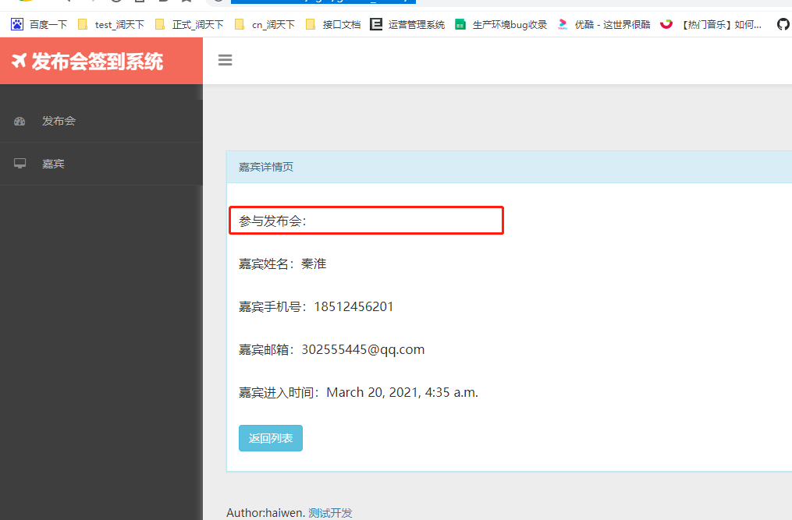    

    * 多对多数据查询——正向查询（用嘉宾多的一方去查询就叫正向查询）
        
        嘉宾查询其关联的发布会数据：guest.events.all() ——> 返回QuerySet对象
        格式：数据对象.多方属性.all()
        guest.events会返回一个多对多管理器，用法和模型管理器一样，可以使用filter等相关方法
        
    * 控制台查看对应嘉宾id关联的多个发布会
    
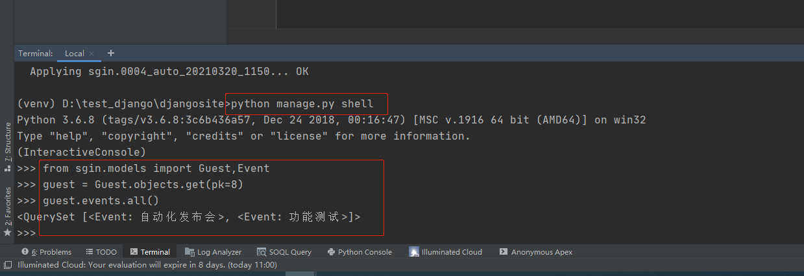    

    * templates中guests_detail.html模块参与发布会内容修改如下
   
```html
<!--继承base.html-->

<!--定义个性化内容，注意占坑的标签内容-->

    <div class="panel-info panel">
        <div class="panel-heading"> 嘉宾详情页 </div>
        <div class="panel-body">
<!--            直接使用guest对象调用关联的发布会（正向查询即多方查询单方）-->
            <p>参与发布会：<a href="/sgin/events_detail/{{ event.id }}">{{ event }} | </a></p>
            <p>嘉宾姓名：{{ guest.name }}</p>
            <p>嘉宾手机号：{{ guest.phone }}</p>
            <p>嘉宾邮箱：{{ guest.email }}</p>
            <p>嘉宾进入时间：{{ guest.join_time }}</p>
            <p><a href="/sgin/guests" class="btn btn-info">返回列表</a></p>
        </div>
    </div>

```

    6、修改签到视图do_sgin
        由于guest对应了多个发布会，所以不能通过guest.event来查看关联的发布会，应该通过guest.events.all()
        
    views.py中的do_sgin视图修改如下
    
```python
# 签到
def do_sgin(request, event_id):
    if request.method == 'POST':
        # 获取签到发布会
        current_event = Event.objects.get(pk=event_id)
        phone = request.POST.get('phone')
        # 判断手机号是否正确
        res = Guest.objects.filter(phone=phone)
        if not res:
            return render(request, 'events_detail.html', {'event': current_event, 'error':'手机号错误'})
        # 是否是当前发布会嘉宾
        guest = res[0]
        # event_id已经不生效，因为外键修改成多对多了，所以需要取出关联发布会的id列表
        event_ids =  [d[0] for d in guest.events.values_list('id')]
        # 传递过来的发布会id是否在当前嘉宾的关联发布会id列表中
        if event_id not in event_ids:  # 如果不在下面列表则返回提示内容
            return render(request, 'events_detail.html', {'event': current_event, 'error': '非当前发布会嘉宾'})
        # 是否已经签到
        if guest.is_sign:
            return render(request, 'events_detail.html', {'event': current_event, 'error': '已签到不要重复签到'})
        # 开始签到
        guest.is_sign = True
        # 涉及到数据库修改，所以要加上save，多个动作才存在回滚
        guest.save()
        # return render(request, 'sgin_success.html', {'phone': phone})
        return redirect(f'/sgin/sgin_success/{phone}')
```

    7、多对多中间表
        * 查看models.py文件中的Guest类中的以下代码
        
```python
    # 加入时间 创建数据的时候就自动取当前时间 auto_now_add=True
    join_time = models.DateTimeField(auto_now_add=True)
    # 记录是否签到成功，默认没有签到
    is_sign = models.BooleanField(default=False)
```
    
    注意这两个字段，有没有什么问题？
    
    之前的嘉宾和发布会是多对 1的关系，那么1个嘉宾保存对应的加入时间和签到状态是没有问题的，但
    是现在改成了多对多，那么数据还这样存储的话就会出现嘉宾对关联的发布会1进行签到，但是再签到
    发布会2，3的时候发现也签到了。因为签到状态绑定在了嘉宾这边，修改了签到状态就相当于把所有发
    布会都签到了，这显然不合理。同样加入时间也是一样
    
    那么这两个这个字段应该定义在哪里呢，仔细想想表示嘉宾和发布会两表之间的关系在哪？
    
    答案是：中间表
    
    我们可以在中间表这里再添加两个字段，重新定义该中间表。由于我们之前没有显示定义该表，这个表是自动创建的。现在我们显示定义该表
    并且删除上面加入时间和签到的两行代码
    
```python
# models.py
# 定义嘉宾和发布会多对多关系表
class GuestEvent(models.Model):
    # 通过外键关联对应数据，on_delete设置为删除对应的数据即删除该条记录，如发布会1对应嘉宾2
    # 当发布会1被删除了，对应的嘉宾2等都被删除
    # 通过外键关联对应的数据，verbose_name表示字段名称
    event = models.ForeignKey(Event, verbose_name='发布会', on_delete=models.CASCADE)
    guest = models.ForeignKey(Guest, verbose_name='嘉宾', on_delete=models.CASCADE)
    # 加入时间 创建数据的时候就自动取当前时间 auto_now_add=True
    join_time = models.DateTimeField(auto_now_add=True)
    # 记录是否签到成功，默认没有签到
    is_sign = models.BooleanField(default=False)
```

    8、通过 through指定使用上面创建的多对多中间表
    
```python
# 定义发布会关联嘉宾
class Guest(models.Model):
    # django会自动创建一个id作为主键
    # 关联发布会，下面CASCADE表示如果删除了关联的发布会，该嘉宾也会删除
    # event = models.ForeignKey(Event, on_delete=models.CASCADE)
    events = models.ManyToManyField(Event, through='GuestEvent')
    # 姓名 字符串 64 唯一
    name = models.CharField(max_length=64, unique=True)
    # 手机号 字符串 11 唯一
    phone = models.CharField(max_length=11, unique=True)
    # 邮箱 邮箱格式 xxx@yyy.z
    email = models.EmailField()

    def __str__(self):
        return self.name
```

    9、执行数据库迁移命令
        运行migrate时提示错误
        ValueError: Cannot alter field sgin.Guest.events into sgin.Guest.events - they 
        are not compatible types (you cannot alter to or from M
        2M fields, or add or remove through= on M2M fields)
        
    migrations目录的同一个文件下修改如下
    
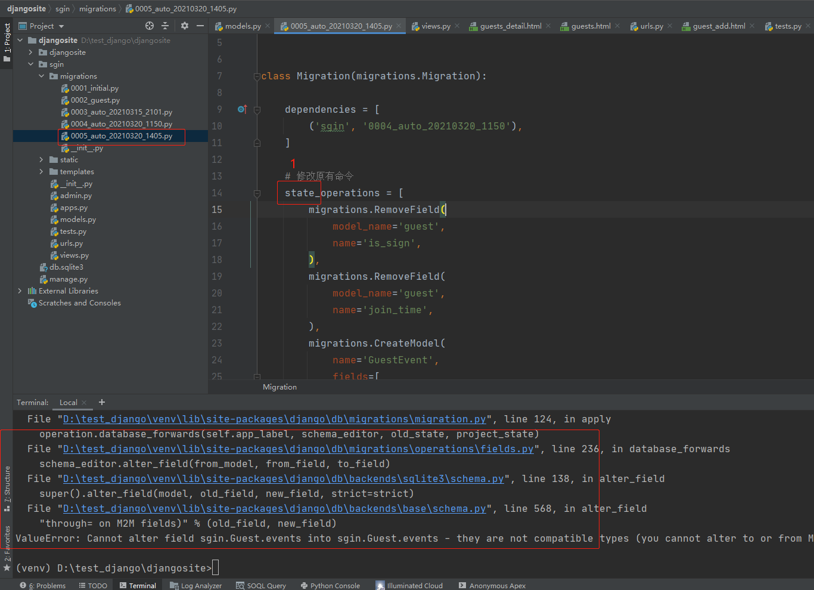

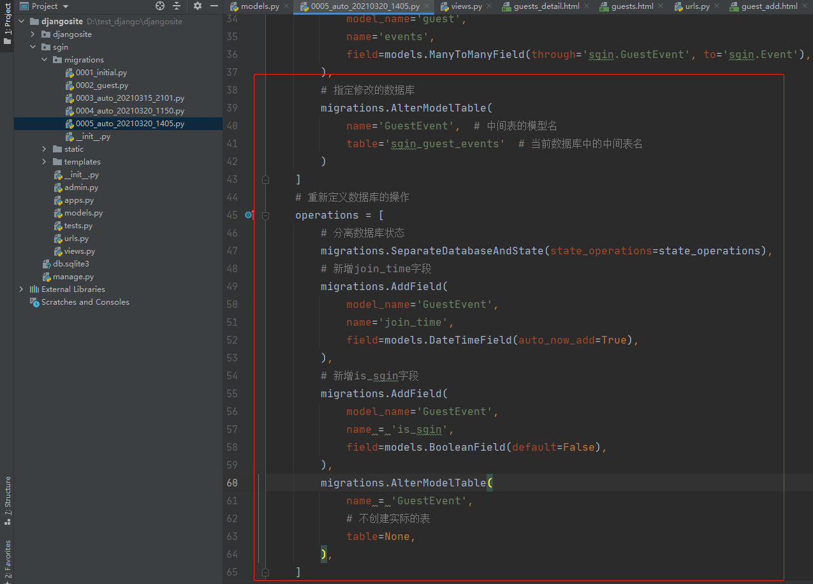
    
    再次执行python manage.py migrate命令即可
    
    10、视图修改
    
```python
def do_sgin(request,event_id):
 #.....前置代码
# 是否已经签到
ge=GuestEvent.objects.get(guest_id=guest.id,event_id=event_id)
if ge.is_sgin:
    return render(request,'event_detail.html', {'event':current_event,'error':'已签到，不要重复签到'})
    #进入签到--操作中间模型
    ge.is_sgin=True
    ge.save()
```

### 数据库事务

    看下创建嘉宾的代码
    
```python
guest = Guest.objects.create(name=name,phone=phone,email=email)
#根据event_ids查找发布会数据列表
events = [Event.objects.get(pk=event_id) for event_id in event_ids ]
#将发布会数据列表关联到当前嘉宾
# guest.events.add(*events)
guest.events.set(events)
```

    如果创建嘉宾的时候没有问题，而查找发布会或关联发布会的步骤出现了问题，就会出现嘉宾创建了，但是没有关联到发布会，这是一个bug
    我们应该这样处理，要么一次性成功创建且关联到发布会，要么失败不创建
    
    在数据库中这种要成功就一起成功，要失败就一起失败的做法叫事务，如果这里嘉宾创建成功但是后面的步骤失败了，那么数据库会发起回滚操作，将创建的嘉宾撤销
    
    在django中，可以用with transaction.atomic(): 语句块实现
    
```python
from django.db import transaction
with transaction.atomic():
 #事务操作。。。
```

    创建嘉宾代码部分可以改成：
    
```python
#创建嘉宾
try:
    with transaction.atomic():
        guest = Guest.objects.create(name=name,phone=phone,email=email)
        #根据event_ids查找发布会数据列表
        events = [Event.objects.get(pk=event_id) for event_id in event_ids ]
        #将发布会数据列表关联到当前嘉宾
        # guest.events.add(*events)
        guest.events.set(events)
except Exception as e:
    return render(request,'guest_add.html',{'error': repr(e)})  #返回精简错误信息
#保存成功-跳转到嘉宾列表页
return redirect('/sgin/guests/')
```

    
        
        