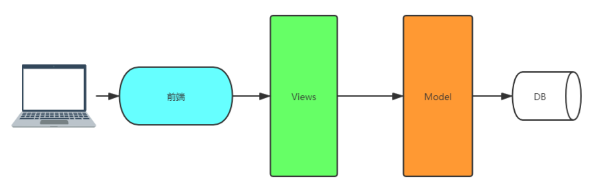

### 测试平台功能简介

    1、项目管理
        管理项目和模块的增删改查，项目包含模块，模块是项目的子集
        
    2、用户管理
        用户列表与用户详情展示
        
    3、环境管理
        环境列表，管理测试环境
        
    4、自动化列表
        包括4个模块
    
    5、测试用例
        管理用例
        
    6、web接口
        管理测试接口
        
    7、测试计划
        管理测试任务，执行测试任务
        
    8、测试报告
        管理生成测试报告
        
### 项目目标

    重点：通过对自动化的平台开发，学习web开发技巧
    结合自动化知识，定制符合自己项目需求的平台
    
### 项目架构

    前后端分离
    前端：html+css+js+jquery
    后端：django+mysql
    


### 需求分析

    * 本项目是1个接口测试平台，作为前后端分离项目，聚焦后端的数据与逻辑的实现
    * 在分工明确的今天，前后端分离模式作为主流web开发架构将开发人员分为前端和后端，前端主要负责
        页面的实现和用户的交互，像后端请求数据。后端主要负责业务逻辑，数据的处理，负责像前端提供内容
      总结：前端负责貌美如花，后端负责挣钱养家
      
    * 因此结合django的架构，如果我们专注后端开发就要从view(视图)model(模型)这里入手
    


    大纲明确任务
        1.设计1个系统
        2.可以管理自动化接口用例
        3.可以执行用例并生成测试报告
        4.额外附带一些功能：用户管理、项目管理等
        
### 数据结构分解

    设计一个系统并不是一蹴而就的事情，从你脑袋中有想法开始，需要将计划列到纸上，然后不断改进
    * 在这个过程中，由于经验不足，需求变动，用户的各种不合理要求等各种"意外情况"，导致前期设计偏离从而把项目推到重来都是常有的事情
    * 因此如果想减少返工，前期设计很重要，虽然现在推崇敏捷模式，但是在一些关键地方还是需要三思而后行
    * 比如数据库设计，作为web系统的基石，由于前期数据库设计不够严谨，导致后面改动了大量的代码，并且还可能导致bug   
    * 一般来说，数据库设计和API规范都是由架构师或者有经验的开发人员设计的
    * 比如我们可以从画图开始，将我们需要的数据表列出来，然后用箭头标明出他们之间的关系，这里面不免涉及到多对1与多对多的表关联关系
        由于在djangoORM结构中，多对1和多对多关系只能定义在1方，所以我们可以规定，发出箭头的模型为定义外键关系的模型     
        
|多对一|多对多|
|----|-----|
|测试环境——项目|项目——用户|
|模块——项目|计划——用例|
|用例——模块|用例——标签|
|步骤——用例||
|步骤——接口||
|接口——模块||
|计划——用户||
|计划——环境||
|测试结果——计划||
        


    例如：模块与项目之前的关系是多对1，即1个项目对应多个模块，那么外键定义在模块这里
    
    多对多并没有严格限制定义在哪一方，但是从业务角度考虑，哪1方是主动关联的，外键就定义在哪1方
    比如测试计划和测试用例之间的关系，测试计划在制定的时候需要关联测试用例（因为需要执行测试用例），而创建测试用例时
    不需要指定他属于哪个测试计划，所以定义在测试计划这里比较合理
    
    确定模型关系之后，我们可以考虑具体的模型应该设计哪些字段了
    
### 模型字段的设计

    数据库设计应该秉承自上到下的风格，也就是说从依赖关系的根节点开始设计，这样可以最小限度的改动代码
    在这个例子里面我们发现，用户是所有数据的根节点，他没有依赖其他数据模型，只有被依赖的
    
### 使用Django自带的用户模型

        设想一下，假如我们要实现一个用户模型，那么需要有用户名，密码，邮箱这些必须的字段，还要配合
    该模型编写创建用户，修改密码，登录，登出等一些方法，同时还要实现session来记录用户的登录状态，
    若对权限有要求还要进一步做处理。。。很多工作要做
    
        如果我们想实现一个复杂的系统，需要多种权限和用户状态，那么从头设计一个是值得的。但是如果我
    们只是想用下用户的基本功能，登录、注册等则不必大费周章，django为我们提供了一个默认的用户模型，
    他位于django的认证模块
    


    除了帮你定义了模型的字段，还配套了相关的方法，因此我们直接使用该模型即可。不用重复造轮子了
    


### 设计项目和模块


### 创建项目与app
    
    省略
    
### models.py文件定义数据模型

    注意：当两个字段关联同一个模型时，进行反向查询的时候用User.project.set就不知道查询哪个数据了
    比如下面的admin和members字段都关联了User模型，所以必须设置一个反向名称，用户就可以根据这个反
    向名称进行查询了，就好比这两个字段打了标签，即使用related_name
    
    * on_delete = models.SET_NULL  用户删除了则置为空
    * related_name = "admin" 设置反向名称，防止多个字段关联了同一个模型无法查询
    * name字段unique = True，项目名称不同名，方便管理
    * status可设置为枚举，就只能在设定的枚举字段内容中选择，使用choices接收一个二维元组
    * auto_now_add = True 第一次创建数据时，自动填入当前时间
    * auto_now = True 每次更新都会写入当前时间
    * blank = True 表示空格或空字符串
    * null = True 为空
    * on_delete = models.DO_NOTHING 删除后表示关联的用户还在，但是无法引用，什么都不做
    * TextField 没有max_length的限制
    * editable=True 表示可编辑
    
    sqtp包——models.py文件中定义项目和模块两个模型代码如下
    
```python
from django.db import models
# 因为使用的是Django自带的登录模型，所以需要先导入
from django.contrib.auth.models import User
# Create your models here.


# 项目
class Project(models.Model):


    # 枚举项目状态
    pro_status = (
        ('developing', '开发中'),
        ('operating', '维护中'),
        ('stable', '稳定运行中')
    )

    # 管理员
    admin = models.ForeignKey(User, on_delete=models.SET_NULL, verbose_name='项目管理员', related_name='admin')
    # 成员
    members = models.ManyToManyField(User, verbose_name='项目成员', related_name='members')
    # 名称
    name = models.CharField(max_length=32, unique=True, verbose_name='项目名称')
    # 状态
    status = models.CharField(choices=pro_status, max_length=32, default='stable', verbose_name='项目状态')
    version = models.CharField(max_length=32, default='v1.0', verbose_name='版本')  # 版本
    # 创建
    create_time = models.DateTimeField(auto_now_add=True, verbose_name='创建时间')
    created_by = models.ForeignKey(User, null=True, version_name='创建者', on_delete=models.SET_NULL, related_name='created_by')
    # 更新，设置更新时间null=True允许为空，因为第一次创建时候是没有更新时间的
    update_time = models.DateTimeField(auto_now=True, verbose_name='更新时间', null=True)
    updated_by = models.ForeignKey(User, null=True, version_name='更新者', on_delete=models.SET_NULL, related_name='updated_by')
    # 描述
    desc = models.TextField(null=True, blank=True, verbose_name='描述')
    # 排序（可选择此字段进行排序）
    sorted_by = models.IntegerField(default=1, verbose_name='排序', editable=True)
    # 删除（默认不删除）
    is_delete = models.BooleanField(default=False, verbose_name='删除')

    # 直接通过模型管理器查看到名称
    def __str__(self):
        return self.name

    class Meta:
        # 原类作用：默认数据库表使用sorted_by进行排序，而不是使用主键id排序，默认升序，如果要倒序，在sorted_by前加上负号即['-sorted_by']
        ordering = ['-sorted_by']


# 模块
class Module(models.Model):


    project = models.ForeignKey(Project, on_delete=models.CASCADE, verbose_name='所属项目')
    name = models.CharField(max_length=32, verbose_name='模块名称')

    def __str__(self):
        return self.name

    class Meta:
        ordering = ['-sorted_by']
        verbose_name = '模块表'
```

### 模型的继承

        除了用户模型，如果后面每个模型都要设置这些通用字段，那么就不适合在每一个模型里面都定义这些
    字段，应该将他们抽取出来放在一个公共类里面，然后其他模型来继承，与Python的类继承相同，Django
    也有完善的继承机制
    
    Django有三种继承的方式：
        * 抽象基类：被用来继承的模型被称为Abstract base classes，将子类共同的数据抽离出来，供子类继承重用，它不会创建实际的数据表
        * 多表继承：Multi-table inheritance，每一个模型都有自己的数据库表，父子之间独立存在
        * 代理模型：如果你只想修改模型的Python层面的行为，并不想改动模型的字段，可以使用代理模型
        


        只需要在模型的Meta类里添加 abstract=True 元数据项，就可以将一个模型转换为抽象基类。Django
    不会为这种类创建实际的数据库表，它们也没有管理器，不能被实例化也无法直接保存，它们就是被当作父类供起
    来，让子类继承的。抽象基类完全就是用来保存子模型们共有的内容部分，达到重用的目的。当它们被继承时，它
    们的字段会全部复制到子模型中。看下面的例子
    
    实例操作如下
    
    1、先在sqtp包——models.py文件中顶部定义一个CommonInfo()抽象类，然后Meta类里添加abstract=True
    2、Project(models.Model)和Module(models.Model)继承抽象基类变为Project(CommonInfo)和Module(CommonInfo)
    3、项目和模块的模型中删除和基类相同的内容
    4、元类继承需要由class Meta修改为class Meta(CommonInfo.Meta)
    5、修改__str__函数
    
    总结models.py文件修改如下
    
```python
from django.db import models
# 因为使用的是Django自带的登录模型，所以需要先导入
from django.contrib.auth.models import User
# Create your models here.


class CommonInfo(models.Model):
    # 创建
    create_time = models.DateTimeField(auto_now_add=True, verbose_name='创建时间')
    created_by = models.ForeignKey(User, null=True, verbose_name='创建者', on_delete=models.SET_NULL, related_name='%(class)s_created_by')
    # 更新，设置更新时间null=True允许为空，因为第一次创建时候是没有更新时间的
    update_time = models.DateTimeField(auto_now=True, verbose_name='更新时间', null=True)
    updated_by = models.ForeignKey(User, null=True, verbose_name='更新者', on_delete=models.SET_NULL, related_name='%(class)s_updated_by')
    # 描述
    desc = models.TextField(null=True, blank=True, verbose_name='描述')
    # 排序（可选择此字段进行排序）s
    sorted_by = models.IntegerField(default=1, verbose_name='排序', editable=True)
    # 删除（默认不删除）
    is_delete = models.BooleanField(default=False, verbose_name='删除')

    # 直接通过模型管理器查看到名称
    def __str__(self):
        # 检查当前对象有无name属性，有则返回，无则返回描述desc字段信息
        if hasattr(self, 'name'):
            return self.name
        return self.desc

    class Meta:
        abstract = True
        # 原类作用：默认数据库表使用sorted_by进行排序，而不是使用主键id排序，默认升序，如果要倒序，在sorted_by前加上负号即['-sorted_by']
        ordering = ['-sorted_by']


# 项目
class Project(CommonInfo):
    # 枚举项目状态
    pro_status = (
        ('developing', '开发中'),
        ('operating', '维护中'),
        ('stable', '稳定运行中')
    )

    # 管理员
    admin = models.ForeignKey(User, null=True, on_delete=models.SET_NULL, verbose_name='项目管理员', related_name='admin')
    # 成员
    members = models.ManyToManyField(User, verbose_name='项目成员', related_name='members')
    # 名称
    name = models.CharField(max_length=32, unique=True, verbose_name='项目名称')
    # 状态
    status = models.CharField(choices=pro_status, max_length=32, default='stable', verbose_name='项目状态')
    version = models.CharField(max_length=32, default='v1.0', verbose_name='版本')  # 版本

    class Meta(CommonInfo.Meta):  # 显示继承才能继承父模型的元类功能，默认不会继承abstract = True
        verbose_name = '项目表'


# 模块
class Module(CommonInfo):

    project = models.ForeignKey(Project, on_delete=models.CASCADE, verbose_name='所属项目')
    name = models.CharField(max_length=32, verbose_name='模块名称')

    class Meta(CommonInfo.Meta):
        verbose_name = '模块表'


# 测试环境
class Environment(CommonInfo):

    # 服务器类型选项枚举
    service_type = (
        (0, 'web服务器'),
        (1, '数据库服务器'),
    )
    # 服务器操作系统选项枚举
    service_os = (
        (0, 'window'),
        (1, 'linux'),
    )
    # 服务器状态选项枚举
    service_status = (
        (0, 'active'),
        (1, 'disable'),
    )

    project = models.ForeignKey(Project, on_delete=models.CASCADE, verbose_name='所属项目')
    # ip 使用Django提供的GenericIPAddressField来专门储存ip类型字段
    ip = models.GenericIPAddressField(default='127.0.0.1', verbose_name='ip地址')
    port = models.SmallIntegerField(default=80, verbose_name='端口号')
    # 服务器类型
    category = models.SmallIntegerField(default=0, choices=service_type, verbose_name='服务器类型')
    # 操作类型
    os = models.SmallIntegerField(default=0, choices=service_type, verbose_name='服务器操作系统')
    # 状态
    status = models.SmallIntegerField(default=0, choices=service_status, verbose_name='服务器状态')

    class Meta(CommonInfo.Meta):
        verbose_name = '测试环境表'
```