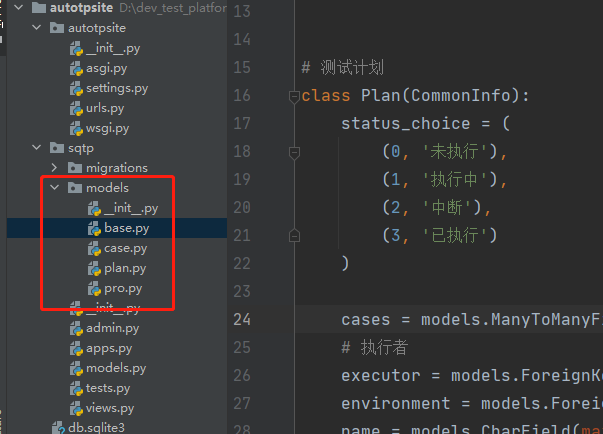

### 数据库配置mysql

    准备工作
        * 自行搭建mysql服务5.7
        * 准备一个可以外部访问的账户，root也可以
        * 创建数据库,不同于sqlite,数据选择mysql时 django不会帮你创建数据库，只会关联已有的数据库
        
    创建数据库语句：在navicat执行，autotpsite为项目名称，方便统一记录
    CREATE DATABASE `autotpsite` DEFAULT CHARACTER SET utf8 COLLATE utf8_general_ci;
    
    安装pymysqlclient模块
    pip install mysqlclient  #链接mysql数据库需要此模块
    
    settings.py文件中配置mysql数据库信息
    
```python
DATABASES = {
    'default': {
        'ENGINE': 'django.db.backends.mysql',  # 默认引擎
        'NAME': 'autotpsite',  # 数据库名称
        'USER': 'root',  # 用户名
        'PASSWORD': 'Lja199514',  # 密码
        'HOST': 'localhost',  # mysql的IP
        'PORT': '3306',  # mysql的端口号
    }
}
```

    启动django服务,如果可以正常启动代表连接没有问题:python manage.py runserver
    如果mysql用户未设置允许远程访问权限，则需要先设置
    
    执行命令数据迁移目前会报错：原因是related_name抽象成基类被继承后导致每个模块值一样
    所以修改抽象模型的related_name 加上%(class)s_
    修改Project.admin 设置null=True
    
```python
class CommonInfo(models.Model):
    # 创建
    create_time = models.DateTimeField(auto_now_add=True, verbose_name='创建时间')
    created_by = models.ForeignKey(User, null=True, verbose_name='创建者', on_delete=models.SET_NULL, related_name='%(class)s_created_by')
    # 更新，设置更新时间null=True允许为空，因为第一次创建时候是没有更新时间的
    update_time = models.DateTimeField(auto_now=True, verbose_name='更新时间', null=True)
    updated_by = models.ForeignKey(User, null=True, verbose_name='更新者', on_delete=models.SET_NULL, related_name='%(class)s_updated_by')
```

    再执行迁移数据库命令：
        * python manage.py makemigrations
        * python manage.py migrate
        
### 模型代码继续实现

    * 1、首先用包组织模型，在sqtp项目下新建models包
    * 2、按模块分割创建多个文件：plan.py、case.py、pro.py、base.py(放抽象基类)
    * 3、__init__.py文件导入所有的模型
    * 4、删除原有自带的models.py文件
    


```python
# coding=utf-8
# @File     : base.py
# @Time     : 2021/3/21 18:40
# @Author   : jingan
# @Email    : 3028480064@qq.com
# @Software : PyCharm
# 因为使用的是Django自带的登录模型，所以需要先导入
from django.db import models
from django.contrib.auth.models import User


class CommonInfo(models.Model):
    # 创建
    create_time = models.DateTimeField(auto_now_add=True, verbose_name='创建时间')
    created_by = models.ForeignKey(User, null=True, verbose_name='创建者', on_delete=models.SET_NULL, related_name='%(class)s_created_by')
    # 更新，设置更新时间null=True允许为空，因为第一次创建时候是没有更新时间的
    update_time = models.DateTimeField(auto_now=True, verbose_name='更新时间', null=True)
    updated_by = models.ForeignKey(User, null=True, verbose_name='更新者', on_delete=models.SET_NULL, related_name='%(class)s_updated_by')
    # 描述
    desc = models.TextField(null=True, blank=True, verbose_name='描述')
    # 排序（可选择此字段进行排序）s
    sorted_by = models.IntegerField(default=1, verbose_name='排序', editable=True)
    # 删除（默认不删除）
    is_delete = models.BooleanField(default=False, verbose_name='删除')

    # 直接通过模型管理器查看到名称
    def __str__(self):
        # 检查当前对象有无name属性，有则返回，无则返回描述desc字段信息
        if hasattr(self, 'name'):
            return self.name
        return self.desc

    class Meta:
        abstract = True
        # 原类作用：默认数据库表使用sorted_by进行排序，而不是使用主键id排序，默认升序，如果要倒序，在sorted_by前加上负号即['-sorted_by']
        ordering = ['-sorted_by']
```

```python
# coding=utf-8
# @File     : case.py
# @Time     : 2021/3/21 18:39
# @Author   : jingan
# @Email    : 3028480064@qq.com
# @Software : PyCharm
from .pro import Module
from .base import CommonInfo
from django.db import models


# 测试用例
class Case(CommonInfo):
    case_status = (
        ('True', 'active'),
        ('False', 'disable')
    )

    module = models.ForeignKey(Module, on_delete=models.SET_NULL, null=True, verbose_name='关联模块')
    tags = models.ManyToManyField('Tag', verbose_name='用例标签')
    status = models.BooleanField(choices=case_status, default='True', verbose_name='用例状态')

    class Meta(CommonInfo.Meta):
        verbose_name = '测试用例表'


# 标签
class Tag(CommonInfo):
    name = models.CharField(max_length=32, default='no Tag', verbose_name='标签名')

    class Meta(CommonInfo.Meta):
        verbose_name = '用例标签表'


# 测试步骤
class Step(CommonInfo):
    # 步骤状态
    step_status = (
        (0, '未执行'),
        (1, '执行中'),
        (2, '中断'),
        (3, '成功'),
        (4, '失败'),
        (5, '错误')
    )

    case = models.ForeignKey(Case, on_delete=models.CASCADE, verbose_name='用例步骤')
    httpapi = models.ForeignKey('HttpApi', on_delete=models.SET_NULL, null=True, verbose_name='http接口')
    expected = models.CharField(max_length=10240, default='', verbose_name='预期结果')
    statue = models.SmallIntegerField(choices=step_status, default=0, verbose_name='步骤状态')
    # 执行顺序（步骤序号）
    step_no = models.SmallIntegerField(default=1, verbose_name='执行顺序')

    class Meta(CommonInfo.Meta):
        verbose_name = '用例步骤'
        ordering = ['step_no']


# 接口
class HttpApi(CommonInfo):
    http_method = (
        (0, 'get'),
        (1, 'post'),
        (2, 'put'),
        (3, 'delete')
    )

    content_types = (
        (0, 'application/json'),  # sqlite不支持这种格式
        (1, 'application/x-www-form-urlencoded')  # 表单格式
    )

    # 验证的枚举类型
    auth_types = (
        (0, 'cookie'),
        (1, 'token'),
        (2, 'None')
    )

    module = models.ForeignKey(Module, on_delete=models.SET_NULL, null=True, verbose_name='关联模块')
    # http请求方法
    method = models.SmallIntegerField(default=0, choices=http_method, verbose_name='请求方法')
    # 请求路径path
    path = models.CharField(max_length=1024, null=True, default='/', verbose_name='请求路径')
    # 参数
    data = models.CharField(max_length=10240, null=True, blank=True, verbose_name='请求参数')
    # 请求参数类型
    content_type = models.SmallIntegerField(choices=content_types, default=0, verbose_name='请求参数类型')
    # 请求头,sqlite不支持JSONField这种格式，所以使用mysql
    headers = models.JSONField(null=True, blank=True, verbose_name='请求头')
    # 验证类型
    auth_type = models.SmallIntegerField(choices=auth_types, default=3, verbose_name='接口认证类型')

    class Meta(CommonInfo.Meta):
        verbose_name = 'http接口'
```

```python
# coding=utf-8
# @File     : plan.py
# @Time     : 2021/3/21 18:39
# @Author   : jingan
# @Email    : 3028480064@qq.com
# @Software : PyCharm
from .pro import Module
from .case import Case
from .base import CommonInfo
from django.db import models
from .pro import Environment
from django.contrib.auth.models import User


# 测试计划
class Plan(CommonInfo):
    status_choice = (
        (0, '未执行'),
        (1, '执行中'),
        (2, '中断'),
        (3, '已执行')
    )

    cases = models.ManyToManyField(Case, verbose_name='测试用例', through='PlanCase')
    # 执行者
    executor = models.ForeignKey(User, on_delete=models.SET_NULL, null=True, verbose_name='执行人')
    environment = models.ForeignKey(Environment, on_delete=models.SET_NULL, null=True, verbose_name='测试环境')
    name = models.CharField(max_length=32, verbose_name='测试计划', unique=True)
    status = models.SmallIntegerField(choices=status_choice, default=0, verbose_name='计划状态')
    # 记录执行次数
    exec_counts = models.SmallIntegerField(default=0, verbose_name='执行次数')


# 计划&用例中间表
class PlanCase(CommonInfo):
    plan = models.ForeignKey(Plan, on_delete=models.CASCADE, verbose_name='测试计划')
    case = models.ForeignKey(Case, on_delete=models.CASCADE, verbose_name='测试用例')
    # 用例的执行顺序
    case_no = models.SmallIntegerField(default=1, verbose_name='执行顺序')

    class Meta(CommonInfo.Meta):
        verbose_name = '计划用例关系表'

# 测试结果
class Result(CommonInfo):
    plan = models.ForeignKey(Plan, on_delete=models.SET_NULL, null=True, verbose_name='测试计划')
    # 触发时间
    start_time = models.DateTimeField(null=True, blank=True, editable=True, verbose_name='触发时间')
    # 用例执行通过数、失败数、总数
    case_num = models.SmallIntegerField(default=0, verbose_name='用例数')
    pass_num = models.SmallIntegerField(default=0, verbose_name='通过数')
    failed_num = models.SmallIntegerField(default=0, verbose_name='失败数')

    class Meta(CommonInfo.Meta):
        verbose_name = '测试结果'

```

```python
# coding=utf-8
# @File     : pro.py
# @Time     : 2021/3/21 18:39
# @Author   : jingan
# @Email    : 3028480064@qq.com
# @Software : PyCharm
from .base import CommonInfo
from django.db import models
from django.contrib.auth.models import User


# 项目
class Project(CommonInfo):
    # 枚举项目状态
    pro_status = (
        ('developing', '开发中'),
        ('operating', '维护中'),
        ('stable', '稳定运行中')
    )

    # 管理员
    admin = models.ForeignKey(User, null=True, on_delete=models.SET_NULL, verbose_name='项目管理员', related_name='admin')
    # 成员
    members = models.ManyToManyField(User, verbose_name='项目成员', related_name='members')
    # 名称
    name = models.CharField(max_length=32, unique=True, verbose_name='项目名称')
    # 状态
    status = models.CharField(choices=pro_status, max_length=32, default='stable', verbose_name='项目状态')
    version = models.CharField(max_length=32, default='v1.0', verbose_name='版本')  # 版本

    class Meta(CommonInfo.Meta):  # 显示继承才能继承父模型的元类功能，默认不会继承abstract = True
        verbose_name = '项目表'


# 模块
class Module(CommonInfo):

    project = models.ForeignKey(Project, on_delete=models.CASCADE, verbose_name='所属项目')
    name = models.CharField(max_length=32, verbose_name='模块名称')

    class Meta(CommonInfo.Meta):
        verbose_name = '模块表'


# 测试环境
class Environment(CommonInfo):

    # 服务器类型选项枚举
    service_type = (
        (0, 'web服务器'),
        (1, '数据库服务器'),
    )
    # 服务器操作系统选项枚举
    service_os = (
        (0, 'window'),
        (1, 'linux'),
    )
    # 服务器状态选项枚举
    service_status = (
        (0, 'active'),
        (1, 'disable'),
    )

    project = models.ForeignKey(Project, on_delete=models.CASCADE, verbose_name='所属项目')
    # ip 使用Django提供的GenericIPAddressField来专门储存ip类型字段
    ip = models.GenericIPAddressField(default='127.0.0.1', verbose_name='ip地址')
    port = models.SmallIntegerField(default=80, verbose_name='端口号')
    # 服务器类型
    category = models.SmallIntegerField(default=0, choices=service_type, verbose_name='服务器类型')
    # 操作类型
    os = models.SmallIntegerField(default=0, choices=service_type, verbose_name='服务器操作系统')
    # 状态
    status = models.SmallIntegerField(default=0, choices=service_status, verbose_name='服务器状态')

    class Meta(CommonInfo.Meta):
        verbose_name = '测试环境表'
```

### 数据库查询强化

    1、反向查询
    模型查询其关联的项目叫做正向查询（外键定义在模型）,反过来，项目查询下面的模型叫做反向查询
    * 方式1：未指定related_name时：modelobj.field_set.all()
    * 方式2：指定related_name时：modelobj.related_name.all()
    
    test.py文件如下
    
```python
from django.test import TestCase
from .models import Module,Project,Environment,Plan,Step,Case,HttpApi,Tag,Result
from django.contrib.auth.models import User

# Create your tests here.
class TestM2MQuery(TestCase):
    def setUp(self) -> None:
        # 用户
        self.user = User.objects.create_user(username='admin',password='123456',first_name='管理员')
        # 项目
        self.test_pro=Project.objects.create(name='松勤测试平台',created_by=self.user,admin=self.user)
        # 模块
        self.test_mod = Module.objects.create(name='第三方支付-微信',project=self.test_pro,created_by=self.user)
        # 用例
        self.test_case = Case.objects.create(desc='支付接口用例001',module=self.test_mod,created_by=self.user)
        # 步骤
        self.test_step=Step.objects.create(desc='test_step',case=self.test_case,created_by=self.user)
        # 接口
        self.test_api=HttpApi.objects.create(desc='合同新增接口',module=self.test_mod,created_by=self.user)
        # 标签
        self.test_tag = Tag.objects.create(name='冒烟测试',created_by=self.user)
        # 环境
        self.test_env = Environment.objects.create(desc='阿里云',project=self.test_pro,created_by=self.user)
        # 计划
        self.test_plan = Plan.objects.create(name='生辰纲',environment=self.test_env,created_by=self.user)
        # 报告
        self.test_report = Result.objects.create(plan=self.test_plan,created_by=self.user)

    #用例步骤关系
    def test_case_step(self):
        #查询某用例下面的步骤
        steps = self.test_case.step_set.filter()
        Step.objects.create(desc='step2',case=self.test_case,created_by=self.user)
        print(steps)

    #用例 标签
    def test_case_tag(self):
        # 关联标签
        self.test_case.tags.add(self.test_tag)
        # 用例下面的标签--正向查询
        tags=self.test_case.tags.all()
        print(tags)
        # 标签关联的用例？--反向查询
        cases=self.test_tag.case_set.all()
        print(cases)

    def test_user_pro(self):
        # 查询项目管理员--正向查询
        user1=self.test_pro.admin
        print(user1)
        # 反向查询--当前用户管理的项目--用relatedname查询
        Project.objects.create(name='松勤测试平台123',created_by=self.user,admin=self.user)
        pros=self.user.admin.all()
        print(pros)

        # 反向查询2--当前用户参与了哪些项目
        pro1=Project.objects.create(name='testpro1')
        pro2=Project.objects.create(name='testpro2')
        pro3=Project.objects.create(name='testpro3')
        #项目关联成员
        pro1.members.add(self.user)
        pro2.members.add(self.user)
        pro3.members.add(self.user)
        # ---正向查询
        pro1.members.all()
        # 当前用户参与了哪些项目
        pros=self.user.members.all()
        print(pros)

        # 查询当前用户创建的项目
        pros2=self.user.project_created_by.all()
        print(pros2)
```

### 字段条件查询

    字段查询是指如何指定SQL WHERE子句的内容。它们用作QuerySet的filter(), exclude()和get()方法的关键字参数
    
    其基本格式是：field__lookuptype=value，注意其中是双下划线
    默认查找类型为exact(精确匹配)
    lookuptype的类型有：
    Django的数据库API支持20多种查询类型，下表列出了所有的字段查询参数
    
|字段名|说明|
|----|----|
|exact |精确匹配|
|iexact |不区分大小写的精确匹配|
|contains |包含匹配|
|icontains|不区分大小写的包含匹配|
|in|在..之内的匹配|
|gt|大于|
|gte|大于等于|
|lt|小于|
|lte |小于等于|
|startswith |从开头匹配|
|istartswith |不区分大小写从开头匹配|
|endswith|从结尾处匹配|
|iendswith |不区分大小写从结尾处匹配|
|range|范围匹配|
|date|日期匹配|
|year|年份|
|iso_year|以ISO 8601标准确定的年份|
|month |月份|
|day|日期|
|week|第几周|
|week_day|周几|
|iso_week_day|以ISO 8601标准确定的星期几|
|quarter|季度|
|time|时间|
|hour|小时|
|minute|分钟|
|second|秒|
|regex|区分大小写的正则匹配|
|iregex|不区分大小写的正则匹配|

    实例

```python
# 字段条件查询
class TestFieldQuery(TestCase):
    def setUp(self) -> None:
        # 用户
        self.user = User.objects.create_user(username='admin',password='123456',first_name='管理员')
        # 项目
        self.test_pro=Project.objects.create(name='松勤测试平台',created_by=self.user,admin=self.user)
        # 模块
        self.test_mod = Module.objects.create(name='第三方支付-微信',project=self.test_pro,created_by=self.user)
        # 用例
        self.test_case = Case.objects.create(desc='支付接口用例001',module=self.test_mod,created_by=self.user)
        # 步骤
        self.test_step=Step.objects.create(desc='test_step',case=self.test_case,created_by=self.user)
        # 接口
        self.test_api=HttpApi.objects.create(desc='合同新增接口',module=self.test_mod,created_by=self.user)
        # 标签
        self.test_tag = Tag.objects.create(name='冒烟测试',created_by=self.user)
        # 环境
        self.test_env = Environment.objects.create(desc='阿里云',project=self.test_pro,created_by=self.user)
        # 计划
        self.test_plan = Plan.objects.create(name='生辰纲',environment=self.test_env,created_by=self.user)
        # 报告
        self.test_report = Result.objects.create(plan=self.test_plan,created_by=self.user)


    def test_iexact_query(self):
        steps = Step.objects.filter(desc__iexact='Test_Step')
        print(steps)

    def test_contains_query(self):
        tags = Tag.objects.filter(name__contains='冒烟')
        print(tags)
```

### 跨关系查询

    Django提供了强大并且直观的方式解决跨越关联的查询，它在后台自动执行包含JOIN的SQL语句。要跨
    越某个关联，只需使用关联的模型字段名称，并使用双下划线分隔，直至你想要的字段（可以链式跨越，无限跨度）
    
    例如：#查找标签是xxx的用例
        * 注意：双划线关联的是字段名称
        * 技巧：查什么就用对应数据模型，下面查用例，就使用用例数据模型Case.objects
        * res1=Case.objects.filter(tags__name='smoketest')
        
    示例如下

```python
#跨关系查询
class TestOverRelations(TestCase):
    def setUp(self) -> None:
        # 用户
        self.user = User.objects.create_user(username='admin',password='123456',first_name='管理员')
        # 项目
        self.test_pro=Project.objects.create(name='松勤测试平台',created_by=self.user,admin=self.user)
        # 模块
        self.test_mod = Module.objects.create(name='第三方支付-微信',project=self.test_pro,created_by=self.user)
        # 用例
        self.test_case = Case.objects.create(desc='支付接口用例001',module=self.test_mod,created_by=self.user)
        # 步骤
        self.test_step=Step.objects.create(desc='test_step',case=self.test_case,created_by=self.user)
        # 接口
        self.test_api=HttpApi.objects.create(desc='合同新增接口',module=self.test_mod,created_by=self.user)
        # 标签
        self.test_tag = Tag.objects.create(name='冒烟测试',created_by=self.user)
        # 环境
        self.test_env = Environment.objects.create(desc='阿里云',project=self.test_pro,created_by=self.user)
        # 计划
        self.test_plan = Plan.objects.create(name='生辰纲',environment=self.test_env,created_by=self.user)
        # 报告
        self.test_report = Result.objects.create(plan=self.test_plan,created_by=self.user)


    def test_tags(self):
        # 通过标签名查找测试用例
        # 小技巧1，查什么就用对应数据的模型
        self.test_case.tags.add(self.test_tag)  #关联标签
        cases = Case.objects.filter(tags__name='冒烟测试')
        print('通过标签名查找测试用例')
        print(cases)

    def test_case_project(self):
        # 查找测试用例对应的项目 1.正向查抄
        print('查找测试用例对应的项目 1.正向查抄')
        project = self.test_case.module.project
        print(project)

        # 跨关系--通过测试用例的名称 外键模型__字段
        project2 =  Project.objects.filter(module__case__desc='支付接口用例001')[0]
        print(project2)
``` 
    
    