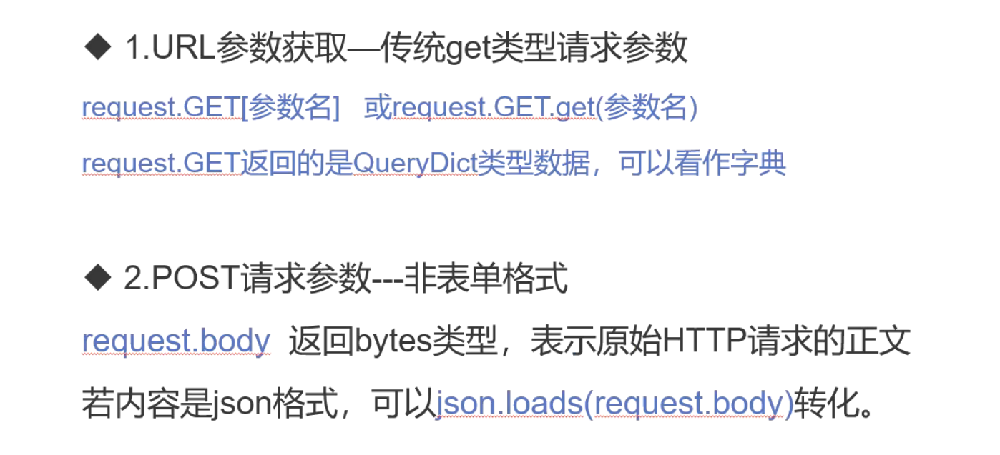

### 接口开发


### 接口规范——RESTful风格

    1、URL风格：动词+宾语
        动词常用就是4种HTTP方法，对应CRUD方法
        * GET：读取（Read）
        * POST：新建（Create）
        * PUT：更新（Update）
        * DELETE：删除（Delete）
        根据 HTTP 规范，动词一律大写
        
    2、宾语
        宾语就是 API 的 URL，是 HTTP 动词作用的对象。它应该是名词，不能是动词
        比如，/articles这个 URL 就是正确的，而下面的 URL 不是名词，所以都是错误的
            /getAllCars
            /createNewCar
            /deleteAllRedCars
            
    3、请求与响应格式都为json格式
        Content-Type: application/json
        


### 项目接口的增删改查实现
    
    接口文档如下
    


    注意：model插入数据方法
    总结：
        * 普通数据项：直接插入
        * 外键数据项：先获取要插入的外键，然后和普通想一起插入
        * 多对多数据项：获取要插入的多对多数据项，待表中普通数据项和外键数据项save后，使用.add方法加入
     


    1、POST请求参数——非表单格式
        请求的消息体都在request.body中，返回bytes格式，表示原始HTTP请求的正文内容
        若内容是json格式，可以json.loads(request.body)转化
    
    views.py文件编写“新增项目”接口代码
    
```python

```
    2、autotpsite下的主路由urls.py文件导入include，如果接口路径是api开头，就分发给sqtp文件下的urls.py路由
    
```python
from sqtp import urls
from django.contrib import admin
from django.urls import path, include

urlpatterns = [
    path('admin/', admin.site.urls),
    path('api/', include(urls)),
]
```
    3、sqtp文件下新建urls.py文件
        根据路由分发机制和接口文档编写
        
```python
# coding=utf-8
# @File     : urls.py.py
# @Time     : 2021/3/25 8:48
# @Author   : jingan
# @Email    : 3028480064@qq.com
# @Software : PyCharm
from django.urls import path
from .views import add_project


urlpatterns = [
    path('project/', add_project)   # 项目的增删改查路径
]
```


    4、setting设置runner方式为Twisted
    


    5、cmd命令窗口输入：python manage.py runserver 8081
    
    6、autotpsite项目下创建testcase目录
        * 新建test_project_api.py文件
        * 写入如下代码，并运行测试
        
```python
# coding=utf-8
# @File     : test_project_api.py
# @Time     : 2021/3/25 8:43
# @Author   : jingan
# @Email    : 3028480064@qq.com
# @Software : PyCharm
import requests


host = 'http://127.0.0.1:8081'
path = '/api/project/'

# 新增项目
def test_add():
    url = host+path
    # 请求数据
    payload = {
        'name': '自动化平台',
    }
    resp = requests.post(url, json=payload)
    print(resp.text)

if __name__ == '__main__':
    test_add()
```

    7、运行以上测试内容后，打印的文本报错提示403 Forbidden，所以需要防跨站请求攻击
       在视图函数views.py——add_project函数前加上装饰器：@csrf_exempt
       顺带加上try的异常处理请求参数，获取错误内容，再次运行测试：test_project_api.py文件
       
```python
import json
from django.db import transaction
from django.shortcuts import render
from django.views.decorators.csrf import csrf_exempt

from sqtp.models.pro import Project
from django.http import JsonResponse
from django.contrib.auth.models import User
# Create your views here.


# 项目接口增删改查
import json
from django.db import transaction
from django.shortcuts import render
from django.views.decorators.csrf import csrf_exempt

from sqtp.models.pro import Project
from django.http import JsonResponse
from django.contrib.auth.models import User
# Create your views here.


# 项目接口增删改查
@csrf_exempt
def add_project(request):
    # 如何处理json格式的请求？
    if request.method == 'POST':
        in_params = json.loads(request.body)  # 将传入的请求体内容转换成字典格式
        try:
            # 根据接口文档定义请求参数
            name = in_params['name']
            desc = in_params['desc']
            status = in_params['status']
            version = in_params['version']
            admin_id = in_params['admin_id']
            members_id = in_params['members_id']  # 成员id列表在创建项目数据时不能直接传入
        except Exception as e:
            return JsonResponse({'retcode': 400, 'msg':'请求错误', 'error': repr(e)})
        # 创建项目数据
        try:
            # 加入事务回滚操作
            with transaction.atomic():
                project = Project.objects.create(name=name, desc=desc, status=status, version=version, admin_id=admin_id)
                # 找到成员列表对应的用户，使用项目数据进行关联,members为多对多管理方法
                # 先查询数据
                # 通过导入的用户User模块去查询，取出对象用get方法，使用filter后面加上下标[0]，否则取的是Queryset对象
                members = [User.objects.get(pk=_id) for _id in members_id]
                # 将获取到的member值传入，使用解包，因为不知道获取了多少用户，列表解包加一个*号，字典解包加两个*号
                project.members.add(*members)
            # 根据接口文档定义返回的响应数据格式
            return JsonResponse(request, {'retcode': 200, 'msg': '添加成功', 'id': project.id})
        except Exception as e:
            return JsonResponse(request, {'retcode': 500, 'msg': '添加失败', 'error': repr(e)})
```

    运行上面代码发现错误：{"retcode": 400, "msg": "\u8bf7\u6c42\u9519\u8bef", "error": "KeyError('desc',)"}
    原因：选填参数'desc'未传入
    
    8、再次修改视图views.py——add_project函数中代码
        
        * 判断选填参数
        * 将写错的members_id参数加上-s
        * create创建数据时传入参数使用解包的方法，因为非必填参数不一定传入
        * 最后两个return中的request删除
        * 修改后再次运行test_project_api.py文件
        
```python
import json
from django.db import transaction
from django.shortcuts import render
from django.views.decorators.csrf import csrf_exempt

from sqtp.models.pro import Project
from django.http import JsonResponse
from django.contrib.auth.models import User
# Create your views here.


# 项目接口增删改查
@csrf_exempt
def add_project(request):
    # 如何处理json格式的请求？
    if request.method == 'POST':
        in_params = json.loads(request.body)  # 将传入的请求体内容转换成字典格式
        try:
            # 根据接口文档定义请求参数
            # 创建数据的参数
            info = {}
            info['name'] = in_params['name']  # name是必填参数
            # 下面的都是选填参数
            if 'desc' in in_params:
                info['desc'] = in_params['desc']
            if 'status' in in_params:
                info['status'] = in_params['status']
            if 'version' in in_params:
                info['version'] = in_params['version']
            if 'admin_id' in in_params:
                info['admin_id'] = in_params['admin_id']
            if 'member_ids' in in_params:
                info['member_ids'] = in_params['member_ids']  # 成员id列表在创建项目数据时不能直接传入
        except Exception as e:
            return JsonResponse({'retcode': 400, 'msg':'请求错误', 'error': repr(e)})
        # 创建项目数据
        try:
            # 加入事务回滚操作
            with transaction.atomic():
                project = Project.objects.create(**info)  # 因为选填参数在创建数据的时候不一定需要传入，所以使用解包的方法
                # 找到成员列表对应的用户，使用项目数据进行关联,members为多对多管理方法
                # 先查询数据
                # 通过导入的用户User模块去查询，取出对象用get方法，如果使用filter后面加上下标[0]，否则取的是Queryset对象
                if 'member_ids' in info:  # 另一种写法：if info.get('member_ids',None): 如果没有传递成员列表则不关联
                    members = [User.objects.get(pk=_id) for _id in info['member_ids']]
                    # 将获取到的member值传入，使用解包，因为不知道获取了多少用户，列表解包加一个*号，字典解包加两个*号
                    project.members.add(*members)
            # 根据接口文档定义返回的响应数据格式
            return JsonResponse({'retcode': 200, 'msg': '添加成功', 'id': project.id})
        except Exception as e:
            return JsonResponse({'retcode': 500, 'msg': '添加失败', 'error': repr(e)})
"""
运行test_project_api.py文件结果
{"retcode": 200, "msg": "\u6dfb\u52a0\u6210\u529f", "id": 1}
"""
```
        
### 定义删除、修改、查询操作函数

    1、views.py文件中定义delete_project()函数
    2、因为原本路由是只指向了add_project增加项目的路由，需要改成指向项目增删改查的路由，同样在views.py文件定义dispatcher()函数，并且将@csrf_exempt加上，其余的可以删除
    
```python
import json
from django.db import transaction
from django.shortcuts import render
from django.views.decorators.csrf import csrf_exempt

from sqtp.models.pro import Project
from django.http import JsonResponse
from django.contrib.auth.models import User
# Create your views here.


# 根据请求的方法分配具体执行的函数（指向增删改查的路由）——路由调度器
@csrf_exempt
def dispatcher(request):
    if request.method == 'GET':
        # 处理查询操作
        pass
    elif request.method == 'POST':
        # 处理新增请求，注意不仅需要执行函数，还要return
        return add_project(request)
    elif request.method == 'PUT':
        # 处理修改操作
        pass
    elif request.method == 'DELETE':
        # 处理删除请求
        return delete_project(request)

# 项目接口增删改查
def add_project(request):
    # 如何处理json格式的请求？
    if request.method == 'POST':
        in_params = json.loads(request.body)  # 将传入的请求体内容转换成字典格式
        try:
            # 根据接口文档定义请求参数
            # 创建数据的参数
            info = {}
            info['name'] = in_params['name']  # name是必填参数
            # 下面的都是选填参数
            if 'desc' in in_params:
                info['desc'] = in_params['desc']
            if 'status' in in_params:
                info['status'] = in_params['status']
            if 'version' in in_params:
                info['version'] = in_params['version']
            if 'admin_id' in in_params:
                info['admin_id'] = in_params['admin_id']
            if 'member_ids' in in_params:
                info['member_ids'] = in_params['member_ids']  # 成员id列表在创建项目数据时不能直接传入
        except Exception as e:
            return JsonResponse({'retcode': 400, 'msg':'请求错误', 'error': repr(e)})
        # 创建项目数据
        try:
            # 加入事务回滚操作
            with transaction.atomic():
                project = Project.objects.create(**info)  # 因为选填参数在创建数据的时候不一定需要传入，所以使用解包的方法
                # 找到成员列表对应的用户，使用项目数据进行关联,members为多对多管理方法
                # 先查询数据
                # 通过导入的用户User模块去查询，取出对象用get方法，如果使用filter后面加上下标[0]，否则取的是Queryset对象
                if 'member_ids' in info:  # 另一种写法：if info.get('member_ids',None): 如果没有传递成员列表则不关联
                    members = [User.objects.get(pk=_id) for _id in info['member_ids']]
                    # 将获取到的member值传入，使用解包，因为不知道获取了多少用户，列表解包加一个*号，字典解包加两个*号
                    project.members.add(*members)
            # 根据接口文档定义返回的响应数据格式
            return JsonResponse({'retcode': 200, 'msg': '添加成功', 'id': project.id})
        except Exception as e:
            return JsonResponse({'retcode': 500, 'msg': '添加失败', 'error': repr(e)})

# 删除
def delete_project(request):
    # 需要指定删除，所以需要先获取url中参数id值，例如/api/project/?id=1
    if request.method == 'DELETE':
        _id = request.GET.get('id')
        # 查询需要删除的数据对象
        project = Project.objects.get(pk=_id)
        # 删除项目
        try:
            project.delete()
            return JsonResponse({'retcode': 200, 'msg': '删除成功'})
        except Exception as e:
            return JsonResponse({'retcode': 500, 'msg': '删除失败', 'error': repr(e)})
```
    3、将上面定义的dispatcher()导入到分路由urls.py文件中
    
```python
# coding=utf-8
# @File     : urls.py.py
# @Time     : 2021/3/25 8:48
# @Author   : jingan
# @Email    : 3028480064@qq.com
# @Software : PyCharm
from django.urls import path
from .views import dispatcher


urlpatterns = [
    path('project/', dispatcher)   # 项目的增删改查路径
]
```
    4、test_project_api.py文件定义测试函数进行测试
    
```python
# coding=utf-8
# @File     : test_project_api.py
# @Time     : 2021/3/25 8:43
# @Author   : jingan
# @Email    : 3028480064@qq.com
# @Software : PyCharm
import requests


host = 'http://127.0.0.1:8081'
path = '/api/project/'

# 新增项目
def test_add():
    url = host + path
    # 请求数据
    payload = {
        'name': '性能测试平台',
    }
    resp = requests.post(url, json=payload)
    print(resp.json())

# 删除项目
def test_delete():
    url = host + path + '?id=1'
    resp = requests.delete(url)
    print(resp.json())


if __name__ == '__main__':
    test_delete()

"""
{'retcode': 200, 'msg': '删除成功'}
"""
```


    
       
    