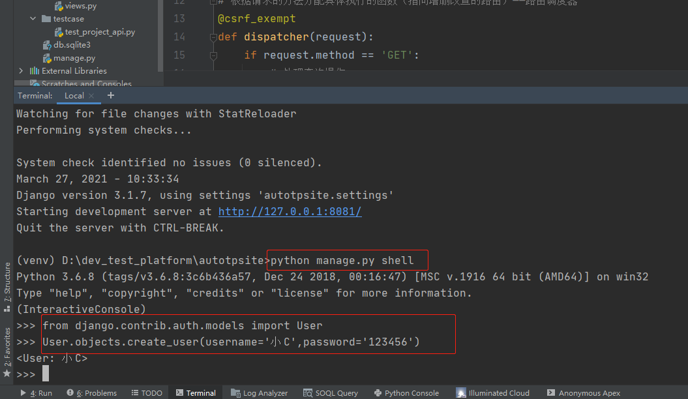
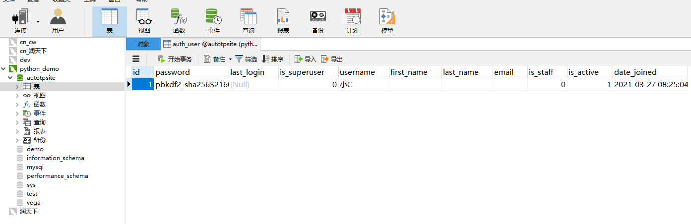
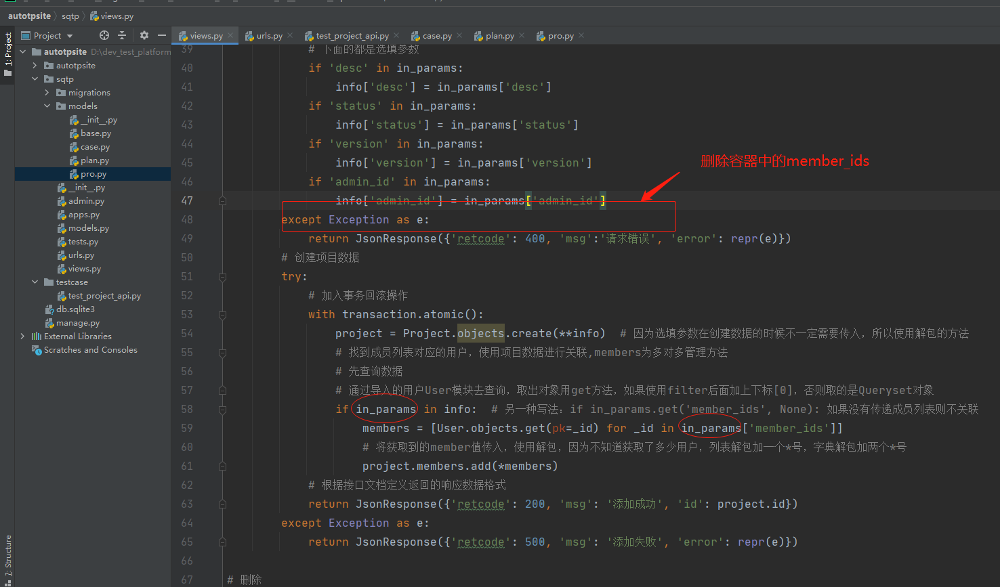
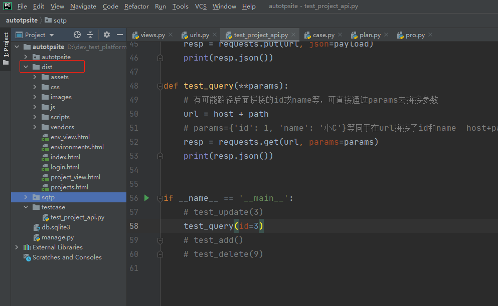
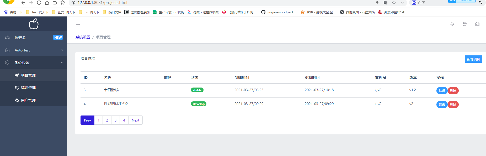

### 动态赋值（python反射）

    * object.__setattr__(属性名,属性值)或setattr(object, 属性名, 属性值)
    * 属性名：string类型
    * 属性值：python对象（任意类型）
    
### 多对多关系清除
    
    * project.members.clear()
    * 模板：数据模型.多对多字段.clear()
    
### 数据对象转字典（处理嵌套响应，自定义响应字段）

    model_to_dict(数据对象, fields=[字段1，字段2，...])
    列如：model_to_dict(project.admin, fields=['id', 'username', 'email', 'first_name'])
    
### 项目修改和查询接口开发

    1、views.py文件定义修改函数update_project()和查询函数query_project()
    
        * 查询接口，注意返回的retlist数据可能包含username、password，所以有些是不需要展示的，需要自定义响应字段
        
    2、路由调度器函数dispatcher()，定义修改、查询的return内容
        
```python
import json
from django.db import transaction
from django.forms import model_to_dict
from django.shortcuts import render
from django.views.decorators.csrf import csrf_exempt

from sqtp.models.pro import Project
from django.http import JsonResponse
from django.contrib.auth.models import User
# Create your views here.


# 根据请求的方法分配具体执行的函数（指向增删改查的路由）——路由调度器
@csrf_exempt
def dispatcher(request):
    if request.method == 'GET':
        # 处理查询操作
        return query_project(request)
    elif request.method == 'POST':
        # 处理新增请求，注意不仅需要执行函数，还要return
        return add_project(request)
    elif request.method == 'PUT':
        # 处理修改操作
        return update_project(request)
    elif request.method == 'DELETE':
        # 处理删除请求
        return delete_project(request)

# 项目接口增删改查
def add_project(request):
    # 如何处理json格式的请求？
    if request.method == 'POST':
        in_params = json.loads(request.body)  # 将传入的请求体内容转换成字典格式
        try:
            # 根据接口文档定义请求参数
            # 创建数据的参数
            info = {}
            info['name'] = in_params['name']  # name是必填参数
            # 下面的都是选填参数
            if 'desc' in in_params:
                info['desc'] = in_params['desc']
            if 'status' in in_params:
                info['status'] = in_params['status']
            if 'version' in in_params:
                info['version'] = in_params['version']
            if 'admin_id' in in_params:
                info['admin_id'] = in_params['admin_id']
            if 'member_ids' in in_params:
                info['member_ids'] = in_params['member_ids']  # 成员id列表在创建项目数据时不能直接传入
        except Exception as e:
            return JsonResponse({'retcode': 400, 'msg':'请求错误', 'error': repr(e)})
        # 创建项目数据
        try:
            # 加入事务回滚操作
            with transaction.atomic():
                project = Project.objects.create(**info)  # 因为选填参数在创建数据的时候不一定需要传入，所以使用解包的方法
                # 找到成员列表对应的用户，使用项目数据进行关联,members为多对多管理方法
                # 先查询数据
                # 通过导入的用户User模块去查询，取出对象用get方法，如果使用filter后面加上下标[0]，否则取的是Queryset对象
                if 'member_ids' in info:  # 另一种写法：if info.get('member_ids',None): 如果没有传递成员列表则不关联
                    members = [User.objects.get(pk=_id) for _id in info['member_ids']]
                    # 将获取到的member值传入，使用解包，因为不知道获取了多少用户，列表解包加一个*号，字典解包加两个*号
                    project.members.add(*members)
            # 根据接口文档定义返回的响应数据格式
            return JsonResponse({'retcode': 200, 'msg': '添加成功', 'id': project.id})
        except Exception as e:
            return JsonResponse({'retcode': 500, 'msg': '添加失败', 'error': repr(e)})

# 删除
def delete_project(request):
    # 需要指定删除，所以需要先获取url中参数id值，例如/api/project/?id=1
    if request.method == 'DELETE':
        _id = request.GET.get('id')
        # 查询需要删除的数据对象
        project = Project.objects.get(pk=_id)
        # 删除项目
        try:
            project.delete()
            return JsonResponse({'retcode': 200, 'msg': '删除成功'})
        except Exception as e:
            return JsonResponse({'retcode': 500, 'msg': '删除失败', 'error': repr(e)})

# 修改
def update_project(request):
    # 获取待修改对象的id
    _id = request.GET.get('id')
    # 获取请求体参数——json格式转换成字典
    in_params = json.loads(request.body)
    # 收集参数容器
    info = {}
    # 选填参数
    if 'name' in in_params:
        info['name'] = in_params['name']
    if 'desc' in in_params:
        info['desc'] = in_params['desc']
    if 'status' in in_params:
        info['status'] = in_params['status']
    if 'version' in in_params:
        info['version'] = in_params['version']
    if 'admin_id' in in_params:
        info['admin_id'] = in_params['admin_id']
    if 'member_ids' in in_params:
        info['member_ids'] = in_params['member_ids']

    # 查询待修改数据
    try:
        project = Project.objects.get(pk=_id)
        # 更新多对多关系，先判断有没有传入member_ids
        if info.get('member_ids'):
            # 更新成员关系（覆盖）
            member_ids = info['member_ids']  # [1, 2, 3]
            # 根据id获取用户数据对象
            member_list = [User.objects.get(pk=id) for id in member_ids]
            # 关联成员之前先清除原有多对多关系（就是数据库表中多对多关系表数据）
            project.members.clear()
            # 关联成员
            project.members.add(*member_list)

        # 更新项目数据：需要动态传参更新，因为非必填参数未必需要传入
        # project.__setattr__('name', info['name'])
        for k,v in info.items():  # 根据入参动态设置属性
            project.__setattr__(k, v)


        project.save()
        return JsonResponse({'retcode': 200, 'msg': '修改成功'})
    except Exception as e:
        return JsonResponse({'retcode': 500, 'msg': '修改失败'})


# 查询
def query_project(request):
    # 获取查询参数
    in_params = request.GET
    # 定义容器收集参数（不可通过传入的参数直接参数，防止测试添加其他任意参数造成安全问题）
    info = {}
    if 'id' in in_params:
        info['id'] = in_params['id']
    if 'name' in in_params:
        info['name'] = in_params['name']
    try:
        retlist = []  # 定义容器收集返回字段内容
        projects = list(Project.objects.filter(**info))
        # 自定义响应字段
        for project in projects:
            item = {}
            item['id'] = project.id
            item['name'] = project.name
            item['status'] = project.status
            item['version'] = project.version
            # 根据接口文档，格式化时间
            item['create_time'] = project.create_time.strftime('%Y-%m-%d/%H:%M')
            item['update_time'] = project.update_time.strftime('%Y-%m-%d/%H:%M')
            # 将admin内容转换成字典(直接将数据对象转换成字典)
            item['admin'] = model_to_dict(project.admin, fields=['id', 'username', 'email', 'first_name'])
            # 查询关联数据信息(项目查模块为反向查询)
            item['modules'] = list(project.module_set.values('id', 'name', 'desc'))
            item['members'] = list(project.members.values('id', 'username', 'email', 'first_name'))
            retlist.append(item)

        return JsonResponse({'retcode': 200, 'msg': '查询正确', 'retlist': retlist})
    except Exception as e:
        return JsonResponse({'retcode': 500, 'msg': '查询错误', 'error': repr(e)})
```
 
    3、testcase——test_project_api.py文件定义修改、查询的测试用例
        * 测试修改用例时，需要先在数据库表auth_user中造数据，不是直接操作数据库
        * 一、Pycharm控制台输入：python manage.py shell
        * 二、导入Django自带User模块创建数据：from django.contrib.auth.models import User
        * 三、再次输入：User.objects.create_user(username='小C',password='123456')即可
        * 四、数据库sqtp_project表中选择需要修改的项目id值：比如3，进行调用测试
        * 五、cmd窗口启动项目，然后启用测试用例
        {'retcode': 200, 'msg': '修改成功'}
        
```python
# coding=utf-8
# @File     : test_project_api.py
# @Time     : 2021/3/25 8:43
# @Author   : jingan
# @Email    : 3028480064@qq.com
# @Software : PyCharm
import requests


host = 'http://127.0.0.1:8081'
path = '/api/project/'

# 新增项目
def test_add():
    url = host + path
    # 请求数据
    payload = {
        'name': '性能测试平台',
    }
    resp = requests.post(url, json=payload)
    print(resp.json())

# 删除
def test_delete():
    url = host + path + '?id=1'
    resp = requests.delete(url)
    print(resp.json())

# 修改
def test_update(_id):
    url = host + path + f'?id={_id}'
    payload = {
        'name': '十日游戏',
        'desc': '悬疑',
        'status': 'stable',
        'version': 'v1.2',
        'admin_id': 1,  # 需要先在数据库表auth_user造用户数据
        'member_ids': [1,2],
    }
    resp = requests.put(url, json=payload)
    print(resp.json())

def test_query(**params):
    # 有可能路径后面拼接的id或name等，可直接通过params去拼接参数
    url = host + path
    # params={'id': 1, 'name': '小C'}等同于在url拼接了id和name  host+path+'?id=1&name=小C'
    resp = requests.get(url, params=params)
    print(resp.json())


if __name__ == '__main__':
    # test_update(3)
    test_query(id=3)

"""
{'retcode': 200, 'msg': '查询正确', 'retlist': [{'id': 3, 'name': '十日游戏', 'status': 'stable', 'version': 'v1.2', 
'create_time': '2021-03-27/03:23', 'update_time': '2021-03-27/08:38', 'admin': {'id': 1, 'username': '小C', 'first_name': '', 
'email': ''}, 'modules': [], 'members': []}]}
"""
```
        




    * test_project_api.py文件测试新增项目test_add()函数的选填参数
      请求数据修改为
      payload = {
        'name': '性能测试平台',
        'desc': '王者荣耀',
        'status': 'develop',
        'version': 'v2',
        'admin_id': 1,
        'member_ids': [1,2]
    }
    
```python
# 新增项目
def test_add():
    url = host + path
    # 请求数据
    payload = {
        'name': '性能测试平台2',
        'desc': '王者荣耀',
        'status': 'develop',
        'version': 'v2',
        'admin_id': 1,
        # 'member_ids': [1,2]
    }
    resp = requests.post(url, json=payload)
    print(resp.json())
```
    * 运行test_add()函数报错:
    {'retcode': 500, 'msg': '添加失败', 'error': 'TypeError("Project() got an unexpected keyword argument \'member_ids\'",)'}
    传入的member_ids导致报错，注释后，再次运行即可
    
    * 原因：创建一个空到项目时是还没有member_ids成员字段的，修改views.py文件中add_project()函数
    
```python
# 项目接口增删改查
def add_project(request):
    # 如何处理json格式的请求？
    if request.method == 'POST':
        in_params = json.loads(request.body)  # 将传入的请求体内容转换成字典格式
        try:
            # 根据接口文档定义请求参数
            # 创建数据的参数
            info = {}
            info['name'] = in_params['name']  # name是必填参数
            # 下面的都是选填参数
            if 'desc' in in_params:
                info['desc'] = in_params['desc']
            if 'status' in in_params:
                info['status'] = in_params['status']
            if 'version' in in_params:
                info['version'] = in_params['version']
            if 'admin_id' in in_params:
                info['admin_id'] = in_params['admin_id']
        except Exception as e:
            return JsonResponse({'retcode': 400, 'msg':'请求错误', 'error': repr(e)})
        # 创建项目数据
        try:
            # 加入事务回滚操作
            with transaction.atomic():
                project = Project.objects.create(**info)  # 因为选填参数在创建数据的时候不一定需要传入，所以使用解包的方法
                # 找到成员列表对应的用户，使用项目数据进行关联,members为多对多管理方法
                # 先查询数据
                # 通过导入的用户User模块去查询，取出对象用get方法，如果使用filter后面加上下标[0]，否则取的是Queryset对象
                if in_params in info:  # 另一种写法：if in_params.get('member_ids', None): 如果没有传递成员列表则不关联
                    members = [User.objects.get(pk=_id) for _id in in_params['member_ids']]
                    # 将获取到的member值传入，使用解包，因为不知道获取了多少用户，列表解包加一个*号，字典解包加两个*号
                    project.members.add(*members)
            # 根据接口文档定义返回的响应数据格式
            return JsonResponse({'retcode': 200, 'msg': '添加成功', 'id': project.id})
        except Exception as e:
            return JsonResponse({'retcode': 500, 'msg': '添加失败', 'error': repr(e)})
```




### 视图代码优化

    目前：入参处理繁琐，重复代码较多
    提取公共项，利用for循环实现该过程
    view.py代码修改如下
    
```python
import json
from django.db import transaction
from django.forms import model_to_dict
from django.shortcuts import render
from django.views.decorators.csrf import csrf_exempt

from sqtp.models.pro import Project
from django.http import JsonResponse
from django.contrib.auth.models import User
# Create your views here.


# 根据请求的方法分配具体执行的函数（指向增删改查的路由）——路由调度器
@csrf_exempt
def dispatcher(request):
    if request.method == 'GET':
        # 处理查询操作
        return query_project(request)
    elif request.method == 'POST':
        # 处理新增请求，注意不仅需要执行函数，还要return
        return add_project(request)
    elif request.method == 'PUT':
        # 处理修改操作
        return update_project(request)
    elif request.method == 'DELETE':
        # 处理删除请求
        return delete_project(request)

# 项目接口增删改查
def add_project(request):
    # 如何处理json格式的请求？
    if request.method == 'POST':
        in_params = json.loads(request.body)  # 将传入的请求体内容转换成字典格式
        try:
            # 根据接口文档定义请求参数
            # 创建数据的参数
            info = {}
            position_keys = ['name']  # 必填参数列表
            # 必填参数判断的是不在in_params中的情况
            for key in position_keys:
                # 如果入参没有必填参数，则返回错误消息
                if key not in in_params:
                    return JsonResponse({'retcode': 400, 'msg': '请求错误', 'error': f'需要参数{key}'})
                info[key] = in_params[key]

            # 下面的都是选填参数
            option_keys = ['desc', 'status', 'version', 'admin_id']
            for key in option_keys:
                # 遍历选填参数列表，如果在入参中有对应的key，则取出对应的值放到容器中
                if key in in_params:
                    info[key] = in_params[key]
        except Exception as e:
            return JsonResponse({'retcode': 400, 'msg':'请求错误', 'error': repr(e)})
        # 创建项目数据
        try:
            # 加入事务回滚操作
            with transaction.atomic():
                project = Project.objects.create(**info)  # 因为选填参数在创建数据的时候不一定需要传入，所以使用解包的方法
                # 找到成员列表对应的用户，使用项目数据进行关联,members为多对多管理方法
                # 先查询数据
                # 通过导入的用户User模块去查询，取出对象用get方法，如果使用filter后面加上下标[0]，否则取的是Queryset对象
                if in_params.get('member_ids', None):  # 如果没有传递成员列表则不关联
                    members = [User.objects.get(pk=_id) for _id in in_params['member_ids']]
                    # 将获取到的member值传入，使用解包，因为不知道获取了多少用户，列表解包加一个*号，字典解包加两个*号
                    project.members.add(*members)
            # 根据接口文档定义返回的响应数据格式
            return JsonResponse({'retcode': 200, 'msg': '添加成功', 'id': project.id})
        except Exception as e:
            return JsonResponse({'retcode': 500, 'msg': '添加失败', 'error': repr(e)})

# 删除
def delete_project(request):
    # 需要指定删除，所以需要先获取url中参数id值，例如/api/project/?id=1
    if request.method == 'DELETE':
        # get请求in_params不从request.body中获取，直接get获取
        in_params = request.GET
        info = {}  # 查询字段的容器
        position_keys = ['id']  # 必填参数列表
        for key in position_keys:
            # 如果入参没有必填参数，则返回错误消息
            if key not in in_params:
                return JsonResponse({'retcode': 400, 'msg': '请求错误', 'error': f'需要参数{key}'})
            info[key] = in_params[key]
        # 删除项目
        try:
            # 获取需要删除的数据对象id
            project = Project.objects.get(**info)
            project.delete()
            return JsonResponse({'retcode': 200, 'msg': '删除成功'})
        except Exception as e:
            return JsonResponse({'retcode': 500, 'msg': '删除失败', 'error': repr(e)})

# 修改
def update_project(request):
    # 获取待修改对象的id
    _id = request.GET.get('id')
    # 获取请求体参数——json格式转换成字典
    in_params = json.loads(request.body)
    # 收集参数容器
    info = {}
    # 选填参数member_ids不用传入列表，因为是通过多对多字段更新的
    option_keys = ['name', 'desc', 'status', 'version', 'admin_id']
    for key in option_keys:
        # 遍历选填参数列表，如果在入参中有对应的key，则取出对应的值放到容器中
        if key in in_params:
            info[key] = in_params[key]

    # 查询待修改数据
    try:
        project = Project.objects.get(pk=_id)
        # 更新多对多关系，先判断有没有传入member_ids
        if in_params.get('member_ids'):
            # 更新成员关系（覆盖）
            member_ids = in_params['member_ids']  # [1, 2, 3]
            # 根据id获取用户数据对象
            member_list = [User.objects.get(pk=id) for id in member_ids]
            # 关联成员之前先清除原有多对多关系（就是数据库表中多对多关系表数据）
            project.members.clear()
            # 关联成员
            project.members.add(*member_list)

        # 更新项目数据：需要动态传参更新，因为非必填参数未必需要传入
        # project.__setattr__('name', info['name'])
        for k,v in info.items():  # 根据入参动态设置属性
            project.__setattr__(k, v)

        project.save()
        return JsonResponse({'retcode': 200, 'msg': '修改成功'})
    except Exception as e:
        return JsonResponse({'retcode': 500, 'msg': '修改失败'})

# 查询
def query_project(request):
    # 获取查询参数
    in_params = request.GET
    # 定义容器收集参数（不可通过传入的参数直接参数，防止测试添加其他任意参数造成安全问题）
    info = {}
    option_keys = ['name', 'id']
    for key in option_keys:
        # 遍历选填参数列表，如果在入参中有对应的key，则取出对应的值放到容器中
        if key in in_params:
            info[key] = in_params[key]
    try:
        retlist = []  # 定义容器收集返回字段内容
        projects = list(Project.objects.filter(**info))
        # 自定义响应字段
        for project in projects:
            item = {}
            item['id'] = project.id
            item['name'] = project.name
            item['status'] = project.status
            item['version'] = project.version
            # 根据接口文档，格式化时间
            item['create_time'] = project.create_time.strftime('%Y-%m-%d/%H:%M')
            item['update_time'] = project.update_time.strftime('%Y-%m-%d/%H:%M')
            # 将admin内容转换成字典(直接将数据对象转换成字典)
            item['admin'] = model_to_dict(project.admin, fields=['id', 'username', 'email', 'first_name'])
            # 查询关联数据信息(项目查模块为反向查询)
            item['modules'] = list(project.module_set.values('id', 'name', 'desc'))
            item['members'] = list(project.members.values('id', 'username', 'email', 'first_name'))
            retlist.append(item)

        return JsonResponse({'retcode': 200, 'msg': '查询正确', 'retlist': retlist})
    except Exception as e:
        return JsonResponse({'retcode': 500, 'msg': '查询错误', 'error': repr(e)})
```

    * test_project_api.py文件进行测试
    
```python
# coding=utf-8
# @File     : test_project_api.py
# @Time     : 2021/3/25 8:43
# @Author   : jingan
# @Email    : 3028480064@qq.com
# @Software : PyCharm
import requests


host = 'http://127.0.0.1:8081'
path = '/api/project/'

# 新增项目
def test_add():
    url = host + path
    # 请求数据
    payload = {
        'name': '安全测试平台2',
        'desc': '王者荣耀',
        'status': 'developing',
        'version': 'v2',
        'admin_id': 1,
        'member_ids': [1]
    }
    resp = requests.post(url, json=payload)
    print(resp.json())

# 删除
def test_delete(_id):
    url = host + path + f'?id={_id}'
    resp = requests.delete(url)
    print(resp.json())

# 修改
def test_update(_id):
    url = host + path + f'?id={_id}'
    payload = {
        'name': '十日游戏',
        'desc': '悬疑',
        'status': 'stable',
        'version': 'v1.2',
        'admin_id': 1,  # 需要先在数据库表auth_user造用户数据
        'member_ids': [1,2],
    }
    resp = requests.put(url, json=payload)
    print(resp.json())

def test_query(**params):
    # 有可能路径后面拼接的id或name等，可直接通过params去拼接参数
    url = host + path
    # params={'id': 1, 'name': '小C'}等同于在url拼接了id和name  host+path+'?id=1&name=小C'
    resp = requests.get(url, params=params)
    print(resp.json())


if __name__ == '__main__':
    # test_update(3)
    test_query(id=3)
    # test_add()
    # test_delete(9)
```

### 前端页面集成

    1、将dist前端集成目录复制到项目autotpsite目录下
    


    2、配置前端文件访问路径
        主路由文件添加：
        * from django.conf.urls.static import static
        * urlpatterns = [
            path('admin/', admin.site.urls),
            path('api/', include(urls)),
          ] + static("/", document_root="dist")
          
       注意：这种只是临时方案，这种方式性能不高，后面运维方面会涉及到ngix部署静态文件
       
```python
from sqtp import urls
from django.contrib import admin
from django.urls import path, include
from django.conf.urls.static import static

urlpatterns = [
    path('admin/', admin.site.urls),
    path('api/', include(urls)),
    # 假设访问地址不是以api开头的，就会选择到static静态文件路径中，静态文件的根目录是dist
    # 如果前端访问了projects路径就会对应动态渲染前端的projects.html文件
]+static("/", document_root="dist")
```

    3、重启服务，载入静态文件
        * 访问127.0.0.1:8081/index.html主页
        


### 根据API文档完成模块增删改查接口开发

    快捷键：shift+table反向缩进代码
    1、views.py文件代码更新如下
    
```python
import json
from django.db import transaction
from django.http import JsonResponse
from django.forms import model_to_dict
from django.contrib.auth.models import User
from django.views.decorators.csrf import csrf_exempt
from sqtp.models.pro import Project, Module, Environment
# Create your views here.


# 根据请求的方法分配具体执行的函数（指向增删改查的路由）——路由调度器
@csrf_exempt
def dispatcher(request):
    if request.method == 'GET':
        # 处理查询操作
        return query_project(request)
    elif request.method == 'POST':
        # 处理新增请求，注意不仅需要执行函数，还要return
        return add_project(request)
    elif request.method == 'PUT':
        # 处理修改操作
        return update_project(request)
    elif request.method == 'DELETE':
        # 处理删除请求
        return delete_project(request)

@csrf_exempt
def dispatcher_module(request):
    if request.method == 'GET':
        # 处理查询操作
        return query_module(request)
    elif request.method == 'POST':
        # 处理新增请求，注意不仅需要执行函数，还要return
        return add_module(request)
    elif request.method == 'PUT':
        # 处理修改操作
        return update_module(request)
    elif request.method == 'DELETE':
        # 处理删除请求
        return delete_module(request)

# 项目接口增删改查
def add_project(request):
    # 如何处理json格式的请求？
    in_params = json.loads(request.body)  # 将传入的请求体内容转换成字典格式
    try:
        # 根据接口文档定义请求参数
        # 创建数据的参数
        info = {}
        position_keys = ['name']  # 必填参数列表
        # 必填参数判断的是不在in_params中的情况
        for key in position_keys:
            # 如果入参没有必填参数，则返回错误消息
            if key not in in_params:
                return JsonResponse({'retcode': 400, 'msg': '请求错误', 'error': f'需要参数{key}'})
            info[key] = in_params[key]

        # 下面的都是选填参数
        option_keys = ['desc', 'status', 'version', 'admin_id']
        for key in option_keys:
            # 遍历选填参数列表，如果在入参中有对应的key，则取出对应的值放到容器中
            if key in in_params:
                info[key] = in_params[key]
    except Exception as e:
        return JsonResponse({'retcode': 400, 'msg':'请求错误', 'error': repr(e)})
    # 创建项目数据
    try:
        # 加入事务回滚操作
        with transaction.atomic():
            project = Project.objects.create(**info)  # 因为选填参数在创建数据的时候不一定需要传入，所以使用解包的方法
            # 找到成员列表对应的用户，使用项目数据进行关联,members为多对多管理方法
            # 先查询数据
            # 通过导入的用户User模块去查询，取出对象用get方法，如果使用filter后面加上下标[0]，否则取的是Queryset对象
            if in_params.get('member_ids', None):  # 如果没有传递成员列表则不关联
                members = [User.objects.get(pk=_id) for _id in in_params['member_ids']]
                # 将获取到的member值传入，使用解包，因为不知道获取了多少用户，列表解包加一个*号，字典解包加两个*号
                project.members.add(*members)
        # 根据接口文档定义返回的响应数据格式
        return JsonResponse({'retcode': 200, 'msg': '添加成功', 'id': project.id})
    except Exception as e:
        return JsonResponse({'retcode': 500, 'msg': '添加失败', 'error': repr(e)})

# 删除
def delete_project(request):
    # 需要指定删除，所以需要先获取url中参数id值，例如/api/project/?id=1
    # get请求in_params不从request.body中获取，直接get获取
    in_params = request.GET
    info = {}  # 查询字段的容器
    position_keys = ['id']  # 必填参数列表
    for key in position_keys:
        # 如果入参没有必填参数，则返回错误消息
        if key not in in_params:
            return JsonResponse({'retcode': 400, 'msg': '请求错误', 'error': f'需要参数{key}'})
        info[key] = in_params[key]
    # 删除项目
    try:
        # 获取需要删除的数据对象id
        project = Project.objects.get(**info)
        project.delete()
        return JsonResponse({'retcode': 200, 'msg': '删除成功'})
    except Exception as e:
        return JsonResponse({'retcode': 500, 'msg': '删除失败', 'error': repr(e)})

# 修改
def update_project(request):
    # 获取待修改对象的id
    _id = request.GET.get('id')
    # 获取请求体参数——json格式转换成字典
    in_params = json.loads(request.body)
    # 收集参数容器
    info = {}
    # 选填参数member_ids不用传入列表，因为是通过多对多字段更新的
    option_keys = ['name', 'desc', 'status', 'version', 'admin_id']
    for key in option_keys:
        # 遍历选填参数列表，如果在入参中有对应的key，则取出对应的值放到容器中
        if key in in_params:
            info[key] = in_params[key]

    # 查询待修改数据
    try:
        project = Project.objects.get(pk=_id)
        # 更新多对多关系，先判断有没有传入member_ids
        if in_params.get('member_ids'):
            # 更新成员关系（覆盖）
            member_ids = in_params['member_ids']  # [1, 2, 3]
            # 根据id获取用户数据对象
            member_list = [User.objects.get(pk=id) for id in member_ids]
            # 关联成员之前先清除原有多对多关系（就是数据库表中多对多关系表数据）
            project.members.clear()
            # 关联成员
            project.members.add(*member_list)

        # 更新项目数据：需要动态传参更新，因为非必填参数未必需要传入
        # project.__setattr__('name', info['name'])
        for k,v in info.items():  # 根据入参动态设置属性
            project.__setattr__(k, v)

        project.save()
        return JsonResponse({'retcode': 200, 'msg': '修改成功'})
    except Exception as e:
        return JsonResponse({'retcode': 500, 'msg': '修改失败'})

# 查询
def query_project(request):
    # 获取查询参数
    in_params = request.GET
    # 定义容器收集参数（不可通过传入的参数直接参数，防止测试添加其他任意参数造成安全问题）
    info = {}
    option_keys = ['name', 'id']
    for key in option_keys:
        # 遍历选填参数列表，如果在入参中有对应的key，则取出对应的值放到容器中
        if key in in_params:
            info[key] = in_params[key]
    try:
        retlist = []  # 定义容器收集返回字段内容
        projects = list(Project.objects.filter(**info))
        # 自定义响应字段
        for project in projects:
            item = {}
            item['id'] = project.id
            item['name'] = project.name
            item['status'] = project.status
            item['version'] = project.version
            # 根据接口文档，格式化时间
            item['create_time'] = project.create_time.strftime('%Y-%m-%d/%H:%M')
            item['update_time'] = project.update_time.strftime('%Y-%m-%d/%H:%M')
            # 将admin内容转换成字典(直接将数据对象转换成字典)
            item['admin'] = model_to_dict(project.admin, fields=['id', 'username', 'email', 'first_name'])
            # 查询关联数据信息(项目查模块为反向查询)
            item['modules'] = list(project.module_set.values('id', 'name', 'desc'))
            item['members'] = list(project.members.values('id', 'username', 'email', 'first_name'))
            retlist.append(item)

        return JsonResponse({'retcode': 200, 'msg': '查询正确', 'retlist': retlist})
    except Exception as e:
        return JsonResponse({'retcode': 500, 'msg': '查询错误', 'error': repr(e)})


# 模块的增删改查
def add_module(request):
    in_params = json.loads(request.body)  # 将传入的请求体内容转换成字典格式
    try:
        # 根据接口文档定义请求参数
        # 创建数据的参数
        info = {}
        position_keys = ['name', 'project_id']  # 必填参数列表
        # 必填参数判断的是不在in_params中的情况
        for key in position_keys:
            # 如果入参没有必填参数，则返回错误消息
            if key not in in_params:
                return JsonResponse({'retcode': 400, 'msg': '请求错误', 'error': f'需要参数{key}'})
            info[key] = in_params[key]

        # 下面的都是选填参数
        option_keys = ['desc',]
        for key in option_keys:
            # 遍历选填参数列表，如果在入参中有对应的key，则取出对应的值放到容器中
            if key in in_params:
                info[key] = in_params[key]
    except Exception as e:
        return JsonResponse({'retcode': 400, 'msg': '请求错误', 'error': repr(e)})
    # 创建模块
    try:
        module = Module.objects.create(**info)  # 因为选填参数在创建数据的时候不一定需要传入，所以使用解包的方法
        # 根据接口文档定义返回的响应数据格式
        return JsonResponse({'retcode': 200, 'msg': '添加成功', 'id': module.id})
    except Exception as e:
        return JsonResponse({'retcode': 500, 'msg': '添加失败', 'error': repr(e)})

def delete_module(request):
    # get请求in_params不从request.body中获取，直接get获取
    in_params = request.GET
    info = {}  # 查询字段的容器
    position_keys = ['id']  # 必填参数列表
    for key in position_keys:
        # 如果入参没有必填参数，则返回错误消息
        if key not in in_params:
            return JsonResponse({'retcode': 400, 'msg': '请求错误', 'error': f'需要参数{key}'})
        info[key] = in_params[key]
    # 删除模块
    try:
        # 获取需要删除的数据对象id
        module = Module.objects.get(**info)
        module.delete()
        return JsonResponse({'retcode': 200, 'msg': '删除成功'})
    except Exception as e:
        return JsonResponse({'retcode': 500, 'msg': '删除失败', 'error': repr(e)})

def update_module(request):
    # 获取待修改对象的id
    _id = request.GET.get('id')
    # 获取请求体参数——json格式转换成字典
    in_params = json.loads(request.body)
    # 收集参数容器
    info = {}
    # 选填参数member_ids不用传入列表，因为是通过多对多字段更新的
    option_keys = ['name', 'desc', 'project_id']
    for key in option_keys:
        # 遍历选填参数列表，如果在入参中有对应的key，则取出对应的值放到容器中
        if key in in_params:
            info[key] = in_params[key]

    # 查询待修改数据
    try:
        module = Module.objects.get(pk=_id)
        # 更新项目数据：需要动态传参更新，因为非必填参数未必需要传入
        # project.__setattr__('name', info['name'])
        for k, v in info.items():  # 根据入参动态设置属性
            module.__setattr__(k, v)
        module.save()
        return JsonResponse({'retcode': 200, 'msg': '修改成功'})
    except Exception as e:
        return JsonResponse({'retcode': 500, 'msg': '修改失败'})

def query_module(request):
    # 获取查询参数
    in_params = request.GET
    # 定义容器收集参数（不可通过传入的参数直接参数，防止测试添加其他任意参数造成安全问题）
    info = {}
    option_keys = ['project_id', 'id']
    for key in option_keys:
        # 遍历选填参数列表，如果在入参中有对应的key，则取出对应的值放到容器中
        if key in in_params:
            info[key] = in_params[key]
    try:
        retlist = []  # 定义容器收集返回字段内容
        modules = list(Module.objects.filter(**info))
        # 自定义响应字段
        for mod in modules:
            item = {}
            item['id'] = mod.id
            item['name'] = mod.name
            item['desc'] = mod.desc
            # 根据接口文档，格式化时间
            item['create_time'] = mod.create_time.strftime('%Y-%m-%d/%H:%M')
            item['update_time'] = mod.update_time.strftime('%Y-%m-%d/%H:%M')
            retlist.append(item)

        return JsonResponse({'retcode': 200, 'msg': '查询正确', 'retlist': retlist})
    except Exception as e:
        return JsonResponse({'retcode': 500, 'msg': '查询错误', 'error': repr(e)})
```

    2、分发路由urls.py文件代码更新如下
    
```python
# coding=utf-8
# @File     : urls.py.py
# @Time     : 2021/3/25 8:48
# @Author   : jingan
# @Email    : 3028480064@qq.com
# @Software : PyCharm
from django.urls import path
from .views import dispatcher, dispatcher_module


urlpatterns = [
    path('project/', dispatcher),   # 项目的增删改查路径
    path('module/', dispatcher_module)  # 模块的增删改查路径
]
```

    3、新增test_module_api.py文件，代码如下
    
```python
# coding=utf-8
# @File     : test_module_api.py
# @Time     : 2021/3/27 18:59
# @Author   : jingan
# @Email    : 3028480064@qq.com
# @Software : PyCharm
import requests


host = 'http://127.0.0.1:8081'
path = '/api/module/'

# 新增项目
def test_add():
    url = host + path
    # 请求数据
    payload = {
        'name': '特斯拉',
        'desc': 'mod1',
        'project_id': 3
    }
    resp = requests.post(url, json=payload)
    print(resp.json())

# 删除
def test_delete(_id):
    url = host + path + f'?id={_id}'
    resp = requests.delete(url)
    print(resp.json())

# 修改
def test_update(_id):
    url = host + path + f'?id={_id}'
    payload = {
        'name': '特斯拉锤子',
        'desc': 'mod3',
        'project_id': 3,
    }
    resp = requests.put(url, json=payload)
    print(resp.json())

def test_query(**params):
    # 有可能路径后面拼接的id或name等，可直接通过params去拼接参数
    url = host + path
    # params={'id': 1, 'name': '小C'}等同于在url拼接了id和name  host+path+'?id=1&name=小C'
    resp = requests.get(url, params=params)
    print(resp.json())


if __name__ == '__main__':
    test_update(2)
    # test_query()
    # test_add()
    # test_delete(1)
```

