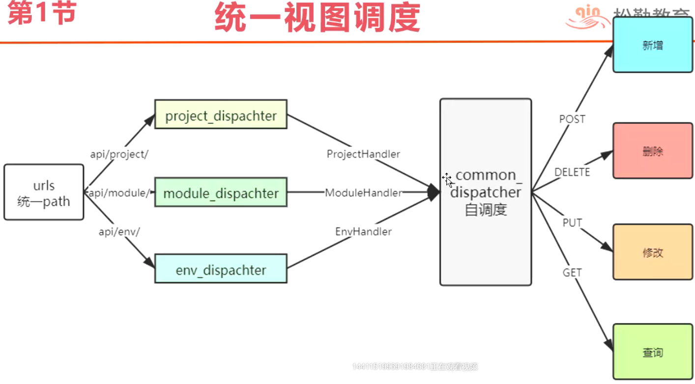

### 优化视图调度

    目前来看，视图路由的代码很相似，作用都差不多，抽取公共项，views.py代码优化如下
    将增删改查视图封装到类，视图方法设置成静态方法，去掉方法名后缀（从类调用）
    


### 查询代码优化

    优化前：
    item['id'] = project.id
    item['name'] = project.name
    item['status'] = project.status
    item['version'] = project.version
    
    优化后：
    item=module_to_dict(project, fields=['id', 'name', 'status', 'version']
    
### bug修改
    
    * 更多多对多关系，传空列表无法清空关系
    * 原因：model_to_dict的对象不能为空

```python
import json
from django.db import transaction
from django.http import JsonResponse
from django.forms import model_to_dict
from django.contrib.auth.models import User
from django.views.decorators.csrf import csrf_exempt
from sqtp.models.pro import Project, Module, Environment
# Create your views here.


# 根据请求的方法分配具体执行的函数（指向增删改查的路由）——路由调度器
@csrf_exempt
def dispatcher_project(request):
    return _common_dispatcher(request, ProjectHandler)

@csrf_exempt
def dispatcher_module(request):
    return _common_dispatcher(request, ModuleHandler)

# 通用视图调度
def _common_dispatcher(request, Handler):
    if request.method == 'GET':
        # 处理查询操作
        return Handler.query(request)
    if request.method == 'POST':
        # 处理新增请求，注意不仅需要执行函数，还要return
        return Handler.add(request)
    if request.method == 'PUT':
        # 处理修改操作
        return Handler.update(request)
    if request.method == 'DELETE':
        # 处理删除请求
        return Handler.delete(request)


class ProjectHandler:


    # 项目接口增删改查
    @staticmethod
    def add(request):
        # 如何处理json格式的请求？
        in_params = json.loads(request.body)  # 将传入的请求体内容转换成字典格式
        try:
            # 根据接口文档定义请求参数
            # 创建数据的参数
            info = {}
            position_keys = ['name']  # 必填参数列表
            # 必填参数判断的是不在in_params中的情况
            for key in position_keys:
                # 如果入参没有必填参数，则返回错误消息
                if key not in in_params:
                    return JsonResponse({'retcode': 400, 'msg': '请求错误', 'error': f'需要参数{key}'})
                info[key] = in_params[key]

            # 下面的都是选填参数
            option_keys = ['desc', 'status', 'version', 'admin_id']
            for key in option_keys:
                # 遍历选填参数列表，如果在入参中有对应的key，则取出对应的值放到容器中
                if key in in_params:
                    info[key] = in_params[key]
        except Exception as e:
            return JsonResponse({'retcode': 400, 'msg':'请求错误', 'error': repr(e)})
        # 创建项目数据
        try:
            # 加入事务回滚操作
            with transaction.atomic():
                project = Project.objects.create(**info)  # 因为选填参数在创建数据的时候不一定需要传入，所以使用解包的方法
                # 找到成员列表对应的用户，使用项目数据进行关联,members为多对多管理方法
                # 先查询数据
                # 通过导入的用户User模块去查询，取出对象用get方法，如果使用filter后面加上下标[0]，否则取的是Queryset对象
                if in_params.get('member_ids', None):  # 如果没有传递成员列表则不关联
                    members = [User.objects.get(pk=_id) for _id in in_params['member_ids']]
                    # 将获取到的member值传入，使用解包，因为不知道获取了多少用户，列表解包加一个*号，字典解包加两个*号
                    project.members.add(*members)
            # 根据接口文档定义返回的响应数据格式
            return JsonResponse({'retcode': 200, 'msg': '添加成功', 'id': project.id})
        except Exception as e:
            return JsonResponse({'retcode': 500, 'msg': '添加失败', 'error': repr(e)})

    # 删除
    @staticmethod
    def delete(request):
        # 需要指定删除，所以需要先获取url中参数id值，例如/api/project/?id=1
        # get请求in_params不从request.body中获取，直接get获取
        in_params = request.GET
        info = {}  # 查询字段的容器
        position_keys = ['id']  # 必填参数列表
        for key in position_keys:
            # 如果入参没有必填参数，则返回错误消息
            if key not in in_params:
                return JsonResponse({'retcode': 400, 'msg': '请求错误', 'error': f'需要参数{key}'})
            info[key] = in_params[key]
        # 删除项目
        try:
            # 获取需要删除的数据对象id
            project = Project.objects.get(**info)
            project.delete()
            return JsonResponse({'retcode': 200, 'msg': '删除成功'})
        except Exception as e:
            return JsonResponse({'retcode': 500, 'msg': '删除失败', 'error': repr(e)})

    # 修改
    @staticmethod
    def update(request):
        # 获取待修改对象的id
        _id = request.GET.get('id')
        # 获取请求体参数——json格式转换成字典
        in_params = json.loads(request.body)
        # 收集参数容器
        info = {}
        # 选填参数member_ids不用传入列表，因为是通过多对多字段更新的
        option_keys = ['name', 'desc', 'status', 'version', 'admin_id']
        for key in option_keys:
            # 遍历选填参数列表，如果在入参中有对应的key，则取出对应的值放到容器中
            if key in in_params:
                info[key] = in_params[key]

        # 查询待修改数据
        try:
            project = Project.objects.get(pk=_id)
            # 更新多对多关系，先判断有没有传入member_ids
            # if in_params.get('member_ids'):   如果member_ids传入的是空列表[]，目前逻辑是没有覆盖的，修改如下
            if 'member_ids' in in_params:
                # 更新成员关系（覆盖）
                member_ids = in_params['member_ids']  # [1, 2, 3]
                # 根据id获取用户数据对象
                member_list = [User.objects.get(pk=id) for id in member_ids]
                # 关联成员之前先清除原有多对多关系（就是数据库表中多对多关系表数据）
                project.members.clear()
                # 关联成员
                project.members.add(*member_list)

            # 更新项目数据：需要动态传参更新，因为非必填参数未必需要传入
            # project.__setattr__('name', info['name'])
            for k,v in info.items():  # 根据入参动态设置属性
                project.__setattr__(k, v)

            project.save()
            return JsonResponse({'retcode': 200, 'msg': '修改成功'})
        except Exception as e:
            return JsonResponse({'retcode': 500, 'msg': '修改失败'})

    # 查询
    @staticmethod
    def query(request):
        # 获取查询参数
        in_params = request.GET
        # 定义容器收集参数（不可通过传入的参数直接参数，防止测试添加其他任意参数造成安全问题）
        info = {}
        option_keys = ['name', 'id']
        for key in option_keys:
            # 遍历选填参数列表，如果在入参中有对应的key，则取出对应的值放到容器中
            if key in in_params:
                info[key] = in_params[key]
        try:
            retlist = []  # 定义容器收集返回字段内容
            projects = list(Project.objects.filter(**info))
            # 自定义响应字段
            for project in projects:
                # 直接取值
                item = model_to_dict(project, fields=['id', 'name', 'status', 'version'])
                # 根据接口文档，格式化时间
                item['create_time'] = project.create_time.strftime('%Y-%m-%d/%H:%M')
                item['update_time'] = project.update_time.strftime('%Y-%m-%d/%H:%M')
                # 将admin内容转换成字典(直接将数据对象转换成字典)
                # 使用了model_to_dict，则传入的admin需要判断，因为传入不能为空
                if project.admin:
                    item['admin'] = model_to_dict(project.admin, fields=['id', 'username', 'email', 'first_name'])
                else:
                    item['admin'] = None
                # 查询关联数据信息(项目查模块为反向查询)
                item['modules'] = list(project.module_set.values('id', 'name', 'desc'))
                item['members'] = list(project.members.values('id', 'username', 'email', 'first_name'))
                retlist.append(item)

            return JsonResponse({'retcode': 200, 'msg': '查询正确', 'retlist': retlist})
        except Exception as e:
            return JsonResponse({'retcode': 500, 'msg': '查询错误', 'error': repr(e)})


class ModuleHandler:


    # 模块的增删改查
    @staticmethod
    def add(request):
        in_params = json.loads(request.body)  # 将传入的请求体内容转换成字典格式
        try:
            # 根据接口文档定义请求参数
            # 创建数据的参数
            info = {}
            position_keys = ['name', 'project_id']  # 必填参数列表
            # 必填参数判断的是不在in_params中的情况
            for key in position_keys:
                # 如果入参没有必填参数，则返回错误消息
                if key not in in_params:
                    return JsonResponse({'retcode': 400, 'msg': '请求错误', 'error': f'需要参数{key}'})
                info[key] = in_params[key]

            # 下面的都是选填参数
            option_keys = ['desc',]
            for key in option_keys:
                # 遍历选填参数列表，如果在入参中有对应的key，则取出对应的值放到容器中
                if key in in_params:
                    info[key] = in_params[key]
        except Exception as e:
            return JsonResponse({'retcode': 400, 'msg': '请求错误', 'error': repr(e)})
        # 创建模块
        try:
            module = Module.objects.create(**info)  # 因为选填参数在创建数据的时候不一定需要传入，所以使用解包的方法
            # 根据接口文档定义返回的响应数据格式
            return JsonResponse({'retcode': 200, 'msg': '添加成功', 'id': module.id})
        except Exception as e:
            return JsonResponse({'retcode': 500, 'msg': '添加失败', 'error': repr(e)})

    @staticmethod
    def delete(request):
        # get请求in_params不从request.body中获取，直接get获取
        in_params = request.GET
        info = {}  # 查询字段的容器
        position_keys = ['id']  # 必填参数列表
        for key in position_keys:
            # 如果入参没有必填参数，则返回错误消息
            if key not in in_params:
                return JsonResponse({'retcode': 400, 'msg': '请求错误', 'error': f'需要参数{key}'})
            info[key] = in_params[key]
        # 删除模块
        try:
            # 获取需要删除的数据对象id
            module = Module.objects.get(**info)
            module.delete()
            return JsonResponse({'retcode': 200, 'msg': '删除成功'})
        except Exception as e:
            return JsonResponse({'retcode': 500, 'msg': '删除失败', 'error': repr(e)})

    @staticmethod
    def update(request):
        # 获取待修改对象的id
        _id = request.GET.get('id')
        # 获取请求体参数——json格式转换成字典
        in_params = json.loads(request.body)
        # 收集参数容器
        info = {}
        # 选填参数member_ids不用传入列表，因为是通过多对多字段更新的
        option_keys = ['name', 'desc', 'project_id']
        for key in option_keys:
            # 遍历选填参数列表，如果在入参中有对应的key，则取出对应的值放到容器中
            if key in in_params:
                info[key] = in_params[key]

        # 查询待修改数据
        try:
            module = Module.objects.get(pk=_id)
            # 更新项目数据：需要动态传参更新，因为非必填参数未必需要传入
            # project.__setattr__('name', info['name'])
            for k, v in info.items():  # 根据入参动态设置属性
                module.__setattr__(k, v)
            module.save()
            return JsonResponse({'retcode': 200, 'msg': '修改成功'})
        except Exception as e:
            return JsonResponse({'retcode': 500, 'msg': '修改失败'})

    @staticmethod
    def query(request):
        # 获取查询参数
        in_params = request.GET
        # 定义容器收集参数（不可通过传入的参数直接参数，防止测试添加其他任意参数造成安全问题）
        info = {}
        option_keys = ['project_id', 'id']
        for key in option_keys:
            # 遍历选填参数列表，如果在入参中有对应的key，则取出对应的值放到容器中
            if key in in_params:
                info[key] = in_params[key]
        try:
            retlist = []  # 定义容器收集返回字段内容
            modules = list(Module.objects.filter(**info))
            # 自定义响应字段
            for mod in modules:
                item = model_to_dict(mod, fields=['id', 'name', 'desc'])
                # 根据接口文档，格式化时间
                item['create_time'] = mod.create_time.strftime('%Y-%m-%d/%H:%M')
                item['update_time'] = mod.update_time.strftime('%Y-%m-%d/%H:%M')
                retlist.append(item)

            return JsonResponse({'retcode': 200, 'msg': '查询正确', 'retlist': retlist})
        except Exception as e:
            return JsonResponse({'retcode': 500, 'msg': '查询错误', 'error': repr(e)})
```

    分发路由urls.py优化
    
```python
from django.urls import path
from .views import dispatcher_project, dispatcher_module


urlpatterns = [
    path('project/', dispatcher_project),   # 项目的增删改查路径
    path('module/', dispatcher_module)  # 模块的增删改查路径
]
```

### 环境接口开发

    1、sqtp目录下创建plugins.py文件，抽取入参处理函数
    
```python
# coding=utf-8
# @File     : plugins.py
# @Time     : 2021/3/28 21:38
# @Author   : jingan
# @Email    : 3028480064@qq.com
# @Software : PyCharm
from django.http import JsonResponse

# 将入参处理独立出来
def info_handler(in_params, position_keys=None, option_keys=None):
    if option_keys is None:
        option_keys = []
    if position_keys is None:
        position_keys = []
    info = {}  # 创建数据的入参
    for key in position_keys:
        # 判断入参如果没有必填参数，就返回错误消息
        if key not in in_params:
            return JsonResponse({'retcode': 400, 'msg': '请求错误', 'error': f'需要参数{key}'})
        info[key] = in_params[key]
    # 接下来是选填参数
    for key in in_params:
        info[key] = in_params[key]
    return info
```

    2、views.py视图文件新增环境接口代码
    
```python
import json
from django.db import transaction
from .plugins import info_handler
from django.http import JsonResponse
from django.forms import model_to_dict
from django.contrib.auth.models import User
from django.views.decorators.csrf import csrf_exempt
from sqtp.models.pro import Project, Module, Environment
# Create your views here.


# 根据请求的方法分配具体执行的函数（指向增删改查的路由）——路由调度器
@csrf_exempt
def dispatcher_project(request):
    return _common_dispatcher(request, ProjectHandler)

@csrf_exempt
def dispatcher_module(request):
    return _common_dispatcher(request, ModuleHandler)

@csrf_exempt
def dispatcher_env(request):
    return _common_dispatcher(request, EnvHandler)

# 通用视图调度
def _common_dispatcher(request, Handler):
    if request.method == 'GET':
        # 处理查询操作
        return Handler.query(request)
    if request.method == 'POST':
        # 处理新增请求，注意不仅需要执行函数，还要return
        return Handler.add(request)
    if request.method == 'PUT':
        # 处理修改操作
        return Handler.update(request)
    if request.method == 'DELETE':
        # 处理删除请求
        return Handler.delete(request)


class ProjectHandler:


    # 项目接口增删改查
    @staticmethod
    def add(request):
        # 如何处理json格式的请求？
        in_params = json.loads(request.body)  # 将传入的请求体内容转换成字典格式
        try:
            position_keys = ['name']  # 必填参数列表
            option_keys = ['desc', 'status', 'version', 'admin_id']  # 选填参数
            info = info_handler(in_params, position_keys, option_keys)

        except Exception as e:
            return JsonResponse({'retcode': 400, 'msg':'请求错误', 'error': repr(e)})
        # 创建项目数据
        try:
            # 加入事务回滚操作
            with transaction.atomic():
                project = Project.objects.create(**info)  # 因为选填参数在创建数据的时候不一定需要传入，所以使用解包的方法
                # 找到成员列表对应的用户，使用项目数据进行关联,members为多对多管理方法
                # 先查询数据
                # 通过导入的用户User模块去查询，取出对象用get方法，如果使用filter后面加上下标[0]，否则取的是Queryset对象
                if in_params.get('member_ids', None):  # 如果没有传递成员列表则不关联
                    members = [User.objects.get(pk=_id) for _id in in_params['member_ids']]
                    # 将获取到的member值传入，使用解包，因为不知道获取了多少用户，列表解包加一个*号，字典解包加两个*号
                    project.members.add(*members)
            # 根据接口文档定义返回的响应数据格式
            return JsonResponse({'retcode': 200, 'msg': '添加成功', 'id': project.id})
        except Exception as e:
            return JsonResponse({'retcode': 500, 'msg': '添加失败', 'error': repr(e)})

    # 删除
    @staticmethod
    def delete(request):
        # 需要指定删除，所以需要先获取url中参数id值，例如/api/project/?id=1
        # get请求in_params不从request.body中获取，直接get获取
        in_params = request.GET
        position_keys = ['id']  # 必填参数列表
        info = info_handler(in_params, position_keys=position_keys)
        # 删除项目
        try:
            # 获取需要删除的数据对象id
            project = Project.objects.get(**info)
            project.delete()
            return JsonResponse({'retcode': 200, 'msg': '删除成功'})
        except Exception as e:
            return JsonResponse({'retcode': 500, 'msg': '删除失败', 'error': repr(e)})

    # 修改
    @staticmethod
    def update(request):
        # 获取待修改对象的id
        _id = request.GET.get('id')
        # 获取请求体参数——json格式转换成字典
        in_params = json.loads(request.body)
        # 选填参数member_ids不用传入列表，因为是通过多对多字段更新的
        option_keys = ['name', 'desc', 'status', 'version', 'admin_id']
        info = info_handler(in_params, option_keys=option_keys)

        # 查询待修改数据
        try:
            project = Project.objects.get(pk=_id)
            # 更新多对多关系，先判断有没有传入member_ids
            # if in_params.get('member_ids'):   如果member_ids传入的是空列表[]，目前逻辑是没有覆盖的，修改如下
            if 'member_ids' in in_params:
                # 更新成员关系（覆盖）
                member_ids = in_params['member_ids']  # [1, 2, 3]
                # 根据id获取用户数据对象
                member_list = [User.objects.get(pk=id) for id in member_ids]
                # 关联成员之前先清除原有多对多关系（就是数据库表中多对多关系表数据）
                project.members.clear()
                # 关联成员
                project.members.add(*member_list)

            # 更新项目数据：需要动态传参更新，因为非必填参数未必需要传入
            # project.__setattr__('name', info['name'])
            for k,v in info.items():  # 根据入参动态设置属性
                project.__setattr__(k, v)

            project.save()
            return JsonResponse({'retcode': 200, 'msg': '修改成功'})
        except Exception as e:
            return JsonResponse({'retcode': 500, 'msg': '修改失败'})

    # 查询
    @staticmethod
    def query(request):
        # 获取查询参数
        in_params = request.GET
        option_keys = ['name', 'id']
        info = info_handler(in_params, option_keys=option_keys)

        try:
            retlist = []  # 定义容器收集返回字段内容
            projects = list(Project.objects.filter(**info))
            # 自定义响应字段
            for project in projects:
                # 直接取值
                item = model_to_dict(project, fields=['id', 'name', 'status', 'version'])
                # 根据接口文档，格式化时间
                item['create_time'] = project.create_time.strftime('%Y-%m-%d/%H:%M')
                item['update_time'] = project.update_time.strftime('%Y-%m-%d/%H:%M')
                # 将admin内容转换成字典(直接将数据对象转换成字典)
                # 使用了model_to_dict，则传入的admin需要判断，因为传入不能为空
                if project.admin:
                    item['admin'] = model_to_dict(project.admin, fields=['id', 'username', 'email', 'first_name'])
                else:
                    item['admin'] = None
                # 查询关联数据信息(项目查模块为反向查询)
                item['modules'] = list(project.module_set.values('id', 'name', 'desc'))
                item['members'] = list(project.members.values('id', 'username', 'email', 'first_name'))
                retlist.append(item)

            return JsonResponse({'retcode': 200, 'msg': '查询正确', 'retlist': retlist})
        except Exception as e:
            return JsonResponse({'retcode': 500, 'msg': '查询错误', 'error': repr(e)})


class ModuleHandler:


    # 模块的增删改查
    @staticmethod
    def add(request):
        in_params = json.loads(request.body)  # 将传入的请求体内容转换成字典格式
        try:
            # 根据接口文档定义请求参数
            position_keys = ['name', 'project_id']  # 必填参数列表
            option_keys = ['desc']  # 选填参数
            info = info_handler(in_params, position_keys, option_keys)

        except Exception as e:
            return JsonResponse({'retcode': 400, 'msg': '请求错误', 'error': repr(e)})
        # 创建模块
        try:
            module = Module.objects.create(**info)  # 因为选填参数在创建数据的时候不一定需要传入，所以使用解包的方法
            # 根据接口文档定义返回的响应数据格式
            return JsonResponse({'retcode': 200, 'msg': '添加成功', 'id': module.id})
        except Exception as e:
            return JsonResponse({'retcode': 500, 'msg': '添加失败', 'error': repr(e)})

    @staticmethod
    def delete(request):
        # get请求in_params不从request.body中获取，直接get获取
        in_params = request.GET
        position_keys = ['id']  # 必填参数列表
        info = info_handler(in_params, position_keys=position_keys)

        # 删除模块
        try:
            # 获取需要删除的数据对象id
            module = Module.objects.get(**info)
            module.delete()
            return JsonResponse({'retcode': 200, 'msg': '删除成功'})
        except Exception as e:
            return JsonResponse({'retcode': 500, 'msg': '删除失败', 'error': repr(e)})

    @staticmethod
    def update(request):
        # 获取待修改对象的id
        _id = request.GET.get('id')
        # 获取请求体参数——json格式转换成字典
        in_params = json.loads(request.body)
        # 选填参数member_ids不用传入列表，因为是通过多对多字段更新的
        option_keys = ['name', 'desc', 'project_id']
        info = info_handler(in_params, option_keys=option_keys)

        # 查询待修改数据
        try:
            module = Module.objects.get(pk=_id)
            # 更新项目数据：需要动态传参更新，因为非必填参数未必需要传入
            # project.__setattr__('name', info['name'])
            for k, v in info.items():  # 根据入参动态设置属性
                module.__setattr__(k, v)
            module.save()
            return JsonResponse({'retcode': 200, 'msg': '修改成功'})
        except Exception as e:
            return JsonResponse({'retcode': 500, 'msg': '修改失败'})

    @staticmethod
    def query(request):
        # 获取查询参数
        in_params = request.GET
        option_keys = ['project_id', 'id']
        info = info_handler(in_params, option_keys=option_keys)

        try:
            retlist = []  # 定义容器收集返回字段内容
            modules = list(Module.objects.filter(**info))
            # 自定义响应字段
            for mod in modules:
                item = model_to_dict(mod, fields=['id', 'name', 'desc'])
                # 根据接口文档，格式化时间
                item['create_time'] = mod.create_time.strftime('%Y-%m-%d/%H:%M')
                item['update_time'] = mod.update_time.strftime('%Y-%m-%d/%H:%M')
                retlist.append(item)

            return JsonResponse({'retcode': 200, 'msg': '查询正确', 'retlist': retlist})
        except Exception as e:
            return JsonResponse({'retcode': 500, 'msg': '查询错误', 'error': repr(e)})

# 环境接口
class EnvHandler:

    @staticmethod
    def add(request):
        in_params = json.loads(request.body)  # 将传入的请求体内容转换成字典格式
        try:
            position_keys = ['project_id', 'ip', 'port']
            option_keys = ['category', 'status', 'os', 'desc']
            info = info_handler(in_params,position_keys,option_keys)
        except Exception as e:
            return JsonResponse({'retcode': 400, 'msg': '请求错误', 'error': repr(e)})
        # 创建模块
        try:
            env = Environment.objects.create(**info)  # 因为选填参数在创建数据的时候不一定需要传入，所以使用解包的方法
            # 根据接口文档定义返回的响应数据格式
            return JsonResponse({'retcode': 200, 'msg': '添加成功', 'id': env.id})
        except Exception as e:
            return JsonResponse({'retcode': 500, 'msg': '添加失败', 'error': repr(e)})

    @staticmethod
    def delete(request):
        # get请求in_params不从request.body中获取，直接get获取
        in_params = request.GET
        position_keys = ['id']  # 必填参数列表
        info = info_handler(in_params, position_keys=position_keys)

        # 删除模块
        try:
            # 获取需要删除的数据对象id
            env = Environment.objects.get(**info)
            env.delete()
            return JsonResponse({'retcode': 200, 'msg': '删除成功'})
        except Exception as e:
            return JsonResponse({'retcode': 500, 'msg': '删除失败', 'error': repr(e)})

    @staticmethod
    def update(request):
        # 获取待修改对象的id
        _id = request.GET.get('id')
        # 获取请求体参数——json格式转换成字典
        in_params = json.loads(request.body)
        # 选填参数member_ids不用传入列表，因为是通过多对多字段更新的
        option_keys = ['desc', 'project_id', 'ip', 'port', 'category', 'os']
        info = info_handler(in_params, option_keys=option_keys)

        # 查询待修改数据
        try:
            env = Environment.objects.get(pk=_id)
            # 更新项目数据：需要动态传参更新，因为非必填参数未必需要传入
            # project.__setattr__('name', info['name'])
            for k, v in info.items():  # 根据入参动态设置属性
                env.__setattr__(k, v)
            env.save()
            return JsonResponse({'retcode': 200, 'msg': '修改成功'})
        except Exception as e:
            return JsonResponse({'retcode': 500, 'msg': '修改失败', 'error': repr(e)})

    @staticmethod
    def query(request):
        # 获取查询参数
        in_params = request.GET
        option_keys = ['project_id', 'id']
        info = info_handler(in_params, option_keys=option_keys)

        try:
            retlist = []  # 定义容器收集返回字段内容
            envs = list(Environment.objects.filter(**info))
            # 自定义响应字段
            for env in envs:
                item = model_to_dict(env, fields=['id', 'ip', 'desc', 'port', 'category', 'os', 'status'])
                item['project'] = model_to_dict(env.project, fields=['id', 'namd', 'desc'])
                # 根据接口文档，格式化时间
                item['create_time'] = env.create_time.strftime('%Y-%m-%d/%H:%M')
                item['update_time'] = env.update_time.strftime('%Y-%m-%d/%H:%M')
                retlist.append(item)

            return JsonResponse({'retcode': 200, 'msg': '查询正确', 'retlist': retlist})
        except Exception as e:
            return JsonResponse({'retcode': 500, 'msg': '查询错误', 'error': repr(e)})
```

    3、urls.py分发路由文件新增环境路由
    
```python
from django.urls import path
from .views import dispatcher_project, dispatcher_module, dispatcher_env


urlpatterns = [
    path('project/', dispatcher_project),   # 项目的增删改查路径
    path('module/', dispatcher_module),  # 模块的增删改查路径
    path('env/', dispatcher_env),  # 环境的增删改查路径
]
```

    4、testcase目录下新建test_env_api.py测试文件
    
```python
# coding=utf-8
# @File     : test_env_api.py
# @Time     : 2021/3/28 22:42
# @Author   : jingan
# @Email    : 3028480064@qq.com
# @Software : PyCharm
import requests


host = 'http://127.0.0.1:8081'
path = '/api/env/'

# 新增项目
def test_add():
    url = host + path
    # 请求数据
    payload = {
        'project_id': 4,
        'ip': '192.168.1.100',
        'port': '8088',
        'category': 1,
        'os': 1,
        'status': 1,
        'desc': '亚马逊'
    }
    resp = requests.post(url, json=payload)
    print(resp.text)

# 删除
def test_delete(_id):
    url = host + path + f'?id={_id}'
    resp = requests.delete(url)
    print(resp.json())

# 修改
def test_update(_id):
    url = host + path + f'?id={_id}'
    payload = {
        'project_id':3,
        'ip':'192.168.1.100',
        'port':8080,
        'category':1,
        'os':1,
        'status':1,
        'desc':'亚马逊ES'
    }
    resp = requests.put(url, json=payload)
    print(resp.json())

def test_query(**params):
    # 有可能路径后面拼接的id或name等，可直接通过params去拼接参数
    url = host + path
    # params={'id': 1, 'name': '小C'}等同于在url拼接了id和name  host+path+'?id=1&name=小C'
    resp = requests.get(url, params=params)
    print(resp.json())


if __name__ == '__main__':
    test_update(1)
    # test_query()
    # test_add()
    # test_delete(9)
```

### 包的形式组织视图

    和模型一样，视图的代码也越来越厚，因此所有接口代码放在1个文件中管理也是不合适的，
    这个时候，我们要设计1下目录结构，然后按照这个目录结构，分配我们的视图代码
    
    1、sqtp项目下创建views包
    包结构：
    views
        -__init__.py
            -xxx_dispatcher
        -mgr.py
            -ProjectHandler
            -ModuleHandler
            -EnvHandler
        -case.py
            -CaseHandler
            -StepHandler
            -HttpApiHandler
            -TagHandler
        -plan.py
            -ResultHandler
            -PlanHandler
            
    2、views包下新建mgr.py文件导入接口函数
    
```python
# coding=utf-8
# @File     : mgr.py
# @Time     : 2021/3/29 7:52
# @Author   : jingan
# @Email    : 3028480064@qq.com
# @Software : PyCharm

import json
from django.db import transaction
from sqtp.plugins import info_handler
from django.http import JsonResponse
from django.forms import model_to_dict
from django.contrib.auth.models import User
from sqtp.models.pro import Project, Module, Environment
# Create your views here.


class ProjectHandler:


    # 项目接口增删改查
    @staticmethod
    def add(request):
        # 如何处理json格式的请求？
        in_params = json.loads(request.body)  # 将传入的请求体内容转换成字典格式
        try:
            position_keys = ['name']  # 必填参数列表
            option_keys = ['desc', 'status', 'version', 'admin_id']  # 选填参数
            info = info_handler(in_params, position_keys, option_keys)

        except Exception as e:
            return JsonResponse({'retcode': 400, 'msg':'请求错误', 'error': repr(e)})
        # 创建项目数据
        try:
            # 加入事务回滚操作
            with transaction.atomic():
                project = Project.objects.create(**info)  # 因为选填参数在创建数据的时候不一定需要传入，所以使用解包的方法
                # 找到成员列表对应的用户，使用项目数据进行关联,members为多对多管理方法
                # 先查询数据
                # 通过导入的用户User模块去查询，取出对象用get方法，如果使用filter后面加上下标[0]，否则取的是Queryset对象
                if in_params.get('member_ids', None):  # 如果没有传递成员列表则不关联
                    members = [User.objects.get(pk=_id) for _id in in_params['member_ids']]
                    # 将获取到的member值传入，使用解包，因为不知道获取了多少用户，列表解包加一个*号，字典解包加两个*号
                    project.members.add(*members)
            # 根据接口文档定义返回的响应数据格式
            return JsonResponse({'retcode': 200, 'msg': '添加成功', 'id': project.id})
        except Exception as e:
            return JsonResponse({'retcode': 500, 'msg': '添加失败', 'error': repr(e)})

    # 删除
    @staticmethod
    def delete(request):
        # 需要指定删除，所以需要先获取url中参数id值，例如/api/project/?id=1
        # get请求in_params不从request.body中获取，直接get获取
        in_params = request.GET
        position_keys = ['id']  # 必填参数列表
        info = info_handler(in_params, position_keys=position_keys)
        # 删除项目
        try:
            # 获取需要删除的数据对象id
            project = Project.objects.get(**info)
            project.delete()
            return JsonResponse({'retcode': 200, 'msg': '删除成功'})
        except Exception as e:
            return JsonResponse({'retcode': 500, 'msg': '删除失败', 'error': repr(e)})

    # 修改
    @staticmethod
    def update(request):
        # 获取待修改对象的id
        _id = request.GET.get('id')
        # 获取请求体参数——json格式转换成字典
        in_params = json.loads(request.body)
        # 选填参数member_ids不用传入列表，因为是通过多对多字段更新的
        option_keys = ['name', 'desc', 'status', 'version', 'admin_id']
        info = info_handler(in_params, option_keys=option_keys)

        # 查询待修改数据
        try:
            project = Project.objects.get(pk=_id)
            # 更新多对多关系，先判断有没有传入member_ids
            # if in_params.get('member_ids'):   如果member_ids传入的是空列表[]，目前逻辑是没有覆盖的，修改如下
            if 'member_ids' in in_params:
                # 更新成员关系（覆盖）
                member_ids = in_params['member_ids']  # [1, 2, 3]
                # 根据id获取用户数据对象
                member_list = [User.objects.get(pk=id) for id in member_ids]
                # 关联成员之前先清除原有多对多关系（就是数据库表中多对多关系表数据）
                project.members.clear()
                # 关联成员
                project.members.add(*member_list)

            # 更新项目数据：需要动态传参更新，因为非必填参数未必需要传入
            # project.__setattr__('name', info['name'])
            for k,v in info.items():  # 根据入参动态设置属性
                project.__setattr__(k, v)

            project.save()
            return JsonResponse({'retcode': 200, 'msg': '修改成功'})
        except Exception as e:
            return JsonResponse({'retcode': 500, 'msg': '修改失败'})

    # 查询
    @staticmethod
    def query(request):
        # 获取查询参数
        in_params = request.GET
        option_keys = ['name', 'id']
        info = info_handler(in_params, option_keys=option_keys)

        try:
            retlist = []  # 定义容器收集返回字段内容
            projects = list(Project.objects.filter(**info))
            # 自定义响应字段
            for project in projects:
                # 直接取值
                item = model_to_dict(project, fields=['id', 'name', 'status', 'version'])
                # 根据接口文档，格式化时间
                item['create_time'] = project.create_time.strftime('%Y-%m-%d/%H:%M')
                item['update_time'] = project.update_time.strftime('%Y-%m-%d/%H:%M')
                # 将admin内容转换成字典(直接将数据对象转换成字典)
                # 使用了model_to_dict，则传入的admin需要判断，因为传入不能为空
                if project.admin:
                    item['admin'] = model_to_dict(project.admin, fields=['id', 'username', 'email', 'first_name'])
                else:
                    item['admin'] = None
                # 查询关联数据信息(项目查模块为反向查询)
                item['modules'] = list(project.module_set.values('id', 'name', 'desc'))
                item['members'] = list(project.members.values('id', 'username', 'email', 'first_name'))
                retlist.append(item)

            return JsonResponse({'retcode': 200, 'msg': '查询正确', 'retlist': retlist})
        except Exception as e:
            return JsonResponse({'retcode': 500, 'msg': '查询错误', 'error': repr(e)})


class ModuleHandler:


    # 模块的增删改查
    @staticmethod
    def add(request):
        in_params = json.loads(request.body)  # 将传入的请求体内容转换成字典格式
        try:
            # 根据接口文档定义请求参数
            position_keys = ['name', 'project_id']  # 必填参数列表
            option_keys = ['desc']  # 选填参数
            info = info_handler(in_params, position_keys, option_keys)

        except Exception as e:
            return JsonResponse({'retcode': 400, 'msg': '请求错误', 'error': repr(e)})
        # 创建模块
        try:
            module = Module.objects.create(**info)  # 因为选填参数在创建数据的时候不一定需要传入，所以使用解包的方法
            # 根据接口文档定义返回的响应数据格式
            return JsonResponse({'retcode': 200, 'msg': '添加成功', 'id': module.id})
        except Exception as e:
            return JsonResponse({'retcode': 500, 'msg': '添加失败', 'error': repr(e)})

    @staticmethod
    def delete(request):
        # get请求in_params不从request.body中获取，直接get获取
        in_params = request.GET
        position_keys = ['id']  # 必填参数列表
        info = info_handler(in_params, position_keys=position_keys)

        # 删除模块
        try:
            # 获取需要删除的数据对象id
            module = Module.objects.get(**info)
            module.delete()
            return JsonResponse({'retcode': 200, 'msg': '删除成功'})
        except Exception as e:
            return JsonResponse({'retcode': 500, 'msg': '删除失败', 'error': repr(e)})

    @staticmethod
    def update(request):
        # 获取待修改对象的id
        _id = request.GET.get('id')
        # 获取请求体参数——json格式转换成字典
        in_params = json.loads(request.body)
        # 选填参数member_ids不用传入列表，因为是通过多对多字段更新的
        option_keys = ['name', 'desc', 'project_id']
        info = info_handler(in_params, option_keys=option_keys)

        # 查询待修改数据
        try:
            module = Module.objects.get(pk=_id)
            # 更新项目数据：需要动态传参更新，因为非必填参数未必需要传入
            # project.__setattr__('name', info['name'])
            for k, v in info.items():  # 根据入参动态设置属性
                module.__setattr__(k, v)
            module.save()
            return JsonResponse({'retcode': 200, 'msg': '修改成功'})
        except Exception as e:
            return JsonResponse({'retcode': 500, 'msg': '修改失败'})

    @staticmethod
    def query(request):
        # 获取查询参数
        in_params = request.GET
        option_keys = ['project_id', 'id']
        info = info_handler(in_params, option_keys=option_keys)

        try:
            retlist = []  # 定义容器收集返回字段内容
            modules = list(Module.objects.filter(**info))
            # 自定义响应字段
            for mod in modules:
                item = model_to_dict(mod, fields=['id', 'name', 'desc'])
                # 根据接口文档，格式化时间
                item['create_time'] = mod.create_time.strftime('%Y-%m-%d/%H:%M')
                item['update_time'] = mod.update_time.strftime('%Y-%m-%d/%H:%M')
                retlist.append(item)

            return JsonResponse({'retcode': 200, 'msg': '查询正确', 'retlist': retlist})
        except Exception as e:
            return JsonResponse({'retcode': 500, 'msg': '查询错误', 'error': repr(e)})

# 环境接口
class EnvHandler:

    @staticmethod
    def add(request):
        in_params = json.loads(request.body)  # 将传入的请求体内容转换成字典格式
        try:
            position_keys = ['project_id', 'ip', 'port']
            option_keys = ['category', 'status', 'os', 'desc']
            info = info_handler(in_params,position_keys,option_keys)
        except Exception as e:
            return JsonResponse({'retcode': 400, 'msg': '请求错误', 'error': repr(e)})
        # 创建模块
        try:
            env = Environment.objects.create(**info)  # 因为选填参数在创建数据的时候不一定需要传入，所以使用解包的方法
            # 根据接口文档定义返回的响应数据格式
            return JsonResponse({'retcode': 200, 'msg': '添加成功', 'id': env.id})
        except Exception as e:
            return JsonResponse({'retcode': 500, 'msg': '添加失败', 'error': repr(e)})

    @staticmethod
    def delete(request):
        # get请求in_params不从request.body中获取，直接get获取
        in_params = request.GET
        position_keys = ['id']  # 必填参数列表
        info = info_handler(in_params, position_keys=position_keys)

        # 删除模块
        try:
            # 获取需要删除的数据对象id
            env = Environment.objects.get(**info)
            env.delete()
            return JsonResponse({'retcode': 200, 'msg': '删除成功'})
        except Exception as e:
            return JsonResponse({'retcode': 500, 'msg': '删除失败', 'error': repr(e)})

    @staticmethod
    def update(request):
        # 获取待修改对象的id
        _id = request.GET.get('id')
        # 获取请求体参数——json格式转换成字典
        in_params = json.loads(request.body)
        # 选填参数member_ids不用传入列表，因为是通过多对多字段更新的
        option_keys = ['desc', 'project_id', 'ip', 'port', 'category', 'os']
        info = info_handler(in_params, option_keys=option_keys)

        # 查询待修改数据
        try:
            env = Environment.objects.get(pk=_id)
            # 更新项目数据：需要动态传参更新，因为非必填参数未必需要传入
            # project.__setattr__('name', info['name'])
            for k, v in info.items():  # 根据入参动态设置属性
                env.__setattr__(k, v)
            env.save()
            return JsonResponse({'retcode': 200, 'msg': '修改成功'})
        except Exception as e:
            return JsonResponse({'retcode': 500, 'msg': '修改失败', 'error': repr(e)})

    @staticmethod
    def query(request):
        # 获取查询参数
        in_params = request.GET
        option_keys = ['project_id', 'id']
        info = info_handler(in_params, option_keys=option_keys)

        try:
            retlist = []  # 定义容器收集返回字段内容
            envs = list(Environment.objects.filter(**info))
            # 自定义响应字段
            for env in envs:
                item = model_to_dict(env, fields=['id', 'ip', 'desc', 'port', 'category', 'os', 'status'])
                item['project'] = model_to_dict(env.project, fields=['id', 'namd', 'desc'])
                # 根据接口文档，格式化时间
                item['create_time'] = env.create_time.strftime('%Y-%m-%d/%H:%M')
                item['update_time'] = env.update_time.strftime('%Y-%m-%d/%H:%M')
                retlist.append(item)

            return JsonResponse({'retcode': 200, 'msg': '查询正确', 'retlist': retlist})
        except Exception as e:
            return JsonResponse({'retcode': 500, 'msg': '查询错误', 'error': repr(e)})
```

    3、views包下的__init__.py文件导入视图函数
    
```python
# coding=utf-8
# @File     : __init__.py.py
# @Time     : 2021/3/29 7:51
# @Author   : jingan
# @Email    : 3028480064@qq.com
# @Software : PyCharm
from django.views.decorators.csrf import csrf_exempt
from .mgr import ProjectHandler, ModuleHandler, EnvHandler


# 根据请求的方法分配具体执行的函数（指向增删改查的路由）——路由调度器
@csrf_exempt
def dispatcher_project(request):
    return _common_dispatcher(request, ProjectHandler)

@csrf_exempt
def dispatcher_module(request):
    return _common_dispatcher(request, ModuleHandler)

@csrf_exempt
def dispatcher_env(request):
    return _common_dispatcher(request, EnvHandler)

# 通用视图调度
def _common_dispatcher(request, Handler):
    if request.method == 'GET':
        # 处理查询操作
        return Handler.query(request)
    if request.method == 'POST':
        # 处理新增请求，注意不仅需要执行函数，还要return
        return Handler.add(request)
    if request.method == 'PUT':
        # 处理修改操作
        return Handler.update(request)
    if request.method == 'DELETE':
        # 处理删除请求
        return Handler.delete(request)
```

### plugins.py文件中优化新增接口函数

    1、plugins.py代码更新如下
    
```python
# coding=utf-8
# @File     : plugins.py
# @Time     : 2021/3/28 21:38
# @Author   : jingan
# @Email    : 3028480064@qq.com
# @Software : PyCharm
import json

from django.db import transaction
from django.http import JsonResponse
from sqtp.models.case import Tag, Case
from django.contrib.auth.models import User

# 将入参处理独立出来
def info_handler(in_params, position_keys=None, option_keys=None):
    if option_keys is None:
        option_keys = []
    if position_keys is None:
        position_keys = []
    info = {}  # 创建数据的入参
    for key in position_keys:
        # 判断入参如果没有必填参数，就返回错误消息
        if key not in in_params:
            return JsonResponse({'retcode': 400, 'msg': '请求错误', 'error': f'需要参数{key}'})
        info[key] = in_params[key]
    # 接下来是选填参数
    for key in option_keys:
        info[key] = in_params[key]
    return info

# 多对多关系字典——业务相关
M2M_dict = {
    'member_ids': User,
    'tag_ids': Tag,
    'case_ids': Case,
}
def handler_add(request, position_keys, option_keys, ModelHandler):
    in_params = json.loads(request.body)
    info = info_handler(in_params, position_keys, option_keys)

    # 创建项目
    try:
        with transaction.atomic():
            mod_obj = ModelHandler.objects.create(**info)

            # 约定以_ids为结尾的参数，且数据类型是list，那么就进行多对多关联
            for key in in_params:
                if key.endswith('_ids') and isinstance(in_params[key], list):
                    # 多对多关联
                    M = M2M_dict[key]  # 从自定义的多对多关系字典找到映射的模型
                    # 根据模型取出对应的数据
                    objs = [M.objects.get(pk=_id) for _id in in_params[key]]
                    # 根据模型对象进行关联
                    m2m_field_name = key.split('_')[0] + 's'
                    # 利用python反射获取对象属性
                    m2m_field = getattr(mod_obj, m2m_field_name)
                    m2m_field.add(*objs)

        return JsonResponse({'retcode': 200, 'msg': '添加成功', 'id': mod_obj.id})
    except Exception as e:
        return JsonResponse({'retcode': 500, 'msg': '添加失败', 'error': repr(e)})
```

    2、ProjectHandler类中的add函数优化如下
    
```python
class ProjectHandler:


    # 项目接口增删改查
    @staticmethod
    def add(request):
        position_keys = ['name']  # 必填参数列表
        option_keys = ['desc', 'status', 'version', 'admin_id']  # 选填参数
        return handler_add(request, position_keys, option_keys, Project)
```


    