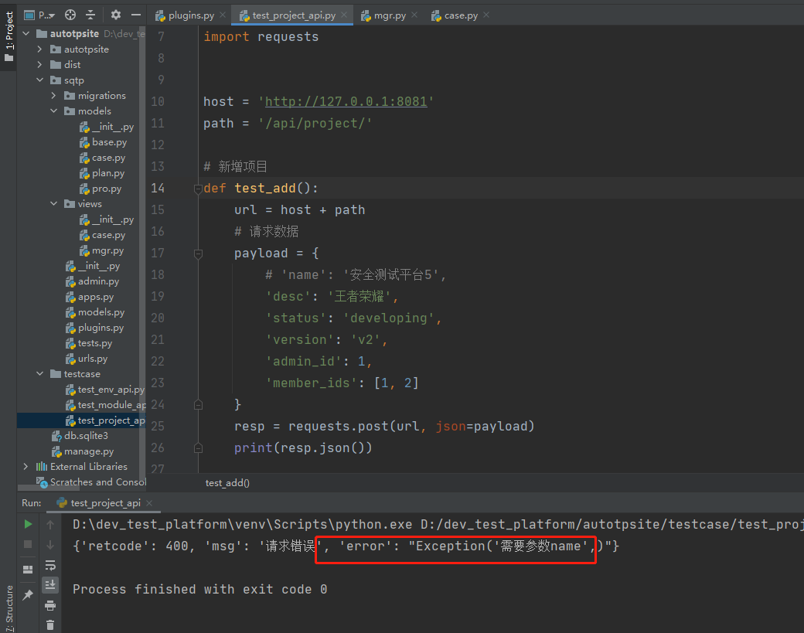
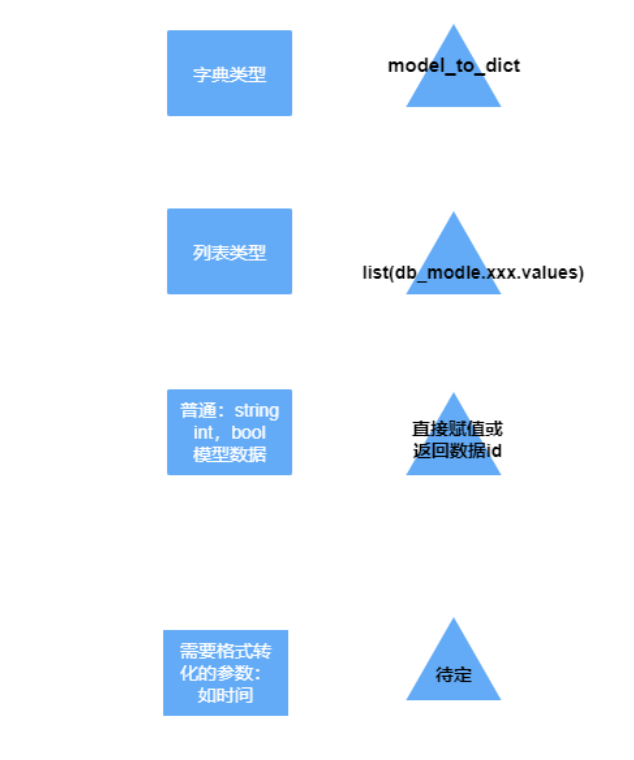

### 测试代码
    
    发现必填参数不填会报错，原因在于plugin.py文件中的info_handler函数未返回报错信息
    方法一：info_handler函数中抛出异常，handler_add函数返回提示内容
    plugin.py文件代码修改如下
    
```python
# coding=utf-8
# @File     : plugins.py
# @Time     : 2021/3/28 21:38
# @Author   : jingan
# @Email    : 3028480064@qq.com
# @Software : PyCharm
import json

from django.db import transaction
from django.http import JsonResponse
from sqtp.models.case import Tag, Case
from django.contrib.auth.models import User

# 将入参处理独立出来
def info_handler(in_params, position_keys=None, option_keys=None):
    if option_keys is None:
        option_keys = []
    if position_keys is None:
        position_keys = []
    info = {}  # 创建数据的入参
    for key in position_keys:
        # 判断入参如果没有必填参数，就返回错误消息
        if key not in in_params:
            raise Exception(f'需要参数{key}')
            # return JsonResponse({'retcode': 400, 'msg': '请求错误', 'error': f'需要参数{key}'})
        info[key] = in_params[key]
    # 接下来是选填参数
    for key in option_keys:
        info[key] = in_params[key]
    return info

# 多对多关系字典——业务相关
M2M_dict = {
    'member_ids': User,
    'tag_ids': Tag,
    'case_ids': Case,
}
def handler_add(request, position_keys, option_keys, ModelHandler):
    in_params = json.loads(request.body)
    try:
        info = info_handler(in_params, position_keys, option_keys)
    except Exception as e:
        return JsonResponse({'retcode': 400, 'msg': '请求错误', 'error': repr(e)})
    # 创建项目
    try:
        with transaction.atomic():
            mod_obj = ModelHandler.objects.create(**info)

            # 约定以_ids为结尾的参数，且数据类型是list，那么就进行多对多关联
            for key in in_params:
                if key.endswith('_ids') and isinstance(in_params[key], list):
                    # 多对多关联
                    M = M2M_dict[key]  # 从自定义的多对多关系字典找到映射的模型
                    # 根据模型取出对应的数据
                    objs = [M.objects.get(pk=_id) for _id in in_params[key]]
                    # 根据模型对象进行关联
                    m2m_field_name = key.split('_')[0] + 's'
                    # 利用python反射获取对象属性
                    m2m_field = getattr(mod_obj, m2m_field_name)
                    m2m_field.add(*objs)

        return JsonResponse({'retcode': 200, 'msg': '添加成功', 'id': mod_obj.id})
    except Exception as e:
        return JsonResponse({'retcode': 500, 'msg': '添加失败', 'error': repr(e)})
```
    test_project_api.py文件中test_add函数中注释必填参数name进行测试
    


    方法二：直接判断info是否是字典，如果不是就返回抛出返回的JsonResponse
    
```python
# coding=utf-8
# @File     : plugins.py
# @Time     : 2021/3/28 21:38
# @Author   : jingan
# @Email    : 3028480064@qq.com
# @Software : PyCharm
import json

from django.db import transaction
from django.http import JsonResponse
from sqtp.models.case import Tag, Case
from django.contrib.auth.models import User

# 将入参处理独立出来
def info_handler(in_params, position_keys=None, option_keys=None):
    if option_keys is None:
        option_keys = []
    if position_keys is None:
        position_keys = []
    info = {}  # 创建数据的入参
    for key in position_keys:
        # 判断入参如果没有必填参数，就返回错误消息
        if key not in in_params:
            # raise Exception(f'需要参数{key}')
            return JsonResponse({'retcode': 400, 'msg': '请求错误', 'error': f'需要参数{key}'})
        info[key] = in_params[key]
    # 接下来是选填参数
    for key in option_keys:
        info[key] = in_params[key]
    return info

# 多对多关系字典——业务相关
M2M_dict = {
    'member_ids': User,
    'tag_ids': Tag,
    'case_ids': Case,
}
def handler_add(request, position_keys, option_keys, ModelHandler):
    in_params = json.loads(request.body)
    info = info_handler(in_params, position_keys, option_keys)
    if not isinstance(info, dict):  # 如果不是字典则返回抛出的JsonResponse
        return info

    # 创建项目
    try:
        with transaction.atomic():
            mod_obj = ModelHandler.objects.create(**info)

            # 约定以_ids为结尾的参数，且数据类型是list，那么就进行多对多关联
            for key in in_params:
                if key.endswith('_ids') and isinstance(in_params[key], list):
                    # 多对多关联
                    M = M2M_dict[key]  # 从自定义的多对多关系字典找到映射的模型
                    # 根据模型取出对应的数据
                    objs = [M.objects.get(pk=_id) for _id in in_params[key]]
                    # 根据模型对象进行关联
                    m2m_field_name = key.split('_')[0] + 's'
                    # 利用python反射获取对象属性
                    m2m_field = getattr(mod_obj, m2m_field_name)
                    m2m_field.add(*objs)

        return JsonResponse({'retcode': 200, 'msg': '添加成功', 'id': mod_obj.id})
    except Exception as e:
        return JsonResponse({'retcode': 500, 'msg': '添加失败', 'error': repr(e)})
```

### 通用视图构造布局

    1、views下新建handlers.py文件
        定义一个类CommonView，封装增删改查通用视图
        类下定义四个方法：增operate_add；删除operate_delete；改operate_update；查operate_query
        变量：db_model数据模型；mod_obj模型数据对象

```python
# coding=utf-8
# @File     : handler.py
# @Time     : 2021/4/6 20:07
# @Author   : jingan
# @Email    : 3028480064@qq.com
# @Software : PyCharm
import json
from django.db import transaction
from django.http import JsonResponse
from sqtp.models.case import Tag, Case
from django.contrib.auth.models import User
from sqtp.plugins import info_handler, read_yml, filter_query

# 多对多关系字典——业务相关
M2M_dict = {
    'member_ids': User,
    'tag_ids': Tag,
    'case_ids': Case,
}


class CommonView:


    @staticmethod
    def operate_add(request, position_keys, option_keys, db_model):
        # 如何处理json格式的请求？
        in_params = json.loads(request.body)  # 入参in_params==字典
        info = info_handler(in_params, position_keys, option_keys)
        if not isinstance(info, dict):  # info如果不是字典，说明触发了异常被赋值成了JsonResponse
            return info

        # 创建项目
        try:
            with transaction.atomic():  # 数据库事务
                mod_obj = db_model.objects.create(**info)

                # 约定以_ids为结尾的参数，且数据类型是list，那么就进行多对多关联
                for key in in_params:
                    if key.endswith('_ids') and isinstance(in_params[key], list):
                        # 多对多关联
                        M = M2M_dict[key]  # 从自定义的多对多关系字典找到映射的模型
                        # 根据模型取出对应的数据
                        objs = [M.objects.get(pk=_id) for _id in in_params[key]]
                        # 根据模型对象进行关联
                        m2m_field_name = key.split('_')[0] + 's'
                        # 利用python反射获取对象属性
                        m2m_field = getattr(mod_obj, m2m_field_name)
                        m2m_field.add(*objs)

            return JsonResponse({'retcode': 200, 'msg': '添加成功', 'id': mod_obj.id})
        except Exception as e:
            return JsonResponse({'retcode': 500, 'msg': '添加失败', 'error': repr(e)})

    @staticmethod
    def operate_delete(request, db_model):
        in_params = request.GET
        position_keys = ['id']  # 必填参数列表
        info = info_handler(in_params, position_keys=position_keys)
        # 删除项目
        try:
            # 获取需要删除的数据对象id
            mod_obj = db_model.objects.get(**info)
            mod_obj.delete()
            return JsonResponse({'retcode': 200, 'msg': '删除成功'})
        except Exception as e:
            return JsonResponse({'retcode': 500, 'msg': '删除失败', 'error': repr(e)})

    @staticmethod
    def operate_update(request, option_keys, db_model):
        # 获取待修改对象的id
        _id = request.GET.get('id')
        # 获取请求体参数——json格式转换成字典
        in_params = json.loads(request.body)
        # 选填参数member_ids不用传入列表，因为是通过多对多字段更新的
        info = info_handler(in_params, option_keys=option_keys)

        # 查询待修改数据
        try:
            mod_obj = db_model.objects.get(pk=_id)
            # 更新多对多关系，先判断有没有传入member_ids
            # 约定 以_ids结尾的参数，且数据类型是list,那么就进行多对多关联
            for key in in_params:
                if key.endswith('_ids') and isinstance(in_params[key], list):
                    # 多对多关联
                    M=M2M_dict[key] # 从自定义多对多关系字典找到映射的模型
                    # 根据模型取出对应的数据
                    objs = [M.objects.get(pk=_id) for _id in in_params[key]]
                    # 模型数据对象进行关联
                    m2m_field_name = key.split('_')[0] + 's'
                    # 利用python反射获取对象属性---多对多管理器
                    m2m_field = getattr(mod_obj, m2m_field_name)
                    # 清除原有关系--多对多
                    m2m_field.clear()
                    # 重新关联成员
                    m2m_field.add(*objs)

            # 更新项目数据：需要动态传参更新，因为非必填参数未必需要传入
            # project.__setattr__('name', info['name'])
            for k, v in info.items():  # 根据入参动态设置属性
                mod_obj.__setattr__(k, v)

            mod_obj.save()
            return JsonResponse({'retcode': 200, 'msg': '修改成功'})
        except Exception as e:
            return JsonResponse({'retcode': 500, 'msg': '修改失败', 'error': repr(e)})

    @staticmethod
    def operate_query(request, option_keys, db_model):
        # 获取查询参数
        in_params = request.GET
        info = info_handler(in_params, option_keys=option_keys)

        try:
            retlist = []  # 定义容器收集返回字段内容
            # projects = list(Project.objects.filter(**info))
            query_list = db_model.objects.filter(**info)
            # 自定义响应字段
            for query_obj in query_list:
                # 根据响应模板（yml文件）判断响应参数类型，从而做具体处理
                # read_yml('sqtp/query_resp_temp.yml')读取的是整个yml文件，需要加上[db_model.__name__]相当于返回models包中class类中类名
                resp_tmp = read_yml('sqtp/query_resp_temp.yml')[db_model.__name__]
                item = filter_query(resp_tmp, query_obj)
                retlist.append(item)

            return JsonResponse({'retcode': 200, 'msg': '查询正确', 'retlist': retlist})
        except Exception as e:
            return JsonResponse({'retcode': 500, 'msg': '查询错误', 'error': repr(e)})
```        
        
    2、views.py——>case.py调用上面封装的通用视图
    
```python
# coding=utf-8
# @File     : case.py.py
# @Time     : 2021/3/29 8:04
# @Author   : jingan
# @Email    : 3028480064@qq.com
# @Software : PyCharm
import json
from django.db import transaction
from sqtp.plugins import info_handler
from django.http import JsonResponse
from django.forms import model_to_dict
from django.contrib.auth.models import User
from sqtp.models.case import Case
from .handler import CommonView


# 用例
class CaseHandler:

    @staticmethod
    def add(request):
        position_keys = ['desc', 'module_id']  # 必填参数
        option_keys = ['status', 'tag_ids']  # 选填参数
        return CommonView.operate_add(request,position_keys=position_keys, option_keys=option_keys, db_model=Case)

    @staticmethod
    def delete(request):
        return CommonView.operate_delete(request, Case)

    @staticmethod
    def update(request):
        option_keys = ['desc','status','module_id','tag_ids']
        return CommonView.operate_update(request, option_keys=[], db_model=Case)

    @staticmethod
    def query(request):
        option_keys = ['id','module_id']
        return CommonView.operate_query(request, option_keys, db_model=Case)
```
    
    3、views.py——>__init__.py文件定义Case的路由调度器
    
```python
# coding=utf-8
# @File     : __init__.py.py
# @Time     : 2021/3/29 7:51
# @Author   : jingan
# @Email    : 3028480064@qq.com
# @Software : PyCharm
from django.views.decorators.csrf import csrf_exempt
from .case import CaseHandler
from .mgr import ProjectHandler, ModuleHandler, EnvHandler


# 根据请求的方法分配具体执行的函数（指向增删改查的路由）——路由调度器
@csrf_exempt
def dispatcher_project(request):
    return _common_dispatcher(request, ProjectHandler)

@csrf_exempt
def dispatcher_module(request):
    return _common_dispatcher(request, ModuleHandler)

@csrf_exempt
def dispatcher_case(request):
    return _common_dispatcher(request, CaseHandler)

@csrf_exempt
def dispatcher_env(request):
    return _common_dispatcher(request, EnvHandler)

# 通用视图调度
def _common_dispatcher(request, Handler):
    if request.method == 'GET':
        # 处理查询操作
        return Handler.query(request)
    if request.method == 'POST':
        # 处理新增请求，注意不仅需要执行函数，还要return
        return Handler.add(request)
    if request.method == 'PUT':
        # 处理修改操作
        return Handler.update(request)
    if request.method == 'DELETE':
        # 处理删除请求
        return Handler.delete(request)
```
    
    4、sqtp——>urls.py文件设置路由
    
```python
# coding=utf-8
# @File     : urls.py.py
# @Time     : 2021/3/25 8:48
# @Author   : jingan
# @Email    : 3028480064@qq.com
# @Software : PyCharm
from django.urls import path
from .views import dispatcher_project, dispatcher_module, dispatcher_env, dispatcher_case


urlpatterns = [
    path('project/', dispatcher_project),   # 项目的增删改查路径
    path('module/', dispatcher_module),  # 模块的增删改查路径
    path('env/', dispatcher_env),  # 环境的增删改查路径
    path('case/', dispatcher_case),  # 用例的增删改查路径
]
```
    
    5、testcase——>创建test_case_api.py文件进行测试
    
```python
# coding=utf-8
# @File     : test_case_api.py.py
# @Time     : 2021/4/6 21:17
# @Author   : jingan
# @Email    : 3028480064@qq.com
# @Software : PyCharm
import requests

host = 'http://127.0.0.1:8081'
path = '/api/case/'

# 新增项目
def test_add():
    url = host+path
    # 请求数据
    payload = {
        'desc':'密码测试',
        'module_id':2,
        'status':True,
        'tag_ids':[1, 2],
    }
    resp = requests.post(url,json=payload)
    print(resp.json())

# 删除
def test_delete(_id):
    url = host+path+f'?id={_id}'
    resp = requests.delete(url)
    print(resp.json())

# 修改
def test_update(_id):
    url = host+path+f'?id={_id}'
    payload={
        'desc':'空密码测试',
        'module_id':2,
        'status':True,
        'tag_ids':[1],
    }
    resp = requests.put(url,json=payload)
    print(resp.json())

# 查询
def test_query(**params):  # id=xxx,name=xxx
    url = host + path
    resp = requests.get(url, params=params)  # {}
    print(resp.json())

if __name__ == '__main__':
    test_add()
    # test_delete(20)
    # test_update(1)
    # test_query()
```
    
### 查询自定义响应字段规律



    比如说接口文档中自定义字段retlist值是字典则要用model_to_dict，如果是列表则使用list(db_modle.xxx.values)
    
    1、在sqtp下新建query_resp_temp.yml文件
        * 里面定义接口的响应模板
        
```yaml
Project:
  {
    "retcode": 200,
    "msg": "\u67e5\u8be2\u6210\u529f",
    "retlist": [
      {
        "id": 28,
        "name": "\u81ea\u52a8\u5316\u5e73\u53f017",
        "status": "developing",
        "version": "v8",
        "create_time": "2021-03-27/14:17",
        "update_time": "2021-03-27/14:17",
        "admin": {
          "id": 1,
          "username": "\u5c0f\u660e",
          "first_name": "",
          "email": ""
        },
        "modules": [
          {
            "id": 4,
            "name": "\u7279\u65af\u62c9",
            "desc": "mod3"
          }
        ],
        "members": [
          {
            "id": 1,
            "username": "\u5c0f\u660e",
            "email": "",
            "first_name": ""
          },
          {
            "id": 2,
            "username": "\u5c0fC",
            "email": "",
            "first_name": ""
          }
        ]
      }
    ]
  }

Module:
  {
    "retcode": 200,
    "msg": "查询成功",
    "retlist": [
      {
        "id": 2,
        "desc": "mod1",
        "name": "测试模块1",
        "create_time": "2021-03-25/10:31",
        "update_time": "2021-03-25/10:35"
      }
    ]
  }

Environment:
  {
    "retcode": 200,
    "msg": "\u67e5\u8be2\u6210\u529f",
    "retlist": [
      {
        "id": 3,
        "desc": "\u4e9a\u9a6c\u900a",
        "ip": "192.168.1.100",
        "port": 8080,
        "category": 2,
        "os": 2,
        "status": 2,
        "project": {
          "id": 16,
          "desc": "\u786c\u6838\u624b\u6e38",
          "name": "\u81ea\u52a8\u5316\u5e73\u53f03"
        },
        "create_time": "2021-03-27/13:02",
        "update_time": "2021-03-27/13:04"
      }
    ]
  }

Case:
  {
    "retcode": 200,
    "msg": "\u67e5\u8be2\u6210\u529f",
    "retlist": [
      {
        "id": 1,
        "desc": "\u7a7a\u5bc6\u7801\u6d4b\u8bd5",
        "status": true,
        "create_time": "2021-03-27/06:59",
        "update_time": "2021-03-30/10:07",
        "module": {
          "id": 2,
          "desc": "mod1",
          "project": 16,
          "name": "\u6d4b\u8bd5\u6a21\u57571"
        },
        "steps": [
          {
            "id": 4,
            "desc": "test",
            "expected": "1",
            "httpapi": 1,
            "step_no": 1
          },
          {
            "id": 5,
            "desc": "test",
            "expected": "1",
            "httpapi": 1,
            "step_no": 1
          },
        ],
        "tags": [
          {
            "name": "smoke_test"
          }
        ]
      }
    ]
  }

Step:
  {
    'retcode': 200,
    'msg': '查询成功',
    'retlist': [
      {
        'id': 1,
        'desc': 'mm1',
        'expected': '123',
        'step_no': 1,
        'httpapi': 2,
        'create_time': '2021-03-27/06:59',
        'update_time': '2021-03-27/06:59',
      }
    ]
  }

HttpApi:
  {
    "retcode": 200,
    "msg": "\u67e5\u8be2\u6210\u529f",
    "retlist": [
      {
        "id": 3,
        "method": 2,
        "path": "/api/test2",
        "data": "{\"user\":\"test\",\"psw\":\"123123\"}",
        "content_type": 1,
        "headers": "{\"Cache-Control\":\"no-cache\"}",
        "auth_type": 1,
        "desc": "\u6d4b\u8bd5\u63a5\u53e32",
        "create_time": "2021-03-30/07:08",
        "update_time": "2021-03-30/07:37",
        "module": {
          "id": 3,
          "desc": "login",
          "name": "\u767b\u5f55\u6a21\u5757"
        }
      }
    ]
  }

Tag:
  {
    "retcode": 200,
    "msg": "\u67e5\u8be2\u6210\u529f",
    "retlist": [
      {
        "id": 4,
        "name": "smoke_test",
        "desc": "\u6d4b\u8bd5\u63a5\u53e32",
        "create_time": "2021-03-30/07:31",
        "update_time": "2021-03-30/07:31",
      }
    ]
  }

Plan:
  {
    "retcode": 200,
    "retlist": [
      {
        "id": 16,
        "name": "\u53ef\u53e3\u53ef\u4e50",
        "desc": "cool",
        "exec_counts": 0,
        "status": 0,
        "environment": {
          "id": 1,
          "desc": "\u4e9a\u9a6c\u900aES",
          "project": 7,
          "ip": "192.168.1.1",
          "port": 8555,
          "category": 0,
          "os": 0,
          "status": 0
        },
        "executor": null,
        "project": {
          "id": 7,
          "name": "\u767e\u4e07\u5bcc\u7fc1"
        },
        "cases": [
          {
            "id": 5,
            "desc": "\u5408\u540c\u65b0\u589e",
            "create_time": "2021-03-03T03:56:43.937Z",
            "created_by_id": 3,
            "update_time": "2021-03-04T03:00:53.105Z",
            "updated_by_id": 3,
            "sorted_by": 1,
            "module_id": null,
            "status": true,
            "start_time": null,
            "end_time": null
          }
        ]
      }
    ]
  }
```

    2、plugins.py文件定义read_yml函数读取yaml文件中自定义的响应字段
    
```python
# pip install yml
import yaml

def read_yml(path):
    with open(path, encoding='utf8') as f:
        # safe_load将文件读取的内容转化成python字典格式
        return yaml.safe_load(f.read())
```

    3、handler.py文件中operate_query函数调用read_yml函数
    
```python
@staticmethod
    def operate_query(request, option_keys, db_model):
        # 获取查询参数
        in_params = request.GET
        info = info_handler(in_params, option_keys=option_keys)

        try:
            retlist = []  # 定义容器收集返回字段内容
            # projects = list(Project.objects.filter(**info))
            query_list = db_model.objects.filter(**info)
            # 自定义响应字段
            for query_obj in query_list:
                # 根据响应模板（yml文件）判断响应参数类型，从而做具体处理
                # read_yml('sqtp/query_resp_temp.yml')读取的是整个yml文件，需要加上[db_model.__name__]相当于返回models包中class类中类名
                resp_tmp = read_yml('sqtp/query_resp_temp.yml')[db_model.__name__]

            return JsonResponse({'retcode': 200, 'msg': '查询正确', 'retlist': retlist})
        except Exception as e:
            return JsonResponse({'retcode': 500, 'msg': '查询错误', 'error': repr(e)})
```

    4、plugin.py文件中定义filter_query()函数
        * 根据接口文档中响应字典的value判断数据处理的方式
    
```python
def filter_query(resp_tmp, query_obj):
    # 取出yml文件中retlist字典中第一个值
    item_dict = resp_tmp['retlist'][0]
    # 根据响应字典的value判断数据处理的方式
    item = {}
    for k, v in item_dict.items():
        if isinstance(v, dict):
            print('开始处理字典数据类型')
            if hasattr(query_obj, k):
                fields = v.keys()  # 因为value是dict ,根据字典的key指定数据模型要展示的字段
                item[k] = model_to_dict(getattr(query_obj, k), fields=fields)
            else:
                item[k] = None

        elif isinstance(v, list):
            print('开始处理列表数据类型')
            # 正向查询或反向查询？
            if hasattr(query_obj, k):
                print('正向查询')
                fields = v[0].keys()  # 展示哪些字段--取出列表的第一元素再获取keys
                item[k] = list(getattr(query_obj, k).values(*fields))
            else:
                print('反向查询')
                fields = v[0].keys()
                item[k] = list(getattr(query_obj, k).values(*fields))
        else:
            print('开始处理普通类型数据')
            value = getattr(query_obj, k)
            # 判断value是否为对应外键--判断类型是否为Model--
            if isinstance(value, Model):
                item[k] = value.id
            # 格式化时间
            elif k.endswith('_time'):
                item[k] = value.strftime('%Y-%m-%d/%H:%M')
            else:
                item[k] = value
    return item
```
    
    5、handler.py文件中调用上面的filter_query()函数
    
```python
@staticmethod
def operate_query(request, option_keys, db_model):
    # 获取查询参数
    in_params = request.GET
    info = info_handler(in_params, option_keys=option_keys)

    try:
        retlist = []  # 定义容器收集返回字段内容
        # projects = list(Project.objects.filter(**info))
        query_list = db_model.objects.filter(**info)
        # 自定义响应字段
        for query_obj in query_list:
            # 根据响应模板（yml文件）判断响应参数类型，从而做具体处理
            # read_yml('sqtp/query_resp_temp.yml')读取的是整个yml文件，需要加上[db_model.__name__]相当于返回models包中class类中类名
            resp_tmp = read_yml('sqtp/query_resp_temp.yml')[db_model.__name__]
            item = filter_query(resp_tmp, query_obj)
            retlist.append(item)

        return JsonResponse({'retcode': 200, 'msg': '查询正确', 'retlist': retlist})
    except Exception as e:
        return JsonResponse({'retcode': 500, 'msg': '查询错误', 'error': repr(e)})
```
    
        
        