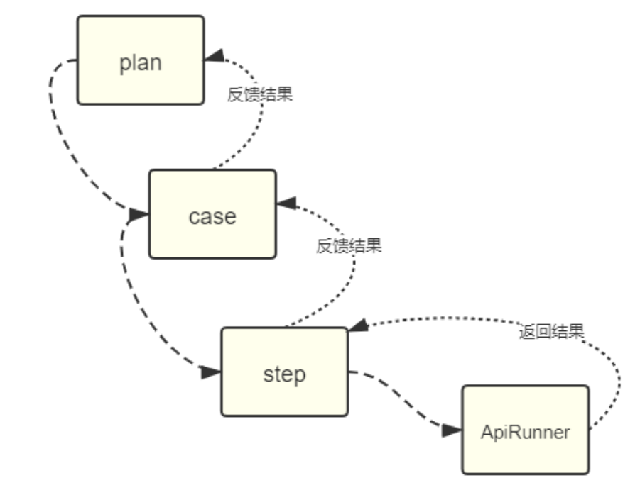

### 修复上次开发的bug

    bug1,查询plan报错
        * 更新查询模板 plan 部分 去掉，start_time，end_time，created_by_id，updated_by_id
        
```python
# query_resp_temp.yml
Plan:
  {
    "retcode": 200,
    "retlist": [
      {
        "id": 16,
        "name": "\u53ef\u53e3\u53ef\u4e50",
        "desc": "cool",
        "exec_counts": 0,
        "status": 0,
        "environment": {
          "id": 1,
          "desc": "\u4e9a\u9a6c\u900aES",
          "project": 7,
          "ip": "192.168.1.1",
          "port": 8555,
          "category": 0,
          "os": 0,
          "status": 0
        },
        "executor": null,
        "project": {
          "id": 7,
          "name": "\u767e\u4e07\u5bcc\u7fc1"
        },
        "cases": [
          {
            "id": 5,
            "desc": "\u5408\u540c\u65b0\u589e",
            "create_time": "2021-03-03T03:56:43.937Z",
            "update_time": "2021-03-04T03:00:53.105Z",
            "sorted_by": 1,
            "module_id": null,
            "status": true,
          }
        ]
      }
    ]
  }
```

    bug2 plan部分的查询没有项目信息
    
        * 按照响应模板的内容，project应该返回对应的信息
        * project对应的value是字典类型，所以查询处理方式对应的是 filter_query的这里
            现在只做了简单的判断，如果没有相关属性就返回空，显然plan是没有project属性的，只能通过环境关
            联到项目数据，因此，如果不改ORM就在这里修改
            根据目前掌握的信息，project是字典，要获取plan对应的project可以通过plan.environment.project
            
    bug3: 查询处理字典值未判断外键模型对象是否为空
        
```python
# plugins.py
def filter_query(resp_tmp, query_obj):
    # 取出yml文件中retlist字典中第一个值
    item_dict = resp_tmp['retlist'][0]
    # 根据响应字典的value判断数据处理的方式
    item = {}
    for k, v in item_dict.items():
        if isinstance(v, dict):
            print('开始处理字典数据类型')
            if hasattr(query_obj, k) and getattr(query_obj, k):
                fields = v.keys()  # 因为value是dict ,根据字典的key指定数据模型要展示的字段
                item[k] = model_to_dict(getattr(query_obj, k), fields=fields)

            elif isinstance(query_obj, Plan) and k == 'project':
                fields = v.keys()
                item[k] = model_to_dict(query_obj.environment.project, fields=fields)

            else:
                item[k] = None

        elif isinstance(v, list):
            print('开始处理列表数据类型')
            # 正向查询或反向查询？
            if hasattr(query_obj, k):
                print('正向查询')
                fields = v[0].keys()  # 展示哪些字段--取出列表的第一元素再获取keys
                item[k] = list(getattr(query_obj, k).values(*fields))
            else:
                print('反向查询')
                fields = v[0].keys()
                item[k] = list(getattr(query_obj, k[:-1]+'_set').values(*fields))

        else:
            print('开始处理普通类型数据')
            value = getattr(query_obj, k)
            # 判断value是否为对应外键--判断类型是否为Model--
            if isinstance(value, Model):
                item[k] = value.id
            # 格式化时间
            elif k.endswith('_time'):
                item[k] = value.strftime('%Y-%m-%d/%H:%M')
            else:
                item[k] = value

    return item
```

### query_resp.yml模板更新

```ymal
Project:
  {
    "retcode": 200,
    "msg": "\u67e5\u8be2\u6210\u529f",
    "retlist": [
      {
        "id": 28,
        "name": "\u81ea\u52a8\u5316\u5e73\u53f017",
        "status": "developing",
        "version": "v8",
        "create_time": "2021-03-27/14:17",
        "update_time": "2021-03-27/14:17",
        "admin": {
          "id": 1,
          "username": "\u5c0f\u660e",
          "first_name": "",
          "email": ""
        },
        "modules": [
          {
            "id": 4,
            "name": "\u7279\u65af\u62c9",
            "desc": "mod3"
          }
        ],
        "members": [
          {
            "id": 1,
            "username": "\u5c0f\u660e",
            "email": "",
            "first_name": ""
          },
          {
            "id": 2,
            "username": "\u5c0fC",
            "email": "",
            "first_name": ""
          }
        ]
      }
    ]
  }

Module:
  {
    "retcode": 200,
    "msg": "查询成功",
    "retlist": [
      {
        "id": 2,
        "desc": "mod1",
        "name": "测试模块1",
        "create_time": "2021-03-25/10:31",
        "update_time": "2021-03-25/10:35"
      }
    ]
  }

Environment:
  {
    "retcode": 200,
    "msg": "\u67e5\u8be2\u6210\u529f",
    "retlist": [
      {
        "id": 3,
        "desc": "\u4e9a\u9a6c\u900a",
        "ip": "192.168.1.100",
        "port": 8080,
        "category": 2,
        "os": 2,
        "status": 2,
        "project": {
          "id": 16,
          "desc": "\u786c\u6838\u624b\u6e38",
          "name": "\u81ea\u52a8\u5316\u5e73\u53f03"
        },
        "create_time": "2021-03-27/13:02",
        "update_time": "2021-03-27/13:04"
      }
    ]
  }

Case:
  {
    "retcode": 200,
    "msg": "\u67e5\u8be2\u6210\u529f",
    "retlist": [
      {
        "id": 1,
        "desc": "\u7a7a\u5bc6\u7801\u6d4b\u8bd5",
        "status": true,
        "create_time": "2021-03-27/06:59",
        "update_time": "2021-03-30/10:07",
        "module": {
          "id": 2,
          "desc": "mod1",
          "project": 16,
          "name": "\u6d4b\u8bd5\u6a21\u57571"
        },
        "steps": [
          {
            "id": 4,
            "desc": "test",
            "expected": "1",
            "httpapi": 1,
            "step_no": 1
          },
          {
            "id": 5,
            "desc": "test",
            "expected": "1",
            "httpapi": 1,
            "step_no": 1
          },
        ],
        "tags": [
          {
            "name": "smoke_test"
          }
        ]
      }
    ]
  }

Step:
  {
    'retcode': 200,
    'msg': '查询成功',
    'retlist': [
      {
        'id': 1,
        'desc': 'mm1',
        'expected': '123',
        'step_no': 1,
        'httpapi': 2,
        'create_time': '2021-03-27/06:59',
        'update_time': '2021-03-27/06:59',
      }
    ]
  }

HttpApi:
  {
    "retcode": 200,
    "msg": "\u67e5\u8be2\u6210\u529f",
    "retlist": [
      {
        "id": 3,
        "method": 2,
        "path": "/api/test2",
        "data": "{\"user\":\"test\",\"psw\":\"123123\"}",
        "content_type": 1,
        "headers": "{\"Cache-Control\":\"no-cache\"}",
        "auth_type": 1,
        "desc": "\u6d4b\u8bd5\u63a5\u53e32",
        "create_time": "2021-03-30/07:08",
        "update_time": "2021-03-30/07:37",
        "module": {
          "id": 3,
          "desc": "login",
          "name": "\u767b\u5f55\u6a21\u5757"
        }
      }
    ]
  }

Tag:
  {
    "retcode": 200,
    "msg": "\u67e5\u8be2\u6210\u529f",
    "retlist": [
      {
        "id": 4,
        "name": "smoke_test",
        "desc": "\u6d4b\u8bd5\u63a5\u53e32",
        "create_time": "2021-03-30/07:31",
        "update_time": "2021-03-30/07:31",
      }
    ]
  }

Plan:
  {
    "retcode": 200,
    "retlist": [
      {
        "id": 16,
        "name": "\u53ef\u53e3\u53ef\u4e50",
        "desc": "cool",
        "exec_counts": 0,
        "status": 0,
        "environment": {
          "id": 1,
          "desc": "\u4e9a\u9a6c\u900aES",
          "project": 7,
          "ip": "192.168.1.1",
          "port": 8555,
          "category": 0,
          "os": 0,
          "status": 0
        },
        "executor": null,
        "project": {
          "id": 7,
          "name": "\u767e\u4e07\u5bcc\u7fc1"
        },
        "cases": [
          {
            "id": 5,
            "desc": "\u5408\u540c\u65b0\u589e",
            "sorted_by": 1,
            "module_id": null,
            "status": true,
          }
        ]
      }
    ]
  }

Result:
  {
      "retcode": 200,
      "retlist": [
          {
              "id": 12,
              "desc": null,
              "plan": { "name": "\u98de\u9e70\u8ba1\u5212", "id":3},
              "project": { "name": "star war","id":2},
              "start_time": "2021-03-22/13:12:05",
              "end_time": "2021-03-22/13:12:09",
              "case_num": 1,
              "pass_num": 0,
              "failed_num": 1
          }
      ]
  }
```

### views.py视图中增加接口用例

    views.py——》case.py文件中增加StepHandler, TagHandler, HttpApiHandler, PlanHandler类方法
       
```python
# case.py
# coding=utf-8
# @File     : case.py.py
# @Time     : 2021/3/29 8:04
# @Author   : jingan
# @Email    : 3028480064@qq.com
# @Software : PyCharm
from django.contrib.auth.models import User
from django.http import JsonResponse

from sqtp.models.plan import Plan, Result
from sqtp.models.case import Case, Step, Tag, HttpApi
from .handler import CommonView


# 用例
class CaseHandler:

    @staticmethod
    def add(request):
        position_keys = ['desc', 'module_id']  # 必填参数
        option_keys = ['status', 'tag_ids']  # 选填参数
        return CommonView.operate_add(request, position_keys=position_keys, option_keys=option_keys, db_model=Case)

    @staticmethod
    def delete(request):
        return CommonView.operate_delete(request, Case)

    @staticmethod
    def update(request):
        option_keys = ['desc','status','module_id','tag_ids']
        return CommonView.operate_update(request, option_keys=[], db_model=Case)

    @staticmethod
    def query(request):
        option_keys = ['id','module_id']
        return CommonView.operate_query(request, option_keys, db_model=Case)

# 步骤
class StepHandler:

    @staticmethod
    def add(request):
        position_keys = ['case_id', 'httpapi_id', 'step_no']
        option_keys = ['expected', 'status', 'desc']
        return CommonView.operate_add(request, position_keys=position_keys, option_keys=option_keys, db_model=Step)

    @staticmethod
    def delete(request):
        return CommonView.operate_delete(request, Step)

    @staticmethod
    def update(request):
        option_keys = ['case_id', 'httpapi_id', 'step_no', 'status', 'expected', 'desc']
        return CommonView.operate_update(request, option_keys, db_model=option_keys)

    @staticmethod
    def query(request):
        option_keys = ['id', 'case_id']
        return CommonView.operate_query(request, option_keys, Step)

# 标签
class TagHandler:
    @staticmethod
    def add(request):
        position_keys = ['name']  # 必填参数
        option_keys = ['desc']  # 选填参数
        return CommonView.operate_add(request, position_keys, option_keys, Tag)

    @staticmethod
    def delete(request):
        return CommonView.operate_delete(request, Tag)

    @staticmethod
    def update(request):
        option_keys = ['name', 'desc']
        return CommonView.operate_update(request, option_keys, Tag)

    @staticmethod
    def query(request):
        option_keys = ['id', 'case_id', 'name']
        return CommonView.operate_query(request, option_keys, Tag)


# 接口
class HttpApiHandler:
    @staticmethod
    def add(request):
        position_keys = ['module_id', 'desc', 'method']  # 必填参数
        option_keys = ['path', 'data', 'content_type', 'auth_type', 'headers']  # 选填参数
        return CommonView.operate_add(request, position_keys, option_keys, HttpApi)

    @staticmethod
    def delete(request):
        return CommonView.operate_delete(request, HttpApi)

    @staticmethod
    def update(request):
        option_keys = ['module_id', 'desc', 'method', 'path', 'data', 'content_type', 'auth_type', 'headers']
        return CommonView.operate_update(request, option_keys, HttpApi)

    @staticmethod
    def query(request):
        option_keys = ['id', 'module_id']
        return CommonView.operate_query(request, option_keys, HttpApi)


# 计划
class PlanHandler:
    @staticmethod
    def add(request):
        position_keys = ['name', 'environment_id']  # 必填参数
        option_keys = ['desc', 'status', 'case_ids']  # 选填参数
        return CommonView.operate_add(request, position_keys, option_keys, Plan)

    @staticmethod
    def delete(request):
        return CommonView.operate_delete(request, Plan)

    @staticmethod
    def update(request):
        option_keys = ['name', 'environment_id', 'desc', 'status', 'case_ids']
        return CommonView.operate_update(request, option_keys, Plan)

    @staticmethod
    def query(request):
        option_keys = ['id', 'project_id']
        return CommonView.operate_query(request, option_keys, Plan)

    @staticmethod
    def run(request):
        try:
            plan_id = request.GET.get('id')
            res = plan_run(plan_id)
            return JsonResponse(res)
        except Exception as e:
            return JsonResponse({'retcode':500,'msg':'执行失败','error':repr(e)})

```   

### __init__.py文件中增加路由调度器

    views.py——》__init__.py文件增加dispatcher_result、dispatcher_plan、dispatcher_httpapi、dispatcher_tag、dispatcher_step、dispatcher_run路由调度器
    
```python
# coding=utf-8
# @File     : __init__.py.py
# @Time     : 2021/3/29 7:51
# @Author   : jingan
# @Email    : 3028480064@qq.com
# @Software : PyCharm
from django.views.decorators.csrf import csrf_exempt
from .case import CaseHandler, StepHandler, TagHandler, HttpApiHandler, PlanHandler, ResultHandler
from .mgr import ProjectHandler, ModuleHandler, EnvHandler


# 根据请求的方法分配具体执行的函数（指向增删改查的路由）——路由调度器
@csrf_exempt
def dispatcher_project(request):
    return _common_dispatcher(request, ProjectHandler)

@csrf_exempt
def dispatcher_module(request):
    return _common_dispatcher(request, ModuleHandler)

@csrf_exempt
def dispatcher_case(request):
    return _common_dispatcher(request, CaseHandler)

@csrf_exempt
def dispatcher_env(request):
    return _common_dispatcher(request, EnvHandler)

@csrf_exempt
def dispatcher_result(request):
    return _common_dispatcher(request,ResultHandler)

@csrf_exempt
def dispatcher_run(request):
    return PlanHandler.run(request)

@csrf_exempt
def dispatcher_plan(request):
    return _common_dispatcher(request,PlanHandler)

@csrf_exempt
def dispatcher_httpapi(request):
    return _common_dispatcher(request,HttpApiHandler)

@csrf_exempt
def dispatcher_tag(request):
    return _common_dispatcher(request,TagHandler)

@csrf_exempt
def dispatcher_step(request):
    return _common_dispatcher(request,StepHandler)

# 通用视图调度
def _common_dispatcher(request, Handler):
    if request.method == 'GET':
        # 处理查询操作
        return Handler.query(request)
    if request.method == 'POST':
        # 处理新增请求，注意不仅需要执行函数，还要return
        return Handler.add(request)
    if request.method == 'PUT':
        # 处理修改操作
        return Handler.update(request)
    if request.method == 'DELETE':
        # 处理删除请求
        return Handler.delete(request)
```

### urls.py增加路由

    sqtp——>urls.py增加路由
    
```python
# coding=utf-8
# @File     : urls.py.py
# @Time     : 2021/3/25 8:48
# @Author   : jingan
# @Email    : 3028480064@qq.com
# @Software : PyCharm
from django.urls import path
from .views import dispatcher_project, dispatcher_module, dispatcher_env, dispatcher_case
from .views import dispatcher_result, dispatcher_plan, dispatcher_httpapi, dispatcher_tag, dispatcher_step, dispatcher_run


urlpatterns = [
    path('project/', dispatcher_project),   # 项目的增删改查路径
    path('module/', dispatcher_module),  # 模块的增删改查路径
    path('env/', dispatcher_env),  # 环境的增删改查路径
    path('case/', dispatcher_case),  # 用例的增删改查路径
    path('case/', dispatcher_result),  # 结果的增删改查路径
    path('case/', dispatcher_plan),  # 计划的增删改查路径
    path('case/', dispatcher_httpapi),  # http的增删改查路径
    path('case/', dispatcher_tag),  # 标签的增删改查路径
    path('case/', dispatcher_step),  # 步骤的增删改查路径
    path('case/', dispatcher_run),  # 执行的增删改查路径
]
```

### testcase包中新增测试用例文件

    testcase包新增test_http_api.py、test_plan_api.py、test_step_api.py、test_tag_api.py测试文件
    
```python
# coding=utf-8
# @File     : test_http_api.py
# @Time     : 2021/4/14 20:13
# @Author   : jingan
# @Email    : 3028480064@qq.com
# @Software : PyCharm

import requests

host = 'http://127.0.0.1:8081'
path = '/api/httpapi/'


# 新增项目
def test_add():
    url = host + path
    # 请求数据
    payload = {
        'module_id': 4,
        'desc': '测试接口2',
        'method': True,
        'path': '/api/test',
        'data': 1,
        'content_type': 1,
        'auth_type': 1,
        'headers':'{"Cache-Control":"no-cache"}'
    }
    resp = requests.post(url, json=payload)
    print(resp.json())


# 删除
def test_delete(_id):
    url = host + path + f'?id={_id}'
    resp = requests.delete(url)
    print(resp.json())


# 修改
def test_update(_id):
    url = host + path + f'?id={_id}'
    payload = {
        'module_id': 3,
        'desc': '测试接口2',
        'method': 2,
        'path': '/api/test2',
        'data': '{"user":"test","psw":"123123"}',
        'content_type': 1,
        'auth_type': 1,
        'headers':'{"Cache-Control":"no-cache"}'
    }
    resp = requests.put(url, json=payload)
    print(resp.json())


# 查询
def test_query(**params):  # id=xxx,name=xxx
    url = host + path
    resp = requests.get(url, params=params)  # {}
    print(resp.json())


if __name__ == '__main__':
    # test_add()
    # test_delete(20)
    # test_update(3)
    test_query(id=3)
```

```python
# coding=utf-8
# @File     : test_plan_api.py
# @Time     : 2021/4/14 20:14
# @Author   : jingan
# @Email    : 3028480064@qq.com
# @Software : PyCharm


import requests

host ='http://127.0.0.1:8081'
path='/api/plan/'
# 新增项目
def test_add():
    url=host+path
    #请求数据
    payload={
        'name':'plan002',
        'environment_id':3,
        'desc':'test',
        'status':0,
        'case_ids':[1,2]
    }
    resp = requests.post(url,json=payload)
    print(resp.json())

# 删除
def test_delete(_id):
    url=host+path+f'?id={_id}'
    resp = requests.delete(url)
    print(resp.json())


#修改
def test_update(_id):
    url = host+path+f'?id={_id}'
    payload={
        'name':'plan002',
        'environment_id':3,
        'desc':'test',
        'status':0,
        'case_ids':[1,2]
    }
    resp = requests.put(url,json=payload)
    print(resp.json())

#查询
def test_query(**params): # id=xxx,name=xxx
    url = host+path
    resp = requests.get(url,params=params) #{}
    print(resp.json())


if __name__ == '__main__':
    # test_add()
    # test_delete(20)
    # test_update(1)
    test_query(id=1)
```

```python
# coding=utf-8
# @File     : test_step_api.py
# @Time     : 2021/4/14 20:14
# @Author   : jingan
# @Email    : 3028480064@qq.com
# @Software : PyCharm


import requests

host = 'http://127.0.0.1:8081'
path = '/api/step/'


# 新增项目
def test_add():
    url = host + path
    # 请求数据
    payload = {
        'case_id': 2,
        'httpapi_id': 1,
        'step_no': True,
        'expected': 1,
        'status': 1,
        'desc': 'test'
    }
    resp = requests.post(url, json=payload)
    print(resp.json())


# 删除
def test_delete(_id):
    url = host + path + f'?id={_id}'
    resp = requests.delete(url)
    print(resp.json())


# 修改
def test_update(_id):
    url = host + path + f'?id={_id}'
    payload = {
        'case_id': 2,
        'httpapi_id': 1,
        'step_no': True,
        'expected': 1,
        'status': 1,
        'desc': 'test'
    }
    resp = requests.put(url, json=payload)
    print(resp.json())


# 查询
def test_query(**params):  # id=xxx,name=xxx
    url = host + path
    resp = requests.get(url, params=params)  # {}
    print(resp.json())


if __name__ == '__main__':
    # test_add()
    # test_delete(20)
    # test_update(2)
    test_query()
```

```python
# coding=utf-8
# @File     : test_tag_api.py
# @Time     : 2021/4/14 20:14
# @Author   : jingan
# @Email    : 3028480064@qq.com
# @Software : PyCharm

import requests

host ='http://127.0.0.1:8081'
path='/api/tag/'
# 新增项目
def test_add():
    url=host+path
    #请求数据
    payload={
        'desc':'回归测试',
        'name':'b_test'
    }
    resp = requests.post(url,json=payload)
    print(resp.json())

# 删除
def test_delete(_id):
    url=host+path+f'?id={_id}'
    resp = requests.delete(url)
    print(resp.json())


#修改
def test_update(_id):
    url = host+path+f'?id={_id}'
    payload={
        'desc':'冒烟测试',
        'name':'smoke_test'
    }
    resp = requests.put(url,json=payload)
    print(resp.json())

#查询
def test_query(**params): # id=xxx,name=xxx
    url = host+path
    resp = requests.get(url,params=params) #{}
    print(resp.json())


if __name__ == '__main__':
    # test_add()
    # test_delete(20)
    # test_update(2)
    test_query()
```

    修改mgr.py文件中ProjectHandler类方法中查询函数如下
    
```python
# 查询
    @staticmethod
    def query(request):
        option_keys = ['id', 'name']
        return CommonView.operate_query(request, option_keys, Project)
```

### 接口执行器实现

    执行器结构图如下



    目的：实现前端测试计划的执行
    
    1、在sqtp目录下创建plugins包
        * __init__.py同一目录中handlers.py的函数，方便调用
      
```python
# coding=utf-8
# @File     : __init__.py.py
# @Time     : 2021/4/14 20:45
# @Author   : jingan
# @Email    : 3028480064@qq.com
# @Software : PyCharm

from .handlers import info_handler,read_yml,filter_query
```

    2、首先创造1个api执行器用于专门执行http请求和记录结果
        * 在plugins包中创建status_conf.py文件，主要用来存储映射关系，类似于http数据中定义的0映射为get方法，1映射为post方法

```python
# coding=utf-8
# @File     : status_conf.py
# @Time     : 2021/4/14 20:51
# @Author   : jingan
# @Email    : 3028480064@qq.com
# @Software : PyCharm


class StatusConf:
    # 定义子类，存储步骤状态值
    class step_status:
        standby = 0
        running = 1
        breaked = 2
        success = 3
        failed = 4
        error = 5

    class plan_status:
        standby = 0
        running = 1
        breaked = 2
        done = 3

    http_method = (
        'get',
        'post',
        'put',
        'delete',
    )
    content_types = (
        'application/json',
        'application/x-www-form-urlencoded',
    )
```        

    2、在plugins包中新建task_runner.py文件
        * 将用例执行相关代码写在该文件中
        
```python
# coding=utf-8
# @File     : task_runner.py
# @Time     : 2021/4/14 20:47
# @Author   : jingan
# @Email    : 3028480064@qq.com
# @Software : PyCharm

from datetime import datetime
import requests
# api执行相关
from .status_conf import StatusConf
from sqtp.models.case import Step, Case
from sqtp.models.plan import Plan, Result


class ApiRunner():
    def __init__(self,ip,port):
        self.host = f'http://{ip}:{port}'

    # 执行api--参数api为httpApi的实例对象(即sqtp_httpapi数据库表中的信息)
    def exec_api(self,api):
        self.resp = None
        # 从status_conf文件取出对应的http方法（get/post/delete）
        method = StatusConf.http_method[api.method]
        # 根据api对应的值取出具体的content_type
        content_type = StatusConf.content_types[api.content_type]
        self.url = self.host + api.path
        # 根据请求类型来判断传参 post , put --这两种方法都在请求体传参
        try:
            if method in ['post','put']:
                # 根据 content_type判断 参数传递
                if content_type == 'application/json':
                    self.resp = requests.request(method,self.url,json=api.data)
                elif content_type == 'application/x-www-form-urlencoded':
                    # 如果是表单格式就传给data
                    self.resp = requests.request(method,self.url,data=api.data)
                else:
                    return {'msg':'请求暂时不支持'}
            else:
                # get 或 delete类型请求一般参数存储在url中
                self.resp = requests.request(method,self.url,params=api.data)
        except Exception as e:
            # 记录错误信息
            self.status = StatusConf.step_status.error
            self.error = repr(e)  # 记录异常信息

    # 检查结果--实际和预期比较
    def check_result(self,expect):
        # 判断是否有响应结果
        if self.resp:
            # 判断实际和预期是否相符
            if expect == self.resp.text:
                # 修改状态--成功
                self.status=StatusConf.step_status.success
            else:
                self.status=StatusConf.step_status.failed
                self.error = f'{expect} not equal {self.resp.text}'


# 步骤执行
def step_run(step_id,test_env):
    ip = test_env.ip
    port = test_env.port
    # 搜集接口信息
    target_step = Step.objects.get(pk=step_id)
    target_api = target_step.httpapi  # 目标接口
    target_step.status = StatusConf.step_status.running  # 更新状态为运行中
    target_step.save()
    # 触发接口
    api_runner = ApiRunner(ip,port)
    api_runner.exec_api(target_api)
    api_runner.check_result(target_step.expected)

    #
    target_step.status = api_runner.status  # 从api执行器中同步步骤状态
    target_step.save()
    # 反馈信息
    return {'recode':200,'msg':'执行完成','status':target_step.status}


# 用例执行
def case_run(case_id,test_env):
    target_case = Case.objects.get(pk=case_id)
    step_list = target_case.step_set.all()  # 反向查询出该用例中所有步骤
    # 循环执行用例中的步骤
    for step in step_list:
        res = step_run(step.id,test_env)
        # 判断步骤结果，同时返回对应的信息
        if res['status'] != StatusConf.step_status.success:
            return {'retcode':500,'msg':'运行中断','status':'failed'}
    return {'retcode':200,'msg':'运行结束','status':'success'}


# 计划执行
def plan_run(plan_id):
    target_plan = Plan.objects.get(pk=plan_id)
    # 开始执行计划
    start_time = datetime.now()  # 触发时间
    target_plan.status = StatusConf.plan_status.running  # 更新为正在执行
    target_plan.save()

    # 循环执行计划中的用例
    case_list = target_plan.plancase_set.filter(plan_id=plan_id)
    # 用例的成功和失败数
    case_num = case_list.count()
    pass_num = 0
    failed_num = 0
    for case in case_list:
        res = case_run(case.id,target_plan.environment)
        if res['status'] == 'success':
            # 用例通过，pass_num +1
            pass_num += 1
        else:
            failed_num += 1
    end_time = datetime.now() # 触发时间
    # 更新状态
    target_plan.status = StatusConf.plan_status.done
    # 记录计划执行次数
    target_plan.exec_counts += 1
    target_plan.save()

    # 测试完成--保存本次测试结果到 Result
    Result.objects.create(plan=target_plan,start_time=start_time,end_time=end_time,case_num=case_num,pass_num=pass_num,failed_num=failed_num)

    return {'retcode':200,'msg':'运行结束','status':target_plan.status,'case_num':case_num,'pass_num':pass_num,'failed_num':failed_num}
```

    3、在views——>case.py的PlanHandler类中增加run函数
    
```python
@staticmethod
    def run(request):
        try:
            plan_id = request.GET.get('id')
            res = plan_run(plan_id)
            return JsonResponse(res)
        except Exception as e:
            return JsonResponse({'retcode':500,'msg':'执行失败','error':repr(e)})
```

    4、在views——>__init__.py中增加调度器
    
```python
@csrf_exempt
def dispatcher_run(request):
    return PlanHandler.run(request)
```

    5、在sqtp——>urls.py中增加路由
    
```python
# 执行plan
    path('run/plan/', dispatcher_run),
```
        
    6、在plugins包中新建handlers.py文件
        * 将原来plugins中的代码写在handlers.py中
        
```python
# coding=utf-8
# @File     : plugins.py
# @Time     : 2021/3/28 21:38
# @Author   : jingan
# @Email    : 3028480064@qq.com
# @Software : PyCharm
from django.db.models import Model
from django.forms import model_to_dict
from django.http import JsonResponse
from sqtp.models.plan import Plan


# 将入参处理独立出来
def info_handler(in_params, position_keys=None, option_keys=None):
    if option_keys is None:
        option_keys = []
    if position_keys is None:
        position_keys = []
    info = {}  # 创建数据的入参
    for key in position_keys:
        # 判断入参如果没有必填参数，就返回错误消息
        if key not in in_params:
            # raise Exception(f'需要参数{key}')
            return JsonResponse({'retcode': 400, 'msg': '请求错误', 'error': f'需要参数{key}'})
        info[key] = in_params[key]
    # 接下来是选填参数
    for key in option_keys:
        # 遍历选填参数列表，如果在入参有对应的key，则取出对应的值放在容器里
        if key in in_params and not key.endswith('_ids'):  # 过滤以_ids结尾的数据
            info[key] = in_params[key]
    return info

# pip install yml
import yaml

def read_yml(path):
    with open(path, encoding='utf8') as f:
        # safe_load将文件读取的内容转化成python字典格式
        return yaml.safe_load(f.read())

def filter_query(resp_tmp, query_obj):
    # 取出yml文件中retlist字典中第一个值
    item_dict = resp_tmp['retlist'][0]
    # 根据响应字典的value判断数据处理的方式
    item = {}
    for k, v in item_dict.items():
        if isinstance(v, dict) and getattr(query_obj, k):
            print('开始处理字典数据类型')
            if hasattr(query_obj, k):
                fields = v.keys()  # 因为value是dict ,根据字典的key指定数据模型要展示的字段
                item[k] = model_to_dict(getattr(query_obj, k), fields=fields)

            elif isinstance(query_obj, Plan) and k == 'project':
                fields = v.keys()
                item[k] = model_to_dict(query_obj.environment.project, fields=fields)

            else:
                item[k] = None

        elif isinstance(v, list):
            print('开始处理列表数据类型')
            # 正向查询或反向查询？
            if hasattr(query_obj, k):
                print('正向查询')
                fields = v[0].keys()  # 展示哪些字段--取出列表的第一元素再获取keys
                item[k] = list(getattr(query_obj, k).values(*fields))
            else:
                print('反向查询')
                fields = v[0].keys()
                item[k] = list(getattr(query_obj, k[:-1]+'_set').values(*fields))

        else:
            print('开始处理普通类型数据')
            value = getattr(query_obj, k)
            # 判断value是否为对应外键--判断类型是否为Model--
            if isinstance(value, Model):
                item[k] = value.id
            # 格式化时间
            elif k.endswith('_time'):
                item[k] = value.strftime('%Y-%m-%d/%H:%M')
            else:
                item[k] = value

    return item
```

    7、导入前端项目文件dist到根目录，然后重启服务器，更新前端
        
        访问：http://127.0.0.1:8081/projects.html
    
    
    
    


