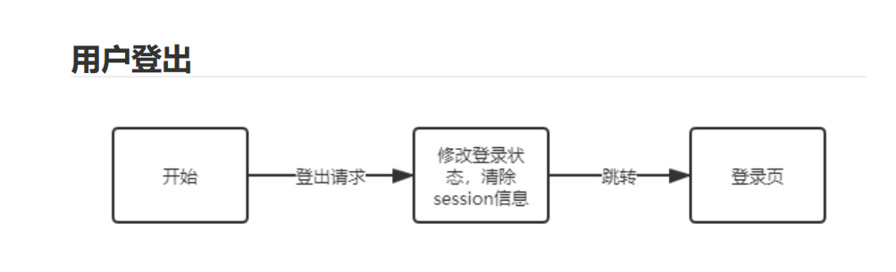
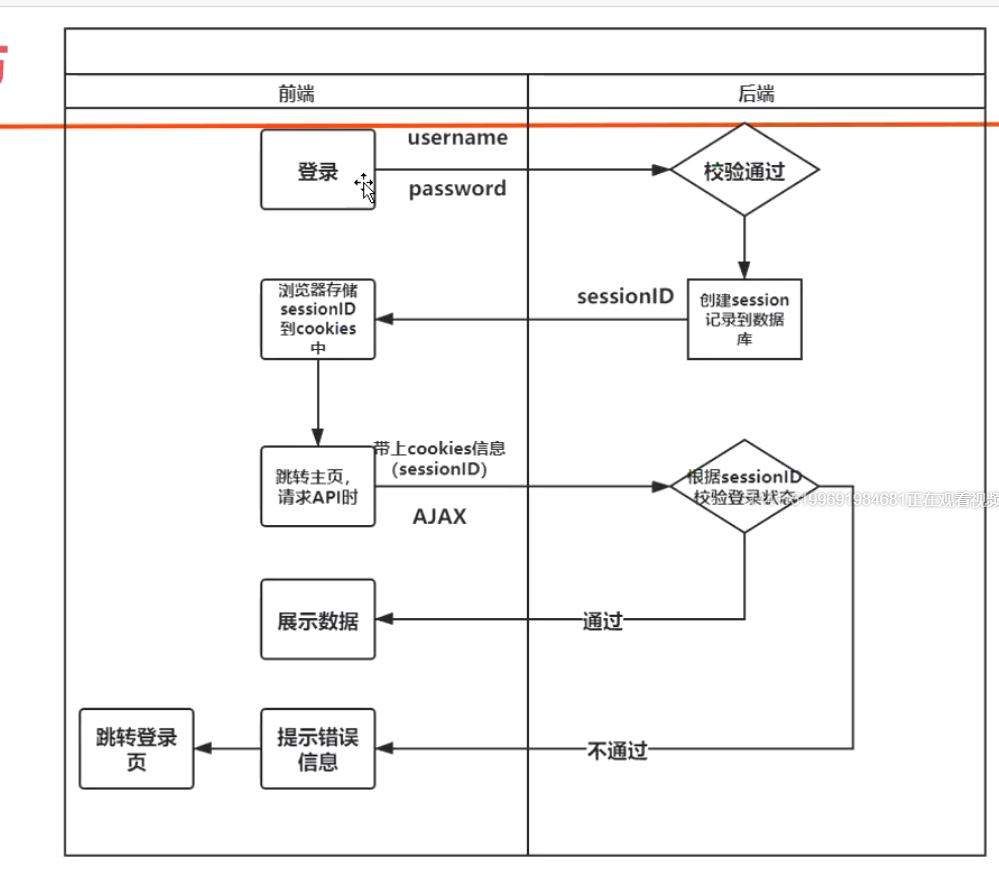

### 用户登录


### django自带验证机制


### 实现用户登录

    1、sqtp——>views——>新建account.py文件，里面新增login函数
    
```python
# coding=utf-8
# @File     : account.py
# @Time     : 2021/4/19 21:22
# @Author   : jingan
# @Email    : 3028480064@qq.com
# @Software : PyCharm
import json
from django.contrib import auth
from django.http import JsonResponse
from ..plugins import info_handler


# 登录
def login(request):
    if request.method == 'POST':
        # 1、入参处理
        in_params = json.loads(request.body)
        info = info_handler(in_params, position_keys=['username', 'password'])
        if not isinstance(info, dict):
            return info

        # 2、使用django自带验证机制，验证用户信息
        user = auth.authenticate(**info)  # 验证通过返回用户的实例对象
        if not user:  # 如果登录失败
            return JsonResponse({'retcode': 400, 'msg': 'login failed!'})

        # 3、记录用户登录状态
        auth.login(request, user)
        return JsonResponse({'retcode': 302, 'to': 'index.html', 'msg': 'login success!'})
```

    2、views——>__init__.py导入login模块函数
    
```python
from .account import login
```

    3、sqtp——>urls.py新增路由
    
```python
# 登录用户
path('user/login/', login)
```

### 用户登出


    
     1、sqtp——>views——>account.py文件，里面新增logout函数
     
```python
# 登出
def logout(request):
    # 清除用户登录态
    auth.logout(request)
    # 返回登出信息
    return JsonResponse({'retcode': 302, 'to': 'login.html', 'msg': 'logout success!'})
```

    2、views——>__init__.py导入logout模块函数
    
```python
from .account import logout
```

    3、sqtp——>urls.py新增路由
    
```python
# 登录用户
path('user/logout/', logout)
```
### 视图装饰器

    * 允许的http方法，请求方法不在列表中就返回错误
        require_http_methods(["GET", "POST"])
        
    * 快捷方法
        require_GET()
        require_POST()
        
    * 验证登录状态
        login_required
        
    * 登录和登出等加上装饰器，确保请求方法是正确的，所以account.py文件中的login和logout函数修改如下
    
```python
from django.views.decorators.http import require_POST, require_GET
# 登录
# 导入装饰器确保请求的方法是POST
@require_POST
def login(request):
    # 1、入参处理
    in_params = json.loads(request.body)
    info = info_handler(in_params, position_keys=['username', 'password'])
    if not isinstance(info, dict):
        return info

    # 2、使用django自带验证机制，验证用户信息
    user = auth.authenticate(**info)  # 验证通过返回用户的实例对象
    if not user:  # 如果登录失败
        return JsonResponse({'retcode': 400, 'msg': 'login failed!'})

    # 3、记录用户登录状态
    auth.login(request, user)
    return JsonResponse({'retcode': 302, 'to': 'index.html', 'msg': 'login success!'})

# 登出
@require_GET
def logout(request):
    # 清除用户登录态
    auth.logout(request)
    # 返回登出信息
    return JsonResponse({'retcode': 302, 'to': 'login.html', 'msg': 'logout success!'})
```
        
### 用户注册


    1、sqtp——>views——>account.py文件，里面新增register注册函数
     
```python
# 注册
@require_POST
def register(request):
    # 1、入参处理
    in_params = json.loads(request.body)
    position_keys = ['email', 'username', 'password']  # 必填参数：用户名、邮箱、密码
    option_keys = ['first_name', 'admin_code']  # 选填参数：昵称、管理员邀请码
    info = info_handler(in_params, position_keys, option_keys)
    if not isinstance(info, dict):
        return info

    # 2、用户名和邮箱不能重复
    # 根据入参的用户名或邮箱搜索用户，如果存在则说明已经有人在用了
    if list(User.objects.filter(username=info['username'])) or list(User.objects.filter(email=info['email'])):
        return JsonResponse({'retcode': 400, 'msg': '用户名或邮箱已存在'})

    # 判断是否传递admin_code
    if 'admin_code' in info:
        # 弹出admin_code
        admin_code = info.pop('admin_code')
        # 判断admin_code是否正确
        if admin_code == 'sqtp':
            # 如果相等就创建用户管理员
            user = User.objects.create_superuser(**info)
        else:
            return JsonResponse({'retcode': 400, 'msg': 'register failed!', 'error': f'wrong admin_code {admin_code}'})
    else:
        # 如果没有admin_code就创建普通用户
        user = User.objects.create_user(**info)

    # 注册完成
    if user:
        # 自动登录
        auth.login(request, user)
        return JsonResponse({'retcode': 302, 'to': 'index.html', 'msg': '注册成功，自动登录'})
```

    2、views——>__init__.py导入logout模块函数
    
```python
from .account import register
```

    3、sqtp——>urls.py新增路由
    
```python
# 登录用户
path('user/register/', register)
```
    
### 验证用户登录态(访问的页面是否登录)

    1、autotpsite——>settings.py文件底部设置重定向地址（即访问未登录页面点击后需要跳转的页面）
    
```python
# 指定未登录用户重定向的地址
LOGIN_URL = 'api/user/current/'
```

    2、views——>__init__.py文件中路由调度器中添加装饰器@login_required()验证登录态
    
```python
from django.contrib.auth.decorators import login_required
@login_required()  # 如果查询项目信息就需要先登录，验证登录状态
@csrf_exempt
def dispatcher_project(request):
    return _common_dispatcher(request, ProjectHandler)
```

    前后端验证逻辑图
    


### 检查当前用户（重定向页面/api/user/current/的实现）

    前端验证流程图
    


    1、sqtp——>views——>account.py文件，里面新增current_user函数
     
```python
@require_GET
@ensure_csrf_cookie
def current_user(request):
    # 如果当前用户处于登录状态
    if request.user.is_authenticated:
        fields = ['id', 'username', 'email', 'first_name', 'last_login', 'is_superuser', 'is_staff', 'is_active', 'date_joined']
        # 返回当前用户登录信息
        out_data = model_to_dict(request.user, fields=fields)
        return JsonResponse({'retcode': 200, 'msg': out_data})
    else:
        return JsonResponse({'retcode': 403, 'msg': '未登录', 'to': 'login.html'})
```

    2、views——>__init__.py导入current_user模块函数
    
```python
from .account import current_user
```

    3、sqtp——>urls.py新增路由
    
```python
# 检查当前用户
path('user/current/', current_user),
```

### 前后端分离项目中前端如何获取csrftoken值

    * 不使用模板无法使用csrf_token标签
    * 本质是发送请求时携带csrftoken值，存储在请求头和请求体
    * 前端如何获取csrftoken?
    
    前端获取csrftoken的方法
        1、首先配置django给服务端生成csrftoken
            * 入口视图加上@ensure_csrf_cookie
            
```python
@require_GET
@ensure_csrf_cookie
def current_user(request):
    # 如果当前用户处于登录状态
    if request.user.is_authenticated:
        fields = ['id', 'username', 'email', 'first_name', 'last_login', 'is_superuser', 'is_staff', 'is_active', 'date_joined']
        # 返回当前用户登录信息
        out_data = model_to_dict(request.user, fields=fields)
        return JsonResponse({'retcode': 200, 'msg': out_data})
    else:
        return JsonResponse({'retcode': 403, 'msg': '未登录', 'to': 'login.html'})
```
 
        2、然后前端js读取cookies_csrftoken


