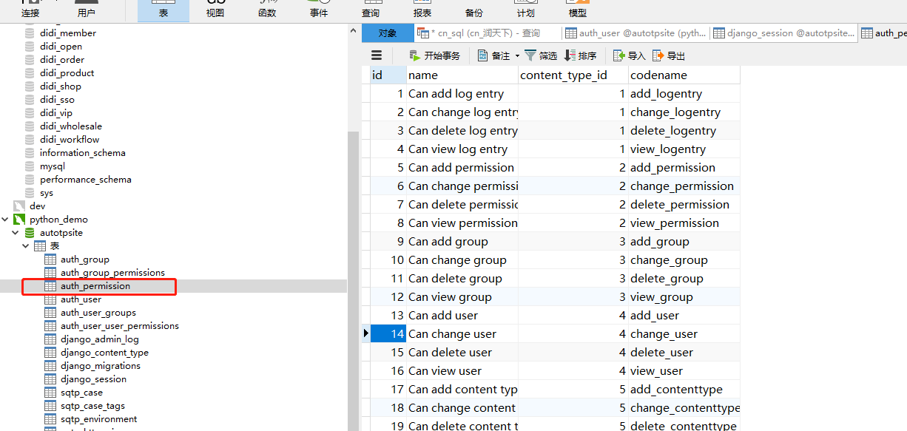
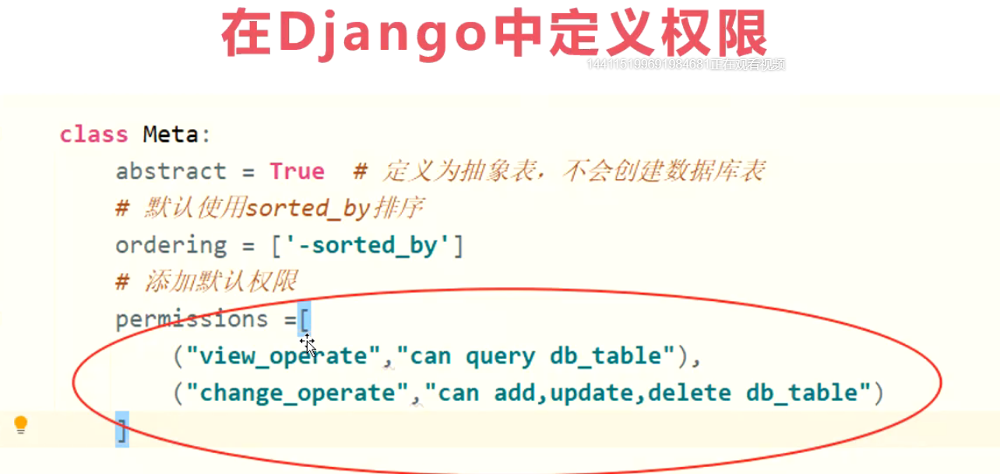
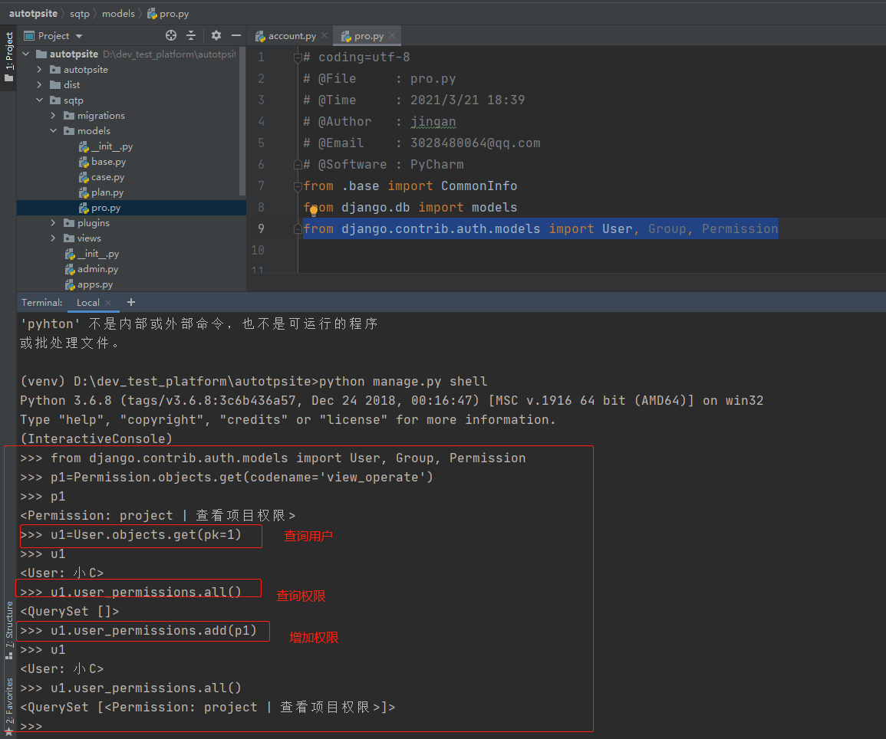
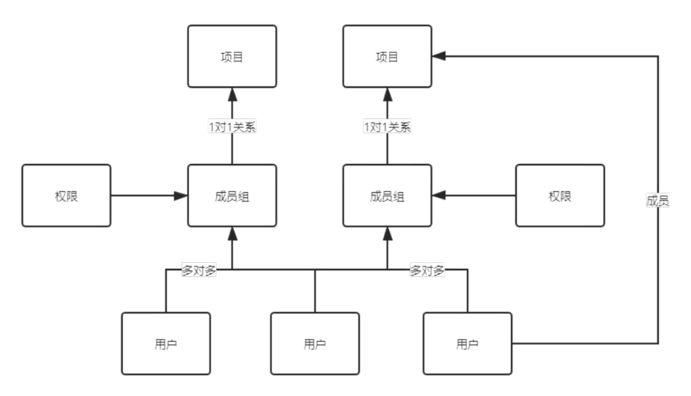

    
    课堂画图工具：https://www.processon.com/i/5eb619a15653bb6f2af9fe54
    
### 权限是什么？

    抽象的概念，表示执行某个操作需要的凭据，其实我们登录操作也可以看成是获取凭据的操作，向后台
    发起请求时向其展示该凭证
    
    那么web系统的情况会复杂一点，比如我要管理员用户或者当前项目组成员才能改动项目，那就需要复
    杂的权限系统来实现了
    
    在django中权限是通过数据库记录的形式呈现的，dango提供了permissions这个数据模型来定义权
    限，因此我们不需要自己写一个权限模型了
    
    权限定义数据在auth_permission表中
    


### Django的默认权限

    默认权限：当 INSTALLED_APPS 设置了 django.contrib.auth 时，它将确保你的每个Django模型
    被创建时有四个默认权限：添加、修改、删除和查看
    
    注意：Django内置的权限授权是针对Model进行的授权，如一旦授予某用户修改权限，那么该用户就拥有了该Model所有对象的修改权限
    
### 如何添加自定义权限？

    给待操作的DB模型加上 permissions属性
    如下图，一个元组代表一个权限；格式与上图数据库一致（codename, name）
    


    1、sqtp——>models——>pro——>Project类下的Meta中添加权限
    
```python
class Meta(CommonInfo.Meta):  # 显示继承才能继承父模型的元类功能，默认不会继承abstract = True
    verbose_name = '项目表'
    # 添加权限
    permissions = [
        ("view_operate", "查看项目权限")
    ]    
```
    2、输入命令同步数据库
    
        * python manage.py makemigrations
        * python manage.py migrate
        
        
### 如何赋予权限给用户？

    方式1：通过 user_permissions 属性将权限分配给 User
    
        permissions = Permission.objects.filter(codename='view_operate')
        user.user_permissions.add(*permissions)
        


    方式2：通过 permissions 属性分配给 Group

    示例：
        >>> from django.contrib.auth.models import User, Group, Permission
        >>> u2=User.objects.get(pk=2)
        >>> u2
        <User: 小明>
        >>> u2.groups.all()
        <QuerySet []>
        >>> u2.groups.add( Group.objects.get(name='权限测试组'))
        >>> u2.groups.all()
        <QuerySet [<Group: 权限测试组>]>
        >>> g1=Group.objects.get(name='权限测试组')
        >>> g1.permissions.add(p1)   # 用户添加到组中
        >>> g1.permissions.all()
        <QuerySet [<Permission: sqtp | 项目表 | 查看项目权限>]>


        如何给用户进行分组？
        user的groups属性
            * myuser.groups.set([group_list])
            * myuser.groups.add(group, group, ...)
            * myuser.groups.remove(group, group, ...)
            * myuser.groups.clear()
            
        groups反向添加用户
        
### 如何过滤权限？

    方法一：自行判断用户是否有权限
        user.has_perm(权限1,权限2,权限3)    权限名 = 应用名称.codename
        
    views——>mgr.py文件中ProjectHandler类下的query函数新增has_perm()方法进行判断
        
```python
# 查询
@staticmethod
def query(request):
    # 检查当前用户是否具备view_operate权限
    if not request.user.has_perm('sqtp.view_operate'):  # request.user表示获取当前用户
        return JsonResponse({'retcode': 403, 'msg': '没有权限'})

    option_keys = ['id', 'name']
    return CommonView.operate_query(request, option_keys, Project)
```

    方法二：使用permission_required 装饰器
    
    permission_required (perm, login_url=None, raise_exception=False)
    * perm：权限名（应用名称.codename）例如：sqtp.view_operate
    * login_url：没有权限会被自动重定向到指定地址，没有填写则默认使用settings.py文件的LOGIN_URL配置
    * raise_exception: 为true时会触发PermissionDenied异常，提示403，不会进行跳转
    
    views——>mgr.py文件中ProjectHandler类下的query函数可修改为
    
```python
# 查询
@staticmethod
@permission_required('sqtp.view_operate', login_url='/api/user/current/')
def query(request):
    # 检查当前用户是否具备view_operate权限
    # if not request.user.has_perm('sqtp.view_operate'):  # request.user表示获取当前用户
    #     return JsonResponse({'retcode': 403, 'msg': '没有权限'})

    option_keys = ['id', 'name']
    return CommonView.operate_query(request, option_keys, Project)
```
    
```python
from django.contrib.auth.decorators import permission_required
@permission_required('polls.add_choice')
def my_view(request):
    ...
```

    就像 has_perm() 方法一样，权限名称采用 "<app label>.<permission codename>" 形式（比如
    polls.polls.add_choice 就是 polls 应用程序下的模型的权限）
    
    装饰器也可以接受可迭代权限，在这种情况下，用户必须拥有所有权限才能访问视图
    
    注意， permission_required() 也可以接受可选的 login_url 参数
    
```python
from django.contrib.auth.decorators import permission_required
@permission_required('polls.add_choice', login_url='/loginpage/')
def my_view(request):
    ...
```

    和login_required()装饰器一样，login_url 默认是:setting:settings.LOGIN_URL<LOGIN_URL>
    
    如果有raise_exception参数，那么装饰器将引发PermissionDenied错误，提示the 403 (HTTPForbidden) view 而不是跳转到登录页面
    
    如果你想使用 raise_exception 但也想给用户登录的机会，那需要添加 login_required() 装饰器
    
```python
from django.contrib.auth.decorators import login_required, permission_required
@login_required 
@permission_required('polls.add_choice', raise_exception=True) 
def my_view(request):
    ...
```

    当 LoginView 的 redirect_authenticated_user=True 并且已登录用户没有所有必须的权限时，这避免了重定向循环
    
    
### 如何删除权限

    这个问题就和如何删除多对多关系一样，因为权限其实是和用户或组关联的多对多关系。因此操作多对多管理器的remove或者clear即可
    remove---删除指定权限
    clear----删除所有---慎用
    
### 改造当前项目内容

    结合现在开发的自动化平台对项目进行改造,目前项目和成员已有成员关系进行关联了，但是控制权限还
    不是太方便，可以利用django自带的groups对成员进行分组，然后将权限赋予成员组，这样只要在成
    员组内的用户就有了这个项目的操作权限
    


    1、models——>pro.py——>Project类中添加成员组字段group
    
```python
# 成员组-1对1关系
group = models.OneToOneField(Group, on_delete=models.CASCADE, null=True, verbose_name='成员组')
```

    2、执行命令数据库迁移
        python manage.py makemigrations
        python manage.py migrate
        
    3、models——>pro.py文件新增sync_permissions和save函数
    
```python
def sync_permissions(self):
    # 查看当前项目是否具备成员组
    if not self.group:
        # 没有就创建成员组，名称格式为“项目名称_group”
        self.group = Group.objects.create(name=self.name + '_group')
    self.group.permissions.set(Permission.objects.all())  # 关联权限到成员组
    # 同步当前members到group
    self.group.user_set.set(self.members.all())  # set接受的是可迭代型数据

def save(self, force_insert=False, force_update=False, using=None, update_fields=None):
    self.sync_permissions()  # 先调用同步权限方法再保存
    super().save()  # 这步需要调用才是真正的保存到数据库
```

    4、views——>handler.py文件中operate_update函数中新增项目同步权限代码
    
```python
@staticmethod
def operate_update(request, option_keys, db_model):
    # 获取待修改对象的id
    _id = request.GET.get('id')
    # 获取请求体参数——json格式转换成字典
    in_params = json.loads(request.body)
    # 选填参数member_ids不用传入列表，因为是通过多对多字段更新的
    info = info_handler(in_params, option_keys=option_keys)
    if not isinstance(info, dict):
        return info

    # 查询待修改数据
    try:
        mod_obj = db_model.objects.get(pk=_id)
        # 如果是项目就同步权限
        if isinstance(mod_obj, Project):
            mod_obj.sync_permissions()
        # 更新多对多关系，先判断有没有传入member_ids
        # 约定 以_ids结尾的参数，且数据类型是list,那么就进行多对多关联
        for key in in_params:
            if key.endswith('_ids') and isinstance(in_params[key], list):
                # 多对多关联
                M=M2M_dict[key] # 从自定义多对多关系字典找到映射的模型
                # 根据模型取出对应的数据
                objs = [M.objects.get(pk=_id) for _id in in_params[key]]
                # 模型数据对象进行关联
                m2m_field_name = key.split('_')[0] + 's'
                # 利用python反射获取对象属性---多对多管理器
                m2m_field = getattr(mod_obj, m2m_field_name)
                # 清除原有关系--多对多
                m2m_field.clear()
                # 重新关联成员
                m2m_field.add(*objs)

        # 更新项目数据：需要动态传参更新，因为非必填参数未必需要传入
        # project.__setattr__('name', info['name'])
        for k, v in info.items():  # 根据入参动态设置属性
            mod_obj.__setattr__(k, v)

        mod_obj.save()
        return JsonResponse({'retcode': 200, 'msg': '修改成功'})
    except Exception as e:
        return JsonResponse({'retcode': 500, 'msg': '修改失败', 'error': repr(e)})
```

    5、views——>mgr.py中先注释@permission_required('sqtp.view_operate', login_url='/api/user/current/')语句，测试前端代码是否生效
    
    6、前端访问系统设置——项目管理，查看是否筛选数据成功
    
    

