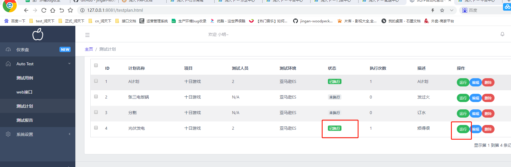

### 后端分页（Paginator）

    分页三要素
        * page_count 总页数
        * page_size 每页显示的条数
        * page_index 第几页
        
    方法
        * Paginator.page(number)
          返回指定页面的Page对象，比如第七页的所有内容，从1开始，如果提供的页码不正确，抛出InvalidPage异常
          
        * Paginator.get_page(number)
          上面方法的安全版本，不会弹出异常，如果输入的参数不是数字，返回第一页，如果输入的数字大于最大页码，返回最后一页
          
        * 属性
          Paginator.count 对象总数
          Paginator.num_pages 页面总数
          Paginator.page_range 基于1的页数范围迭代器，比如[1,2,3,4]
          
    1、views——>handler.py文件operate_query函数增加分页代码
    
```python
@staticmethod
def operate_query(request, option_keys, db_model):
    # 获取查询参数
    in_params = request.GET
    info = info_handler(in_params, option_keys=option_keys)
    if not isinstance(info, dict):
        return info

    try:
        retlist = []  # 定义容器收集返回字段内容

        # 获取分页数据——page_index, page_size
        page_index = in_params.get('page_index', 1)  # 默认第一页
        page_size = in_params.get('page_size', 5)  # 默认显示第一页5条数据
        # 初始化分页器对象
        paginator = Paginator(list(db_model.objects.filter(**info)), page_size)
        # 根据页码提供当前页的内容
        queryset = list(paginator.get_page(page_index))

        # 自定义响应字段
        for query_obj in queryset:
            # 根据响应模板（yml文件）判断响应参数类型，从而做具体处理
            # read_yml('sqtp/query_resp_temp.yml')读取的是整个yml文件，需要加上[db_model.__name__]相当于返回models包中class类中类名
            resp_tmp = read_yml('sqtp/query_resp_temp.yml')[db_model.__name__]
            item = filter_query(resp_tmp, query_obj)
            retlist.append(item)

        return JsonResponse({'retcode': 200, 'msg': '查询正确', 'retlist': retlist, 'total': paginator.count})
    except Exception as e:
        return JsonResponse({'retcode': 500, 'msg': '查询错误', 'error': repr(e)})
```

    2、替换前端代码dist
    
    3、重启项目，访问项目管理查看分页功能
    
### 功能补充

    实现创建者和更新者

    1、views——>handler.py
        * operate_add函数中新增 info['created_by'] = request.user  # 创建者为当前登录用户
        * operate_update函数新增 mod_obj.updated_by = request.user  # 更新者为当前用户
        
```python
 @staticmethod
def operate_add(request, position_keys, option_keys, db_model):
    # 如何处理json格式的请求？
    in_params = json.loads(request.body)  # 入参in_params==字典
    info = info_handler(in_params, position_keys, option_keys)
    if not isinstance(info, dict):  # info如果不是字典，说明触发了异常被赋值成了JsonResponse
        return info

    # 创建项目
    try:
        with transaction.atomic():  # 数据库事务
            # 模型数据对象
            info['created_by'] = request.user  # 创建者为当前登录用户
            mod_obj = db_model.objects.create(**info)

            # 约定以_ids为结尾的参数，且数据类型是list，那么就进行多对多关联
            for key in in_params:
                if key.endswith('_ids') and isinstance(in_params[key], list):
                    # 多对多关联
                    M = M2M_dict[key]  # 从自定义的多对多关系字典找到映射的模型
                    # 根据模型取出对应的数据
                    objs = [M.objects.get(pk=_id) for _id in in_params[key]]
                    # 根据模型对象进行关联
                    m2m_field_name = key.split('_')[0] + 's'
                    # 利用python反射获取对象属性
                    m2m_field = getattr(mod_obj, m2m_field_name)
                    m2m_field.add(*objs)

        return JsonResponse({'retcode': 200, 'msg': '添加成功', 'id': mod_obj.id})
    except Exception as e:
        return JsonResponse({'retcode': 500, 'msg': '添加失败', 'error': repr(e)})


@staticmethod
def operate_update(request, option_keys, db_model):
    # 获取待修改对象的id
    _id = request.GET.get('id')
    # 获取请求体参数——json格式转换成字典
    in_params = json.loads(request.body)
    # 选填参数member_ids不用传入列表，因为是通过多对多字段更新的
    info = info_handler(in_params, option_keys=option_keys)
    if not isinstance(info, dict):
        return info

    # 查询待修改数据
    try:
        mod_obj = db_model.objects.get(pk=_id)
        # 如果是项目就同步权限
        if isinstance(mod_obj, Project):
            mod_obj.sync_permissions()
        # 更新多对多关系，先判断有没有传入member_ids
        # 约定 以_ids结尾的参数，且数据类型是list,那么就进行多对多关联
        for key in in_params:
            if key.endswith('_ids') and isinstance(in_params[key], list):
                # 多对多关联
                M=M2M_dict[key] # 从自定义多对多关系字典找到映射的模型
                # 根据模型取出对应的数据
                objs = [M.objects.get(pk=_id) for _id in in_params[key]]
                # 模型数据对象进行关联
                m2m_field_name = key.split('_')[0] + 's'
                # 利用python反射获取对象属性---多对多管理器
                m2m_field = getattr(mod_obj, m2m_field_name)
                # 清除原有关系--多对多
                m2m_field.clear()
                # 重新关联成员
                m2m_field.add(*objs)

        # 更新项目数据：需要动态传参更新，因为非必填参数未必需要传入
        # project.__setattr__('name', info['name'])
        for k, v in info.items():  # 根据入参动态设置属性
            mod_obj.__setattr__(k, v)

        mod_obj.updated_by = request.user  # 更新者为当前用户
        mod_obj.save()
        return JsonResponse({'retcode': 200, 'msg': '修改成功'})
    except Exception as e:
        return JsonResponse({'retcode': 500, 'msg': '修改失败', 'error': repr(e)})
```

    2、前端页面新增或修改测试用例数据，用不同的用户登录后，查看数据库表sqtp_case中created_by_id和updated_by_id值是否变化
    
    
    实现测试计划运行状态
    
    1、views——>case.py文件中PlanHandler类下的run函数修改如下
    
```python
@staticmethod
def run(request):
    try:
        res = plan_run(request)
        return JsonResponse(res)
    except Exception as e:
        return JsonResponse({'retcode':500,'msg':'执行失败','error':repr(e)})
```

    2、plugins——>task_runner.py中plan_run函数修改如下
    
```python
# 计划执行
def plan_run(request):
    plan_id = request.GET.get('id')
    target_plan = Plan.objects.get(pk=plan_id)
    # 开始执行计划
    start_time = datetime.now()  # 触发时间
    target_plan.status = StatusConf.plan_status.running  # 更新为正在执行

    # 将当前登录用户设置为计划执行者
    target_plan.executor = request.user
    target_plan.save()

    # 循环执行计划中的用例
    case_list = target_plan.cases.filter()
    # 用例的成功和失败数
    case_num = case_list.count()
    pass_num = 0
    failed_num = 0
    for case in case_list:
        res = case_run(case.id, target_plan.environment)
        if res['status'] == 'success':
            # 用例通过，pass_num +1
            pass_num += 1
        else:
            failed_num += 1
    end_time = datetime.now()  # 触发时间
    # 更新状态
    target_plan.status = StatusConf.plan_status.done
    # 记录计划执行次数
    target_plan.exec_counts += 1
    target_plan.save()

    # 测试完成--保存本次测试结果到 Result
    Result.objects.create(plan=target_plan, start_time=start_time, end_time=end_time, case_num=case_num, pass_num=pass_num, failed_num=failed_num,executor=request.user)

    return {'retcode': 200, 'msg': '运行结束', 'status': target_plan.status, 'case_num': case_num, 'pass_num': pass_num,
            'failed_num': failed_num}
```

    2、重启服务，前端项目计划界面选择计划运行，查看状态是否变为已执行
    

    
    实现测试计划执行者
    
    1、models——>plan.py文件Result添加executor执行者字段
    
        executor = models.ForeignKey(User, on_delete=models.SET_NULL, null=True, verbose_name='执行人')
        
```python
# 测试结果
class Result(CommonInfo):
    plan = models.ForeignKey(Plan, on_delete=models.SET_NULL, null=True, verbose_name='测试计划')
    # 触发时间
    start_time = models.DateTimeField(null=True, blank=True, editable=True, verbose_name='触发时间')
    # 用例执行通过数、失败数、总数
    case_num = models.SmallIntegerField(default=0, verbose_name='用例数')
    pass_num = models.SmallIntegerField(default=0, verbose_name='通过数')
    failed_num = models.SmallIntegerField(default=0, verbose_name='失败数')
    # 执行者
    executor = models.ForeignKey(User, on_delete=models.SET_NULL, null=True, verbose_name='执行人')

    class Meta(CommonInfo.Meta):
        verbose_name = '测试结果'
```

    2、执行命令进行数据迁移
        python manage.py makemigrations
        python manage.py migrate
        
    3、plugins——>task_runner.py文件中 plan_run函数下添加executor=request.user
    
```python
# 测试完成--保存本次测试结果到 Result
    Result.objects.create(plan=target_plan, start_time=start_time, end_time=end_time, case_num=case_num, pass_num=pass_num, failed_num=failed_num,executor=request.user)
```

    4、前端页面执行测试计划生成测试报告查看是否生成对应数据
    
    
### bug修复

    1、测试计划筛选用例问题
    
        plugins——>task_runner.py将代码
        原代码： 循环执行计划中的用例 case_list = target_plan.plancase_set.filter()
        改为：   循环执行计划中的用例 case_list = target_plan.cases.filter()
        
    2、查询tag时参数问题
    
        查询Tag用case_id时报错
        {'retcode': 500, 'msg': '查询错误', 'error': 'FieldError("Cannot resolve keyword
        \'case_id\' into field. Choices are: case, create_time, created_by,
        created_by_id, desc, id, is_delete, name, sorted_by, update_time, updated_by,
        updated_by_id",)'}
        
        views——>handlers.py对Tag做特殊处理
     
```python
# 针对tag的查询检测下参数
if db_model == Tag:
    # 判断入参是否有case_id
    if 'case_id' in info:
        info['case'] = info.pop('case_id')
```


### Django-guardian实现对象级权限控制

    Django的默认权限机制无法做到对象级别的控制
    解决方法：采用django-guardian第三方模块实现
    
    概述：django-guardian 是为Django提供额外的基于对象权限的身份验证后端
    
    特征：
        * Django的对象全新
        * 匿名用户的支持
        * 高级API
        * 经过严密测试
        * Django admin的整合
        * 装饰器
        
    安装：
        pip install django-guardian 或 easy_install django-guardian
    
    配置：
        安装完成后，我们可以将 django-guardian 加入到我们的项目。首先在settings里将guardian加入到INSTALLED_APPS
        INSTALLED_APPS = (
                # ...
                'guardian',
        )
        
    然后加入到身份验证后端 AUTHENTICATION_BACKENDS，复制以下代码到settings.py文件中
    
```python
AUTHENTICATION_BACKENDS = (
    'django.contrib.auth.backends.ModelBackend',  # 这是Django默认的
    'guardian.backends.ObjectPermissionBackend',  # 这是guardian的
)
```

    注意： 一旦我们将 django-guardian 配置进我们的项目，当我们调用migrate命令将会创建一个
    匿名用户的实例（名为 AnonymousUser ）。 guardian的匿名用户与Django的匿名用户不同
    Django匿名用户在数据库中没有条目，但是Guardian匿名用户有。这意味着以下代码将返回意外
    的结果
    
    最后直接执行：python manage.py migrate，不需要执行另一条迁移命令
    
### 权限分配

    * 方法：guradian.shortcuts.assign_perm()
    * 通过assign_perm可以给用户赋予权限，assign_perm接收三个参数，分别为perm、user_or_group以及object
        & perm：权限，可以是字符串或者权限实例，当填写字符串时格式为app_label.codename
        & user_or_group：用户或组的实例，也可以是用户或组的QuerySet集合
    * object对象实例，可以为None，当为None时表示给整个model赋予权限，也可以为对象的QuerySet集合
    
    判断权限
    * guardian.shortcuts.get_perms(user_or_group, obj)
      从用户或者组中获取针对当前对象的权限判断
      
    views——>mgr.py中ProjectHandler类下update修改如下
    
```python
# 修改
@staticmethod
def update(request):
    _id = request.GET['id']
    pro = Project.objects.get(pk=_id)
    # 判断用户是否具备xx权限
    if 'view_operate' not in get_perms(request.user, pro):
        return JsonResponse({'retcode': 403, 'msg': '没有权限'})

    option_keys = ['name', 'desc', 'status', 'version', 'admin_id']
    return CommonView.operate_update(request, option_keys, Project)
```
        