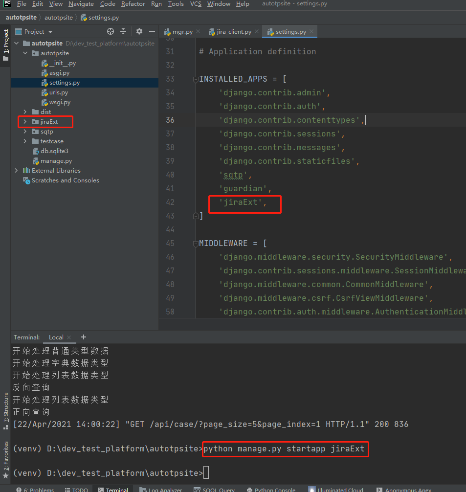

### 项目管理工具jira

    了解对比jira、禅道
        * jira是issue驱动型的
        * 禅道中bug、任务等是分开的
    
    敏捷看板主要有三个状态：代办、处理中、完成
    


    创建看板流程
        1、Backlog中创建一个冲刺Sprint
        

        
        2、可以往Sprint中拖拽任务，需要开始任务，则点击按钮“开始Sprint”，但同一时间只能有一个冲刺且代办任务未完成是不可以开始新Sprint的
        
    总结：jira的敏捷驱动流程
        * 创建问题
        * 拖动到jira
        * 开始冲刺
        * 完成冲刺
        
### jira测试管理流程
    
    需要先安装付费的SynapseRT报告插件
    文档管理可以用wiki


    1、新建需求——创建子级
    


    2、点击对应子级进入页面可创建测试用例或者链接已有的测试用例
    


    3、测试用例都创建完成后，可再新建——>测试计划
    
### 外部控制jira的两种方式

    1、RESTAPI
        https://developer.atlassian.com/cloud/jira/platform/rest/v2/
        
    2、第三方库jira.client是对RESTAPI的封装，这样就不用构造请求头，请求体之类的
        https://jira.readthedocs.io/en/latest/installation.html
        
    Jira提供了完善的RESTful API，如果不想直接请求API接口可以使用Python的Jira库来操作Jira
    
    安装： pip install jira  安装报错则更新pip版本
    
### 项目（Project）

    * jira.projects(): 查看所有项目列表
    * jira.project("项目的Key"): 查看单个项目
    
    项目对象的主要属性及方法如下：
        * key: 项目的Key
        * name: 项目名称
        * description: 项目描述
        * lead: 项目负责人
        * projectTypeKey: 项目分类
        * components: 项目组件
        * versions: 项目中的版本
        * raw: 项目的原始API数据
        
    示例如下
    
```python
print(jira.projects()) # 打印所有你有权限访问的项目列表 
project = jira.project('TESTDEV') # 根据项目KEY获取单个项目 
print(project.id) # 项目ID
print(project.key) # 项目KEY 
print(project.name) # 项目名称 
print(project.description) # 项目描述 
print(project.lead) # 项目负责人 
print(project.issueTypes) # 项目问题类型
print(project.projectTypeKey) # 项目类型 
print(project.components) # 项目组件 
print(project.versions) # 项目版本 
print(project.archived) # 是否归档
```
        
### 问题（issue）

    Issue是Jira的核心，Jira中的任务，用户Story，Bug实质上都是一个Issue
    单个问题对象可以通过jira.issue("问题的Key")得到，问题的主要属性和方法如下：
        * id: 问题的id
        * key: 问题的Key
        * permalink(): 获取问题的链接
        * fields: 问题的描述，创建时间等所有的配置域
        * raw: 问题的原始API数据
        
    示例
    
```python
issue = jira.issue('TESTDEV-7') #根据 key获取单个issue 
print(issue.id) # 问题的ID 
print(issue.key) # 问题的KEY 
print(issue.permalink()) # 问题的链接 
print(issue.fields) #问题的描述，创建时间等所有的配置域 
print(issue.raw) #问题的原始API数据
```

### 配置域（Fields）

    一般问题的Fields中的属性分为固定属性和自定义属性，自定义属性格式一般为类似customfield_10012
    这种。常用的问题的Fields有：
        * assignee：经办人
        * created: 创建时间
        * creator: 创建人
        * labels: 标签
        * priorit: 优先级
        * progress: 进度
        * project: 所属项目
        * reporter: 报告人
        * status: 状态
        * summary: 问题描述
        * worklog: 活动日志
        * updated: 更新时间
        * watches: 关注者
        * comments: 评论
        * resolution: 解决方案
        * subtasks: 子任务
        * issuelinks: 连接问题
        * lastViewed: 最近查看时间
        * attachment: 附件
        
    示例
    
```python
issue = jira.issue('TESTDEV-7') #根据 key获取单个issue

print(issue.fields.assignee) # 经办人
print(issue.fields.created) # 创建时间
print(issue.fields.creator) # 创建人
print(issue.fields.labels) # 标签
# print(issue.fields.priorit) # 优先级
print(issue.fields.progress) # 进度
print(issue.fields.project) # 所属项目
print(issue.fields.reporter) # 报告人
print(issue.fields.status) # 状态
print(issue.fields.summary) # 问题概要
print(issue.fields.worklog) # 活动日志
print(issue.fields.updated) # 更新时间
print(issue.fields.watches) # 关注者
# print(issue.fields.comments) # 评论
print(issue.fields.resolution) # 解决方案
print(issue.fields.subtasks) # 子任务
print(issue.fields.issuelinks) # 连接问题
print(issue.fields.lastViewed) # 最近查看时间
print(issue.fields.attachment) # 附件
```

    注意，若jira返回的原始数据不存在某配置域，则fields对象没有该属性
    AttributeError: type object 'PropertyHolder' has no attribute 'comments'
    
### 关注者/评论/附件

    * jira.watchers(): 问题的关注者
    * jira.add_watcher(): 添加关注者
    * jira.remove_watcher(): 移除关注者
    * jira.comments(): 问题的所有评论
    * jira.comment(): 某条评论
    * jira.add_comment()：添加评论
    * comment.update()/delete(): 更新/删除评论
    * jira.add_attachment(): 添加附件
    
### 创建/分配/转换问题

    * jira.create_issue(): 创建问题
    * jira.create_issues(): 批量创建问题
    * jira.assign_issue(): 分配问题
    * jira.transitions(): 获取问题的工作流
    * jira.transition_issue(): 转换问题
    
### 搜索

    Jira的搜索非常强大，并配有一套专门的搜索语言，称为JQL(Jira Query Language)，Jira的Python库便
    是基于JQL语法进行搜索的，返回的是搜索到的问题列表
    使用语句为：jira.search_issues('JQL语句')
    
    默认最大结果数为1000，可以通过maxResults参数配置，该参数为-1时不限制数量，返回所有搜索结果
    
    jira.search_issues('project=PROJ and assignee = currentUser()', maxResults=-1)
    
    JQL语法：
    Project = TESTDEV AND Reporter = currentUser()
    字符        操作符      关键字
    
    https://confluence.atlassian.com/jirasoftwareserver0712/advanced-searching-959315322.html
     
### 认证

    Jira的访问是有权限的，在访问Jira项目时首先要进行认证，Jira Python库提供了3种认证方式
        1. 通过Cookis方式认证（用户名，密码）
        2. 通过Basic Auth方式认证（用户名，密码）
        3. 通过OAuth方式认证
        认证方式只需要选择一种即可，以下代码为使用Cookies方式认证
        
```python
form jira import JIRA
jira = JIRA('http://devops.sqtest.online:8070/', auth=('用户名', '登录密码')
```

    返回的jira对象便可以对Jira进行操作。主要的操作包括
        1. 项目
        2. 问题
        3. 搜索
        4. 关注者
        5. 评论
        6. 附件
           
    testcase——>新建jira_client.py测试验证jira功能
    
```python
# coding=utf-8
# @File     : jira_client.py
# @Time     : 2021/4/22 9:03
# @Author   : jingan
# @Email    : 3028480064@qq.com
# @Software : PyCharm

# 安装jira库  pip install jira

from jira import JIRA

# 登录jira,拿到客户端对象
jira = JIRA('http://devops.sqtest.online:8070/',auth=('liaojingan','123456'))

# print(jira.projects())  # 查看所有有权限的项目

project = jira.project('TESTDEV')  # 根据项目KEY查看单个项目

# 查看项目具体的内容，比如项目名称、项目负责人等
# print(project.name, project.lead, project.description, project.issueTypes)
# print(jira.issue_types())

issue = jira.issue('TESTDEV-8')

# print(issue.id, issue.key, issue.raw)
# 常见的Fields --固定字段
# print(issue.fields.issuetype)  # 问题类型
# print(issue.fields.project)  # 所属项目
# print(issue.fields.reporter)  #报告者
# print(issue.fields.created)  # 创建时间

# 查看评论
# comments = jira.comments(issue)# 查看某问题下的所有评论
# comment = jira.comment(issue,'10602')
# comment = dir(jira.comment(issue,'10602'))  # dir查看方法和属性
# print(comment.author)

# 添加评论
# jira.add_comment(issue,'jira-client自动评论')

# 更新评论
# comment.update(body='自动更新评论')

# 删除评论
# comment.delete()
# print(jira.comments(issue))

# 问题操作
# 创建问题
issue_dict = {
    'project': {'key': 'TESTDEV'},
    'summary': '测试task01',
    'description': 'jira-client自动创建',
    'issuetype': {'name':'任务'}
}
# new_issue = jira.create_issue(fields=issue_dict) # 创建问题

# 批量创建问题
issue_list = [
    {
        'project': {'id': 10401},
        'summary': '测试task001',
        'description': '来自jira-client自动创建',
        'issuetype': {'name': '任务'},
    },
    {
        'project': {'key': 'TESTDEV'},
        'summary': '测试task002',
        'description': '来自jira-client自动创建',
        'issuetype': {'name': '需求'},
    },
    {
        'project': {'key': 'TESTDEV'},
        'summary': '测试task003',
        'description': '来自jira-client自动创建',
        'issuetype': {'name': '故事'},
    }]
# issues = jira.create_issues(field_list=issue_list)
# print(issues)
```

### 扩展系统模型设计

    扩展系统流程图
        自动化平台添加jira模块——>访问添加的jira.clent功能——>发送请求读取jira.server服务器
        
        注意：每次在自动化平台操作时，可先点击同步按钮，将jira中数据同步到本地先，然后再读取本地数据
        


    1、因为扩展的jira功能模块与原有的sqtp应用是可以分离的，所以最好再新建一个应用jiraExt
        * 控制台输入命令：python manage.py startapp jiraExt
        * 然后settings.py文件加上应用名称'jiraExt'
        


    2、jiraExt——>models.py文件定义数据模型，代码如下
    
```python
from django.db import models

# 项目
class JiraProject(models.Model):
    # 主键
    id = models.CharField(verbose_name='项目ID', max_length=32, primary_key=True, )
    key = models.CharField('项目关键字', max_length=32, unique=True)
    name = models.CharField('项目名称', max_length=256)
    description = models.CharField('项目描述', max_length=1024, default='')
    lead = models.CharField('项目负责人', max_length=32)
    projectTypeKey = models.CharField('项目类型', max_length=32)
    version = models.CharField('项目版本', max_length=128, default='')
    archived = models.BooleanField('是否归档', default=False)


# 用例
class JiraCase(models.Model):
    pass


# 缺陷bug
class JiraBug(models.Model):
    pass
```


    
    
    

    

    