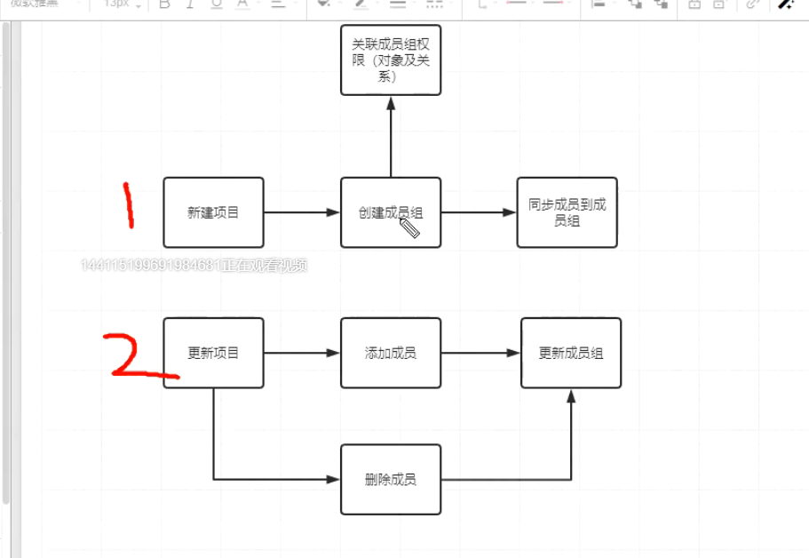

### 新增缺陷功能

    1、jiraExt——>plugins.py文件新增save_issue、update_issue、info_handler函数
    
```python
# coding=utf-8
# @File     : plugins.py
# @Time     : 2021/4/22 15:06
# @Author   : jingan
# @Email    : 3028480064@qq.com
# @Software : PyCharm

# 封装获取jira数据功能
import yaml
from django.http import JsonResponse
from jira import JIRA
from .conf import jira_host, jira_psw, jira_user

# 登录jira，获取客户端对象
jira = JIRA(jira_host, auth=(jira_user, jira_psw))

def _read_yml(path):
    with open(path, encoding='utf-8') as f:
        return yaml.safe_load(f.read())

# 获取项目数据，转化成字典形式
def query_project():
    # 从jira服务器获取项目——当前用户有权限的项目
    projects = jira.projects()
    # 从配置文件读取项目属性
    pro_fields = _read_yml('jiraExt/jira.yml')['project']
    res = []
    for project in projects:
        # 通过project.key获取单个项目对象
        pro = jira.project(project.key)  # 有lead 和 description其他属性
        item = {}
        for field in pro_fields:
            # 反射获取对象属性
            item[field] = str(getattr(pro, field, ''))
            res.append(item)
    return res

# 获取用例数据
def query_case():
    cases = jira.search_issues('issuetype =测试用例')
    case_fields = _read_yml('jiraExt/jira.yml')['case']  # 从配置文件读取项目属性
    res = []
    for case in cases:
        item = {}
        for field in case_fields:
            if field in ['id', 'key']:
                item[field] = getattr(case, field)  # 直接取id 或者 key
            else:
                item[field] = str(getattr(case.fields, field, ''))  # 其他类型需要通过fields取值
        item['project_id'] = item.pop('project')  # 修改key
        res.append(item)
    return res

# 获取bug数据
def query_bug():
    bugs = jira.search_issues('issuetype = 缺陷')
    _conf = _read_yml('jiraExt/jira.yml')['bug']
    res = []
    for bug in bugs:
        item = {}
        for one in _conf:
            if one in ['id', 'key']:
                item[one] = str(getattr(bug, one, ''))  # 直接转字符串
            else:
                item[one] = str(getattr(bug.fields, one, ''))
        res.append(item)
    return res

# 保存问题
def save_issue(pro_id, summary, description,):
    issue_dict = {
        'project': {'id': pro_id},
        'summary': summary,
        'description': description,
        'issuetype': {'name': '缺陷'},

    }
    bug = jira.create_issue(fields=issue_dict)
    return bug

# 修改问题
def update_issue(bug_id, **fields):
    issue = jira.issue(bug_id)
    res = issue.update(**fields)
    return res

def info_handler(in_params, position_keys=None, option_keys=None):
    if option_keys is None:
        option_keys = []
    if position_keys is None:
        position_keys = []
    info = {}  # 创建数据的参数
    for key in position_keys:
        # 判断如果入参没有必填参数，就返回错误消息
        if key not in in_params:
            # raise  Exception(f'需要参数{key}')
            return JsonResponse({'retcode': 400, 'msg': '请求错误', 'error': f'需要参数{key}'})
        info[key] = in_params[key]
    # 接下来是选填参数
    for key in option_keys:
        # 遍历选填参数列表，如果在入参有对应的key，则取出对应的值放到容器中，
        if key in in_params and not key.endswith('_ids'):  # 过滤掉以_ids结尾的参数
            info[key] = in_params[key]

    return info  # 返回参数容器
```

    2、jiraExt——>views.py文件新增create_bug、update_bug函数
    
```python
import json
from django.core.paginator import Paginator
from django.http import JsonResponse
from django.shortcuts import render
from jiraExt.plugins import query_project, query_case, query_bug, save_issue, update_issue, info_handler
from .models import JiraProject, JiraBug, JiraCase
from django.views.decorators.http import require_GET


# 同步jira项目数据
@require_GET
def sync_project(request):

    # 从Jira服务器获取jira中的项目数据，同步到本地
    retlist = query_project()
    # 将数据保存到本地数据库
    for ret in retlist:
        JiraProject.objects.update_or_create(**ret)  # 更新或创建
        # obj = JiraProject(**ret)
        # obj.save()  # 提交到数据库
    # 批量创建--大量数据会提高数据库利用率
    # pros = [JiraProject(**ret) for ret in retlist]
    # JiraProject.objects.bulk_update(pros,fields=['description','lead'])
    return JsonResponse({'retcode': 200, 'msg': '同步项目数据成功'})

# 从本地查询jira项目数据
@require_GET
def list_project(request):
    in_params = request.GET
    info = {}  # 入参过滤器
    if '_id' in in_params:
        info['id'] = in_params.get['_id']

    # 获取分页数据--page_size,page_index
    page_size = in_params.get('page_size', 5)  # 默认1页显示5条
    page_index = in_params.get('page_index', 1)  # 默认第一页
    # 初始化分页器
    paginator = Paginator(list(JiraProject.objects.filter(**info).values()), page_size)
    # 根据页码提供当前页内容
    retlist = list(paginator.get_page(page_index))
    return JsonResponse({'retcode': 200, 'retlist': retlist, 'total': paginator.count})

# 同步用例
def sync_case(request):
    retlist = query_case()
    # 数据保存到本地数据库
    for ret in retlist:
        JiraCase.objects.update_or_create(**ret)  # 更新或创建
    return JsonResponse({'retcode': 200, 'msg': '同步用例数据成功'})

@require_GET
def list_case(request):
    in_params = request.GET
    info = {}  # 入参过滤容器
    if '_id' in in_params:
        info['id'] = in_params.get('_id')

    # 获取分页数据--page_size,page_index
    page_size = in_params.get('page_size', 5)  # 默认1页显示5条
    page_index = in_params.get('page_index', 1)  # 默认第一页
    # 初始化分页器
    paginator = Paginator(list(JiraCase.objects.filter(**info).values()), page_size)
    # 根据页码提供当前页内容
    retlist = list(paginator.get_page(page_index))
    return JsonResponse({'retcode': 200, 'retlist': retlist, 'total': paginator.count})

def sync_bug(request):
    retlist = query_bug()
    for res in retlist:
        res['project_id'] = res.pop('project')
        JiraBug.objects.update_or_create(**res)
    return JsonResponse({'retcode': 200, 'msg': '同步成功'})

def list_bug(request):
    in_params = request.GET
    info = {}
    if '_id' in in_params:
        info['id'] = in_params.get('_id')

    # 获取分页数据--page_size,page_index
    page_size = in_params.get('page_size', 5)  # 默认1页显示5条
    page_index = in_params.get('page_index', 1)  # 默认第一页
    # 初始化分页器
    paginator = Paginator(list(JiraBug.objects.filter(**info).values()), page_size)
    # 根据页码提供当前页内容
    retlist = list(paginator.get_page(page_index))
    return JsonResponse({'retcode': 200, 'retlist': retlist, 'total': paginator.count})

def create_bug(request):
    in_params = json.loads(request.body)
    info = info_handler(in_params, position_keys=['pro_id'], option_keys=['summary', 'description', ])
    if not isinstance(info, dict):
        return info
    res = save_issue(**info)
    return JsonResponse({'retcode': 200, 'msg': '添加成功', 'id': res.id})

def update_bug(request):
    in_params = json.loads(request.body)
    info = info_handler(in_params, option_keys=['bug_id', 'summary', 'description'])
    if not isinstance(info, dict):
        return info
    res = update_issue(**info)
    return JsonResponse({'retcode': 200, 'msg': '修改成功'})
```
    3、jiraExt——>urls.py文件新增路由
    
```python
# coding=utf-8
# @File     : urls.py
# @Time     : 2021/4/22 15:37
# @Author   : jingan
# @Email    : 3028480064@qq.com
# @Software : PyCharm

from django.urls import path, include
from .views import sync_project, list_project, sync_case, list_case, sync_bug, list_bug, create_bug, update_bug


urlpatterns = [
    path('sync/project/', sync_project),
    path('list/project/', list_project),
    path('sync/case/', sync_case),
    path('list/case/', list_case),
    path('sync/bug/', sync_bug),
    path('list/bug/', list_bug),
    path('add/bug/', create_bug),
    path('update/bug/', update_bug),
]
```

### 修复遗留bug问题

    1、修改同步bug时出现的主键重复问题
    
    原来的代码如下
    
```python
def sync_bug(request):
    retlist = query_bug()
    for res in retlist:
        res['project_id'] = res.pop('project')
        JiraBug.objects.update_or_create(**res)
    return JsonResponse({'retcode': 200, 'msg': '同步成功'})
```

    update_or_create方法会根据传递的键值对参数寻找待修改的数据，如果没找到就进行创建，但我们全
    部字段传参的时候，由于bug数据进行了修改，所以数据库里找不到一样匹配的，就会进入创建动作，但是
    这里只修改了描述或主题等相关字段，KEY或ID还是不变的，所以保存数据库时就会出现唯一约束错误
    
    修改为如下代码：
    
```python
def sync_bug(request):
    retlist = query_bug()
    for ret in retlist:
        ret['project_id'] = ret.pop('project')
        JiraBug.objects.update_or_create(defaults=ret, key=ret['key'])
    return JsonResponse({'retcode': 200, 'msg': '同步成功'})
```

    2、项目权限流程设计
    
        * 之前使用django自带的权限机制只能作用到表，比如赋予某一个用户项目管理表的权限，则这个用户可以操作项目表中所有项目的数据，这个权限力度太大
        * 为了实现用户只能操作当前自己项目的数据，引入了第三方django-guardian库，作用到对象级别，可以让用户只操作自身项目数据
        


    流程1-修改新增方法
        一般新增用的是模型管理器的create方法，所以想要封装逻辑，修改模型的create方法最好
        新增，覆盖模型管理器的create方法，自定义模型管理器
        
    1、sqtp——>models——>pro.py文件新增ProjectManager类方法
    
```python
# 自定义模型管理器
class ProjectManager(models.Manager):
    # 覆盖create方法
    def create(self, **kwargs):
        # 实现自定义功能
        pro = super().create(**kwargs)  # 实现往数据库添加数据功能
        # 创建成员组
        pro.group = Group.objects.create(name=pro.name + '_group')
        # 关联成员组权限
        assign_perm('view_operate', pro.group, pro)
        # 同步成员和管理员到成员组
        pro.group.user_set.set(pro.members.all())  # set用法相当于clear和add
        pro.group.user_set.add(pro.admin)
        return pro
```

    2、sqtp——>models——>pro.py文件中Project新增覆盖自定义管理器代码：objects = ProjectManager()
    
```python
class Project(CommonInfo):
    # 枚举项目状态
    proj_status = (
        ('developing', '开发中'),
        ('operating', '维护中'),
        ('stable', '稳定运行中')
    )

    # 管理员
    admin = models.ForeignKey(User, on_delete=models.SET_NULL, verbose_name='项目管理员', related_name='admin', null=True)
    # 成员
    members = models.ManyToManyField(User, verbose_name='项目成员', related_name='members')
    # 名称
    name = models.CharField(max_length=32, unique=True, verbose_name='项目名称')
    # 状态
    status = models.CharField(choices=proj_status, max_length=32, default='stable', verbose_name='项目状态')
    # 版本
    version = models.CharField(max_length=32, default='v1.0', verbose_name='版本')
    # 成员组-1对1关系
    group = models.OneToOneField(Group, on_delete=models.CASCADE, null=True, verbose_name='成员组')

    # 覆盖自定义管理器 ,1个模型可以有多个管理器
    objects = ProjectManager()
```

    3、sqtp——>models——>pro.py修改save方法,注释sync_permissions函数
    
```python
def save(self, force_insert=False, force_update=False, using=None,
         update_fields=None):
    # 添加自定义动作
    # 当前项目如果没有关联成员组，就进行创建并关联，再赋予权限
    if not self.group:
        self.group = Group.objects.create(name=self.name + '_group')
        assign_perm('view_operate', self.group, self)
    # 同步成员和管理员
    self.group.user_set.clear()  # 清空所有关系
    self.group.user_set.add(self.admin)  # 添加管理员
    self.group.user_set.set(self.members.all())  # 同步members
    super().save()  # 这一步执行了才会保存到数据库
```

    

    