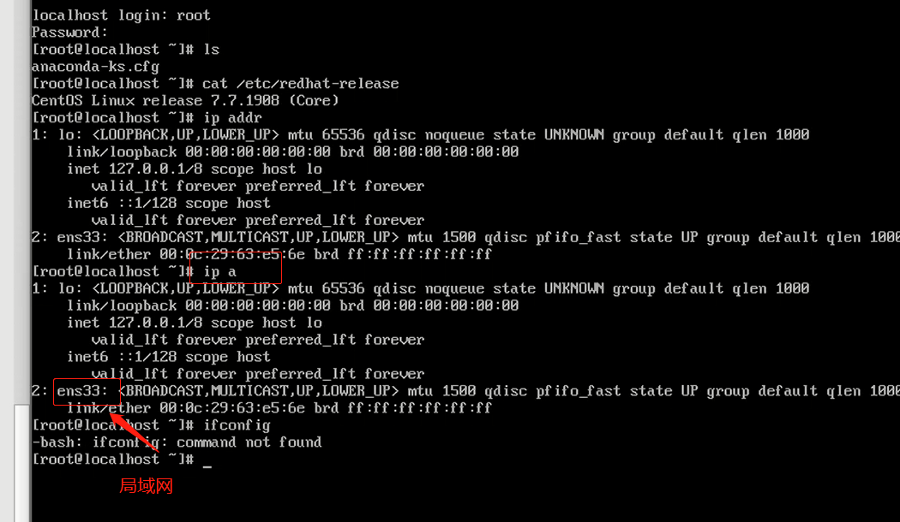

### Django项目运行环境准备

    1、提前准备安装VM和centos7
        * Linux操作系统
        选项一：阿里云或其他服务商的云主机
        选项二：搭建虚拟机，本课程系统为CentOS7，其他选项如Ubuntu/Redhat都可以
        
    注意：如果要移植系统，则将D:\Virtual Machines\CentOS 7 64 位此文件移到另一台机器导入到VM中

### 物理网卡激活
  
    1、未安装ifconfig命令时，可使用ip addr查看信息局域网的网卡面向网络的
    


    2、新装的CentOS7默认情况下网卡是没有分配IP地址的，需要手动激活
    
    3、激活方法，先查看系统中的网卡文件所在目录， 找到了对应的网卡文件
    
```bash
ls /etc/sysconfig/network-scripts/
```


    
    4、root目录下修改该网卡文件，找到ONBOOT选项，默认为no,按下键盘i然后编辑修改为yes，esc命令退出编辑模式，保存后退出 :wq
    
```bash
vi /etc/sysconfig/network-scripts/ifcfg-ens33
```


    
    8、重启网络服务， 查看网卡信息，此时网卡被分配了IP地址
    
```bash
systemctl restart network 或 service network restart
```

    9、windows的cmd命令窗口输入ping命令，查看是否可以ping到虚拟机网段
        ping 192.168.148.130
       或者centos虚拟机ping命令到windows
       
    10、ssh命令检查是否ping通虚拟机
    


    默认情况下虚拟机使用的都是NAT模式，即共享主机ip，即可说明为什么两个网段不一样的centos和windows可以ping通
    NAT模式下虚拟机需要先通过主机，再转发网络，网络出口就是主机
    
    桥接模式：虚拟机和主机是平等的，访问网络不需要通过主机，只要物理网卡（比如路由器）没坏都可以访问，主机和虚拟机组成局域网
    但是桥接模式不安全，通常情况下虚拟机的防护都很弱的，使用NAT网络如果想要攻破我的虚拟机就要先攻破NAT，NAT模式起到保护作用
    


    虚拟机中无法复制命令需要安装VMtools
    
        导航栏——虚拟机——安装VMtools
        
    安装MobaXterm客户端，连接图如下
    注意：如果连接的是云主机，端口号不一定是22
    


### 项目传到Linux虚拟机系统中，然后同步到远程gitee仓库

    方法一：（sftp传递文件）
        1、先在本地新建一个software文件夹
        2、MobaXterm界面中切换到software目录，拖拽整个项目autotpsite文件夹到software重
        
    方法二：（git仓库同步）
        因为项目都是一边开发一边更新同步到服务器的，所以采用此种方法
        
       

    一、新建仓库（输入仓库名称），然后点击创建，其余默认即可
 
    

    二、安装好git之后，在项目文件夹右键选择git bash here打开窗口
        输入命令：git init 初始化仓库
        
  

    三、为了规范化有些文件需要同步到服务器，有些不需要同步到服务器
        其中集成开发工具配置文件“.idea”，“__pycache__"编译文件需要过滤，所以需要先在项目文件夹下新增“.gitiignore”文件，把需要过滤名称写入
        
  

    四、git bash here弹窗输入命令
        git add .
        git commit -m auto_test_platform
        git remote add origin https://gitee.com/lja-night-trip/autotpsite.git  关联远程仓库
        
        先在远程仓库配置SSH公钥步骤如下：
            * 1、先在项目文件夹autotpsite右键选择git GUI here
            * 2、弹出弹窗点击否
            * 3、界面导航栏Help下拉框Show SSH Key
            * 4、弹窗点击Copy To Clipboard，复制到剪贴板
            * 5、远程gitee——帐号信息——安全设置——SSH公钥——粘贴确认即可
        下面即可接着在git bash here窗口输入命令推送本地仓库到远程仓库
        
        git push -u origin master     

    五、MobaXterm中的centos虚拟机先安装git (注意安装的git版本不能太低)
        一、使用yum安装git，yum -y install git
        二、使用yum安装的git在/usr/bin/git下
        三、git --version 查看版本
        四、如果需要移除git，yum remove git
        
      另一种安装git方法：（一般选用此方法）
        下载最新版本源码：https://mirrors.edge.kernel.org/pub/software/scm/git/
        1、输入命令先安装wget：yum install -y wget
        2、再输入命令：wget -O /tmp/git-2.21.0.tar.gz https://mirrors.edge.kernel.org/pub/software/scm/git/压缩包名
        例如：wget -O /tmp/git-2.24.1.tar.gz https://mirrors.edge.kernel.org/pub/software/scm/git/git-2.24.1.tar.gz
        
        3、解压编译
            安装编译依赖：yum install -y curl-devel expat-devel gettext-devel openssl-devel zlib-devel gcc perl-ExtUtils-MakeMaker
            
        4、解压
            tar -zxf /tmp/压缩包名 -C /tmp/  -C表示指定目录
            tar -zxf /tmp/git-2.24.1.tar.gz -C /tmp/
            cd /tmp/git-2.24.1
            
        5、检验相关依赖，设置安装路径
            ./configure --prefix=/usr/local/git
            
        6、编译安装
            make && make install
            
        7、配置全局环境变量
            先删除已有的git：yum remove git
            配置环境变量： vi /etc/profile   添加如下
                        # GIT_HOME
                        GIT_HOME=/usr/local/git
                        export PATH=$PATH:$GIT_HOME/bin
                        
            刷新：source /etc/profile
            输入：git --version 查看版本
            
        8、查看是否存在ssh keys
             $ cd ~/.ssh
           若出现“No such file or directory”,则表示需要创建一个ssh keys
        
        9、创建新的ssh keys
            ssh-keygen -C "3028480064@qq.com" -t rsa
            指定目录: C:\MykeysForGit\（说明：若在此处不输入路径，而直接按回车，则ssh keys生成后存放的路径为C:\User\.ssh）
            输入密码: 123456
            确认密码: lja&123456
            
        10、cat ~/.ssh/id_rsa.pub目录下可复制公钥
            
  

        11、复制的公钥
            远程gitee——帐号信息——安全设置——SSH公钥——粘贴确认即可
            
        参考链接：https://www.cnblogs.com/jhxxb/p/10571227.html
                https://www.cnblogs.com/xihong2014/p/9672656.html
                
    六、将远程仓库的代码克隆到MobaXterm中的test_platform虚拟机中
    
        1、gitee上复制ssh克隆链接
        2、MobaXterm中在root目录下新建一个software目录： mkdir software
        
 

        3、software目录下输入克隆命令
            git clone git@gitee.com:lja-night-trip/autotpsite.git
            提示输入密码后即可提交到远程仓库
            
            切换到autotpsite目录下查看远程仓库信息
            cd autotpsite
            git remote -v
            
    方法三：
        使用脚本自动上传
            
### 运维的预期
    
    * 功能
    * 性能
    * 安全
    
### 总体架构


    操作系统: Linux
        优势：生态系统丰富，程序支持度高，如docker在linux的性能就比在windows好
        
    数据库: Mysql
        优势：开源，性能强劲的关系型数据库
        
    前端web服务器: Nginx
    
    后端app服务器: uWSGI
    
### 运行环境准备

    一、Python3.6安装
        1、切换到根目录输入命令一键安装：wget https://gitee.com/shonekey666/LinuxEnv/raw/master/CentOS/CentOS7-installpython3.sh && sh CentOS7-installpython3.sh
        
        如果提示没有wget命令，可以尝试下面的
        curl -O https://gitee.com/shonekey666/LinuxEnv/raw/master/CentOS/CentOS7-installpython3-4.sh && sh CentOS7-installpython3-4.sh
        
        pyhon3 --version 查看
        
 
    
    二、CentOs7安装Mysql5.7
        1、下载mysql源安装包
            wget http://dev.mysql.com/get/mysql57-community-release-el7-8.noarch.rpm
            
        2、安装mysql源
            yum localinstall mysql57-community-release-el7-8.noarch.rpm
            
        3、检查mysql源是否安装成功
            yum repolist enabled | grep "mysql.*-community.*"

    

    也可以修改 vim /etc/yum.repos.d/mysql-community.repo 源，改变默认安装的mysql版本。比如
    要安装5.6版本，将5.7源的enabled=1改成enabled=0。然后再将5.6源的enabled=0改成enabled=1
    即可
        
        4、安装MySQL
            yum install mysql-community-server
            
        5、启动MySQL服务
            systemctl start mysqld
            
        6、查看MySQL的启动状态
            systemctl status mysqld
            
        7、设置开机启动
            systemctl enable mysqld
            systemctl daemon-reload
            
        8、获取root登陆密码
            mysql安装完成之后，在/var/log/mysqld.log文件中给root生成了一个默认密码。通过下面的方式找到
            root默认密码，然后登录mysql进行修改
            
            输入命令：grep 'temporary password' /var/log/mysqld.log
            返回结果：2021-04-23T08:09:53.455254Z 1 [Note] A temporary password is generated for root@localhost: H)y?%7)>kGgc
            
            如果没有返回，找不到root密码，解决方案：
            (1)删除原来安装过的mysql残留的数据（这一步非常重要，问题就出在这）:rm -rf /var/lib/mysql
            (2)重启mysqld服务：systemctl restart mysqld
            (3)再去找临时密码：grep 'temporary password' /var/log/mysqld.log
            返回：2021-04-23T08:14:44.531792Z 1 [Note] A temporary password is generated for root@localhost: MF>kB;9f1ZrN

            原因有可能是之前安装过一次，没有安装好
            
        9、登录
            mysql -uroot -p
            输入上面获取的密码：MF>kB;9f1ZrN
            
            修改密码(注意密码需要大小写字符、特殊字符、数字组成)
            mysql> ALTER USER 'root'@'localhost' IDENTIFIED BY 'Lja&199514';
            
        9、修改密码策略
            在/etc/my.cnf文件添加validate_password_policy配置，指定密码策略
            # 0（LOW）：验证 Length
            # 1（MEDIUM）：验证 Length; numeric, lowercase/uppercase, and special characters
            # 2（STRONG）：验证 Length; numeric, lowercase/uppercase, and special characters;
            dictionary file
            validate_password_policy=0
            
            当然如果不需要密码策略，可以禁用
            在/etc/my.cnf文件添加
            validate_password = off
            重启生效：systemctl restart mysqld
            
            Mysql的root用户，只能本地访问，这里在创建一个远程可以访问的用户
            mysql -uroot -p
            输入密码
            mysql> GRANT ALL PRIVILEGES ON *.* TO 'its'@'%' IDENTIFIED BY '123456' WITH GRANT OPTION;
            mysql> exit 退出
            
        10、忽略大小写
            登陆mysql查看
            mysql> show variables like "%case%";
            结果显示：lower_case_table_names  0   其中0表示区分大小写，1表示不区分
            
            修改配置文件 /etc/my.cnf 添加：
            lower_case_table_names =1
            
            重启后生效：systemctl restart mysqld
            
        11、用户权限
            把数据库迁移到新的服务器上,执行存储过程时出现了如下问题:
            execute command denied to user ‘用户名’@’%’ for routine ‘函数名称’
            
            一查原来是权限问题,只要用下面的语句改一下相应用户的权限就可以了
            GRANT ALL PRIVILEGES ON *.* TO '用户名'@'%' identified by '登录密码';  （用户名替换为真实的名称）例如：GRANT ALL PRIVILEGES ON *.* TO 'root'@'%' identified by 'Lja&199514';
            FLUSH PRIVILEGES;
            
            相应的撤消权限命令:
            REVOKE ALL PRIVILEGES ON *.* FROM '用户名'@'%' identified by '登录密码'; REVOKE ALL PRIVILEGES ON *.* FROM 'root'@'%';
            FLUSH PRIVILEGES;
            
        12、跑脚本的时候
            ERROR 1067 (42000): Invalid default value for 'FAILD_TIME' （对TIMESTAMP 类型的
            字段如果不设置缺省值或没有标志not null时候在创建表时会报这个错误） 
            这是因为 sql_mode 中的 NO_ZEROR_DATE 导制的，在 strict mode 中不允许'0000-00-00'作为合法日期
            使用下面的命令查看sql_mode：mysql>show variables like 'sql_mode';
            
            将上面的 NO_ZERO_DATE 改为下面的 ALLOW_INVALID_DATES
            mysql> set
            sql_mode='ONLY_FULL_GROUP_BY,STRICT_TRANS_TABLES,NO_ZERO_IN_DATE,ALLOW_INVALID_DATES,ERROR_FOR_DIVISION_BY_ZERO,NO_AUTO_CREATE_USER,NO_ENGINE_SUBSTITUTION';
            
            
    三、创建虚拟环境
        
        1、切换到software目下
            python3 -m venv djvenv
            创建成功后，python解释器和相关库就在这个虚拟环境中了
            
        2、激活虚拟环境
            source djvenv/bin/activate （djvenv为虚拟环境目录）
            
    

    四、相关库的安装
        
        1、有明确的版本要求，如果开发的版本跟运维的版本不一致可能会出现问题
            先在本地使用：pip list 查看开发的时候使用的库的版本
            
           方法一：
           可以对照本地库的版本，手动安装所有的库
           pip install Django 3.1.7
           pip install PyMySQL 1.0.2
           pip install PyYAML 5.4.1
           ...
           
           方法二：
           （在虚拟环境前提下）自动导出同步需要安装的模块
           （1）首先在Pycharm控制台输入命令：pip freeze > requirements.txt
           成功后生成txt文档
           
    

            （2）然后Pycharm使用git命令先将requirements.txt同步到远程gitee仓库中
            
 
    
            （3）linux中切换到仓库目录autotpsite中执行
                git pull命令拉取服务器中更新的内容
                再执行命令：pip install -r requirements.txt -i http://pypi.douban.com/simple/ --trusted-host pypi.douban.com   批量安装库
                如果被中断了，解决问题后再次执行这条命令批量安装
                
 

            (4) 因为centos上虚拟机的mysql没有与本地相同名称的数据库，所以先用命令创建
                mysql> create database autotpsite character set utf8;

                然后在虚拟环境autotpsite文件夹下使用命令：python manage.py runserver 同步数据库
                
            (5) 执行python manage.py runserver 查看项目是否启动成功
                注意：centos中mysql密码要和开发时使用的密码一致
                修改密码参考文档：https://www.linuxidc.com/Linux/2016-05/131664.htm
                
                退出虚拟环境：deactivate
  
### 排查无法启动项目原因
              
    1、启动项目后地址为：http://127.0.0.1:8000/
        表示只能在linux服务器上访问
        输入命令：python manage.py runserver 0.0.0.0:8000 表示监听所有ip
        前端使用浏览器（192.168.148.130:8000）还是无法访问，排除了ip的问题
        
        先ping一下查看是否是网络问题：ping 192.168.148.130  可以的话排除网络问题
        
        再查看哪些端口是开放的：
        firewall-cmd --zone=public --query-port=8000/tcp 
        或者查询所有开放端口：firewall-cmd --zone=public --list-ports   
        
        未启动端口则先开启一个端口
        * 添加：firewall-cmd --zone=public --add-port=8000/tcp --permanent （--permanent永久生效，没有此参数重启后失效）
        * 重新载入：firewall-cmd --reload
        * 查看：firewall-cmd --zone=public --list-ports
        
        最后再进入项目虚拟环境启动项目：python manage.py runserver 8000
        注意：docker环境不需要手动开启端口
                
 
        
### Django生产部署配置
    
    Django部署清单参考：https://docs.djangoproject.com/zh-hans/2.2/howto/deployment/checklist/
    
    Django配置项
        autotpsite项目目录同名的Settings文件设置如下
        * DEBUG  生产模式下需要设置为False
            DEBUG = False #生产环境设置False
        * ALLOWED_HOSTS 监听所有的请求 ——设置为 * 
            可以设置如下方式：
            ALLOWED_HOSTS = ['192.168.148.130']  指定HOST访问
            ALLOWED_HOSTS = ['*']  host白名单，不填默认只能本机通过127.0.0.1访问服务器
        * DATABASES  数据库相关参数
            开发环境用的是本地数据库，生产环境用的是不同数据库，所以这里的值需要改
            其中文件中HOST与CentOS虚拟机中不相同，则HOST需要填写局域网中的值
            
 

    配置完成后Pycharm中使用git命令提交到远程仓库
        * git add .
        * git commit -m 描述
        * git push
        
    Centos中虚拟机再使用命令拉取代码同步
        * git pull
        * python manage.py runserver 0.0.0.0:8000 查看设置是否生效
        * http://192.168.148.130:8000/  浏览器访问，此时静态文件是无法访问的，因为Debug=False模式下是不对静态文件支撑的，需要放在nginx中才生效
        
    目前以上操作完成后，就只是可以将服务运行在自带的服务当中，所以需要专门的服务器托管服务，如下介绍     
    
### Django托管服务器uWSGI

    uWSGI文档
        * 英文版：https://uwsgi-docs.readthedocs.io/en/latest/Download.html
        * 中文版：https://uwsgi-docs-zh.readthedocs.io/zh_CN/latest/Download.html
    
    一、什么是uWSGI（只支持python编写的代码服务）uWSGI Web Server Gateway Interface
        WSGI是Web服务器网关接口。属于web服务器和应用程序之间的通信协议
        
        uwsgi协议是uWSGI服务器使用的本地协议。它是一个二进制协议，可以携带任何类型的数据。属性线路协议
        
        uWSGI是一个全功能的HTTP服务器，实现了WSGI协议、uwsgi协议、http协议等。它要做的就是把
        HTTP协议转化成语言支持的网络协议。比如把HTTP协议转化成WSGI协议，让Python可以直接使用（相当于一个转发）
        
    二、为什么选择uWSGI
        同等条件下，uWSGI的性能表现最强
        https://blog.kgriffs.com/2012/12/18/uwsgi-vs-gunicorn-vs-node-benchmarks.html
        
    三、如何使用uWSGI
        1、安装 
        注意需要在Centos的虚拟环境项目文件夹下安装输入命令（不用加源）
        * pip install uwsgi
        
        2、配置
        * 首先在autotpsite项目根目录下新建uwsgi.ini文件，配置内容如下


        3、同步代码
        * Pycharm中提交代码到仓库：git add .     git commit -m "uwsgi conf"     git push
        * Centos的虚拟机拉取代码更新：git pull
        注意：全局环境安装的uwsgi可以先删除，防止出现命令冲突
        
        4、启动配置文件
            命令格式：uwsgi +ini文件
            * uwsgi uwsgi.ini
            * ls 查看生成了uwsgi_server.log 
            * tail -f uwsgi_server.log 查看日志
            
            注意：为了临时可以查看前端静态文件，可以使用命令在autotpsite项目的settings.py文件修改DEBUG=True，命令：vi autotpsite/settings.py
            然后uwsgi.ini中设置的pid文件重启：uwsgi –reload uswgi8081.pid  # pid是进程文件
            
            如果设置的端口被占用，不影响的情况下杀掉占用的端口
            netstat -lnp|grep 8081
            kill -9  45046
            再重新启动uwsgi uwsgi.ini
            
            在uwsgin.ini文件设置http=0.0.0.0:80   则前端访问不需要带端口号
            


        5、前端登录要想成功需要在account.py文件中的user函数加上backend='django.contrib.auth.backends.ModelBackend'
        

       
            [uwsgi]
            chdir = /root/software/autotpsite/
            //项目根目录，可使用pwd命令获取目录，不可在chdir最后添加注释，否则无法找到根目录
            module = autotpsite.wsgi:application
            // 指定wsgi模块下的application对象
            http = 0.0.0.0:8081 
            #http-socket = 0.0.0.0:8081 除了可以访问http还可以是http-socket
            //对本机8081端口提供服务
            master = true
            //主进程
            # 以上4个是核心配置项
            #vhost = true //多站模式    
            #no-site = true //多站模式时不设置入口模块和文件
            #workers = 2 //子进程数
            #reload-mercy = 10
            #vacuum = true //退出、重启时清理文件
            #max-requests = 1000
            #limit-as = 512
            #buffer-size = 30000
            pidfile = /root/software/autotpsite/uwsgi8081.pid
            //pid文件，用于下脚本启动、停止该进程
            daemonize = /root/software/autotpsite/uwsgi_server.log
            // 日志文件
            disable-logging = true
            //不记录正常信息，只记录错误信息
        
        使用
            * 启动: uwsgi xxx.ini # ini是配置文件，保存启动项参数
            * 重启: uwsgi –reload xxx.pid # pid是进程文件
            * 停止: uwsgi --stop xxx.pid
            
          
        

### 概念扫盲


    web服务器与web应用服务器的区别
    很多教程在涉及到运维这个部分的时候，上来就web服务器，应用服务器的开始部署，对于这块知识比
    较薄弱的同学就会感觉到懵逼，因为根本不懂应用服务器和web服务器的区别。就像我们看双胞胎，这
    两个名字经常一起出现，而且带着相同的名称，总是将我们混淆
    
    Web服务器的基本功能就是提供Web信息浏览服务。它只需支持HTTP协议、HTML文档格式及URL
    web服务器专注http请求的处理与返回，通用性，如nginx和apache可以处理所有http请求然后返回静态文件内容
    
    应用服务器是通过很多协议来为应用程序提供(serves)商业逻辑,具备解释服务端代码能力
    应用服务器专注程序框架和动态内容的处理，专用性，如tomcat只能处理java程序而不能处理python程序
    现在大部分应用服务器都具备HTTP协议解析功能，但不是强项
    
    简单归纳一下两者的区别：
        web服务器专注提供静态文件内容
        app服务器专注提供动态内容
        
    按照这个规则我们可以区分哪些是web服务器，哪些是app服务器
    
|软件名称|是否是web服务器|是否是app服务器|
|------|-------------|------------|
|IIS|是|是|
|Nginx|是||
|Apache|是||
|Tomcat|是|是|
|Jetty|是|是|
|WebSphere|是|是|
|WebLogic|是|是|
|uWSGI||是|

 

### centos7防火墙工具firewall-cmd使用介绍

    1、firewall的基本使用
        * 启动： systemctl start firewalld
        * 查看状态： systemctl status firewalld
        * 停止： systemctl disable firewalld
        * 禁用： systemctl stop firewalld
        
    2、 服务管理工具介绍
        systemctl是CentOS7的服务管理工具中主要的工具，它融合之前service和chkconfig的功能于一体
        * 启动一个服务：systemctl start firewalld.service
        * 关闭一个服务：systemctl stop firewalld.service
        * 重启一个服务：systemctl restart firewalld.service
        * 显示一个服务的状态：systemctl status firewalld.service
        * 在开机时启用一个服务：systemctl enable firewalld.service
        * 在开机时禁用一个服务：systemctl disable firewalld.service
        * 查看服务是否开机启动：systemctl is-enabled firewalld.service
        * 查看已启动的服务列表：systemctl list-unit-files|grep enabled
        * 查看启动失败的服务列表：systemctl --failed
        
    3、配置firewalld-cmd（只是客户端工具，不是真正的防火墙）
        * 查看版本： firewall-cmd --version
        * 查看帮助： firewall-cmd --help
        * 显示状态： firewall-cmd --state
        * 查看所有打开的端口： firewall-cmd --zone=public --list-ports
        * 查看某个端口是否开放：firewall-cmd --zone=public --query-port=8000/tcp
        * 更新防火墙规则： firewall-cmd --reload
        * 查看区域信息: firewall-cmd --get-active-zones
        * 查看指定接口所属区域： firewall-cmd --get-zone-of-interface=eth0
        * 拒绝所有包：firewall-cmd --panic-on
        * 取消拒绝状态： firewall-cmd --panic-off
        * 查看是否拒绝： firewall-cmd --query-panic
        
    4、开启一个端口流程
        * 添加：firewall-cmd --zone=public --add-port=8000/tcp --permanent （--permanent永久生效，没有此参数重启后失效）
        * 重新载入：firewall-cmd --reload
        * 查看：firewall-cmd --zone=public --list-ports
        * 删除：firewall-cmd --zone=public --remove-port=80/tcp --permanent
        
        
    注意：后台无论用什么语言实现（python、java等）只要暴露端口，因为现在的程序不是通过程序API直接调用
    而是通过网络接口去调用，就是ngnix反向代理web服务器会通过（wsgi协议或http协议或socket协议等）连接应用程序服务器
        
    ngnix是软件负载均衡，F5主要是硬件负载均衡

    
                
                
    
        