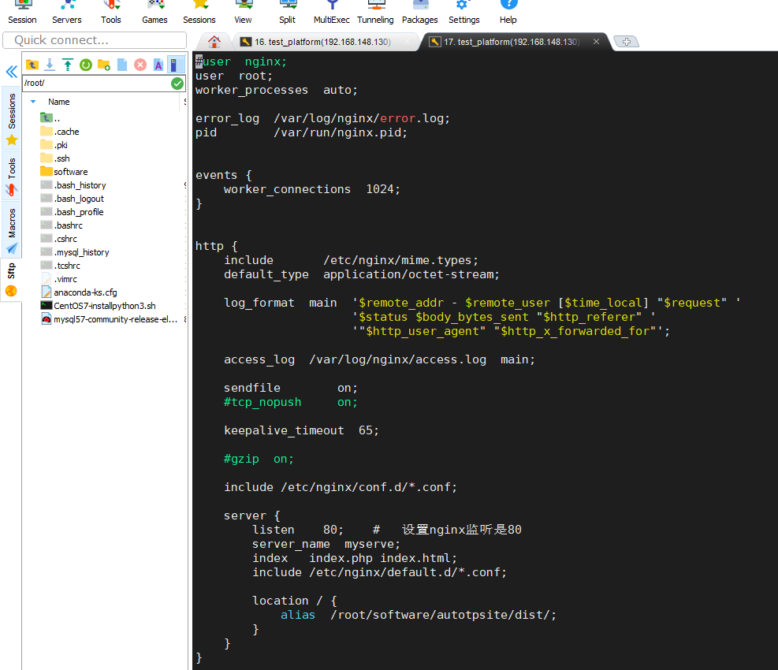
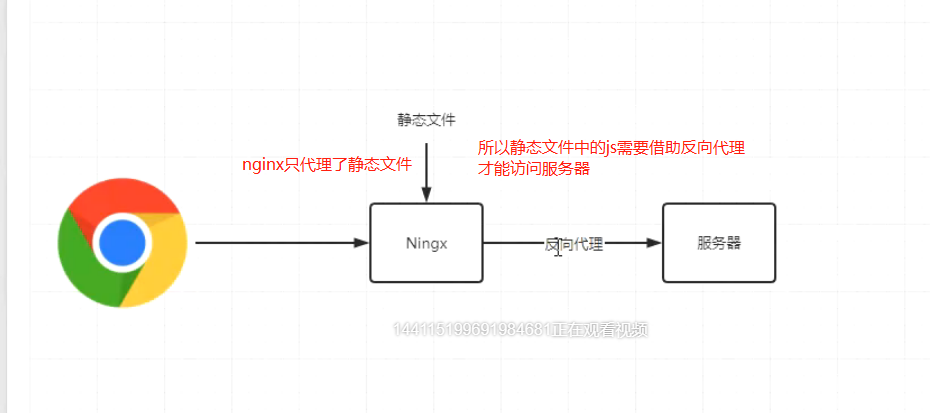
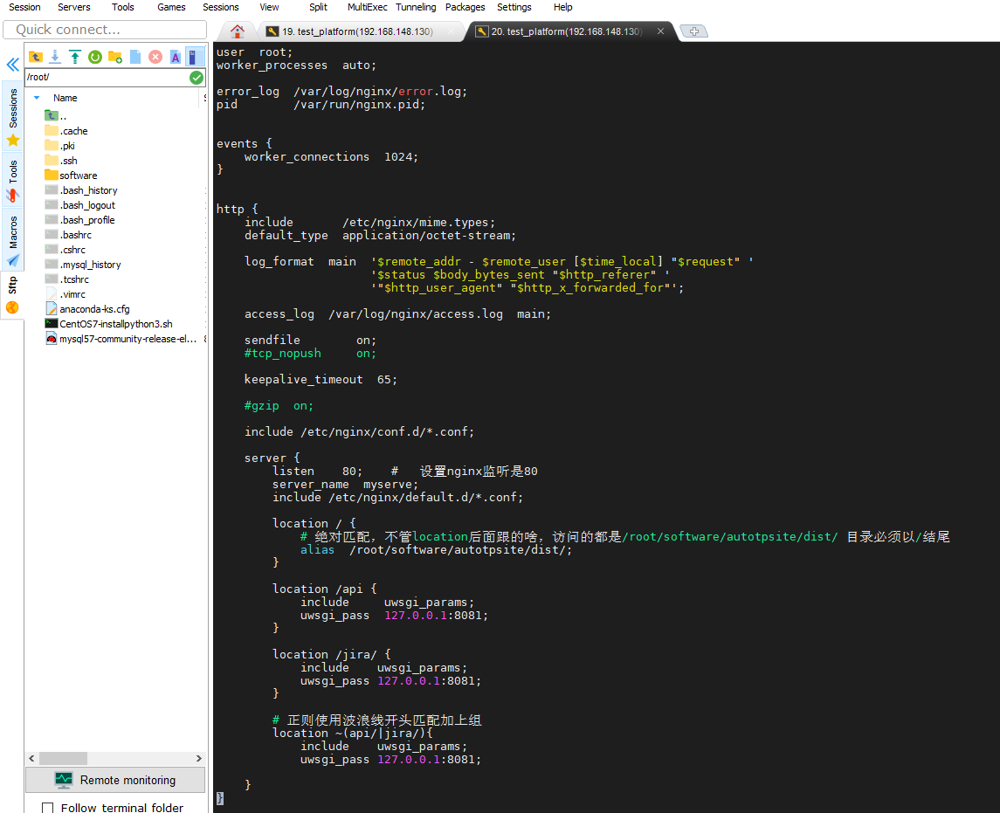
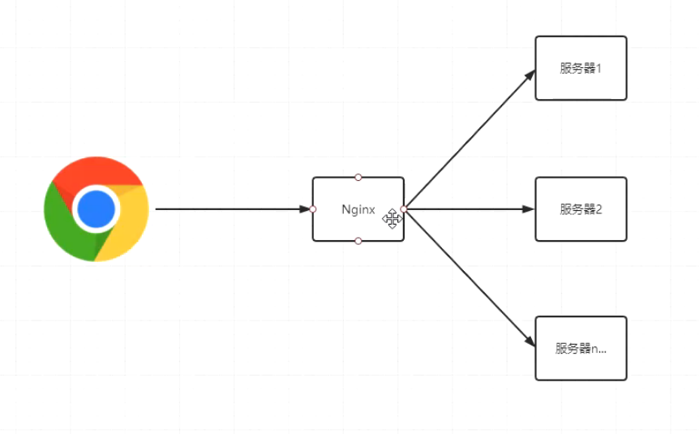
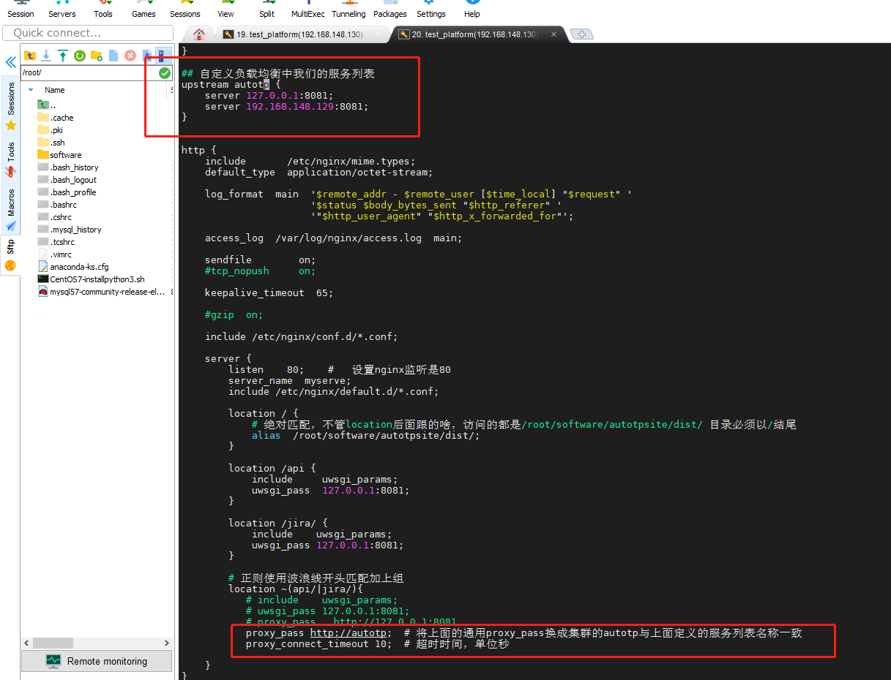

### 什么是Nginx

    Nginx 是一个高性能的 http 和反向代理服务器，其特点是占用内存小，并发能力强。 Nginx 专为性能
    
### Nginx可以从事的用途

    * web服务器
        提供Web信息浏览服务。它只需支持HTTP协议、HTML文档格式及URL
        
    * 反向代理
        正向代理：在浏览器中配置代理服务器，通过代理服务器进行互联网访问
        
        反向代理：将请求发送到反向代理服务器，由反向代理服务器去选择目标服务器获取数据后，再返回给
        客户端，此时反向代理服务器和目标服务器对外就是一个服务器，暴漏的是代理服务器地址
        
    * 负载均衡
        如果请求数过大，单个服务器解决不了，我们增加服务器的数量，然后将请求分发到各个服务器上，将
        原先请求集中到单个服务器的情况改为请求分发到多个服务器上，就是负载均衡
        
### Nginx安装

    nginx安装卸载参考文档：https://www.cnblogs.com/huiyi0521/p/10253341.html

    CentOS安装
        1、第一次安装首先更新centos的yum源
            参考文档：https://blog.csdn.net/xiaojin21cen/article/details/84726193
            如果没有对应的源，就再次添加，参考文档：https://blog.csdn.net/snow_small/article/details/78672976
            
        2、使用命令安装：yum install -y nginx
        
        3、仅输入命令：nginx 默认监听的是80端口
        
        4、查看进程：ps -ef | grep nginx
        
        5、systemctl start nginx  启动nginx
        
          重启nginx服务
            systemctl daemon-reload
            systemctl restart nginx
            systemctl status nginx
     
        
### Nginx配置
    
    Nginx配置概要
    nginx本身作为一个完成度非常高的负载均衡框架，和很多成熟的开源框架一样，大多数功能都可以通过
    修改配置文件来完成，使用者只需要简单修改一下nginx配置文件，便可以非常轻松的实现比如反向代
    理，负载均衡这些常用的功能，同样的，和其他开源框架比如tomcat一样，nginx配置文件也遵循着相
    应的格式规范，并不能一顿乱配，在讲解如何使用nginx实现反向代理，负载均衡等这些功能的配置前，
    我们需要先了解一下nginx配置文件的结构
    
    既然要了解nginx的配置文件，那我总得知道nginx配置文件在哪啊，nginx配置文件默认都放在nginx安
    装路径下的conf目录，而主配置文件nginx.conf自然也在这里面，我们下面的操作几乎都是对
    nginx.conf这个配置文件进行修改
    可是，我怎么知道我nginx装哪了？我要是不知道nginx装哪了咋办？
    这个，细心的朋友们可能会发现，运行nginx -t命令，下面除了给出nginx配置文件是否OK外，同时也包
    括了配置文件的路径
    
    配置文件位置
        * /etc/nginx/nginx.conf  主配置文件
        * /etc/nginx/conf.d/*.conf 次配置文件
        * /etc/nginx/default.d/*.conf 次配置文件    

    1、输入命令查看conf路径：nginx -t
    nginx: configuration file /etc/nginx/nginx.conf test is successful

    2、输入vi命令进入conf文件：vi /etc/nginx/nginx.conf 修改如下
        该命令可查看nginx启动用户：ps aux | grep "nginx: worker process" | awk '{print $1}'

    
    3、仅用端口号访问页面，返回403Forbidden
    
        
    4、分析nginx.conf文件
        通常将nginx配置文件分为三大块，全局块，events块，http块
        * 第一部分全局块
            我们称之为全局块，知识点呐朋友们，要记住，这里呢，主要会设置一些影响 nginx 服务器整体运行的
            配置指令，主要包括配 置运行 Nginx 服务器的用户（组）、允许生成的 worker process 数，进程 PID 
            存放路径、日志存放路径和类型以及配置文件的引入等
            
        user nginx;  运行nginx服务器的用户（组）
        worker_processes auto;  允许生成的work process数，处理请求的子进程，master是用来调度的，例如：systemctl status nginx
        error_log /var/log/nginx/error.log;  日志存放路径
        pid /run/nginx.pid;  进程PID存放路径
        
        # Load dynamic modules. See /usr/share/doc/nginx/README.dynamic.
        include /usr/share/nginx/modules/*.conf;
        
            比如 worker_processes auto； 这一行，worker_processes 值越大，我们nginx可支持的并发数量就越
            多，很多人想这不就爽了吗，我设置成正无穷，无限并发flag达成，秒杀问题轻松解决，这个，受自己
            服务器硬件限制的，不能乱来。设置auto表示会自动根据当前cpu的核心数来分配worker,规则是1个核心1个worker
            
        * 第二部分events块
            events 块涉及的指令主要影响 Nginx 服务器与用户的网络连接，常用的设置包括是否开启对多work_process 
            下的网络连接进行序列化，是否允许同时接收多个网络连接，选取哪种事件驱动模型来处理连接请求，每个work_process可以同时支持的最大连接数等
            
        events {
            worker_connections 1024 # 同时接收网络连接最大数
        }
        
        * 第三部分http块
            http 全局块配置的指令包括文件引入、MIME-TYPE 定义、日志自定义、连接超时时间、单链接请求数上限等
            
            而http块中的server块则相当于一个虚拟主机，一个http块可以拥有多个server块
            server块又包括server全局块，和location块
            全局server块主要包括了本虚拟机主机的监听配置和本虚拟主机的名称或 IP 配置
            
            location块则用来对虚拟主机名称之外的字符串进行匹配，对特定的请求进行处理。前端地址重定向、数据缓
            存和应答控制等功能，还有许多第三方模块的配置也在这里进行。比如，对/usl相关的请求交给8080来
            处理，/admin则较给8081处理（支持正则表达式）
            
### Nginx配置实战

    Pycharm中settings.py文件先设置DEBUG=False，提交到远程仓库，linux中拉取代码
    linux中使用uwsgi --reload uwsgi8081.pid 重启配置进程文件
    然后linux中将nginx.conf配置文件中的user nginx 改成 user root 否则无法访问

    1、配置web服务器
        将我们上1节课程部署到linux上的静态文件代理给Nginx处理。当我们访问服务器IP时，可以自动帮我们返回静态文件主页
        (1) ngnix -t 查看配置文件路径并进入
        vi /etc/nginx/nginx.conf 
        
        (2)修改配置文件如下
        

        
        (3)重启nginx服务
            systemctl daemon-reload
            systemctl restart nginx
            systemctl status nginx
            
        （4）前端使用端口号192.168.148.130访问
            返回403forbindden
            * 1、由于启动用户和nginx工作用户不一致所致
              查看nginx的启动用户，发现是nobody，而为是用root启动的
              命令：ps aux | grep "nginx: worker process" | awk '{print $1}'
              
            * 将nginx.config的user改为和启动用户一致
              命令：vi conf/nginx.conf
              
            * 2、缺少index.html或者index.php文件，就是配置文件中index index.html index.htm这行中的指定的文件
                server {
                    listen 80;
                    server_name localhost;
                    index index.php index.html;
                    root /data/www/;
                }
                
                如果在/data/www/下面没有index.php,index.html的时候，直接文件，会报403 forbidden
                
            * 3、SELinux设置为开启状态（enabled）的原因
                查看当前selinux的状态
                命令：/usr/sbin/sestatus
                
                将SELINUX=enforcing 修改为 SELINUX=disabled 状态
                vi /etc/selinux/config
                #SELINUX=enforcing
                SELINUX=disabled
                
                重启生效。reboot
                reboot
                
        (5)再次前端使用192.168.148.130/index.html访问
            可以访问页面，但是没有数据展示，原因是没有给端口后拼接后的路径进行转发，例如192.168.148.130/jira/list/project/?page_sige=5&page_index=1
            其中/jira/list/project/?page_sige=5&page_index=1路径没有转发，这种转发可以理解为是反向代理
        
        
    2、部署反向代理
    

        反向代理服务器和目标服务器对外就是一个服务器，暴露的是代理服务器地址，隐藏了真实服务器IP地址（实际代理的是服务端）
        
        前面我们访问服务器的时候，只能返回静态文件，而静态文件中的Ajax请求全部失效了，原因就是web
        服务没有代理app服务，app服务是由uWSGI代理的。所以我们要做的就是将发送app服务的请求转给uWSGI就可以了
        
        (1) 配置文件修改如下
            其中转发可以使用通用的 proxy_pass http://127.0.0.1:8081
            uwsgi.ini文件的socket改为http-socket
        

        
    3、部署负载均衡
        在nginx中配置负载均衡也是十分容易的，同时还支持了多种负载均衡策略供我们灵活选择。为了演示逼
        真，我准备了两台虚拟机，当然你也可以在一台机器上部署两个不同端口的服务，都可以模拟
        
        存在的分配方式：轮询是默认方式；流量分配；权重分配；iphash分配
        

        如果添加weight=1;值，则表示由轮询分配变为权重分配，权重越大分配概率越大
         upstream myserver{
             server 127.0.0.1:8081 weight=1;
             server 192.168.21.142:8081 weight=2;
         }
         
         set nu 显示Linux行的编号
         
         ip_hash分配可以和权重配合使用：第一次转发到A服务器这个ip就绑定到A服务器，以后就一直访问这个服务器
         数据库不是同一个就可能出现session不同步，这种分配可以解决（接口需要测试的问题，客服端需要绑定服务器）
         upstream myserver{
            ip_hash
            server 127.0.0.1:8081 weight=1;
            server 192.168.21.142:8081 weight=2;
         }
            
### Nginx自带常用命令

    nginx -s stop 快速关闭Nginx，可能不保存相关信息，并迅速终止web服务
    nginx -s quit 平稳关闭Nginx，保存相关信息，有安排的结束web服务(有请求时，会等待请求完再关闭)
    nginx -s reload 因改变了Nginx相关配置，需要重新加载配置而重载
    nginx -s reopen 重新打开日志文件
    nginx -c filename 为Nginx指定一个配置文件，来代替缺省的
    nginx -t 不运行，仅仅测试配置文件。nginx 将检查配置文件的语法的正确性，并尝试打开配置文件中所引用到的文件
    nginx -v 显示 nginx 的版本
    nginx -V 显示 nginx 的版本，编译器版本和配置参数
    
### Nginx启动
    在centos7+ 启动nginx服务：systemctl start nginx
    centos6+ 上启动nginx服务：service nginx start
    简单粗暴一句，通过这种方式启动nginx 使用systemctl status nginx查看的状态是未运行nginx
    
### Nginx停止
    在centos7+ 停止nginx服务：systemctl stop nginx
    centos6+ 上停止nginx服务：service nginx stop
    粗鲁的停止：nginx -s stop
    优雅的停止，Nginx在退出前完成已经接受的连接请求：nginx -s quit
    
### Nginx重启
    当我们修改了nginx的某些配置，为了使配置生效，我们往往需要重启nginx，同样的，linux下依然有两
    种方式来重启我们的nginx服务:
    
    在centos7+ 重启nginx服务：systemctl restart nginx
    centos6+ 上重启nginx服务：service nginx restart
    使用nginx命令停止，推荐这个：nginx -s reload
    
    而具体使用nginx原生的nginx -s 操作还是linux提供的systemctl ，这个主要看个人喜好，实际两者的功能是差不多的，并没有什么明显的不同