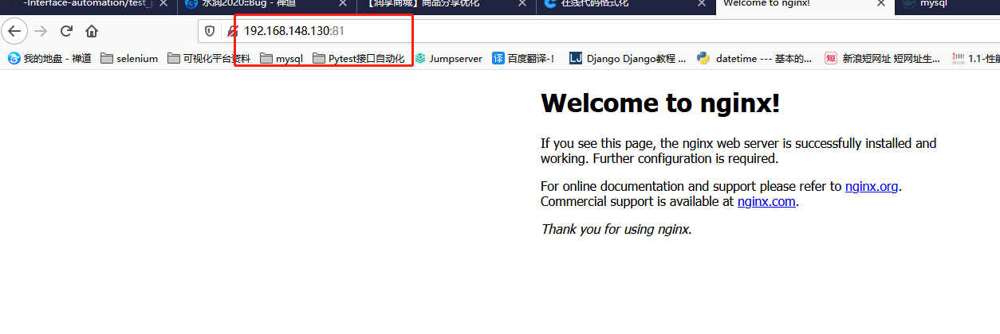
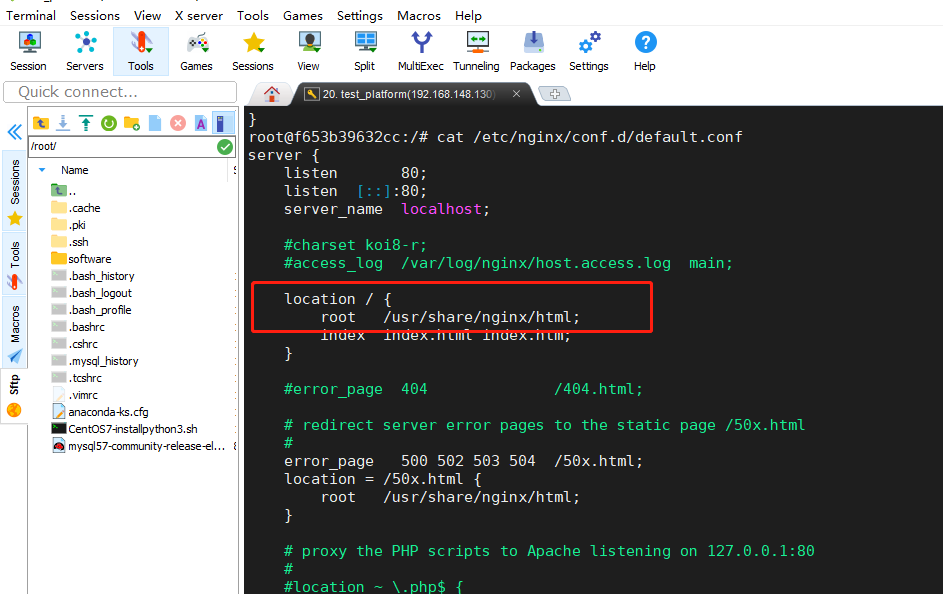
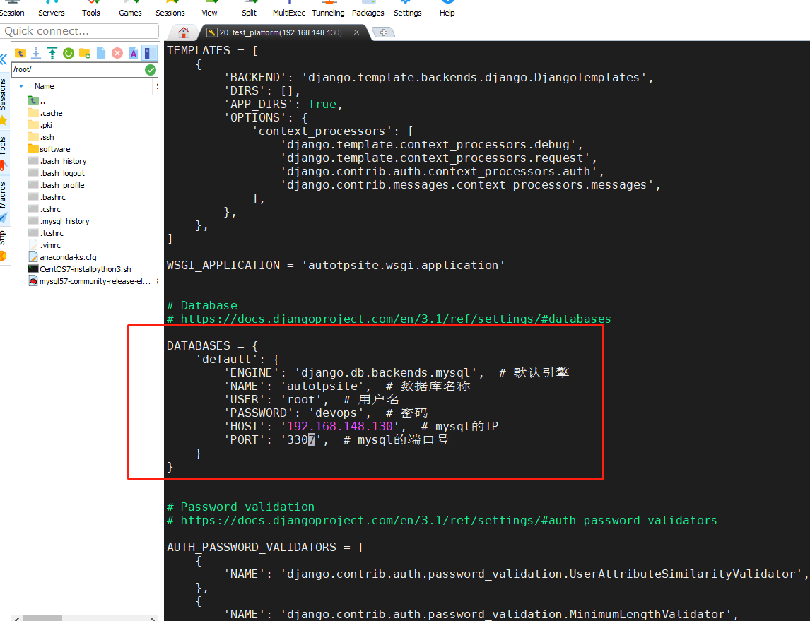
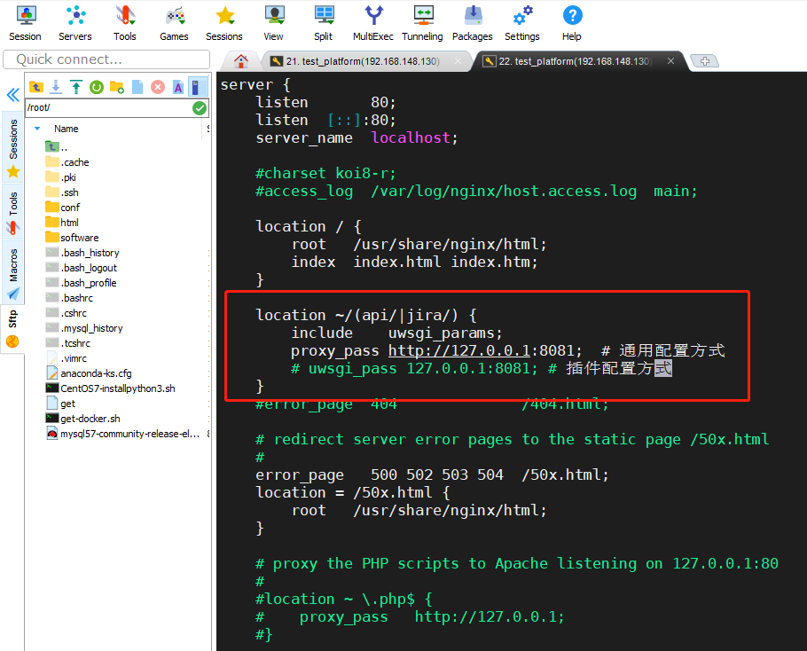
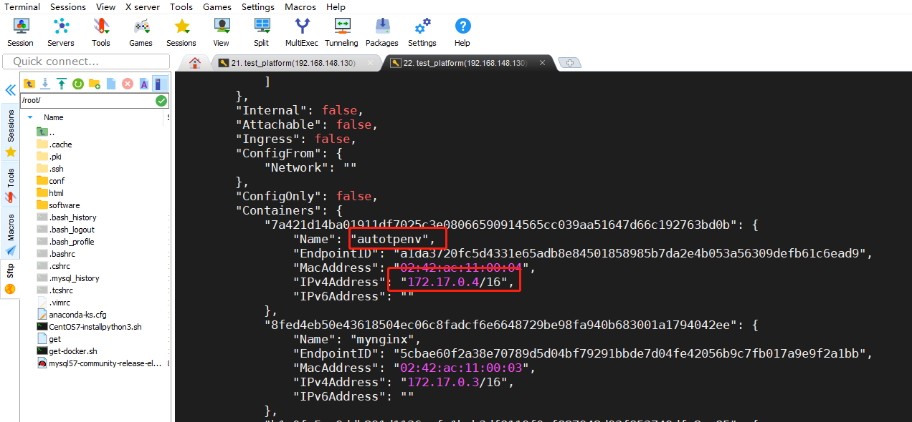
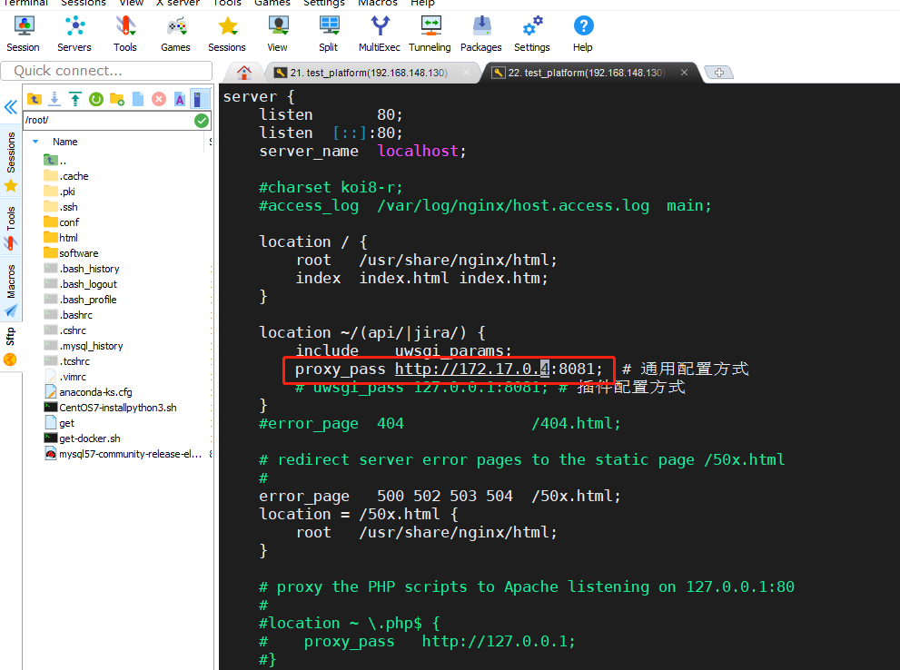

### Docker简介

    由go语言开发的容器应用，目前最流行的容器解决方案
    docker ee: 企业版
    docker ce: 社区版
    
### Docker安装

    准备CentOs7操作系统
    1、使用脚本自动按照——docker
        命令一：curl -fsSL get.docker.com -o get-docker.sh
        命令二：sh get-docker.sh --mirror Aliyun
        
    2、启动docker进程
        systemctl enable docker #设置默认开机启动
        systemctl start docker #启动docker
        
    3、检查docker是否安装成功
        [root@localhost ~]# docker --version
        Docker version 20.10.6, build 370c289
        
### 配置docker国内源
    /etc/docker/daemon.json 中写入如下内容（如果文件不存在请新建该文件:mkdir /etc/docker&&touch daemon.json）
   
```python
{
    "registry-mirrors": [
        "https://docker.mirrors.ustc.edu.cn",
        "https://registry.docker-cn.com",
        "https://hub-mirror.c.163.com",
        "https://mirror.ccs.tencentyun.com",
        "https://reg-mirror.qiniu.com"
    ]
}
``` 

    注意，内容格式必须符合json要求，否则会导致docker启动失败！建议直接赋值以上文本即可
    
    输入以下命令重启docker
        * systemctl daemon-reload
        * systemctl restart docker
        * systemctl status docker 查看docker状态
        
        
### Docker容器概念

    镜像：容器的模板，包括容器运行时所需的数据
    容器：运行中的进程，依赖镜像运行，镜像的具现化
    
    镜像可以看成是python中的类，容器则可以看做是类的实例化，一个类可以有多个对象，同理，一个镜像可以有多个容器
    容器只是运行程序，文件最好是外部提供或映射
    
### 镜像相关命令
    docker images  # 查看镜像
    docker pull 镜像:Tag  # 拉镜像
        如果不清楚有哪些镜像，可以登录Docker Hub查看，有提供命令参考，Tag表示对应程序版本
        
    docker push 镜像:Tag  # 推送镜像
    docker rmi 镜像ID或者镜像名  # 删除镜像，需要提前删除对应的容器
    
### 容器的相关命令

    有了镜像，我们可以基于镜像来运行容器    
    docker run <options> 镜像:tag commands   新建一个容器并启动
        options表示选项，用于运行容器时一些额外的配置，commands表示运行在容器内部
        的命令，比如容器内部要运行一个python脚本，commands可以替换为python commands常用的选项有
        * -d 指定容器运行后台
        * -i 用于控制台交互
        * -t 支持终端登录，通常和-i参数一起使用
        * -p 映射容器端口，用法：-p 宿主机端口:容器端口
        * -v 挂载容器存储卷，用法：-v 宿主机路径:容器路径
        * -e 设置容器的环境变量用于容器内的应用程序进行相关配置，用法 -e 环境变量名:变量值
        * --name=“container_name” 指定容器的名称
        * --rm 退出容器时删除容器 与--restart冲突
        * --restart=“always” 停止容器时是否自动重启 与 --rm冲突
        案例：运行一个mysql容器：docker run -itd -p 3306:3306 -e MYSQL_ROOT_PASSWORD=devops mysql:5.7
        其中-p 3306:3306 表示宿主机端口:容器端口，-e MYSQL_ROOT_PASSWORD=devops表示设置mysql登录密码
        注意只要宿主机端口更换就可以生成多个mysql容器
        
    docker stop 容器ID或名称    停止运行中的容器
    docker start 容器ID或名称   启动停止的容器
    docker restart 容器ID或名称 重启容器
    docker ps 查看容器
    
### docker练习

    想要运行容器必须提前下载好对应的镜像，比如我们想运行一个mysql5.6版本的容器，那么我们需要先
    在本地有这个镜像才能运行
    
    镜像需要在镜像仓库上去下载，就像代码是托管在代码仓库上的，默认情况下我们需要从公有仓库上下载镜像
    默认镜像仓库dockerhub上有海量的镜像供我们选择，我们构建环境的时候可以直接下载其中的镜像来使用
    
    可以在Docker Hub上注册账号 ：hub.docker.com
    
    1、docker pull mysql:5.7  拉取mysql5.7版本镜像安装
    
    2、拉取的镜像默认保存到了系统的 /var/lib/docker/ 目录下面，可以通过一个简单的命令查看当前系统有哪些docker镜像：docker images
    
    3、启动容器： docker run -itd -p 3307:3306 -e MYSQL_ROOT_PASSWORD=devops mysql:5.7
       mysql服务默认监听3306端口，但是容器内部的网络和宿主机不在一个网段，所以我们把该端口映射到
       了宿主机的3307端口，现在我们通过访问宿主机的3307端口就可以访问mysql了
       
       此时我们的进程是运行在前台的，如果关闭窗口就可能造成容器进程退出，所以如果想让容器一直不退
       出，可以在运行的时候加上-d参数，让容器进程作为守护进程
       
    4、此时可以通过 docker ps 命令查看运行中的容器：docker ps
        
    5、若容器在运行过程中发生异常而退出，docker ps命令是看不到终止的进程的，可以通过-a参数列出所有
    的进程，包括已经停止的(状态为Exited)：docker ps -a
    
    6、我们可以通过start和stop 来启动或停止一个容器 参数为容器ID或者容器名
    
### Nginx和Docker项目容器化

    Nginx容器化
    
    1、部署Nginx
       docker run -it -d -p 81:80 --name mynginx --rm nginx
       其中-p 81:80为宿主机端口:容器端口，--name mynginx表示指定容器名称为mynginx，--rm nginx表示停止容器后自动删除容器
       注意：本地没有镜像会自动从镜像仓库拉取镜像
            docker底层不是使用firewall-cmd这个防火墙工具，防火墙和防火墙管理工具是不同的东西，docker底层使用的是iptables
            所以使用firewall-cmd是看不到这个防火墙的，docker启动后会动态的将映射的端口开启防火墙，停止后会自动关闭，所以就
            算被攻击也是只暴露了容器
            
            上面的命令只做了目录映射，没有做端口的映射
       
    2、前端访问宿主机地址，页面显示如下图
       192.168.148.130:81
       


    3、以shell的方式进入容器
       docker exec -it mynginx bash
       mynginx为容器名称
       
    4、nginx -t 查看主配置文件路径
    
    5、cat /etc/nginx/conf.d/default.conf
      查看server块配置文件的路径

    6、退出容器，从容器拷贝nginx的配置文件到宿主机，方便后续修改，因为容器内没有vi命令不方便修改（即服务的静态页面同步到宿主机地址页面，为目录映射）
       docker cp mynginx:/etc/nginx conf
       命令格式为：docker cp 容器名或ID:容器nginx配置文件目录 本地目录
       
    7、因为路径是转发到html下的，如下图，所以
       原本的静态文件在ls software/autotpsite/dist/此目录下，所以还需要挂载上面拷贝到宿主机的配置文件conf和静态文件
       (1) 先将静态文件拷贝到html目录：cp -rf /root/software/autotpsite/dist html
       (2) 然后停止容器： docker stop mynginx
       
    8、重新以挂载目录-v的方式启动Nginx
       （-v 后加绝对路径，PWD表示当前目录）
       -v 宿主机地址：容器地址（其中这里的宿主机地址是linux的）
       "$PWD/conf":/etc/nginx  映射配置文件
       "$PWD/html":/usr/share/nginx/html  映射静态文件
       docker run -it -d -p 81:80 -v "$PWD/conf":/etc/nginx -v "$PWD/html":/usr/share/nginx/html --name mynginx --rm nginx
       
    9、前端浏览器访问192.168.148.130:81
       可访问前端页面
       

       

### 部署后台服务
    Django项目容器化（部署测试平台后台服务 Django+uwsgi）
    测试平台用Docker部署，并可以通过Nginx访问后台
    
    1、首先服务都依赖Python3，所以拉取python3镜像
       git pull python:3.8
       
    2、查看镜像：docker images
    
    3、启动容器-挂载后端目录
       /root/software/autotpsite表示宿主机测试平台项目的目录，/opt表示容器目录，python:3.8表示指定镜像标签
      docker run -it -d -v /root/software/autotpsite:/opt --rm --name autotpenv python:3.8
      
    4、修改宿主机uwsgi.ini配置文件
       因为进入容器内部以后宿主机的环境和容器的环境是不一样的，所以不可以用绝对路径，需要所有路径都改成相对路径
       vi software/autotpsite/uwsgi.ini
       
```ini
[uwsgi]
chdir = ./
# 项目根目录
module = autotpsite.wsgi:application
# 指定wsgi模块下的application对象
http-socket = 0.0.0.0:8081
# 对本机8081端口提供服务
master = true
# 主进程
pidfile = ./uwsgi8081.pid
# pid文件，用于脚本启动、停止该进程
daemonize = ./uwsgi_server.log
# 只记录错误信息
disable-logging = true
socket-timeout=10

# 以上4个是核心配置项
# vhost = true //多站模式
# no-site = true //多站模式时不设置入口模块和文件
# workers = 2 //子进程数
# reload-mercy = 10
# vacuum = true //退出、重启时清理文件
# max-requests = 1000
# limit-as = 512
# buffer-size = 30000
```
    5、进入容器
       docker exec -it autotpenv bash
       
    6、执行安装库的操作
       (1) 切换到容器中的项目目录下：cd opt/
       (2) 因为安装的库都在requirements.txt，所以使用命令：pip install -r requirements.txt -i http://pypi.douban.com/simple/ --trusted-host pypi.douban.com
       (3) 使用命令: python manage.py runserver 测试mysql的连接是否有问题
       可能出现mysql连接不上问题，则需要退出容器，先修改项目的配置文件中数据库连接信息
       (4) 退出容器修改配置文件，进入autpsite项目文件目录下：vi autotpsite/settings.py
           修改成局域网ip和端口：先查看局域网ip docker network inspect bridge（注意端口号不可以使用映射的）
       (5) 然后再进入容器使用命令测试：python manage.py runserver
           如果报错sqtp.Module.project: (fields.E307) The field sqtp.Module.project was declared with a lazy reference to 'sqtp.module', but app 'sqtp' doesn't provide model 'module
           可能是项目存在同名文件夹造成的
       (6) 如果nginx代理的前端文件和后台不是同一台机器就会出问题，需要settings.py文件设置跨域请求
       


    7、安装uWSGI服务
        pip install uwsgi  -i http://pypi.douban.com/simple/ --trusted-host pypi.douban.com
        cat uwsgi.ini配置文件中，如果nginx的配置用的是uwsgi插件方式的就使用socket=0.0.0.0:8081，如果nginx配置的是通用方式就使用http-socket
        然后修改配置文件中路径为相对路径，上面操作已修改过则不再修改
        
    8、启动uWSGI
       uwsgi uwsgi.ini
       tail -f uwsgi_server.log查看日志
        
    9、退出容器exit，配置nginx的配置文件
       命令：docker ps  
       可以看到容器环境调试OK，但是autotpsite容器的端口没有暴露出来，为了下次方便随时启动新容器，我们可以把容器内部的操作写成shell
       命令：vi conf/conf.d/default.conf
       


    10、重启nginx
        docker restart mynginx
        发现还是无法访问，因为容器的网络是和主机隔离的，有自己的一套网络
        
    11、查看主机网络：ip addr    
        查看主机的虚拟网络发现有个docker0网卡，这个是docker使用的网卡，docker就通过这个网卡来进行网络通信
       
    12、查看容器有哪些网络
        docker network ls
        默认情况容器是挂载在bridge网络的，所以可以查看bridge网络的信息，查询到相关容器的内部IP，然后通过内部IP互相访问
        
    13、查看bridge网络的信息
        docker network inspect bridge
        这里可以看到后台服务autotpenv的IP是172.17.0.4/16 （16是子网掩码）
         


    14、再次修改配置文件ip后，再次重启nginx（这种修改ip的方式是临时的，因为重启容器后ip是会变化的）
        vi conf/conf.d/default.conf 
        docker restart mynginx
        

       
    15、前端浏览器注册登录访问即可
        http://192.168.148.130:81/login.html
        
    总结：使用了nginx反向代理，客户端浏览器是先访问nginx端口，然后nginx代理后端暴露映射的端口
    
    附录：
    查看uwsgi日志：tail -f uwsgi_server.log
  
    查看容器详细信息：docekr inspect 容器ID/名称
  
    卸载docker
    1、先杀死所有运行容器
    docker kill $(docker ps -a -q)

    2、删除所有容器
    docker rm $(docker ps -a -q)

    3、删除所有镜像
    docker rmi $(docker images -q)

    4、停止docker服务
    systemctl stop docker

    5、删除存储目录
    rm -rf /etc/docker
    rm -rf /run/docker
    rm -rf /var/lib/dockershim
    rm -rf /var/lib/docker
    如果发现无法删除需要先umount，如 umount /var/lib/docker/devicemapper

    6、卸载docker
    查看已安装的docker包
    yum list installed | grep docker
   
    卸载相关包
    yum remove -y containerd.io.x86_64 docker-ce.x86_64 docker-ce-cli.x86_64
    
    
    
    
    
       
    
       
    
    
    

    
    
    
    
    
    
    
    
    
    
    
    
    