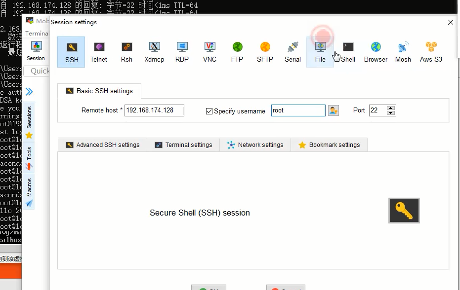

### docker网络知识

    docker run 创建Docker容器时，可以用 --net选项指定容器的网络模式Docker有以下4种网络模式：
    * host 模式，使用 --net=host 指定
    * container 模式，使用 --net=container:NAMEorID 指定
    * none 模式，使用 --net=none 指定
    * bridge 模式，使用 --net=bridge 指定，默认设置
    
### host 模式

    如果启动容器的时候使用 host 模式，那么这个容器将不会获得一个独立的 Network Namespace，而是
    和宿主机共用一个 Network Namespace。容器将不会虚拟出自己的网卡，配置自己的 IP 等，而是使用
    宿主机的 IP 和端口
    
    例如，我们在 10.10.101.105/24 的机器上用 host 模式启动一个含有 web 应用的 Docker 容器，监听
    tcp 80 端口。当我们在容器中执行任何类似 ifconfig 命令查看网络环境时，看到的都是宿主机上的信
    息。而外界访问容器中的应用，则直接使用 10.10.101.105:80 即可，不用任何 NAT 转换，就如直接跑
    在宿主机中一样。但是，容器的其他方面，如文件系统、进程列表等还是和宿主机隔离的
    
### container 模式

    这个模式指定新创建的容器和已经存在的一个容器共享一个 Network Namespace，而不是和宿主机共
    享。新创建的容器不会创建自己的网卡，配置自己的 IP，而是和一个指定的容器共享 IP、端口范围等。
    同样，两个容器除了网络方面，其他的如文件系统、进程列表等还是隔离的。两个容器的进程可以通过
    lo 网卡设备通信
    
### none模式

    这个模式和前两个不同。在这种模式下，Docker 容器拥有自己的 Network Namespace，但是，并不为
    Docker容器进行任何网络配置。也就是说，这个 Docker 容器没有网卡、IP、路由等信息。需要我们自
    己为 Docker容器添加网卡、配置 IP等
    
### bridge模式

    bridge 模式是 Docker 默认的网络设置，此模式会为每一个容器分配 Network Namespace、设置 IP 
    等，并将一个主机上的 Docker 容器连接到一个虚拟网桥上。当 Docker server 启动时，会在主机上创
    建一个名为 docker0 的虚拟网桥，此主机上启动的 Docker 容器会连接到这个虚拟网桥上。虚拟网桥的
    工作方式和物理交换机类似，这样主机上的所有容器就通过交换机连在了一个二层网络中。接下来就要
    为容器分配 IP 了，Docker 会从 RFC1918 所定义的私有 IP 网段中，选择一个和宿主机不同的IP地址和
    子网分配给 docker0，连接到 docker0 的容器就从这个子网中选择一个未占用的 IP 使用。如一般
    Docker 会使用 172.17.0.0/16 这个网段，并将 172.17.42.1/16 分配给 docker0 网桥（在主机上使用
    ifconfig 命令是可以看到 docker0 的，可以认为它是网桥的管理接口，在宿主机上作为一块虚拟网卡使用）
    

    
### 容器通信

    容器通信可以采用的有四种方案：
        * 通过容器 IP 访问：容器重启后，IP 会发生变化，比较麻烦
        * 通过宿主机的 ip:port 的方式访问：如果宿主机IP改变，就得每个应用都得改一遍，并且还要绑定端口，麻烦
        * 通过 link 建立链接：相互依赖的太紧，不利于维护，已经不再支持此方式
        * 自定义 network: 在同一个桥接网络中的容器可以相互访问，即使切换了宿主机，也不影响，因为可以通过容器名来表示对方的IP
        
### 容器通信实战

    查看网络：docker network ls 网络默认挂载在bridge中  
    删除网络：docker network remove autpwork （删除之前网络下不能有挂载的容器） 
    查看docker相关组件信息，网络挂载了哪些容器：docker network inspect bridge
    Containers包含了容器信息

    第四种方案采用的是bridge网络驱动模式，这个是docker默认的网络驱动模式，安全性高，性能好
    1、首先创建自定义网络
       docker network create -d bridge autotpnet
       默认是bridge驱动模式，所以可以简写成:docker network create autotpnet
       
    2、查看是否创建成功
       docker network ls
       
    3、将需要用的容器（autotpenv、mynginx）加入到该网络中，注意容器只能同时存在1个网络中，即从默认的网络重新挂载到新建的网络上
       docker network connect 网络名 容器名
      
       将Nginx和Django后端项目容器加载到新网络中
       docker network connect autotpnet mynginx
       docker network connect autotpnet autotpenv
       
       注意如果需要将容器从网络中删除使用：docker network disconnect autotpnet mynginx
       docker network inspect autotpnet 查看Containers内容则为空
       
    4、此时进入mynginx容器，尝试用后端的容器名进行通信，容器内不可以使用ping命令，所以用curl命令
       curl http://autotpenv:8081/index.html 或访问存在页面curl http://autotpenv:8081/jira/list/project/?page_size=5&page_index=1
       如果容器内部有ping，可以直接ping
       ping autotpenv
       
    5、退出容器，修改nginx配置文件，server块内容将ip换成容器名称,保存
       vi conf/conf.d/default.conf 这里换成你映射出的nginx配置文件
       然后进入nginx容器内部测试
       docker exec -it mynginx bash
       nginx -t 
       nginx -s reload
       curl http://autotpenv:8081/jira/list/project/?page_size=5&page_index=1
       退出容器exit
       

       
```python
location ~/(api/|jira/){
     # include uwsgi_params;
     # uwsgi_pass 172.17.0.5:8081;
     proxy_pass http://autotpenv:8081;
}
```
    6、重启ningx服务，进行访问
       nginx -s reload
    
    7、那么接下来，我们将容器从网络中解除挂载
       docker network disconnect autotpnet mynginx
       docker network disconnect autotpnet autotpenv
       docker network inspect autotpnet 查看Contains是已经没有容器了
       
    8、然后再次访问服务，发现也可以访问，这是为啥呢?
       docker inspect autotpenv
       因为容器又回到了默认的网络brigde, 其实默认的网络bridge模式下就可以实现容器间通过容器的名
       称进行访问，只是我们新建了一个网络将其和其他容器进行了网络隔离，这也是生产中运用的一个重要
       的原则---应用网络隔离, 不同应用无需每个容器之间都要互通，只要保留了主要网络接口能够进行业务上的通信即可
       
    附录
        可运行时直接指定一个网络（--net=autotpnet nginx 其中autotpnet为自定义网络名）
        先停止nginx：docker stop mynginx
        运行时指定网络：docker run -it -d -p 81:80 -v "$PWD/conf":/etc/nginx -v "$PWD/html":/usr/share/nginx/html --name mynginx --rm nginx  --net=autotpnet nginx
        查看是否创建网络成功：docker network ls
   
### 自定义镜像-dockerfile概述
    
    目前的Django后端容器，这个容器并不是我们直接下载镜像就可以使用的。
    而是下载了Python镜像后，基于此容器进行了环境安装，和代码拷贝才完成环境正常运行。
    虽然我们将环境安装做成了脚本，但是每次启动容器的时候都要重新安装环境，会降低app启动速度。
    所以我们需要一个镜像，包含我们Django服务运行所需的环境，这样我们每次基于这个镜像来启动服务
    就可以即开即用，大大提高了运行速度
    
    django为了我们提供了一个非常方便的镜像制作方法--dockerfile.
    
    Dockerfile 是一个文本文件，其内包含了一条条的指令(Instruction)，每一条指令构建一层，因此每一条
    指令的内容，就是描述该层应当如何构建
    
### FROM指定基础镜像

    所谓定制镜像，那一定是以一个镜像为基础，在其上进行定制。就像我们之前运行了一个 nginx 镜像
    的容器，再进行修改一样，基础镜像是必须指定的。而 FROM 就是指定 基础镜像，因此一个
    Dockerfile 中 FROM 是必备的指令，并且必须是第一条指令
    
    在 Docker Hub 上有非常多的高质量的官方镜像，有可以直接拿来使用的服务类的镜像，如 nginx 、
    redis 、 mongo 、 mysql 、 httpd 、 php 、 tomcat 等；也有一些方便开发、构建、运行各种语言应
    用的镜像，如 node 、 openjdk 、 python 、 ruby 、 golang 等。可以在其中寻找一个最符合我们最终
    目标的镜像为基础镜像进行定制。
    
    如果没有找到对应服务的镜像，官方镜像中还提供了一些更为基础的操作系统镜像，如 ubuntu 、
    debian 、 centos 、 fedora 、 alpine 等，这些操作系统的软件库为我们提供了更广阔的扩展空间。
    除了选择现有镜像为基础镜像外，Docker 还存在一个特殊的镜像，名为 scratch 。这个镜像是虚拟的
    概念，并不实际存在，它表示一个空白的镜像。
    
    FROM scratch
    ...
    
    如果你以 scratch 为基础镜像的话，意味着你不以任何镜像为基础，接下来所写的指令将作为镜像第
    一层开始存在。
        
    不以任何系统为基础，直接将可执行文件复制进镜像的做法并不罕见，对于 Linux 下静态编译的程序来
    说，并不需要有操作系统提供运行时支持，所需的一切库都已经在可执行文件里了，因此直接 FROM 
    scratch 会让镜像体积更加小巧。使用 Go 语言 开发的应用很多会使用这种方式来制作镜像，这也是为
    什么有人认为 Go 是特别适合容器微服务架构的语言的原因之一。
       
### RUN 执行命令

    RUN 指令是用来执行命令行命令的。由于命令行的强大能力， RUN 指令在定制镜像时是最常用的指令
    之一。其格式有两种：
        * shell格式： RUN <命令> 就像直接在命令行中输入的命令一样。刚才写的Dockerfile中的RUN指令就是这种格式
          RUN echo '<h1>Hello, Docker!</h1>' > /usr/share/nginx/html/index.html
          
        * exec 格式： RUN ["可执行文件", "参数1", "参数2"] ，这更像是函数调用中的格式。
          既然RUN就像Shell脚本一样可以执行命令，那么我们是否就可以像 hell脚本一样把每个命令对应一个RUN呢？比如这样
          
        FROM debian:stretch
        
        RUN apt-get update
        RUN apt-get install -y gcc libc6-dev make wget
        RUN wget -O redis.tar.gz "http://download.redis.io/releases/redis-5.0.3.tar.gz"
        RUN mkdir -p /usr/src/redis
        RUN tar -xzf redis.tar.gz -C /usr/src/redis --strip-components=1
        RUN make -C /usr/src/redis
        RUN make -C /usr/src/redis install
        
    之前说过，Dockerfile 中每一个指令都会建立一层， RUN 也不例外。每一个 RUN 的行为，就和刚才我
    们手工建立镜像的过程一样：新建立一层，在其上执行这些命令，执行结束后， commit 这一层的修
    改，构成新的镜像
    
    而上面的这种写法，创建了 7 层镜像。这是完全没有意义的，而且很多运行时不需要的东西，都被装进
    了镜像里，比如编译环境、更新的软件包等等。结果就是产生非常臃肿、非常多层的镜像，不仅仅增加
    了构建部署的时间，也很容易出错。 这是很多初学 Docker 的人常犯的一个错误。
    Union FS 是有最大层数限制的，比如 AUFS，曾经是最大不得超过 42 层，现在是不得超过 127 层。
    上面的 Dockerfile 正确的写法应该是这样
       
    FROM debian:stretch
    RUN set -x; buildDeps='gcc libc6-dev make wget' \
    && apt-get update \
    && apt-get install -y $buildDeps \
    && wget -O redis.tar.gz "http://download.redis.io/releases/redis-5.0.3.tar.gz" \
    && mkdir -p /usr/src/redis \
    && tar -xzf redis.tar.gz -C /usr/src/redis --strip-components=1 \
    && make -C /usr/src/redis \
    && make -C /usr/src/redis install \
    && rm -rf /var/lib/apt/lists/* \
    && rm redis.tar.gz \
    && rm -r /usr/src/redis \
    && apt-get purge -y --auto-remove $buildDeps
    
    首先，之前所有的命令只有一个目的，就是编译、安装 redis 可执行文件。因此没有必要建立很多层，
    这只是一层的事情。因此，这里没有使用很多个 RUN 一一对应不同的命令，而是仅仅使用一个 RUN 指
    令，并使用 && 将各个所需命令串联起来。将之前的 7 层，简化为了 1 层。在撰写 Dockerfile 的时候，
    要经常提醒自己，这并不是在写 Shell 脚本，而是在定义每一层该如何构建。
    
    并且，这里为了格式化还进行了换行。Dockerfile 支持 Shell 类的行尾添加 \ 的命令换行方式，以及行
    首 # 进行注释的格式。良好的格式，比如换行、缩进、注释等，会让维护、排障更为容易，这是一个比
    较好的习惯。
    
    此外，还可以看到这一组命令的最后添加了清理工作的命令，删除了为了编译构建所需要的软件，清理
    了所有下载、展开的文件，并且还清理了 apt 缓存文件。这是很重要的一步，我们之前说过，镜像是多
    层存储，每一层的东西并不会在下一层被删除，会一直跟随着镜像。因此镜像构建时，一定要确保每一
    层只添加真正需要添加的东西，任何无关的东西都应该清理掉。
    
    很多人初学 Docker 制作出了很臃肿的镜像的原因之一，就是忘记了每一层构建的最后一定要清理掉无
    关文件
    
### 构建镜像

    在Dockerfile文件所在目录执行：
    [root@localhost mynginx]# docker build -t mynginx:v1 .
    
    请注意命令后面的点
    从命令的输出结果中，我们可以清晰的看到镜像的构建过程。在 Step 2 中，如同我们之前所说的那
    样， RUN 指令启动了一个容器 5030a8db83a3 ，执行了所要求的命令，并最后提交了这一层
    e1dc0297343e ，随后删除了所用到的这个容器 5030a8db83a3 。
    
    这里我们使用了 docker build 命令进行镜像构建。其格式为：
    docker build [选项] <上下文路径/URL/->
    
    在这里我们指定了最终镜像的名称 -t nginx:v1 ，构建成功后，我们可以运行该镜像
    docker run -p 88:80 mynginx:v1
    
    访问192.168.21.142:88   看到Hello,Docker.
    
### 自定义Django后台镜像
    
    首先梳理我们启动项目的流程
    
    1.启动python容器，进入内部
    2.安装依赖库
    3.启动uWSGI服务
    第2、3部已经通过脚本auto_deploy.sh实现了，所以我们的流程可以很简化。
    在项目文件下新建Dockerfile
    
    FROM python:3.8
    COPY . /opt 
    RUN cd /opt && sh auto_deploy.sh
    
    修改auto_deploy.sh, 去掉cd /opt（因为和RUN命令里的重复了）
    pip install -r requirements.txt -i http://pypi.douban.com/simple/ --trusted-host 
    pypi.douban.com && \
    pip install uwsgi -i http://pypi.douban.com/simple/ --trusted-host
    pypi.douban.com && \
    uwsgi uwsgi.ini && \
    tail -f > /dev/null
    
    提交代码，同步代码，开始构建
    [root@localhost autotpsite]# docker build -t autotp:v1 .
    
    构建好了之后发现程序始终阻塞在
    [uWSGI] getting INI configuration from uwsgi.ini
    
    这个是因为我们代码中加入了
    tail -f > /dev/null
    
    这个是之前用来启动容器脚本，放在代码结束之后容器就退出的。但是现在放在镜像制作这里显然不合
    理，镜像制作应该只包含环境搭建的过程，至于项目启动命令应该放在容器启动之后再运行。
    那么怎么做才能让构建命令与容器运行命令分开呢。这里我们可以采用CMD指令，关于CMD和COPY命
    令可以参考附录，我们直接来看实际用法
    
    修改Dockerfile文件
    
    FROM python:3.8
    COPY . /opt
    RUN cd /opt && sh auto_deploy.sh
    CMD cd /opt && uwsgi uwsgi.ini && tail -f uwsgi_server.log
    
    修改auto_deploy.sh文件
    pip install -r requirements.txt -i http://pypi.douban.com/simple/ --trusted
    host pypi.douban.com && \
    pip install uwsgi -i http://pypi.douban.com/simple/ --trusted-host
    pypi.douban.com
    
    再次构建
    [root@localhost autotpsite]# docker build -t autotp:v1 .
    
    查看镜像[root@localhost autotpsite]# docker images
    
    此时我们启动容器的命令也可以很简单，由于镜像内包括了运行所需的库和代码文件，所以这里就不需要映射目录了
    docker run -it -d --rm --name autotpenv autotp:v1
    
    将容器加入网络，并测试访问
    docker network connect autotp autotpenv
    
    最后，如果Nginx访问后台不成功
    1检查后台服务是否启动成功（可以开放宿主机端口外界访问测试一下）
    2 反向代理是否引用了正确的容器名作为IP地址，端口号为后台服务监听的端口号 
    3 nginx容器和后台容器处于同一个docker网络中（docker network inspect 网络 ）检查一下