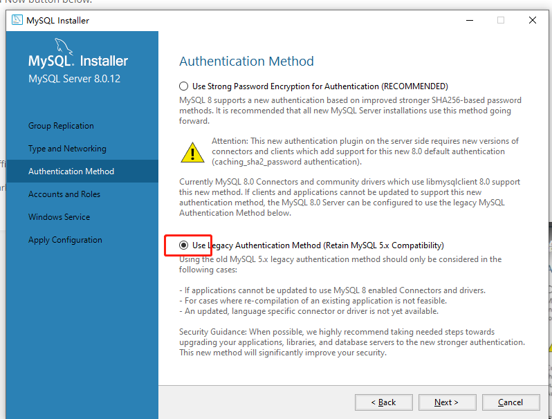
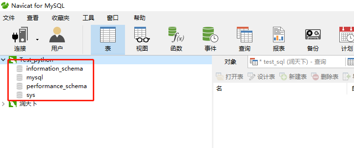

# 1-MySQL的介绍

## 一、操作系统中数据存放的载体
1. Windows、Linux和MacOS都是基于文件的操作系统（比如jpg存放的是图片、txt存放      的是文本文件、AVI存放的是视频等）
数据是以文件为载体保存的  

2. 文件能保存数据，为什么不用文件管理数据
 文档存储无法支持复杂数据搜索；excel也不可以进行关联性操作，而数据库支持使用复杂表达式从海量数据中提取自己需要的数据

## 二、关系型数据库（RDBMS）
1. 指使用了关系型模型的数据库系统
2. 关系模型中数据是可以分类存放的，数据之间可以联系的（学生、老师、教师信息）
3. 关系型数据库可以有效的管理和组织大量复杂的数据
4. 了解：单机数据库和集群数据库

## 三、主流数据库
1. DB2：采购成本高，只在金融、银行需要使用
2. Oracle
3. Mysql：性能低于Oracle、DB2
4. SQL Server：不能跨平台，基本只在教学领域使用

## 四、NoSQL数据库系统（非关系型数据库）
指的是数据分类存放，但是数据之间没有关联关系的数据库系统（秒杀库存、登录信息、消息通知等）是关系型数据库的补充  

应用场景举例：比如秒杀商品，原价200，只售价100元则会存在大量用户抢购的情况，秒杀有个问题就是“超卖”，造成的原因是多线程的，消费者同时争抢读库和改库存，所以多线程条件下容易出现超卖，关系型数据库都是多线程的；因此引入NoSQL数据库中redis就是单线程的，则不会出现超卖的情况  

关系型数据库在建立之前需要先建表、定义字段的类型、哪些不能为空、不能重复等，所以在高速写入的时候这样的校验速度就会明显降低，如果保存的是重要数据则没问题，如果是记录海量低价值数据，比如朋友圈信息对比银行转账信息就是低价信息，这种数据保存到NoSQL数据库中即可，因为这种数据库也没有严格的表结构，数据读写没有这么多校验，所以读写速度远远超过关系型数据库

## 五、主流的NoSQL数据库（开源免费）
1. Redis：内存保存数据库，内存速度高于磁盘读写，比如保存一个电商网站，新浪微博保存大V的信息等，打开的速度就会很快
2. MemCache：跟Redis相似，相比较而言redis市场份额更大一些
3. MongoDB：用硬盘进行保存数据，保存海量低价值数据库是很适合的
4. Neo4J：也是用硬盘保存数据的，用来保存复杂的组织关系和人际关系

举例：比如新闻内容很长，mysql不适合保存数据很长的内容，可以采用MongoDB数据库；再比如促销活动时，为了给用户良好体验，可以抢购商品的介绍信息保存到redis里面，内存的速度快的多；再比如微博上的热点信息也是需要缓存到内存里的，redis就可以派上用场了

## 六、安装mysql
* 注意勾选这个加密机制，防止后面python一些旧的包不兼容

## 七、用户管理
1. Navicat创建连接后自动生成四个逻辑空间，本质是文件夹，不可修改

2. 创建用户

首先点击Navicat中用户头像，列表中显示自带的root用户——》点击新建用户——》设置新用户名、密码、主机等，其中主机可设置为%，表示任意主机可以通过设置的用户名访问数据库——》点击保存（还不可使用，因为暂时没有分配权限）

保存后——点击选项卡中的”服务器权限“列表中的权限都是全局的（一般这种服务器权限还是太大了，一般只赋予新建的业务逻辑空间）

右键新建查询——》输入新建逻辑空间的sql语句(create database test;)——》双击打开这个业务数据库表——》再通过上面的操作赋予权限即可
可重新的新建连接，弹窗中用户和密码输入上面创建的用户密码即可

创建的数据表默认保存的目录；C:\ProgramData\MySQL\MySQL Server 8.0\Data\test

## 八、重设root密码
1. 如果创建的用户忘记密码了，可以通过root登录后重新设置该用户密码
2. 如果root账户密码忘记
首先创建一个txt文件，使用notepad++打开定义修改密码的sql语句
ALTER USER 'root'@'localhost' IDENTIFIED BY '123456';(注意：localhost表示允许本地登录，如果改成百分号%则表示即可本地登录也可以远程登录)

3. 鼠标点击左下角田字符选择“Windows PowerShell(管理员)”打开，输入指令
 net stop mysql80 （先停止服务，其中mysql80是mysql的服务名）
      mysqld --default-file="my.ini文件路径" --init-file="E://temp.txt" --console（mysqld表示启动，--表示加载，--init-file表示需要加载的.txt文件，--console表示打印信息到控制台）

4. 在“Windows PowerShell(管理员)”窗口启动服务命令：net start mysql80

## 九、MySQL配置文件（my.ini）
1. 在my.ini中，我们可以设置各种MYSQL的配置，例如字符集、端口号、目录地址等
可分为三部分：client（配置图形界面的设置）、mysql（命令行客户端的设置）、mysqld（数据库配置信息）

2. 修改配置文件想要生效最快的方法就是先停止服务：net stop mysql80，再重启服务：net start mysql80

3. 迁移mysql数据则拷贝配置文件的这个目录下数据：datadir

4. default-storage-engine=INNODB 默认存储引擎，mysql支持很多引擎，其中INNODB引擎是支持事务的

5. sql-mode="STRICT_TRANS_TABLES,NO_ENGINE_SUBSTITUTION" 开启严格模式，以前mysql存储字符串时，输入数值也会自动转换成字符串，比较宽泛，这个严格格式则不行

6. slow-query-log=1开启慢查询日志，主要用来检查分析为什么sql执行速度慢

7. 大于多少秒的执行sql被写入慢查询日志（即被判定为慢）long_query_time=10

8. server-id=1 数据库ID，多个数据库组成集群才会用到，通过数据库id来区分，只能是整数且不能重复

9. secure-file-priv="C:/ProgramData/MySQL/MySQL Server 8.0/Uploads" 导入导出数据目录，即往mysql导入数据或从mysql导出数据的地址

10. max_connections=151 最大支持连接客户端的数量，不是硬件服务器上不能改太大

11. thread_cache_size=10 线程数量

12. tmp_table_size=16M 缓存大小
