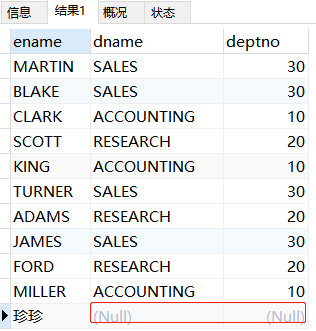
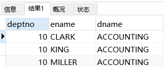
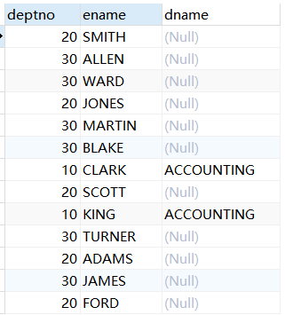

# 数据库的高级查询

## 一、聚合函数（汇总函数）——》返回结果集一定只有一条数据
    聚合函数可对数据求和、求最大值和最小值、求平均值，数据量等
    1、AVG函数：用于获取非空值的平均值，非数字数据统计结果为0

```sql
# 求员工平均工资
SELECT AVG(sal+IFNULL(comm,0)) AS avg
FROM t_emp;
```


    2、SUM函数：只能用于数字类型求和，字符类型的统计结果为0，日期类型统计结果是毫秒数相加 

```sql
# 部分10,20的员工底薪之和
SELECT SUM(sal)
FROM t_emp
WHERE deptno IN(10,20);
```

    3、MAX函数：用于获得非空值的最大值 

```sql
# 部门10,20的员工底薪之和和薪资最大值
SELECT SUM(sal), MAX(sal+IFNULL(comm,0)) AS max
FROM t_emp
WHERE deptno IN(10,20);

# 查询员工名字最长的字符是多少
SELECT MAX(LENGTH(ename)) AS max
FROM t_emp;
```
 
    4、MIN函数：用于获取非空值的最小值

    5、COUNT函数：
    COUNT(*)用于获得包含空值的记录数；
    COUNT(列名)用于获得包含非空值的记录数

```sql
# 查询t_emp表总的数据量和comm佣金字段非空的记录数据量
SELECT COUNT(*), COUNT(comm)
FROM t_emp;

# 查询10和20部门，底薪超过2000并且工龄大于15年的员工人数
SELECT COUNT(*)
FROM t_emp
WHERE deptno IN(10,20) AND (sal*12)>=2000
AND DATEDIFF(NOW(),hiredate)/365>=15;
```

    注意：WHERE子句中不可以使用聚合函数
    
```sql
# 查询1985年以后入职的员工，底薪超过公司平均底薪的员工数量
# 下面这条sql是错误的，原因是WHERE子句中聚合函数未筛选数据的范围导致语句未执行完，这时SELECT执行时没有意义的
SELECT COUNT(*)
FROM t_emp
WHERE hiredate>='1985-01-01'
AND sal>=AVG(sal);
```

## 二、GROUP BY分组查询
    1、为什么要进行分组操作？
    因为默认情况下汇总函数是对全表范围内的数据做统计，有时候需要分组
    
    GROUP BY 子句的作用是通过一定的规则将一个数据集划分成若干个小的区域，然后针对每个小区域分别进行数据汇总处理

```sql
# 分组后查看每组薪资平均值
# ROUND()作用：将小数变为整数位
SELECT deptno,ROUND(AVG(sal)) AS avg
FROM t_emp
GROUP BY deptno; 
```

    2、逐级分组
    数据库支持多列分组条件，执行的时候逐级分组

```sql
# 查询每个部门里，每种职位的人员数量和平均底薪
SELECT deptno,job,COUNT(*),AVG(sal)
FROM t_emp
GROUP BY deptno,job
ORDER BY deptno DESC;
```

    注意：查询语句中如果含有GROUP BY子句，那么SELECT子句中内容就必须要遵守的规则：SELECT子句可以包含聚合函数、或者GROUP BY子句的分组列，其余内容均不可出现在SELECT子句中

```sql
# 下面sql语句中的SELECT中是不可以出现除了GROUP BY后面的字段deptno和聚合函数之外的ename字段的，因为分组或聚合返回的数据都是一条记录的，而ename是返回多条记录的，所以无法执行
SELECT deptno,AVG(sal),ename
FROM t_emp
GROUP BY deptno; 
```

    3、对分组结果集再次做汇总计算

```sql
# WITH ROLLUP表示对GROUP BY分组结果集再次做汇总
# 得出三个部门AVG的和；三个部门最大薪资，最小薪资，三个部门薪资之和
SELECT deptno,AVG(sal),MAX(sal),MIN(sal),SUM(sal)
FROM t_emp
GROUP BY deptno WITH ROLLUP;
```

    4、GROUP_CONCAT函数：把分组查询中的某个字段（即非分组字段）拼接成一个字符串 

```sql
# 查询每个部门薪资大于2000,员工姓名和数量
SELECT deptno,COUNT(*),GROUP_CONCAT(ename)
FROM t_emp
WHERE sal>=2000
GROUP BY deptno;
```

    5、执行顺序：FROM - WHERE - GROUP BY - SELECT - ORDER BY - LIMIT

## 三、HAVING子句
    1、需要与GROUP BY一起使用，因为有些分组，单单使用GROUP BY是无法满足的
    GROUP BY执行完后就要执行HAVING子句

```sql
# 查询部门平均底薪超过2000元的部门编号
# 下面sql是有语法错误的，首先WHERE子句中不可使用聚合函数，其次WHERE执行顺序大于GROUP BY，先执行了聚合函数不知道是按照什么范围统计数据（全表还是局部）
SELECT deptno
FROM t_emp
WHERE AVG(sal)>=2000
GROUP BY deptno;

# 上面修改如下
SELECT deptno,empno
FROM t_emp
GROUP BY deptno HAVING AVG(sal)>=2000;
```

    注意：普通条件写在WHERE子句中，有聚合函数的条件考虑写在HAVING子句中，聚合函数不能和字段做比较，只能用表连接实现

```sql
# 查询每个部门中，1982年以后入职的员工超过2个人的部门编号
SELECT deptno
FROM t_emp
WHERE hiredate>='1982-01-01'  
GROUP BY deptno HAVING COUNT(*)>=2;
```

    2、HAVING子句的特殊写法
    按照数字1分组，MYSQL会依据SELECT子句中的列进行分组，HAVING子句也可正常使用

```sql
# GROUP BY 1表示用第一个查询字段deptno分组
# 有时HAVING和WHERE功能是想通
SELECT deptno, COUNT(*)
FROM t_emp
GROUP BY 1 HAVING deptno IN (10,20); 
# 不建议这样书写，可以先在WHERE子句中写入普通条件筛选一部分数据，这样速度较快
```

## 四、表连接查询
    1、从多张表中提取数据
    必须制定关联条件，如果不定义关联条件就会出现无条件连接，两张表的数据会交叉连接，产生笛卡尔积（就是所有数据叠加在一起）

```sql
# 查询每名员工的部门信息(INNER可省略)
SELECT e.empno,e.ename,d.dname,d.loc
FROM t_emp e INNER JOIN t_dept d
ON e.deptno=d.deptno;
```

    2、表连接的分类：内连接和外连接
      内连接是结果集中只保留符合连接条件的记录
      外连接是不管符不符合连接条件，记录都要保留在结果集中

    3、内连接
    内连接是最常见的一种表连接，用于查询多张关系表符合连接条件的记录
    
    内连接的多种语法形式
    SELECT ..... FROM 表1 JOIN 表2 ON 连接条件；
    SELECT ..... FROM 表1 JOIN 表2 WHERE 连接条件;
    SELECT ..... FROM 表1 表2  WHERE 连接条件;
    SELECT ..... FROM 表1 INNER JOIN 表2 ON 连接条件;

```sql
# 查询每名员工的工号、姓名、部门名称、底薪、职位、工资等级
# 员工表和薪资等级表没有关联字段，但员工表sal字段和薪资等级表中losal和hisal有关

SELECT e.empno,e.ename,d.dname,e.sal,e.job,s.grade
FROM t_emp e JOIN t_dept d ON e.deptno=d.deptno
JOIN t_salgrade s ON e.sal BETWEEN s.losal AND s.hisal;
```

    总结：内连接是数据表不一定必须有同名字段，只要字段之间符合逻辑关系即可

### 表的内连接练习

```sql
# 查询与SCOTT相同部门的员工都有谁
# 方法一使用子查询：用SCOTT部门作为第二次查询的条件，使用子查询速度比较慢
# 每次执行sql语句子查询中WHERE条件都要再重新查询一次，比如下面t_emp有1000条数据就要执行1000次
SELECT ename
FROM t_emp
WHERE deptno=(SELECT deptno FROM t_emp WHERE ename='SCOTT')
AND ename!='SCOTT';

# 方法二：使用内连接:WHERE子句没有重复查询，只是提取数据所以查询速度快
SELECT e2.ename
FROM t_emp e1 JOIN t_emp e2 ON e1.deptno=e2.deptno
WHERE e1.ename='SCOTT' AND e2.ename!='SCOTT';
```
    总结：相同数据表也可以做表连接;因为内连接中ON子句相当于WHERE子句，所以也不可以使用聚合函数
  
  
```sql
# 查询底薪超过公司平均底薪的员工信息
# ON和WHERE子句一样，所以后面也不可以使用聚合函数，下面是错误的写法
SELECT e2.empno,e2.ename,e2.sal
FROM t_emp e1 JOIN t_emp e2 ON e2.sal>=AVG(e1.sal);

# 将查询的公司平均底薪结果集作为一张表和emp表连接，不是使用子查询
# 当然也可以使用子查询方法解答，但查询速度较慢
SELECT e.empno,e.ename,e.sal
FROM t_emp e JOIN (SELECT AVG(sal) avg FROM t_emp) t 
ON e.sal>=t.avg;


# 查询RESEARCH部门的人数、最高底薪、最低底薪、平均底薪、平均工龄
# FLOOR()函数：只保留整数，截取掉小数（场景：年龄）
# CELL()函数：强制进位（场景：快递邮费）
SELECT COUNT(*),MAX(e.sal),MIN(e.sal),AVG(e.sal),FLOOR(AVG(DATEDIFF(NOW(),hiredate)/365))
FROM t_emp e JOIN t_dept d ON e.deptno=d.deptno
WHERE d.dname='RESEARCH';


# 查询每种职业的最高工资、最低工资、平均工资、最高工资等级和最低工资等级
SELECT 
MAX(e.sal+IFNULL(comm,0)),
MIN(e.sal+IFNULL(comm,0)),
AVG(e.sal+IFNULL(comm,0)),
MAX(s.grade),
MIN(s.grade)
FROM t_emp e JOIN t_salgrade s ON e.sal+IFNULL(comm,0) BETWEEN s.losal AND s.hisal 
GROUP BY e.job;


# 查询每个底薪超过部门平均底薪的员工信息
SELECT e.ename,e.deptno,e.sal
FROM t_emp e JOIN (SELECT deptno,AVG(sal) avg FROM t_emp GROUP BY deptno) t
ON e.deptno=t.deptno AND e.sal>t.avg;
```

    4、表的外连接
        使用外连接的原因：如果一名临时员工没有固定的部门编制信息，那么查询每名员工和部门信息时
        用内连接就会遗漏，只有引入外连接才可解决
        LEFT JOIN表示保留左表完整的数据和右表进行连接，如果左表有字段值无法和右表匹配则显示Null
        RIGHT JOIN同理，只是顺序调换
        
```sql
# LEFT JOIN表示保留左表完整的数据和右表进行连接
SELECT e.ename,d.dname,e.deptno
FROM t_emp e LEFT JOIN t_dept d ON e.deptno=d.deptno;
```



```sql
# 查询每个部门的名称和部门人数（前提：40部门没有员工）
# 下面的语句统计出40部门COUNT数量是1，因为COUNT是统计有效数量，40部门是存在的，只是某个字段为null而已
SELECT d.dname,COUNT(*)
FROM t_dept d LEFT JOIN t_emp e ON d.deptno=e.deptno
GROUP BY d.deptno;

# 将右表的null去除即可
SELECT d.dname,COUNT(e.deptno)
FROM t_dept d LEFT JOIN t_emp e ON d.deptno=e.deptno
GROUP BY d.deptno;
```

    UNION关键字可以将多个查询语句的结果集进行合并，前提字段数量相同
    （查询语句）UNION（查询语句）UNION（查询语句）.....
    
```sql
# 查询每个部门的名称和部门的人数，如果没有部门的员工，部门名称用NULL代替
# 下面为错误写法
SELECT d.dname,COUNT(e.deptno)
FROM t_dept d RIGHT JOIN t_emp e ON d.deptno=e.deptno
GROUP BY d.deptno;

# 正确写法
(SELECT d.dname,COUNT(e.deptno)
FROM t_dept d LEFT JOIN t_emp e ON d.deptno=e.deptno
GROUP BY d.deptno)UNION
(SELECT d.dname,COUNT(*)
FROM t_dept d RIGHT JOIN t_emp e ON d.deptno=e.deptno
GROUP BY d.deptno);


# 查询每名员工的编号、姓名、部门名称、月薪、工资等级、工龄、上司编号、上司姓名、上司部门
# 要保留前两张左连接得出的结果集，所以第三张表也用左连接
SELECT 
	e.empno,e.ename,
	d.dname,e.sal+IFNULL(comm,0),
	s.grade,FLOOR(DATEDIFF(NOW(),
	e.hiredate)/365),
	t.empno AS mgrno,t.ename AS mname,t.dname AS mdname
FROM t_emp e LEFT JOIN t_dept d ON e.deptno=d.deptno
LEFT JOIN t_salgrade s ON e.sal BETWEEN s.losal AND s.hisal
LEFT JOIN
(SELECT e1.empno,e1.ename,d1.dname
FROM t_emp e1 JOIN t_dept d1
ON e1.deptno=d1.deptno) t
ON e.mgr=t.empno;
```
    注意：内连接中ON子句和WHERE是等同的；但在外连接中，条件写在WHERE子句中，不符合条件
    的数据是会被过滤的，而不会保留下来
    
```sql
# 写在WHERE子句，不符合条件过滤
SELECT
	e.deptno,e.ename,d.dname
FROM t_emp e LEFT JOIN t_dept d
ON e.deptno=d.deptno
WHERE e.deptno='10';
```



```sql
# 写在ON子句，不符合条件的没有过滤
SELECT
	e.deptno,e.ename,d.dname
FROM t_emp e LEFT JOIN t_dept d
ON e.deptno=d.deptno
AND e.deptno='10';
```



## 五、子查询

    1、where子句中的子查询是不推荐使用的，只推荐在FROM子句中使用子查询
    子查询是查询语句中嵌套查询的语句

```sql
# 查询底薪超过公司平均底薪的员工的信息
SELECT e.deptno,e.ename,e.sal
FROM t_emp e JOIN (SELECT AVG(sal) avg FROM t_emp) t
ON e.sal>t.avg;

# 子查询方法得出的结果也是可以的，只是不推荐在WHERE子句中使用
SELECT deptno,ename,sal
FROM t_emp
WHERE sal>(SELECT AVG(sal) FROM t_emp);
```
    2、子查询语句可以写在WHERE子句、SELECT子句、FROM子句中个，只在FROM子句中使用是最可取的
       因为FROM中的子查询只会执行一次，所以查询效率很快；而WHERE和SELECT子句(相关子查询)每筛选一条数据就要执行一次
       
```sql
# 查询底薪超过公司平均底薪的员工的信息
SELECT e.deptno,e.empno,e.ename,e.sal,t.avg
FROM t_emp e JOIN (SELECT deptno,AVG(sal) avg FROM t_emp GROUP BY deptno) t
ON e.deptno=t.deptno AND e.sal>t.avg;   
```

## 六、单行和多行子查询
    
    1、单行子查询的结果集只有一条记录，多行子查询的结果集有多行记录
    2、多行子查询只能出现在WHERE子句和FROM子句中
    
```sql
# 如何用子查询查找FORD和MARTIN两个人的同事
# 因为子查询查到FROD和MARTIN两个人在不同部门返回两条数据，所以需要使用IN
SELECT ename
FROM t_emp
WHERE deptno IN
(SELECT deptno FROM t_emp WHERE ename IN('FORD','MARTIN'))
AND ename NOT IN('FORD','MARTIN');
```

    3、WHERE子句可以使用IN、ALL、ANY、EXISTS关键字来处理多行表达式结果集的条件判断
    
```sql
# ALL表示sal大于这个结果集的所有数据，ANY表示大于结果集中，其余一个即可
SELECT ename
FROM t_emp
WHERE sal >= ALL
(SELECT sal t_emp FROM t_emp WHERE ename IN('FORD','MARTIN'))
AND ename NOT IN('FORD','MARTIN');
```

```sql
# 查询工资等级是3级或4级的员工信息
# 内连接查询
SELECT e.ename,e.sal,s.grade
FROM t_emp e JOIN t_salgrade s
ON e.sal BETWEEN s.losal AND s.hisal AND grade IN(3,4);

# EXISTS用法，查询效率低
SELECT empno,ename,sal
FROM t_emp
WHERE EXISTS(
SELECT * FROM t_salgrade
WHERE sal BETWEEN losal AND hisal
AND grade IN(3,4));
```


    