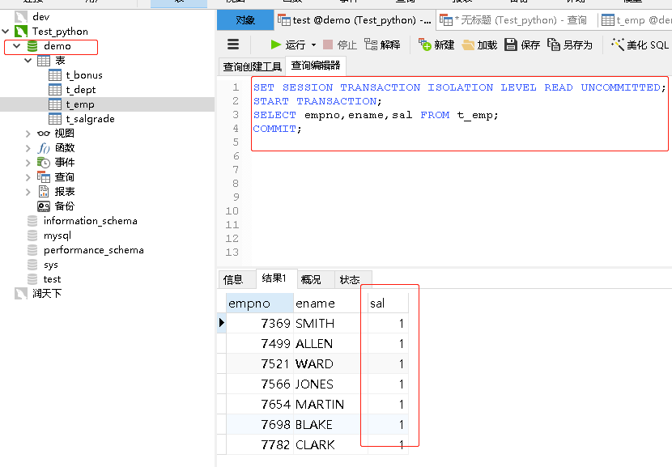
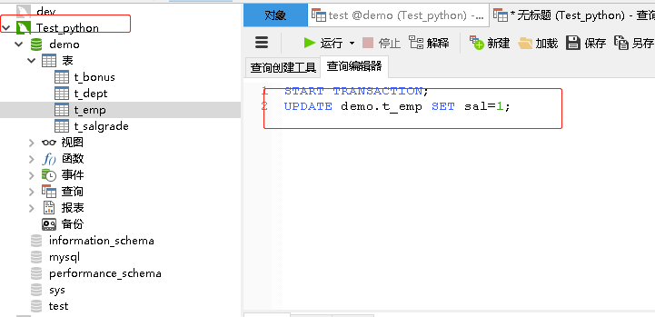
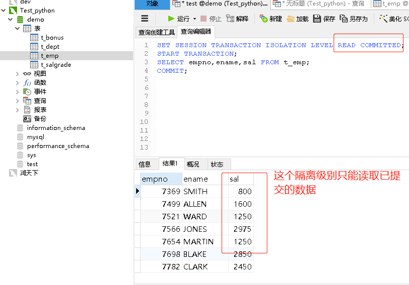

# 综合应用

## 事务机制(Transaction)
    1. 如果数据的写入直接操作数据文件是非常危险的事情
    2. 利用日志来实现间接写入
        MySQL共有五种日志文件，其中redo和undo日志与事务有关
        数据——》拷贝数据到undo日志里——》记录修改到redo日志里——》最后同步最开始的数据
        
    3. RDBMS = SQL语句 + 事务(ACID)
        事务是一个或多个SQL语句组成的整体,要么全部执行成功，要么全部执行失败
        
## 事务案例
    1. 把10部门中MANGER员工调往20部门，其他岗位的员工调往30部门,然后删除10部门
        开启事务
        UPDATE语句
        DELETE语句
        提交事务
        
    2. 管理事务
        默认情况下，MySQL执行每条SQL语句都会自动开启和提交事务，这种方法并不理想
        因为很多业务需要纳入到一个同一个事务下，不需要每条语句都自动开启提交事务，所以需要手动管理事务
        
        语法格式：
            START TARNSACTION;
            SQL语句
            [COMMIT|ROLLBACK];
        COMMIT表示提交事务，ROLLBACK表示回滚
        
        注意：只要没有执行COMMIT事务，那么SQL语句都只是在日志文件中修改的数据，只是在redo文件中修改了数据，不会同步数据文件
        COMMIT提交的是一个结果集，没有中间状态，也就是说不存在说其中的某条SQL执行失败或成功
        
```sql
START TRANSACTION;
DELETE FROM t_emp;
DELETE FROM t_dept;

SELECT * FROM t_emp;
SELECT * FROM t_dept;
# ROLLBACK;
COMMIT;
```

## 事务的ACID的属性
    特性：原子性、一致性、隔离性、持久性
    
    1. 事务的原子性：一个事务中的操作要么全部完成，要么全部失败。
    事务执行后，不允许停留在中间的某个状态
    
    2. 事务的一致性：不管在任何给定的时间，并发事务有多少，事务必须保证运行结果的一致性
    
    3. 事务的隔离性：隔离性要求事务不受其他并发事务的影响，
    如同在给定时间内，该事务是数据库唯一运行的事务
    
    4. 事务的持久性：事务一旦提交，结果便是永久性的，即便发生宕机
    仍然可以依靠事务日志完成数据的持久化
    
## 事务的隔离级别

|序号|隔离级别|功能|
|---|------|---|
|1|read uncommitted|读取未提交数据|
|2|read committed|读取已提交数据|
|3|repeatable|重复读取|
|4|serializable|序列化|

### 业务案例1
    
    购票场景中，由于事务之间完全隔离的
    首先A事务中用户查询1车厢1A坐席车次状态是：未售出，于是用UPDATE语句修改了这条语句状态
    为已售出，因为没有提交事务，所以修改操作只是记录在redo日志中，真实数据未发生改变
    
|事务|车次|车厢|坐席|状态|
|---|---|---|---|---|
|A事务|G8047|1|1A|未售出|
|B事务|C8047|1|1B|未售出|
    
    这时B事务启动了，同样看到1A坐席也是未售出的，于是用UPDATE语句修改了这条记录的状态
    但是B事务很快就提交了于是数据文件就发生了改变，这时候A事务再去提交事务就发现这个坐席
    被人占用了，于是就引发了回滚操作，虽然没有产生歧义数据，但是动不动就购票失败，这个用
    户体验并不好
    所以在这个场景中，我们应该允许当前事务去读取其他事务的临时状态，B事务发现A事务的临时
    数据里购买了1A这个坐席，那么B事务就可以去购买其他坐席，这样就不会引发数据的冲突
    这个场景可以使用：READ UNCOMMITTED 读取其它事务未提交的数据

|事务|车次|车厢|坐席|状态|
|---|---|---|---|---|
|A事务|G8047|1|1A|已售出|
|B事务|C8047|1|1B|未售出|

    SET SESSION TRANSACTION ISOLATION LEVEL表示设置当前会话的隔离级别
    SQL面板相当于一次会话，关闭了面板会话就关了，所以我们设置的事务隔离级别是
    针对当前会话的，并不是全局的

    打开会话面板一：输入以下sql只开启事务修改工资金额为1，不提交事务   
```sql
START TRANSACTION;
UPDATE demo.t_emp SET sal=1;
```

    打开会话面板二：输入以下sql设置事务隔离等级查看会话面板一工资字段的临时状态提交事务
    
```sql
SET SESSION TRANSACTION ISOLATION LEVEL READ UNCOMMITTED;
START TRANSACTION;
SELECT empno,ename,sal FROM t_emp;
COMMIT;
```




    上面的隔离级别只适用于买票的场景中，不适用于其它场景
    
### 业务案例二
    银行业务：只能读取当前事务已经提交的数据，绝对不能读取未提交的数据
    
    A事务(转账1千) ——> Scott账户5000元 <—— (支出100元)B事务 
     
    比如上面A事务还未来得及做任何操作，这时候B事务先执行了消费行为支出100元
    这时候A事务才开始执行转账1千元，因为B事务已经把余额改成4900元，所以A事务
    务在执行更改记录的时候，只需要在余额上加上1千块即可，也就是5900元。
    
    如果AB事务正常提交事务是没有问题的，如果B事务支出100元是错误的操作需要退回,
    B事务执行了ROLLBACK，这时就没有100块的支出，最终结果应该是6千，如果允许A
    事务读取B事务的临时数据，那么按照这个账户余额4900元加上1千，等到B事务回滚
    账户就变成5900元，这样金额就产生了错误
    
    根据上面的场景修改隔离级别为：READ COMMITTED 只能读取其它事务已经提交的数据 


```sql
START TRANSACTION;
UPDATE demo.t_emp SET sal=1;
```
   
```sql
SET SESSION TRANSACTION ISOLATION LEVEL READ COMMITTED;
START TRANSACTION;
SELECT empno,ename,sal FROM t_emp;
COMMIT;
```



## 业务案例3

    A事务(下单购买) ——> 商品价格350元 <—— (涨价)B事务

